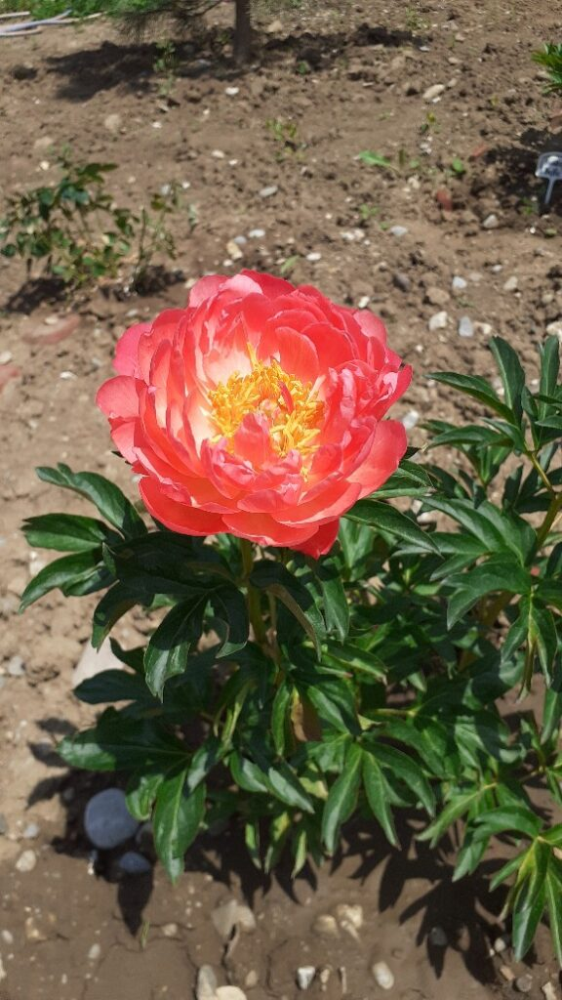
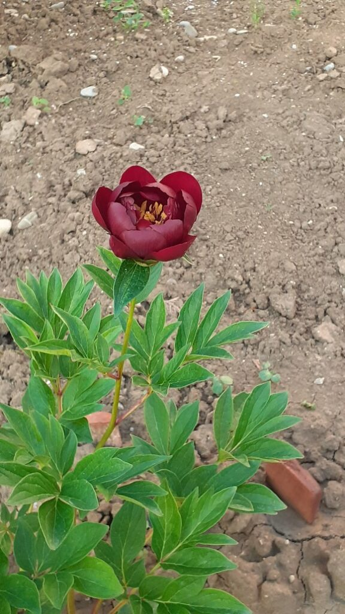
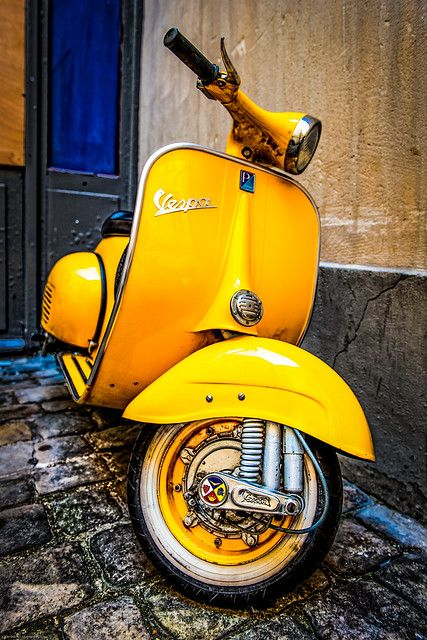

+++
date = 2022-05-16
title = "Ziua 125"
description = "Încep să cred și eu că, la un nivel mult prea adânc să-l pot sonda de una singură, eu am încă niște nerezolvări de stres, de situații, de emoții, vechi, care se materializează în acest somn mai mult nesomn, somn care de foarte puține ori e odihnitor. Corpul tot butucănos mi-l simt și azi, ca și ieri dimineață, parcă nu răspunde la comenzi sau are un defect la softul de rulare că ia comenzile din doi în doi. Azi nu mai pot apăsa butonul de ieri că, din ce-mi amintesc, n-am visat urât așa că, dulap cum mă simt, mă duc încet către bucătărie, poate mă transform în pianină pe drum și-mi fac ziua un cântec."
authors = ["Biannca Locatelli"]
[taxonomies]
tags = []
[extra]
math = false
diagram = false
image = "images/ziua-125.jpg"
+++
---

Și eu și Mr. H eram treji pe la 4 și ceva, fiecare din motive diferite, evident. Lui părea că i s-a gătat somnul iar eu, care dorm iepurește, l-am simțit cotrobăind după căști și m-am trezit, să nu las băietul singur în miez de noapte. Norocul nostru a fost că nu s-a trezit și mica felină și am putut adormi, mai mult sau mai profund, la loc. S-a dovedit că somnul meu era mai mult o veghe cu ochii închiși care la prima adiere de torcăceală pisicească, a fugit el știe pe unde și m-am trezit de parcă aveam o veioză aprinsă în creier. Încep să cred și eu că, la un nivel mult prea adânc să-l pot sonda de una singură, eu am încă niște nerezolvări de stres, de situații, de emoții, vechi, care se materializează în acest somn mai mult nesomn, somn care de foarte puține ori e odihnitor. Ca de obicei, pasez gândul ăsta deoparte cu clasicul meu gând "o să investighez când o să am timp". Neobosita scuză.

***

Corpul tot butucănos mi-l simt și azi, ca și ieri dimineață, parcă nu răspunde la comenzi sau are un defect la softul de rulare că ia comenzile din doi în doi. Azi nu mai pot apăsa butonul de ieri că, din ce-mi amintesc, n-am visat urât așa că, dulap cum mă simt, mă duc încet către bucătărie, poate mă transform în pianină pe drum și-mi fac ziua un cântec.

***

Clar, nu intră direct acțiunea și, împreună cu Spikyșor, ieșim pe terasă, să prizăm aer curat de dimineață, să oxigeneze mai cu vână creierul, panoul central, și să dea drumul la comenzi. În plin exercițiu de inspir-expir, mi s-a oprit respirația pe la jumate. Mi-au înflorit doi bujori!!! Și, pentru că viața e mereu surprinzătoare, nu e niciunul din cei la care mă așteptam!

Primul e Coral Sunset pe numele lui de donșoară fandosită, sau Coralina, cum îi zic eu p-aci pe la țară, și are o culoare corai s-u-p-e-r-b-ă! Habar n-am cum ar trebui să miroasă apusul de corali dar ăsta mic și frumos tare are un miros de crud amestecat cu un strop de bergamotă. Putea să miroasă a orice, e primul meu bujor ever și îl iubesc total!

Al doilea bujor e o mare surpriză, tot coloristică. Îl cheamă Buckeye Belle, sau Bucky după poreclă, și este o vișină putredă, aproape ciocolatos, cu stamine de un galben intens spre portocaliu. Încă nu i-am simțit niciun miros dar e puiuț, are timp. La fel ca și la Coralina, mirosul e un bonus, faptul că au crescut și au și făcut flori din primul an, pentru mine e o mare reușită. Îl iubesc și pe Bucky, sub aceeași umbrelă de total și o să-i iubesc pe toți la fel, că-s ai mei și-mi plac la nebunie!

   &nbsp; &nbsp; &nbsp;
   

Ce pianină, sunt deja un flaut, ating niște note înalte ale bucuriei cum nu le-am mai atins de multișor. Bucuria asta a lucrului făcut de mine, în cazul de față, plantat de mine, e dătătoare de energie și parcă mi-a dat un șut în partea dorsală de m-a activat. N-am fost titirez în bucătărie dar mult mai armonioasă în mișcări. Iar Universul, ca să-mi țină isonul și bucuria mai mult, a trezit-o pe coana mare aproape când eram gata cu toate.

***

La mama e ok, Sassy e mai vocală decât de obicei, dar între timp m-am prins și de ce.

Eu am dus la etaj, în dressing, lângă dormitorul mamei, pliculețele cu mâncarea pentru Sassy, ca să nu mă car mereu cu ele de jos, plus că fac și o departajare frățească între ea și Spiky. Mama a văzut ea unde am pus plicurile și, pe parcursul zilei, de câteva zile cred, i-a tot dat plicuri grăsanei. De când e la mine, am pus-o pe Sassy la dietă pentru că e obeză. Uite că mama, din iubire și din demență, o îmbuibă din nou. În trei zile, a terminat 12 plicuri, în condițiile în care eu îi dau un un plic și puțin pe zi, plus un pumn de cronțonele. Nici nu-i de mirare că grăsălana e vehementă… Revenim la dietă, nu-i bai, și rezolvăm orice proteste cu calm și drăgăleală.

Pentru că azi oricum e zi de curățenie, strâng la ea cât de cât acum la prima oră și fac țiplă când mă apuc de șmotru. Îi și spun că azi o să stau pe la ele prin cameră și mă întreabă cu ce să mă ajute. Wow, chiar e bine! O să vedem cu ce când mă apuc. Deocamdată, mă refugiez la parter, să stau cu mine.

***

Domnul meu pleacă la birou astăzi așa că o parte din timpul meu liber îl petrec cu el, la micul lui dejun și cealaltă, după plecarea lui, o petrec în curte. Ud curticica de flori, dau bună dimineața și pomișorilor fructiferi, mă las scăldată de primele raze de soare, călduțe cât să mângâie blând.

La o scanare scurtă de stare, simt că-s împăcată. Cu clipa, cu ce am și ce n-am, cu mine și cu cei ai mei, cu căderile și ridicările mele. Pun un "post it" mental pe stare cu "Pace" și aș vrea să nu-l pierd din vedere, cel puțin azi.

***

Stau pe terasă și sunt cu un ochi și pe camera de supraveghere, să văd dacă mama are vreo pornire spre micul dejun. O văd că se așează pe marginea patului, se duce la geam, se uită pe geam, se întoarce iar pe marginea patului, se uită la ceas, se uită la televizor, iar la geam, măi dar în nicio clipă, în toată vânzoleala asta, nu i-a trecut prin minte să coboare pur și simplu la masă. Nu înțeleg cum poate să coboare să ia pe șestache ceva dulce și să palmeze dar nu coboară la micul dejun deși, în 90% din dăți, asta e masa la care mănâncă garantat și cu poftă.

Nu vreau să urc încă, o urmăresc, vreau să văd dacă sparge tiparul și acționează altfel decât ca într-o cușcă. Nu, face trasee doar în cameră, deja simt că așteaptă dar nu se aprinde niciun bec acolo la mansarda ei să-i lumineze ideea de a coborî. Asta e, nu poate, mă duc să o iau.

Aproape ușurată, am coborât amândouă și mă surprinde cu cerința dimineții: 2 crenvurști și niște cașcaval. Plus muștar și ardei gras. În binecunoscuta-mi naivitate, mă supun cerințelor, bucuroasă că-i e foame și și stie clar ce vrea. Numa' că nu poate mânca doi crenvurști, dacă trăgeam frâna exaltării, aș fi putut gândi și verifica, măcar minimal, că statistic, niciodată nu a fost cum a zis. Lasă, dacă pentru ea a contat că sunt doi, că așa e ea mai hârciog, mai strângătoare, nu contează restul. Are o stare bună, eu încerc să-i împrumut chiar un strop de exuberanță de la mine, îi arăt bujorii dar ea nu cade-n extaz ca mine și, parcă brusc obosită, vrea să se ducă la ea sus. Lasă, nu toți simt ce simt eu, e normal, bine că măcar a ieșit puțin pe afară.

***

Am făcut o licoare bombă pentru udat plantele din curte, împotriva bolilor și dăunătorilor, și aș vrea să stropesc dimineață, înainte de a mă apuca de curățenie. E zeama asta de-un miros de-ți mută nasul, are fiertură de ceai de coada calului, vreo 2 căpățâni de usturoi presat cu latul cuțitului cât să-i iasă mirosul ăla leșinător, boia de ardei iute, ulei și detergent de vase, iar combinația e necruțătoare. Mă echipez, strecor nebunia asta puțitoare ca să nu-mi înfunde vermorelul, o pun în aparat și, ca o școlăriță cu ghiozdanul în spate, am pornit să șprițez prin curte. Adie un stropșor vântul dar nu cred că îndeajuns să-mi facă probleme.

Nimic mai fals! Deși am 2 perechi de ochelari, prima de vedere, a doua ăia de-i folosesc în bricolaj la diverse tăieri sau șlefuiri, pe la jumătatea curții, mă ustura și mama lui Ștefan cel mare! Vântul ăsta de-l alintam eu adiere, s-a răzgândit și s-a jucat cu jetul vermorelului cum a vrut el, reușind să-mi bage, naiba știe cum, și pe sub ochelari. Combinația aproape letală de usturoi, boia iute și detergent de vase m-a usturat până-n străfundul cel mai străfund al fiecărei celuluțe din ochi! Dar nu puteam să mă opresc în mijlocul trebii, mai ales că nu știam cum aș putea să mă protejez mai mult decât am făcut-o deja. Cu ochii mijiți și de durere dar și natural protejându-se de alte pulverizări surpriză, am reușit să stropesc cam peste tot, fix când simțeam că Universul m-a ironizat maxim azi cu Pacea. Numa' liniștită nu-s acum, am ochii injectați, dar am stropit bio.

***

M-am pripit să-l judec pe tatăl Univers. Ironia maximă a fost abia când, la nici trei sferturi de oră, din senin, s-a pornit o ploicică! Nici prea tare, nici prea încet, ci numa' cât să spele licoarea magică și bio de pe plante. Asta deși, pe minunata aplicație meteo de pe telefon, erau 1% șanse de ploaie. Ca să vezi, ce norocoasă sunt!

***

După multe spălări cu apă rece, ochii mei încep să se relaxeze și mă pornesc pe curățenie. Cum domnul meu e plecat, pot să aspir când vreau, așa că nu mai sunt pe aliniere de planete, ci le fac în ritmul meu. Ascult pe telefon o înregistrare cu Eckhart Tolle dar mă tot întrerup notificările de email. Verific emailul și primesc o veste tristă, o altă moarte, de data asta, a unei femei tinere. Nu mi-e apropiată, e din cartierul în care am locuit cu domnul meu și cu copila ceva ani, dar invariabil simt o apăsare.

Pentru mine, curățenia de cele mai multe ori e un bun prilej fie să ascult ceva interesant în căști, fie să mă ascult și înțeleg pe mine sau perspective asupra vieții.

Cu vestea nouă răsunându-mi în minte, încep să deșir situația să înțeleg de ce simțim tristețe când auzim de trecerea cuiva "la cele veșnice". Clar, nu te întristezi pentru cel care pleacă. În multe culturi, acesta este un eveniment celebrat cu bucurie, trecerea către altceva nefiind nicidecum un eveniment fatalist.

Deci intristarea vine ca o mângâiere pentru cei rămași, pentru că știi, mai ales dacă ai avut o experiență similară, că ei rămân cu dorul. Dar cu ce îi ajută pe cei rămași întristarea ta? Cu nimic. În acele momente, eu nu cred că e cineva mai ușurat dacă se simte îmbărbătat de multă lume.

Azi am înțeles că atunci când ne întristăm la vestea unei morți, care nu ne lovește direct, este pentru că noi avem în ADN-ul de ființă umană, drama. De multe ori am văzut scuza asta, de câteva ori am folosit-o și eu: am un deces în familie, nu pot să fac cutare lucru sau nu pot participa sau x sau y. Deși pare josnic sau chiar e, ne folosim de "un deces în familie" să obținem compasiune sau înțelegere sau să fim scuzați, totul pornind la baza universal valabilă ființei umane, drama.

Am ajuns în mine la o înțelegere palpabilă a modului curat în care ar trebui să reacționez la moartea cuiva: să trimit un gând bun și lumină sufletului care mai rătăcește puțin înainte de a pleca, dar fără a atașa tristețe acestui gând, și să respect durerea celor rămași cu dorul fizic . Atât. Fără alte melodrame și fără alte artificii. Tristețea mea e o talangă pentru sufletul ce pleacă, pentru sufletul celui care rămâne și pentru sufletul meu, care a uitat că aici suntem în vizită și, ca țiganul, și-a făcut altă casă pe unde-a nimerit. Mai rămâne să pricep cum ar trebui să abordez curat o moarte apropiată. Abia acolo se dă examenul de licență…

***

La pauza de curățenie între parter și etaj, o pun pe mama să facă niște cartofi prăjiți. Am luat de la ea de acasă vestitul tuci în care-mi făcea când eram mică și azi nu apuc să fac prânzul eu, dar o pun pe ea. Că tot voia să mă ajute.

Cum suntem doar noi două, ne permitem o aroganță mică. Ea se bucură de cartofii prăjiți, eu că mă ajută ea, prânzul se întinde în lălăială și o dăm în depănare de amintiri. Începe din nou cu telegrafia, locul ei de muncă de-o viață iar azi am aflat și de ce i-a plăcut munca asta la poștă: pentru că nu lucra cu publicul. Așa aflu că mama a fost, și clar este, o introvertită. Asta explică și de ce, după ce s-a fript cu tata, a preferat singurătatea și o pisică în locul unei relații și a socializării.

Tot azi, îmi spune, fără umbre-n glas, că ea nu-și mai aduce aminte decât de o singură colegă, pe celelalte poate că le mai știe după nume, dar nu-și mai aduce aminte figura lor, că poate trece pe lângă ele fără să le recunoască. Am profitat de momentul ăsta de sinceritate și am testat să văd până unde se duce memoria ei. Cu câteva excepții mici, ce e mai vechi de 5 luni, e vag, dar ce ține de copilărie, adolescență și primii ani de muncă, nu. Nu-l mai știe pe soțul colegei ei iar el a murit cu niciun an în urmă și s-au vizitat 30 de ani. Nu-și mai știe colegele, nu-și mai știe cealaltă nepoată dar n-a uitat că soră-mea i-a vorbit rece, nu mai știe de nepoții de la fratele ei și de la sora ei decedată dar îmi spune, din nou, că o doare lipsa de reacție a fratelui ei. Mi-am propus să-l sun zilele următoare, să vorbesc și să-i explic situația, poate se îndură și o sună, măcar așa de complezență, că tare cred că s-ar bucura.

Mă uit la ea cum înșiră amintiri și oameni și pentru o fracțiune de secundă, am simțit că toate astea au rămas agățate într-un timp și acolo vor rămâne în infinitate. Au trăit miliarde de oameni, fiecare cu povestea și bucuria și durerea lui, infinități de mici momente, suntem atât de mici și ardem atât de repede și totuși uite câte intensități punem în clipele alea de ne amprentează memoria.

***

Mama doarme, deja, eu termin curățenia, ajunge și Mr. H acasă, soarele toarnă aur peste natură și prin ferestre, iar eu marchez în calendarul vieții mele încă "o zi faină", cu recunoștință pentru:
1. BUJORI!
2. Mica mea stare de pace!
3. Sinceritatea dezarmantă a mamei!

Clipa mea de frumos este dor de ducă galben:

  

Vespa
