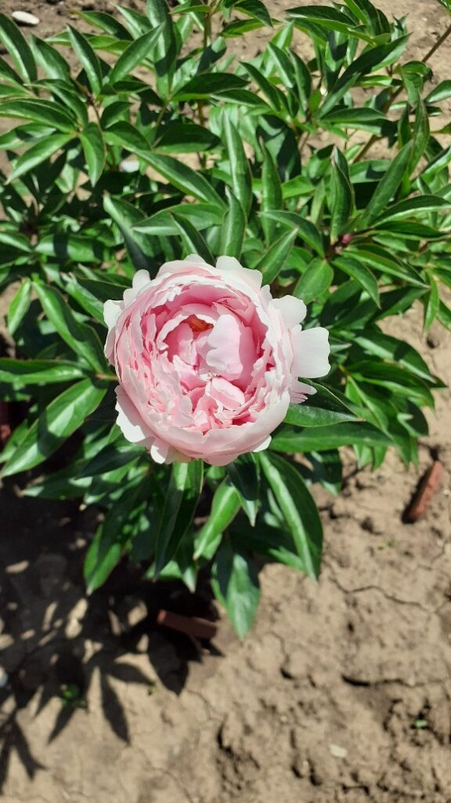
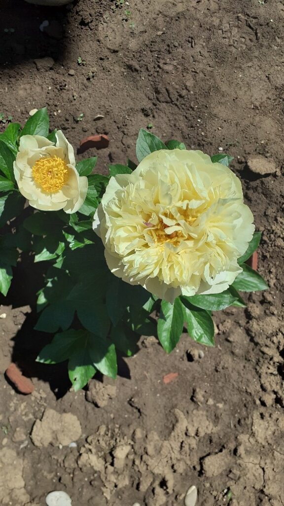
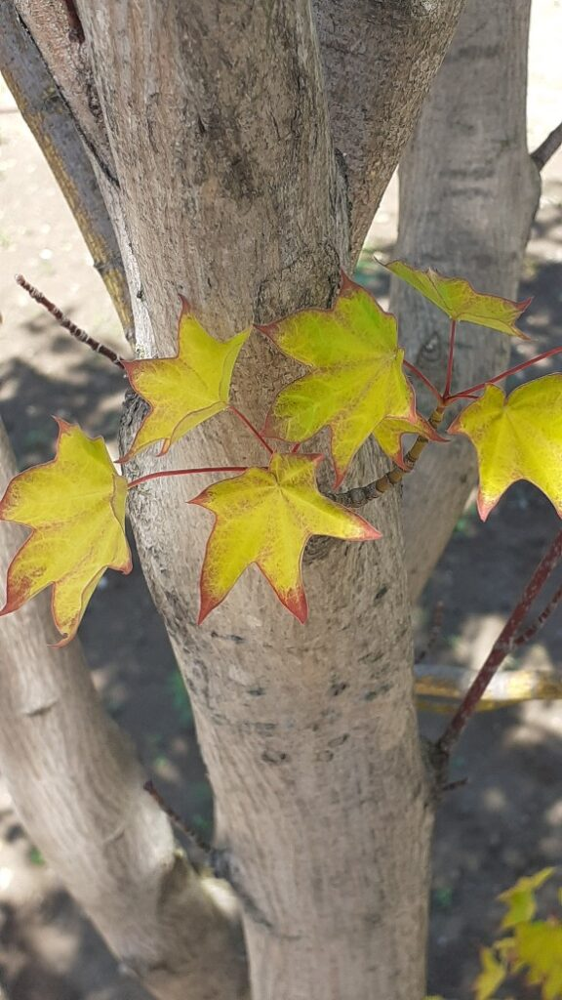

+++
date = 2022-05-20
title = "Ziua 129"
description = "M-am reîntors în curte, la terapia mea naturistă, cu ceva mai multă resemnare. Deși nu-mi place și nu am înghițit niciodată prea ușor resemnarea, o accept pentru că zbaterile astea între stări mă consumă în interior tare mult și tare degeaba. Nu pot schimba ce vine peste mine, cică să schimb cum reacționez la asta. Mda, încerc, dar cred că nu abordez cum trebe, cred că nu integrez și topesc, cred că bag sub preș și mormanul se adună acolo, necercetat și necurățat, și la un moment dat mă împiedic dramatic de el. Dar nicio furtună nu e veșnică. Sper doar să mă țină bateriile interne și fitilul, care-mi ține flacăra vie, să fie destul de lung."
authors = ["Biannca Locatelli"]
[taxonomies]
tags = []
[extra]
math = false
diagram = false
image = "images/ziua-129.jpg"
+++
---

Trezire la 4:34, pat gol pe partea lui Mr. H, gând tâmpit în mintea abia trezită. Dau mesaj, totul e bine, mă liniștesc.

De o bucată mare de timp, nu mai vreau să controlez pe nimeni și nimic. M-am prins și eu, într-un final, că nu poți forța nimic așa că las aripile oricărei ființei și oricărui lucru să zboare de lângă mine când vrea, fără nicio explicație. O dată cu acest permis de liber zbor, s-a așezat în mine și o pace. Culmea, când nu m-am mai încrâncenat, când nu mi-a mai călcat inima în picioare frica aia viscerală că pierd, am căpătat o altă dimensiune a lucrurilor, mai de deasupra. Ce e să fie al meu sau cu mine, va fi, no matter what. Punct.

***

Am adormit din nou și pe la 6:30 m-au trezit Spiky și domnul meu. Așa bușită de somn n-am mai fost de mult. Pur și simplu, nu puteam ține ochii deschiși, la propriu. Mi-am pus papucii pe picioare cu ochii închiși, mi-am luat telefonul pe bâjbâitelea iar pe scări am coborât instinctual. Am și un junghi dureros de la ceafă până la baza spatelui, pe mijloc, și noroc cu ăsta că înjunghierea rapidă pe care mi-a dat-o scurt, mi-a dat și-un push mic de adrenalină. Am dormit cu spatele gol sau m-oi fi mișcat aiurea în timpul somnului și s-a lipit. Nu-i bai, trece. Toate trec. Sper să nu-mi treacă învățătura de minte ca atunci când mă trezesc, să mă trezesc, nu să mai îndes somn că uite cum mă burdușește după.

***

La parter, le-am făcut pe toate de-a-ndoaselea. Am pus de ceai înainte să-mi încălzesc apa de băut în ulcică. M-am apucat de tocat fructele în robot dar am uitat p-afară avocadoul și para, am terminat ceaiul și abia apoi mi-am băut apa. Dar nu m-am supărat pe mine, nu m-am bodogănit, nu m-am certat. E o nouă zi și un nou început anyway. Așa a vrut el să fie, altfel.

***

Fără smoothie pentru mama, m-am bucurat degeaba că am câștigat câteva minute în plus, că le-am pierdut la ea în cameră rapid. Ca și mine, nici ea nu are un început mirobolant al zilei dar evit deschiderea subiectului și nu o întreb cum se simte, doar atac brusc subiectul transpirațiilor nocturne. Ce să vezi, aproape că nu a mai transpirat azi noapte! Măi să fie, chiar așa?! Pijamalele ei întinse prin baie și prin cameră spun altceva, dar n-are sens să o pun la colț. O să revin asupra subiectului smoothie într-un alt moment, mai prielnic.

Las curat și aerisit în urma mea și îi spun, cu clasicul meu zâmbet pe buze, că ne vedem la micul dejun, să coboare când îi e foame. Eu tot zic, ea tot nu face, dar nu mă mai îndoiesc niciodată de puterea picăturii chinezești.

***

Am o senzație de pierdere și de grabă, în timpul meu magic. Faptul că m-am trezit așa de târziu și așa de buimacă, nu mă ajută să fiu tare limpede în dimineața asta. Îmi cercetez empiric sufletul, nu-mi dă nici cu sus, dar nici cu jos, e o țâră anesteziat și el.

Mi se adună în minte informațiile aflate aseară la MasterClass-ul lui Neale și mi se așează pe-o cracă de neuron, principiul contrariilor. E doar o denumire pompoasă pusă în moțul unei perspective pe cât de simplă, pe atât de nevăzută pentru mulți. Long story short, ca să poți să experimentezi lumina, trebe mai întâi să treci prin întuneric. Deși la prima vedere, pare un enunț d-ăla bombastico-spiritual, e simplu ca bună ziua: nu poți vedea lumina dacă nu e întuneric, nu poți înțelege și aplica repede dacă nu știi ce înseamnă încet, nu știi ce e sus dacă nu există și un jos, și tot așa.

Cu alte cuvinte, aplicat pe studiul meu de caz, trebe să trec prin închisoare ca să mă prind care e libertatea. Well, nu-s chiar așa de convinsă. E adevărat că demența mamei mi-a dat o altă dimensiune libertății și a exacerbat lipsa ei, dar pe bune dacă trebuia să trec prin asta ca să știu. Probabil că e o nuanță a principiului contrariilor pe care nu o mulez bine pe cazul meu, că nu face click. Când s-o mai decanta informația, mai bag o fisă și-o să văd ce-mi dă atunci. Deocamdată-mi dă cu virgulă dar nu pun punct.

***

Am mai prins doar o tură prin grădină, să fac prezența și să trec în catastif noile apariții, if case. Da, se înregistrează în anuarul bujorilor trei noi vedete, pe numele lor de scenă: Sarah Bernhardt, Laura Dessert și Pieterje Vriend Wagennar, sau mai scurt Petre.

  <figure>
    
   <figcaption>Sarah</figcaption>
  </figure>
   &nbsp; &nbsp; &nbsp;
  <figure>
    
   <figcaption>Laura</figcaption>
  </figure>
   &nbsp; &nbsp; &nbsp;
  <figure>
   
   <figcaption>Petre</figcaption>
  </figure>

  

  <figure>
   
   <figcaption>Șifonel</figcaption>
  </figure>
   &nbsp; &nbsp; &nbsp;
   <figure>
   
   <figcaption>Coralina</figcaption>
  </figure>
   &nbsp; &nbsp; &nbsp;
   <figure>
   
   <figcaption>Bucky</figcaption>
  </figure>

  

Aproape toate daliile și-au scos căpșorul din pământ, a apărut și un bărbos din cei trei iriși, cine nu vrea deloc să ne vedem, sunt cei doi crini Asiatic Pink. Iar la pomii fructiferi, cei trei piersici dau semne de revigorare, în continuare stau piersicile pe crengi și am avut parte și de o surpriză mică: o caisă. Una singură, într-unul din cei trei caiși care s-au înălțat ca nebunii dar nu au rod (mai) deloc, ca să nu minimizez importanța caisei. Le-am dat tuturor nota maximă și m-am băgat în casă, pentru micile dejunuri ce urmează.

***

Între cele două dejunuri, al mamei și al domnului meu, m-am surprins cântând în timp ce spălam vasele. Taci că-i bine! Dacă dau înapoi doar câteva ore și compar cu începutul dimineții pornit cu nepornire, pot chiar să mă felicit, deși, nu eu sunt vinovata stării de bine. N-am fost atentă cine sau ce mi-a imprimat-o, dar bine că m-am prins că o am, că poate o fac elastic peste toată ziua.

Zău dacă pot să determin și eu ceva tipare la stările mele. Dar nu cred că mă deranjează asta acum.

***

Dezburuienitul curții de flori a devenit un fel de terapie pentru mine. Vreau să scot răsadurile de roșii afară și trebe să pregătesc pământul. Cred că este un experiment ratat ăsta cu roșiile, așa răsaduri pricăjite nu cred că mai există pe fața pământului. Dar, dacă tot le-am drăgălit atâta, să duc treaba până la capăt, măcar să pot trage o concluzie.

Întotdeauna, în terapia asta de stat cu mâinile-n pământ, mă trage ața către reflecție.

Azi iar mi-a venit la masă un dor pe care-l tot alung de ceva timp dar azi s-a umplut și dă pe dinafară. Mi-e dor de căldura umană, de oamenii blânzi, de prieteni, de o cafea și o vorbă, de poveștile lor. Vreau să mă inspir și din altceva decât din ce am în platoul meu, și cred că e și un dor și o nevoie. Altfel, tind să devin analfabetă social. Dar e ceva în mine care mă înțânează și nu-mi vine să sun oameni, care nu mă caută, să le zic: hai, vrei să vii la mine la o cafea? Mă bâzâie gândul că dacă nu mă caută să vadă ce mai simt, nu există interes acolo și de ce aș forța ceva ce nu e?

Plus că unii oameni, cu care nu mă mai agăț de aceeași frecvență, nu doar că nu mă mai înțeleg, dar mă înțeleg și greșit. Pentru că ei, neputându-mă cuprinde și băga într-o cutie tipologică, încep să-și imagineze bucăți din mine printr-o lentilă distorsionată. Ca întotdeauna, nu e nimic greșit în asta: ei vor să înțeleagă iar eu nu mai pot, sau nu mai vreau, să cobor la treapta aia de care deja am trecut. Așa că fiecare rămâne suveran în alegerea lui.

Sunt în aceeași buclă de care-mi tot spune Mr. H și încă nu mă hotărăsc să rup lanțul ciclic și să decid ceva, cu tărie permanentă, în mine. Parcă prea am avut multe ruperi din mine că inima nu mă mai lasă să pierd. Nici timp, nici oameni, nici doruri.

***

Atât de cuprinsă de pământ și gânduri, nici nu știu când a zburat timpul și mă apropii vertiginos de pregătirea prânzului. Mofturile mamei în materie de mâncare îmi consumă mult timp și multă energie și multe resurse. Plus că nici fântâna inspirației mele nu e secată, cu tot internetul ăsta, pentru că apetențele culinare ale mamei sunt extrem de reduse și surprinzătoare. Acum zice că nu mai vrea carne, în ziua următoare mă întreabă de friptură.

Cu cât mă gândesc mai mult la prânz, cu atât mă irit mai tare. Iar când o văd pe camera de supraveghere cum stă în pat toată ziua, mă gogoșesc și mai tare în nervi. Nici nu știu când am trecut de la registrul de dor la ăsta de agitație nervoasă. Încep în mintea mea dialoguri inutile dar parcă vreau să descarc încărcătura asta cumva și nu știu cum. Sunt sătulă de pregătit prânzuri pe care apoi să le arunc. Aș vrea și eu să fiu servită, să mă pun la masă, să vină mâncarea, să mă ridic de la masă și să nu mă intereseze ce rămâne în urma mea. Măcar din când în când. Ăsta a fost oful meu de foarte mult timp și uite că nici acum nu am trecut de el. El este motivul pentru care-mi plăcea, în vacanțe, să luăm cazarea cu mic dejun inclus. Boierie! Deși, de când sunt vegană, dacă nu mergem la hoteluri cu specificul ăsta, nu am ca variante decât gem și câteva fructe rătăcite.

Acum nici plecatul nu mai intră în tabloul vieții mele și gândul ăsta, adaugă o altă intensitate iritării. Și uite așa, țopăind, fără grație, din gând în gând, am intrat în bucătărie, butoi de pulbere. Doamne, ce cavalcadă e în mine!  Și n-am unde să vărs goana asta ce-mi trece și prin minte și prin sânge…

***

Mă reîntorc în curte, mă așez cu fundul în țărâna aia din care tot pigulesc buruiana și trag aer adânc în mine. Îmi umplu pieptul de gol, de firicelul de energie pe care mi-l imaginez că vine de la mama pământ, mă duc să-mi miros bujorii, mă umplu și de suavitatea lor, mă las să stau la soare un strop, să ardă el cu razele lui toate prostiile astea din minte, să nu mi le descarc în mâncarea pe care o pregătesc. Nu-s ipocrită, nu mă curăț instant, oricât de mult aș forța, dar intru înapoi un strop mai curată, cât să nu interferez stropi de nervi în bucatele pentru noi toți. Că până la urmă, ceilalți n-au nicio vină și nicio contribuție la rahatul în care mă zbat mental. Singura care decide prin ce trece sunt eu. Dar azi doar că m-a copleșit o țâră bălteala și nu mă scot mai repede la liman. Atât.

***

Dacă cineva m-ar fi privit din exterior, în timpul prânzului, ce cintezică eram și câtă vivacitatea și expresivitate în discurs aveam, n-ar fi zis că în interior cad hălci de lavă nervoasă peste un suflet deja hărtănit. Cam așa o fi și la depresivi, și la cei care decid că sensul lor aici nu mai e sens.

***

M-am reîntors în curte, la terapia mea naturistă, cu ceva mai multă resemnare. Deși nu-mi place și nu am înghițit niciodată prea ușor resemnarea, o accept pentru că zbaterile astea între stări mă consumă în interior tare mult și tare degeaba. Nu pot schimba ce vine peste mine, cică să schimb cum reacționez la asta. Mda, încerc, dar cred că nu abordez cum trebe, cred că nu integrez și topesc, cred că bag sub preș și mormanul se adună acolo, necercetat și necurățat, și la un moment dat mă împiedic dramatic de el. Dar nicio furtună nu e veșnică. Sper doar să mă țină bateriile interne și fitilul, care-mi ține flacăra vie, să fie destul de lung.

***

Mă liniștește timpul petrecut cu domnul meu, atât de tare încât mi se închid ochii puternic. Am împrumutat și eu de la Spikylina tabietul: de câte ori mă simt în siguranță, alunec într-un somn rapid, că știu că nimic nu mă poate prinde sau atinge acum. Așa fac și eu cu domnul meu azi, lângă el mă simt o tomberoneză roială adoptată și-mi permit o relaxare de mușchi, gânduri și trăiri.

***

Trag cortina peste ziua asta complicată, amalgam interesant totuși, și-mi număr recunoștința pentru:
1. Mr. H!
2. Natură!
3. Viața asta bogată și fascinantă și intrigantă care se desfășoară în mine!

Clipa mea de frumos este arțarul meu galben cu margini roșiatice și cu "piele" de elefant, pe care-l iubesc din toată inima:

  

 

 

  

    <a href="/blog/ziua-128/">Postarea anterioară</a>
  

  

    <a href="/blog/ziua-130/">Postarea următoare</a>
  

