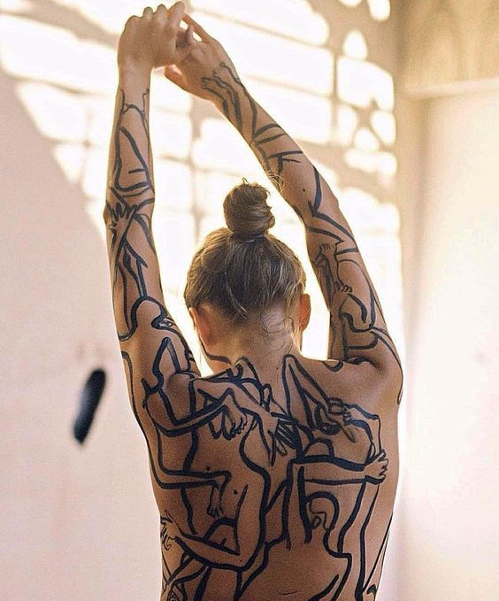

+++
date = 2022-05-22
title = "Ziua 131"
description = "O stare calmă m-a locuit la micul dejun al mamei. N-am mai simțit nevoia să tot vorbesc, poate și pentru că oricum o făcea ea în locul meu. S-au întors povestirile despre tinerețea ei, în forme pe care nici nu le mai măsor cu realitatea, că oricum e irelevant. O privesc, o urmăresc și atât. În mine, am început să fac tranșant o diferență determinată de stările ei: când e mama, când e o femeie pierdută prin viața mamei. Nu știu de ce mintea mea a făcut splitarea asta, dar azi am putut să o observ clar: când femeia care povestea era mama, distanța dintre ea și mine, aia imaginară, dar pe care circulă o energie de uniune, se reducea substanțial, iar când ieșeau balaurii demenței, plecam subit și închideam frecvențele cu ea. Probabil că e o formă, aproape fizică, de autoprotejare, habar n-am, dar a fost ca și cum cineva se juca la butoanele de volum. Tare experiența! "
authors = ["Biannca Locatelli"]
[taxonomies]
tags = []
[extra]
math = false
diagram = false
image = "images/ziua-131.jpg"
+++
---

Trezirea de la 6 a fost cu lumină-n ochi și-n creier. Chiar nu știu ce a relaxat alarma aia din interiorul meu și a trimis semnalul de "poți să mai dormi", că, deși la suprafață, eu par nestrămutată în hotărârea mea de trezire prea dis de dimineața, în mine e o altă voință care așează lucrurile cum ar trebui să fie.

Am și azi pornire lină dar și azi am mâinile umflate. Mi-e greu să strâng pumnul, îmi simt degetele ca niște arcuri care revin instant la poziția inițială. Cunosc deja traseul lopeți-greble-palme, am și măsurat timpul, așa că nu-mi bat dimineața cu gânduri de panică.

***

Înainte de toate, ies pe terasă. Nu vreau să pornesc nimic până nu mă pornesc pe mine și cel mai bun avânt mi-l dă natura. Tot trifoiul e înflorit, e o pătură mare de verde cu moțuri mici albe și cu zumzet de albine. Au plecat mierlele, coțofenele sunt tot aici, că doar avem casele învecinate, iar Spiky se joacă deja de-a pitulușul cu niște vrăbiuțe. Ce repede butează animalele! Cât de repede se prind ele de moment și-s sugative de tot ce le oferă acumul ăsta.

***

Pornesc apa, ceaiul și smoothieul. Din nou, îmi trece prin minte gândul de regret că mama nu-l mai vrea pe al ei. E plin de bun și e suport fantastic pentru corp. Și tot din nou, vine gândul răspuns, ca și cum l-aș fi cerut, "nu poți trece omul strada dacă nu vrea s-o treacă", și gândul ăsta încearcă o mică împăcare acolo, în mine, unde simt eu mare nevoie să fac binele ăla care știu că e universal și oamenilor care nu vor binele.

***

La mama totul e ok, în niște limite, dar ea e veselă și asta e tot ce contează. Am simțit brusc și intens ce strâmb puneam eu metrul și măsuram și comparam, fără să vreau, mere cu pere: curățenia din cameră versus starea mamei. De multe ori, m-a amărât sau scămoșat mizeria și n-am mai băgat în seamă și în suflet, starea ei bună. Așa se întâmplă când îmi las viața pe pilotul automat al egoului, când împarte el pe căprării toate situațiile și toate emoțiile și încearcă să mă apere de toate.

Am lăsat pe mai târziu curățenia și m-am așezat să vorbesc cu ea. Îmi spune, din nou, cât e de fericită că desface iar rebus și că Sassy a început să doarmă în coșul de rufe, iar eu simt, printre cuvinte, dar mai ales printre energia care se plimbă între noi două, că îi e bine și că ea simte că îi e bine aici. Nu verbalizează dar nici nu-mi trebe. Știu.

***

În timpul meu magic, am pus de-un ștrudel. Azi ar trebui să merg o fugă la oamenii la care mama Geta a lăsat o gaură în inimi și-n prezenturi și-mi place să duc ceva făcut, nu cumpărat de la colț de stradă.

În pauza dintre aluatul fraged de foietaj, de-abia făcut, care trebe să stea la frigider o țâră și răzălirea merelor pentru umplutură, mai pun de-un podcast. Azi nu simt nevoia de introspecție, sau cel puțin, nu așa de dimineață.

Mă las să curg cu totul în podcastul ales, îmi mângâie tare plăcut auzul atât vocea cât și engleza, și pentru o jumătate de oră, am fugit în altă parte. Oare d-aia ascult eu podcasturi sau alte lucruri în timp ce fac treabă? Ca să fug din treaba prezentului în orice altceva? Mereu mi-am zis că vreau să-mi lărgesc orizontul perspectivelor care se coc în mine și să aduc la dospit altele noi, de la alții, ca să mă expandez și să nu băltesc. Oricum le selectez numai p-alea care trec de filtrul discernământului meu. Dar dacă e o evadare de fapt?

De când am demența atât de aproape lângă mine, s-a reîntors la mine știutul pe care l-am simțit acut când alergam cu mama prin spitale, să aruncăm din trupul ei cancerele ce se instalaseră comod acolo. Am trăit atunci o nebunie de viață, de fapt am netrăit, dar știu clar ce m-a trăit acei doi ani: constanța prezenței morții. Și când moartea e la doi pași de tine, vrei să înghesui în timpul tău cât mai mult, vrei să cuprinzi cu tot ce ești și cu toate simțurile lucrurile care depășesc pătrățica ta, nu te mai gândești neapărat la cantitate, ci filtrezi puțin și oprești la intrare rahaturile. Acei doi ani, deși habar n-am ce am făcut în ei și pe unde s-au dus, mi-au înfierat în carne și în minte că durata e irelevantă. Poți să trăiești 100 de ani și să fii gol, sau 20 de ani și să fii plin. Acum parcă mi s-a reîntors, cu o putere și mai mare, descoperirea asta și mă împinge cu putere să fiu plină. Limitările prezentului meu îmi lasă ca unic traseu, alte trăiri, alte perspective, analize, introspecții, spălări de suflet și curățări de inutilități.

Demența mamei a mai scos un diamant la suprafață: când înțelegi că timpu-i mic, nu te mai dai pe după vișin, pui pe masă de la început adevărul tău, vezi cine stă cu tine și mergi mai departe. Timpul scurt al vieții mele a scos din cărțile mele de joc diplomația. Nu mai pun cutia în cutie și-n altă cutie și tot așa. Ce sens ar avea? Dintr-odată, lumea mea a devenit din mare, intimă.

***

O stare calmă m-a locuit la micul dejun al mamei. N-am mai simțit nevoia să tot vorbesc, poate și pentru că oricum o făcea ea în locul meu. S-au întors povestirile despre tinerețea ei, în forme pe care nici nu le mai măsor cu realitatea, că oricum e irelevant. O privesc, o urmăresc și atât. În mine, am început să fac tranșant o diferență determinată de stările ei: când e mama, când e o femeie pierdută prin viața mamei. Nu știu de ce mintea mea a făcut splitarea asta, dar azi am putut să o observ clar: când femeia care povestea era mama, distanța dintre ea și mine, aia imaginară, dar pe care circulă o energie de uniune, se reducea substanțial, iar când ieșeau balaurii demenței, plecam subit și închideam frecvențele cu ea. Probabil că e o formă, aproape fizică, de autoprotejare, habar n-am, dar a fost ca și cum cineva se juca la butoanele de volum. Tare experiența!

***

Plecarea ei la etaj e rapid înlocuită de domnul meu, și la fel și trăirea. After all, omul este un actor. Mă surprind câte haine de personaje îmbrac, nu conștient, nu ca să păcălesc nici audiența, dar nici pe mine, ci pur și simplu, le găsesc agățațe pe umerașele zilei și le pun pe mine natural. Cu mama am fost în gardă parcă, cu domnul meu iubit am uitat ce e aia gardă. Cu prietenul meu bătrân sunt atentă la vorbele ce-mi ies pe gură, cu Mr. H le las să iasă nestingherite. Fiecare rol cu partitura lui. Și cred că și asta face parte din fascinația vieții. Important e să nu te pierzi pe tine, esența ta, în toate scenariile.

***

Am prins curaj ieri cu plecarea și azi repetăm figura. E drept, că suntem la 20 de minute de casă, așa că ajungem imediat dacă s-ar întâmpla ceva. Dar nu se va întâmpla. Mama, din nou, nu vrea să meargă cu noi și așa am aflat că ea ar merge oriunde dar numai cu mine, să fim doar noi două și atât. Am simțit imediat și de ce: pentru că ea-mi vrea atenția totală, fără să o împartă cu nimeni, vrea să fie centrul oricărei situații în care se plasează. D-aia se simte stingheră când e mai multă lume, d-aia radiază când e băgată în seamă și când vorbește numai ea. Când mintea te părăsește treptat dar egoul acaparează totul, cam așa se întâmplă…

***

Pentru că m-am deprins să-mi fiu observator, deprinderea asta s-a îmbibat în mine și tind să-i observ și pe alții. Nu mereu sunt imparțială în observație, nu mereu împart dreptatea corect în dreptul omului sau al situației, dar și ăsta e un mușchi pe care vreau să-l antrenez. Azi am avut o paletă întreagă de văzut, numa' bună de exersat.

Dacă faci un pas în spate și nu te lași subjugat de emoție, poți să vezi atât de clar chiar și locul în care poveștile oamenilor s-au lipit de ei iar ei s-au identificat cu ele. Mă uitam la oamenii dragi din jurul meu și parcă vedeam pe fiecare post ituri cu povești. Și scuze. Nu pot să fac aia pentru că ailaltă. Nu am reușit să fac așa, pentru că d-aia. We are all fucked up. Toți! Măi, dar în loc să ne scuturăm, să ne privim viața cu ochi curați, neintinați de dramele prin care am trecut, că au trecut, noi continuăm să stăm cu pielița poveștilor pe retină și nu mai vedem că toate vin și trec. Myself included.

Mă uitam la copila mea. Zici că e fata mamei ei. Mă uit la ea și mă văd pe mine, drama queen. Zici că am lăsat urme-n timp ca-n beton și ea calcă cu religiozitate în fiecare. Degeaba vin eu acum, peste timp și înțelegere nouă, să-i spun că nu trebe să facă toate greșelile, că nu e timp să calci în toate gropile, că poate mai apleci ureche și la "ăi bătrâni", degeaba. Trebe să cadă ca să simtă, c-așa s-a construit omul, s-a zidit cu cărămizile disperării, ale neputinței, ale dramei, ale traumei și-a uitat că la temelie e aur curat. Asta e, o las să treacă prin ele, deși-mi zgârie sufletul. Viața ei e experiența ei.

***

Calendarul cu pisici pe care i l-am luat mamei s-a transformat în operă de perete, de fapt, de fereastră. Înainte să plecăm, mama mi-a cerut ac mare, ață și o foarfecă. Vrea să decupeze pozele cu pisicuțe din lunile ce au trecut deja și să le coasă pe draperia unei ferestre. Ok, dacă asta o face fericită, de ce nu? I le-am adus, m-a întrebat ce sunt astea și de ce i le-am adus (!), i-am spus ce vrea să facă cu calendarul și am plecat. La întoarcere, am găsit o mamă plină de satisfacție de ziceai că e Picasso, cel puțin. A cusut ea toate cele 5 imagini pe draperie și era mândră nevoie mare. Am lăudat-o, am admirat și eu pozele cu fățucile frumoase de pisici și nu mi s-a părut așa o aberație. Încep să acomodez în mine și în mintea mea aproape orice.

Starea ei e bună, chiar mai bună decât de dimineață, așa că hai să brodăm de aici mai departe. Eu sunt obosită, nu-mi arde de table iar ea nu pare deranjată de asta. Probabil că efortul creativ a umplut acolo un spațiu și deocamdată nu simte lipsa lor. Foarte bine, eu nici atât!

***

Când ziceam că poate reușesc performanța să mă pun în pat devreme, văzduhul s-a umplut de schelălăieli mici. Am ieșit afară și am identificat destul de repede zona: lângă noi se construiesc 2 duplexuri și de acolo vine disperarea aia din sunet. Am pus ceva pe mine, am înhățat punga de cronțonele de câini pe care o aveam in casă, și am pornit în direcția cu pricina. Da, am avut dreptate, la una din case este aciuat un puiuc mic, negru ca tăciunele, cu ochi sclipitori, ce plânge de singurătate mititelul. Am stat cu el, l-am ademenit, i-am dat cronțonele, de agitație nu s-a putut concentra pe vocea mea calmă și nu am reușit să îl prind. Mă întorc acasă, reconfortată mental că măcar i-am lăsat mâncare. Nu stau mult și văd o cățea neagră cu o pungă de gunoi în gură, alergând pe câmpul dintre noi și casele în construcție. Aha, deci asta era. Mămica, atrasă de mirosul ademenitor ce venea din pungile cu resturi de mâncare aruncate de muncitori, s-a dus la case, a înșfăcat una din ele și a fugit, uitându-și puiul acolo. Ok, deci se reîntoarce și-l ia cu ea. După vreo douazeci de minute grele pentru mine și pentru bondocelul mic ce urla din toți rărunchii, mă decid să mă duc din nou. Domnul meu, cu mine. Ajunși acolo, mai erau doi vecini, un el și-o ea, care aruncau cu lemnișoare în zona unde se ascunsese mititelul, să-l facă să iasă de acolo și să plece oriunde, numa' să nu le mai schelălăie sub geam. Erau vecini fix de lângă case.

Înarmată cu doi crenvurști și cu multă iubire, în 10 minute am reușit să-l scot și să-l iau în brațe. Un val de emoție m-a încărcat instant când i-am simțit inima mică cum bate să-i spargă pieptișorul. Și-a ascuns fățuca în pliul cotului meu și am pornit spre câmp unde urma să-l eliberez. Deși i-am vorbit calm, cu toată blândețea capabilă s-o adun de prin mine, stresul și frica au terorizat un suflet nevinovat. Și-n timp ce plecam iar vecinii bifau bucuroși că vor avea o noapte liniștită, ea-mi spune că are ceva la codiță. Nu, n-avea nimic, doar făcea pe el și pe mine, de frică. Un val și mai mare, de o amplitudine mare, și-a croit loc în inima mea și, năclăită și puțitoare, am ajuns cu el departe în câmp, pe poteca făcută de câini și sperăm noi, și de mama lui, care tranzitează pe acolo. L-am lăsat jos, a făcut trei pași mai încolo și a început să vomite. Dar în mine, și-n vorbele lui Mr. H, am simțit că așa trebe să facă, să curețe frica aia teribilă și să plece către mami a lui.

***

Există multă neiubire. Există înțelegere și atenție până la niște margini până unde se întinde plapuma de confortabil. Peste marginile astea, nu mai ajunge nici înțelegere, nici atenție, nici grijă iar iubirea e rara avis. Ca o ironie a momentului, în timp ce duceam puiul către libertate, am trecut pe lângă o altă vilă unde era un câine de rasă, "favorizat" de sorți să aibă o casă și un stăpân. Doar că sorți l-au favorizat într-un lanț și o bucată de pământ de un metru jumate pe un metru jumate… Așa că puiul din brațele mele, o fi el vagabond, dar măcar e liber.

***

Mi-am scris și azi o zi faină, interesantă, cu note înalte în trăiri pe alocuri, cu recunoștintă pură pentru:
1. Viață!
2. Spectacolul fabulos dat de ființa umană!
3. Apusul de soare ce mi-a spălat și ochii și sufletul și mi-a-mpăcat ziua!

Clipa mea de frumos dată, de câte piei cărăm pe piele:

  

