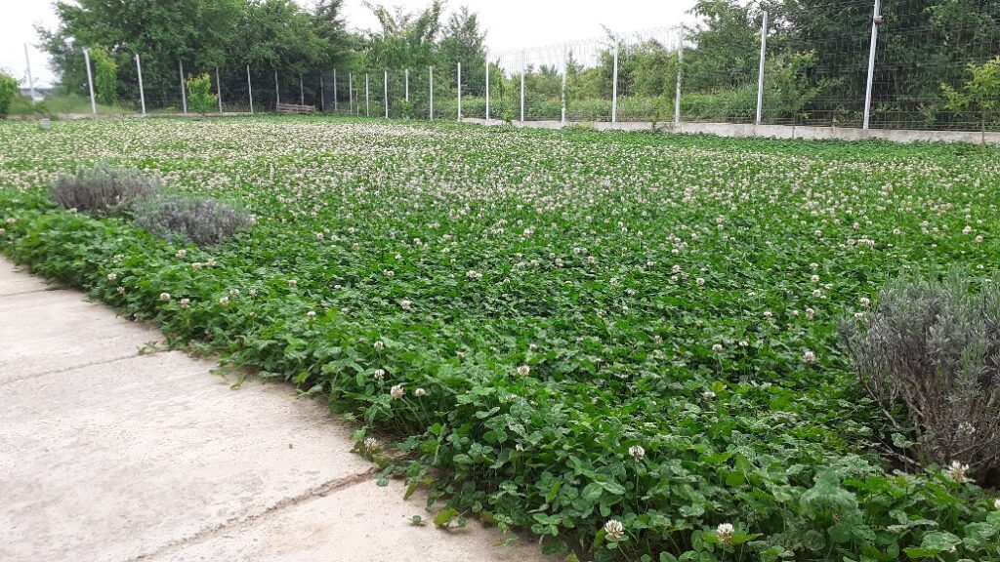
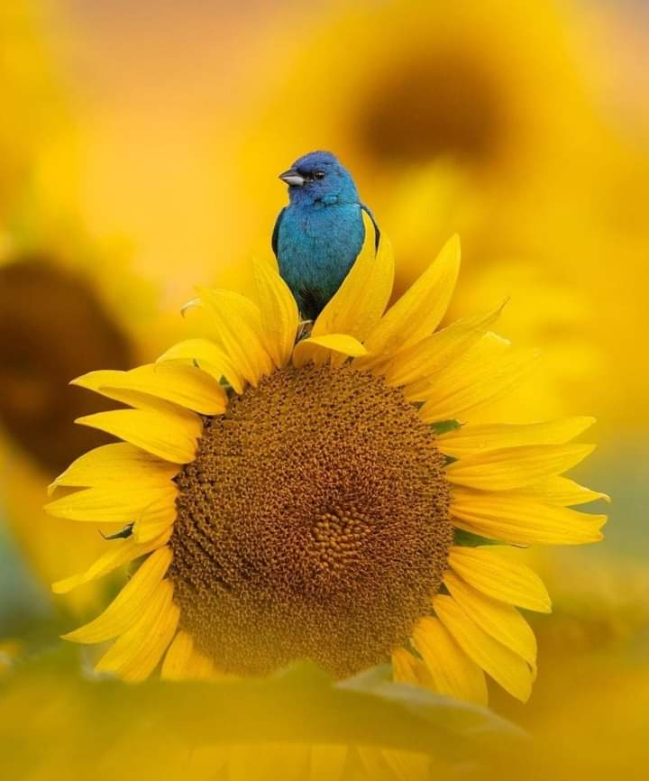

+++
date = 2022-05-24
title = "Ziua 133"
description = "O găsesc stând pe scaun. Doar stând. O întreb ce face și spune că nu știe unde țin eu farfuriile și pâinea. Cred că am, pentru o secundă, o privire perplexă, cred că și ea, pentru o secundă, o vede și se prinde că ceva nu e cum trebe, dar mă redresez rapid, pun masa și mă duc la baie să mă scutur puțin de toate. Începe greul. De parcă până acum a fost plimbare în parc. A fost un greu mai ușor dar acum simt că vine greul ăla nebun. Dacă e ceva pentru care pot să mă felicit cu toată inima, este claritatea pe care o am în minte ce-mi spune că șocul e mai mare prima dată, că așa a fost și la început, că o să mă obișnuiesc și cu o nouă stare a lucrurilor, fix cam ca boiling frog."
authors = ["Biannca Locatelli"]
[taxonomies]
tags = []
[extra]
math = false
diagram = false
image = "images/ziua-133.jpg"
+++
---

Am avut o noapte fără vise și fără treziri, dintr-o bucată, iar trezirea dimineața a avut un parfum de necunoscut. Ca și cum m-am decuplat total de la viață, am plecat undeva unde nu exista nicio dimensiune și de unde nu am fost capabilă să culeg nicio senzație. E ca și cum noaptea asta nu s-a întâmplat, deși știu sigur că a fost și știu că m-am trezit odihnită. Probabil că, fie corpul cu inteligența-i proprie, fie mintea care încearcă să mă protejeze, m-au deconectat la un nivel la care nu știu să ajung conștient și mi-au turnat pe vene odihnă. Oricare ar fi fost, mulțam cu plecăciune și la mai multe nopți așa, că nu mă deranjează că-s dată la o parte. Chiar deloc.

***

Micuța coconet se lăfăie pe partea de pat a lui Mr. H, e contorsionată într-o poziție haioasă, din care mă privește doar cu un ochi mijit. Parcă s-ar trezi, parc-ar mai lenevi. Nu o hotărăsc în nicio direcție, doar mă întind de-mi trosnesc oasele, îmi împing trezirea în toate cotloanele și am intenții mari în vârf de buze și de inimă. Îmi place dimineața asta, cu aroma asta mișto de mister, așa că vreau să plec cât mai conștientă-n ziua mea azi, că doar știu cum mă zburătăcesc pe parcurs.

***

Ce bine e în căsuța noastră! Nu am măsurat gradul meu de atașament față de zvelta asta pe care am crescut-o de la zero, dar știu sigur că-mi place tot ce am creat aici și în curte. E multă muncă, a fost un efort și o aventură, dar zâmbetul pe care mi-l pune ușurel în suflet diminețile în care sunt deschisă s-o văd, a meritat din plin.

Rămân un strop lipită de ușa de la bucătărie, spre terasă, și-mi umplu ochii de flori de trifoi. Toată curtea mare e plină-plină de flori albe, e o explozie de mici gămălii și de viață. Anul trecut, când l-am pus, n-a avut efervescența asta așa că acum parcă recompensează timpul pierdut.

  

***

Am pus în smoothieuri și din starea mea de bucurie de viață, să ne umple pe dinăuntru și să fie buzunare pentru momentele când uităm, și eu și mama, fiecare din motive diferite, că viața e o bucurie. Mi-am savurat apa aproape fierbinte, doamne, dar ce stare de bine mă dă pe dinafară! Mintea mea nu găsește nimic nou în dimineața care să activeze așa o trăire dar ce bine că mai secondează și inima câteodată, și-mi dau seama că totul e nou prin simplu fapt că e o zi nouă.

Aha, deci d-aia se bucură iluminații mereu, că-și trăiesc zilele ca bebelușii, iau totul fără nicio măsură și nicio judecată și cu ochi proaspeți. Hahaha, și bolnavii de demență fac la fel! Ce nebunie și ce talmeș-balmeș de oameni e și pe planeta asta. Și ăsta e și farmecul ei.

***

La coana mare și la Sassy în cameră e curat-curat, ambele geamuri, și de la baie și de la cameră, sunt deschise pentru aerisire, mama și-a aranjat și patul și mă întâmpină cu un zâmbet larg. Îmi spune mândră că a făcut curat, că a dormit bine și că e bine. Mă bucur, se și vede, îi las smoothieul în timp ce fac o conversație mică, îi dau și lui Sassy să pape și le las bine cu promisiunea că ne vedem la mic dejun.

***

De ceva timp n-am mai dat o raită pe olx, nici pe antichități, azi mă răsfăț cu ele, că parcă n-aș asculta și n-aș vedea nimic altceva. Când mă arunc pe site-uri cu vechituri, uit de timp și de mine, mă transportă maxim în alte timpuri și alte obiceiuri.

Fac din când în când mici obsesii, de care nu mă vindec niciodată de tot, ci doar se mai temperează, când apare o alta la orizont. Îmi plac la nebunie tablourile mici, cu ramă de lemn, cu pictură, de toate formele. La fel de mult îmi plac sfeșnicele, cu picior sau de mână, mici sau mari, simple sau împodobite. Lângă sfeșnic, trebe să ai și mucarniță, iar astea-mi plac să fie mici și delicate. Am făcut o obsesie mai nou pentru păsări mici, din ceramică brută, fără nicio încărcare stilistică dar am și păsări mici și grase din metal și din cristal colorat.

Dar cea mai mare obsesie a mea e vesela veche franceză, porțelan de Sarreguemines și Terre de Fer. Sunt din ce în ce mai rare și mi se par din ce în ce mai frumoase. Evocă niște vremuri superbe, de care mă leagă niște urme rămase în sufletul meu dintr-o altă viață, care-și recapătă brusc vlaga și parfumul când dau de crâmpeie de trecut.

M-a smuls din visarea mea un foșnet care vine de la tabletă, unde rulează camera de supraveghere de la mama. Sub cameră este un birou, pe care stă și televizorul, și care are trei sertare. Mama le deschide pe rând și îmi dau seama că-i în căutare de ceva. Nu știu ce vrea, dar rămân cu ochii pe cameră, privind de fapt prin tabletă. Tot foșnetul mă aduce în prezent, pentru că mama deschide un sertar, îl închide, îl deschide pe al doilea, îl închide și uită ca a deschis primul sertar acu' 3 secunde și-l deschide din nou. Dacă n-a deschis și închis sertarele de nu știu câte ori, până am decis că e cazul să mă duc sus, că o să stea juma' de zi, freacă la sertare ca la platane, dacă nu fac ceva. Cu un pretext absurd, mă înființez la ele în cameră și o întreb ce face. Are o logică în căutarea ei, logică care i-a lipsit când a decis să taie calendarul cu pisici pe care i l-am luat și să-l coasă pe draperie. Acum caută partea de pagină care conținea zilele lunii, ca să știe și ea în ce zi este. Atunci când a avut elan creativ, mintea nu era prezentă. Ea știe că nu a aruncat bucățile din pagini dar nu le mai găsește. Și d-aia le caută, nu o dată, nu de două ori, ci pe repeat. Nu mai sunt, probabil că le-a aruncat, asta e, o să-i iau alt calendar.

***

Dacă tot m-am dus, am și coborât-o la micul dejun.

Simt că, în dimineața asta, fără să fiu capabilă să văd de ce, nu am chef să stau de vorbă cu ea. Parcă e în mine o liniște ce nu se vrea tulburată de nimeni și de nimic. Dar mama nu știe ce e în mine și turuie verzi și uscate, strigă după Spiky și-mi zgârie strident interiorul, reușește rapid să-mi lipească o iritare. Că doar la prima oră, făcusem buzunare de bine pentru momente de nebine. Știam eu de ce sau le-am creat atunci mental iar acum se înființează în materie. Mama ei de treabă! Nu pot s-o opresc, că nici nu știu ce naiba să-i spun ca să tacă dar nici pe mine nu pot să mă opresc din a-mi dori o dimineață liniștită. Ca întotdeauna, mă pun la coada listei și rămân strepezită să o ascult. Când în sfârșit a terminat de mâncat, prin povești și bălării, o rog să-și facă singură tocănița de carne de porc azi, peste vreo trei ore, că nu mai pot nici emoțional și nici timp nu o să am. Da, coboară ea, nu e nicio problemă. Măcar am rezolvat asta.

***

Cu OCD-ul la purtător, mi-am pus răsadurile de roșii în curtea de flori, în zona îngrădită ieri. Anul ăsta e experiment, așa că sunt deschisă la orice. Mai puțin la eșec total, hahaha. La cât le-am drăgălit, repicat, transplantat, cu etichete peste etichete, chiar ar fi nașpa să nu-mi iasă măcar de-o roșie cherry. Că am "decât" vreo nouă soiuri și vreo 40 de fire cu totul. Mi-a luat ceva timp să plantez și cu mâinile-n țărână, mi-a fost greu să stau și ochii pe cameră. Mare greșeală! Și mai mare greșeală că i-am spus mamei să-și gătească singură. Niciodată de acum înainte nu-i mai spun că trebe să facă ceva sau să mergem undeva decât cu cinci minute înainte. Ea nu mai are nicio noțiune temporală și a coborât să gătească când a vrut ea. Degeaba îi spun eu să se ducă sus, că vin eu și o iau, nu pot acum să mă împart în două: una să rămână la plantat că începe să ardă soarele și-mi pârlește frunzișoarele, și alta să stea cu ea în casă să îi dea tot ce are nevoie, să pornească aragazul și să gătească tot ea de fapt. Și-a luat fața de victimă, suflă greu și nu vrea să mai urce, ea se apucă de treabă.

***

Las baltă răsadurile, dar nu și iritarea, mă spăl și intru să facem mâncare. Îi pun la dispoziție tot ce are nevoie și mă duc la baie. Când mă întorc, stă în mijlocul bucătăriei și nu face nimic. O întreb ce face și-mi zice că nu știe unde țin eu tuciul, că ea în tuciu gătea acasă. Ok, scot tuciul din cuptor, deși mi se părea aiurea, dar dacă așa făcea, așa să facă și acum. A pornit tocănița, mai ies un strop afară, mai pun 2 răsaduri, vin înapoi, ea stă pe scaun, focul e dat la maxim și mâncarea începe să se lipească. Îi spun că trebe să ajusteze și ea focul, îmi răspunde că nu știe să umble cu aragazul meu și că să-i dau o oală, că nu în tuci se face tocănița. Giiiiz!

Aragazul meu are butoane ca orice alt aragaz din lume, nu e fucking special. Și-n timp ce acumulam nervi în mine, m-a lovit evidența: demența nu înseamnă că uiți, înseamnă și că nu mai ești capabil să găsești soluții. Ok, nu știi unde e ceva, dar pui mâna și deschizi naibii toate ușile de la dulapuri, că nu am o bucătărie cât palatul Versailles! Nu, ea nu mai știe unde e x sau cum se face y și acolo se blochează filmul. Nu mai merge nimic mai departe.

Wow, până azi, când îmi spunea că nu știe cum se face ceva, puneam pe seama faptului că ea așa a făcut mereu, niciodată nu și-a bătut capul cu tehnologia sau să înțeleagă, măcar minimal, cum funcționează lucrurile. Dar, forțată de împrejurări, o scotea la capăt. Doar când avea ajutoare, nu-și bătea capul. Uite că acum, asta se răzbună și a devenit ea însăși nefuncțională.

***

Cu chiu, cu vai, am terminat tocănița, pe care am transferat-o înapoi în tuci (!!!). Se duce sus, nu mănâncă acum, că e obosită. Foarte bine, du-te, că poate termin și eu cu răsadurile.

N-are sens să mai spun că nu am mai avut nicio bucurie cu restul plantării. Îmi zboară gândurile ca bondarii prin creier, sunt și o țâră iritată dar și mult bulversată. Și mă cert că nu am avut răbdare cu ea, și sunt uimită cum de n-am înțeles atât de limpede până azi, că nu mai e funcțională. Adică da, se duce singură la baie, desface rebus, mănâncă singură, își udă florile, mai are câte-o idee creață dar fără un ajutor, ea nu mai e capabilă să știe ce face și cum să facă.

***

Am terminat și restul de răsaduri și am intrat în casă chiar când mama a coborât pentru prânz. Mă întorc de la spălat și o găsesc stând pe scaun. Doar stând. O întreb ce face și spune că nu știe unde țin eu farfuriile și pâinea. Cred că am, pentru o secundă, o privire perplexă, cred că și ea, pentru o secundă, o vede și se prinde că ceva nu e cum trebe, dar mă redresez rapid, pun masa și mă duc la baie să mă scutur puțin de toate.

Începe greul. De parcă până acum a fost plimbare în parc. A fost un greu mai ușor dar acum simt că vine greul ăla nebun. Dacă e ceva pentru care pot să mă felicit cu toată inima, este claritatea pe care o am în minte ce-mi spune că șocul e mai mare prima dată, că așa a fost și la început, că o să mă obișnuiesc și cu o nouă stare a lucrurilor, fix cam ca boiling frog.

***

Descarc prin trimmerul cu care tai iarba ce crește în afara curții noastre, toată intensitatea asta nouă. Și groaza asta nouă. E în mine o voce care-mi susură ce vreau eu să aud: a avut o zi proastă, doar atât. Nu înseamnă că și mâine va fi la fel sau că de acum încolo va fi așa. Trebe doar să fac spațiu în mine noțiunii de nefuncțională sau neajutorată, s-o lipesc mental de mama și să merg mai departe ca și cum nimic nu s-a întâmplat. Și cam cum să fac asta?

Mirosul de ars m-a adus înapoi din lumea gândurilor întunecate. Atâta obidă am pus în tunsul ierbii că am uitat să mă și opresc și trimmerul ăsta are și el o limită. Plus că iarba are vreo 80 de cm, nu-i tocmai mititică, iar el e un biet trimmer cu fir. Pe care reușesc să-l termin înainte să termin de tuns iarba, așa că opresc toată munca, oricum aproape că se face beznă, e cazul să mă opresc. Și din muncă, și din ronțăit de gânduri.

***

Ziua de azi e ca-n filme, cu plusuri mari urmate de minusuri la fel de mari. Fără să fac abstracție de ultimele, sunt totuși recunoscătoare pentru:
1. O noapte de odihnă!
2. Răsadurile mele, chiar și așa pricăjite!
3. Oamenii dragi care simt, fără să spui ceva, momentul dificil din ziua ta și vin cu tine să facă scut împotriva a orice ți-ar face rău!

Clipa mea de frumos este:

  

Indigo Bunting

 

 

  

    <a href="/blog/ziua-132/">Postarea anterioară</a>
  

  

    <a href="/blog/ziua-134/">Postarea următoare</a>
  

