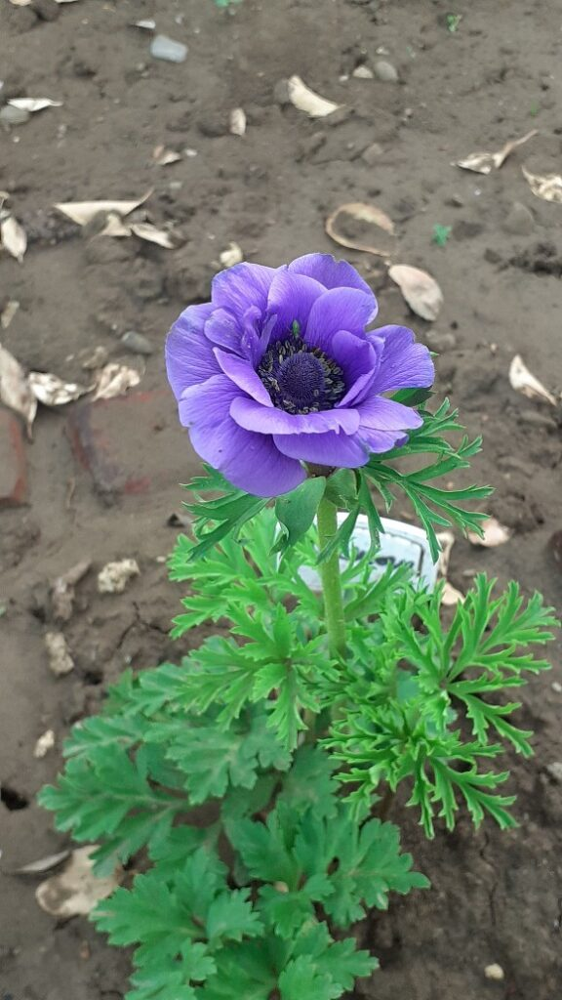
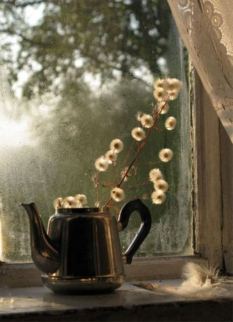

+++
date = 2022-05-26
title = "Ziua 135"
description = "Mă întâmpină bine, are o lumină familiară în ochii ei negri, superbi cândva, și mă agăț de luminița asta ca înecatul de uscat. Luminița asta comprimă în ea viața noastră împreună, e un semn aparte prin care ea, și Universul, mi-arată că acolo, într-un adânc, e totuși mama mea, cea care m-a născut dintr-o dorință mare de a avea copii, dar n-a știut să mă crească dintr-o mutilare sufletească de care nu e vinovată. Luminița asta-mi miroase a ciorbele de weekend, pe care nu le suportam, dar care m-au marcat la un nivel subtil extraordinar de mult. Luminița asta-mi înfățișează o mamă întotdeauna cochetă, pedantă, mirosind mereu a un amestec interesant de tutun și parfum. Luminița asta e mama, prinsă acolo, înăuntrul unei minți perverse."
authors = ["Biannca Locatelli"]
[taxonomies]
tags = []
[extra]
math = false
diagram = false
image = "images/ziua-135.jpg"
+++
---

Munca fizică intensă nu echivalează cu sportul la sală, asta e clar, și cred că nici nu eliberează endorfinele mult dorite. Dar dă câte-o noapte d-asta dintr-o bucată, fără vise. E drept că asta a fost mai puțin odihnitoare ca altele, cel puțin așa-mi spune corpul, care mă doare la fiecare mișcare. Nu-i bai, mișcarea face bine, oricât de "munca câmpului" este sau elitistă, la sală.

Spikylina nu se dezlipește de pat, nici nu s-a sinchisit să deschidă un ochi, măcar așa, de verificare, stă răsturnată în partea de pat a lui Mr. H și doarme adânc.

***

Eu pornesc la drum, către bucătărie și către o nouă zi din viața mea, cu mici intenții pentru o zi mare, care să le cuprindă pe toate câte i le-am pus în desagă, în mintea mea asta organizată cu liste de to do-uri. Am și intenții, am și așteptări și-n liniștea dimineții, îmi dau seama că plec cu tabla deja scrisă și încărcată de sarcini. Până ajung la parter, încerc să-mi golesc mintea și să șterg tabla cu buretele, ca să las ziua să se aștearnă cum vrea. Da, am niște jaloane mari, ca reper, dar fie ce-o fi. Asta e fost un mare pumn în fața controlului care mi s-a infiltrat și-n carne, și care nu lasă loc, sau nu vrea să lase loc, surprizei și neprevăzutului. Iar astea, sunt fix sarea și piperul vieții.

***

Nu mă grăbește nimeni și nimic, așa că ritualul dimineții se desfășoară lin, fără zdruncinături și mă îmbracă într-o stare ca de weekend. Bun așa!

Dau o raită prin curte și mă extaziez ca un copil dar mă și supăr tot ca el, la descoperirile mele. O anemonă superbă, violet indigo, a răzbit și și-a deschis fața către soare, un iris ascunde, sub mici umflături, florile ce stau să se deschidă, e timpul să vină al doilea val de flori, după primul, al bujorilor.

  

În schimb, la pomișorii fructiferi și la roșioarele de abia puse, e un atac nesimțit al afidelor negre. La pomișori am rupt frunzele înnegrite de atâția purici agățați de ele dar la roșii trebe să găsesc un tratament că dacă rup frunzele, nu mai rămân cu nimic din răsad. Ca orice pe pământul ăsta, și grădinăritul este și o artă, și o știință. De abia când le fac eu, mă luminez cât efort presupune fiecare legumă și fiecare fruct, de la piață.

***

Cu bună ziua dat la toată curtea, mă întorc la trivialitatea acțiunilor din bucătăria mea în fiecare prea-dimineață, că acuș se trezește coana mare și-mi imprimă o viteză de numa'-numa'. Am terminat în timp, sunt regulamentară și-n mine, și-n acțiuni și mă înființez la ea, cu smoothieul, mâncarea lui Sassy și zâmbetul pus arcuit pe față.

Mă întâmpină bine, are o lumină familiară în ochii ei negri, superbi cândva, și mă agăț de luminița asta ca înecatul de uscat. Luminița asta comprimă în ea viața noastră împreună, e un semn aparte prin care ea, și Universul, mi-arată că acolo, într-un adânc, e totuși mama mea, cea care m-a născut dintr-o dorință mare de a avea copii, dar n-a știut să mă crească dintr-o mutilare sufletească de care nu e vinovată. Luminița asta-mi miroase a ciorbele de weekend, pe care nu le suportam dar care m-au marcat la un nivel subtil extraordinar de mult. Și acum, când trec pe lângă blocuri, în zilele de weekend, și se simte miros de mâncare gătită și se aude zgomot de veselă, mă transport automat, fără niciun drept de apel, într-un trecut în care eram 4 ființe la masă, o dată pe săptămână. Luminița asta-mi înfățișează o mamă întotdeauna cochetă, pedantă, mirosind mereu a un amestec interesant de tutun și parfum. Luminița asta e mama, prinsă acolo, înăuntrul unei minți perverse. Așa că-n dimineața asta, nu mai văd nimic altceva decât pe mama. Și, cu o putere surprinzătoare și pentru mine, mă inundă duioșia pe care am îndesat-o în spatele revoltei, și mă ține într-o îmbrățișare tot timpul cât stau la ele, să fac curat, să primenesc și să îmbib aerul de la ele cu amintirea mea și cu memoria mea și cu tot ce simt eu că e mama mea, că poate se lipește pe-un prezent ce mă faultează din ce în ce mai des.

***

Cu căldura-n suflet și lacrimi adunate-n gât, timpul meu magic are aromă de amintiri. Le dau la o parte p-alea grele, care vin, ca de obicei, primele și scotocesc după alea bune, că știu eu că au existat.

Mă văd cu ai mei, mândră nevoie mare de faptul că, pe de o parte, mă țin fiecare de câte-o mână și pe de altă parte, că am un costumaș alb cu albastru și mă cred cea mai frumoasă din lume, plimbându-ne prin Trivale, în Pitești. Apoi mă văd cu mama, la ea la serviciu, la poștă, unde-mi plăcea la nebunie să strâng confettiurile rezultate de la mașina de cartare, să mă plimb de la un ghișeu la altul, să mă dau importantă, deși eram un ghizdroc de copil. Și-mi simt și acum, mândria cea mai mare, când cineva mă întreba a cui sunt: a lui Giovanni Locatelli! Pentru mine, ca de altfel pentru aproape toate fetele, tata era un pui de Dumnezeu. Iar numele ăsta frumos învăluia genial misterul pe care tata, prin absența lui în viața mea, îl imprima fără să știe. Iar cei din jur, pentru care tata și-ar fi dat și cămașa de pe el, dintr-o dorință imensă de validare, îl lăudau cu prisosință și asta mă umfla și mai mult în pene. Eram, prin asociere cu el, și eu un pui de Dumnezeu. Tot ce am primit de la tata, pe lângă o lecție dură de răceală paternă, au fost viața, numele frumos și o măsuță sculptată de el. De fapt, de la amândoi am primit aceeași lecție dar, acum când sunt capabilă s-o descifrez, nu mai sună așa dramatic. Că învelită-n foi de durere, stă nestemata acceptării mele de către mine, e drept, după juma' de viață. Așa că mulțam amândurora, pe oriunde or fi ei acum, unul prin eter, cealaltă cu mintea prin alte părți!

***

Mă duc să o aduc la mic dejun, pentru că trebe să fac și curățenia generală și dacă aștept să coboare ea, nu mai încep azi. Invariabil, când deschid ușa să o chem, știe de ce vin. Iar eu, invariabil, mă tot întreb de ce nu coboară singură…La un moment dat, una din noi va ceda.

Mănâncă bine, e în vervă, o pregătesc de curățenie dar pare că anunțul meu trece pe lângă ea, n-a captat nici sunetul, nici sensul. Stă la povești, are chef de lălăială, eu nu mă-ndur să o întrerup că azi parcă-s mai înțelegătoare, și uite așa micul dejun a durat vreo oră, nesperat, neașteptat și nedorit de mult, când am îngrămădit iar destule pe răbojul zilei.

***

De la acest moment al zilei, am intrat într-o vrie: clasicele activități de curățenie milimetrică, care să satisfacă o minte obsedată, plus două noi activități: spălat pisica la funduleț și băgată și coana mare la baie. Pisica, de grasă ce e, nu se mai poate toaleta singură și-mi tot lasă urme aiurea așa că azi am băgat-o la cadă și am tuns, ras și frezat zona. Ce distracție a fost pe mine și pe mama de aoleala pisicii. Ziceai că o taie cineva, așa striga ea ajutor, la început cu toți rărunchii, pe măsură ce se obișnuia cu apa și cu spălatul, din ce în ce mai încet, ca la final de abia să se mai audă câte-un miau-au. Spiky, a venit și ea speriată maxim, să vadă ce-i facem suratei ei, a fost un spectacol, iar mama s-a distrat de minune. A urmat ea dar evident că la ea nu e cu aoleală, ci cu exclamații de bine, de nu înțeleg nici în ruptul capului cum de trebuie să mă lupt cu încăpățânarea ei mereu, înainte de duș sau baie.

Am terminat etajul și când să cobor, coana mare, primenită și odihnită, vrea din nou să mănânce. Ok, hai jos, pregătește-i prânzul, pune masă, strânge masă, am bifat și asta, gata, pot să trec la curățenia de la parter.

***

Tot timpul curățeniei, în care am fost doar cu mine, m-am jucat plasându-mă în propriul observator.

Doamne, dar câte gânduri îmi vin în cap constant! Câteodată activate de lucruri din jurul meu, alteori generate de dialoguri din interiorul meu, de conflicte pe care le buclez inutil sau de incapacități ale celor dragi, vin și pleacă cu miile, și îmi fură timp și energie. Parcă și văd cum pornesc din mintea mea firicele de energie către exterior, oameni sau lucruri, și simt cum mă părăsește încetișor forța vitală. Mă risipesc atât de banal. Dar locul întâi în frământarea interioară îl ocupă grija mea față de cei dragi ai mei, aș vrea să le torn efectiv, direct în minte și inimă, și să-i învăț să le cupleze, cunoașterea asta nouă a mea și înțegerea care mă trăiește din ce în ce mai intens că viața asta nu e o dramă. Că nimic din ce e și ce vine, nu vine ca să ne pedepsească de ceva, că nu totul este despre noi dar culmea, totul ne privește, că dacă vedem doar rahat, apăi ne adâncim și mai mult în el și, partea cea mai nasoală e, că dacă stai mult acolo, te obișnuiești și nu-ți mai pute dar nici nu te mai scoți, că viața se practică în fiecare zi, că trebe reînnoite jurămintele făcute ei, de voință și dorință, în fiecare dimineață și că trebe să ne bucurăm. Știu că sună pedagogic, știu că și eu dau cu bâta-n baltă câteodată dar doar și pentru că-mi număr trei recunoștințe pe zi și tot caut elemente de care să mă bucur every fucking day. Că altfel, o simt în carne că-i pierdută.

Am văzut undeva, nu mai știu unde, un obicei mișto: un bol mare, mare de sticlă, gen damigeană, în care persoana respectivă punea zilnic câte-o pietricică. Albă, dacă ziua era faină, neagră, dacă ziua era pierdută. Iar la final de an, se apuca de numărat. Și ce a debutat ca o joacă de copil, s-a transformat pe parcurs, într-o conștientizare acută: de câte ori punea pietricica albă, la final de zi, avea o mare bucurie în suflet pentru însuși acest gest mic în sine, iar de câte ori punea pietricia neagră, o lăsa să cadă cu promisiunea că se va strădui mai mult data viitoare. Genial experimentul.

***

Dacă tot am terminat în casă, hai să atac și tunsul trifoiului, activitate care îi este rezervată domnului meu. Vreau să-i fac o surpriză și să se odihnească în weekend, fără griji și treburi.

Băi băiete, da' e muncă, nu glumă! Poate că nu ar fi așa de greu dacă nu ar roi albinele pe floricelele de trifoi și ar trebui întâi să le alung și, cel mai important, nu ar trebui să golesc cutia de la mașina de tuns din 5 în 5 minute. Horror! Dar am mulcit cu trifoiul tuns și roșiile abia puse, și trandafirii, și irișii, practic am împrăștiat trifoiul tocat în toată curticica de flori, să îmbogățească pământul și am pus și la rădăcina pomișorilor fructiferi.

Începutul a fost greu, pe măsură ce învățam să înțeleg sunetele mașinii, să mulțumesc Soarelui când își ascundea razele arzânde în spatele norilor, să mă ancorez puternic în prezent și să merg desculță prin trifoi, lucrurile s-au deschis din încrîncenarea lor și am terminat cu o mare bucurie în suflet și cu o vibrație bună în tălpi. M-am conectat cu mama Pământ și dintr-o activitate grea, am putut să sug nectarul și să mă bucur de orice altceva decât greul în sine. Dacă aș putea să iau lecția asta și să o aplic, la scara adecvată, și situației cu demența, ce bine mi-ar fi. One step at a time.

***

Gata, au plecat și albinele la somnic, și eu trebe să mă opresc, să-i duc sucul și pastilele mamei, să mă dușulesc și să mă bag la un zoom cu cele mai mișto doamne, cu care am făcut cursul de Pace cu mine, doamne ce-mi ating niște coarde sensibile în suflet și de care mă leagă un sentiment extrem de fain: deși nu ne-am văzut fizic, lângă doamnele astea mă simt ca și cum aș fi goală, goală, de tot și de toate, și îmbrăcată de înțelegerea lor, de nejudecata lor, de sfaturile lor, de dragul lor, de bucuria lor, de viața lor. E o vorbă care-mi place mult: Speak your truth and see who sticks around. That's your tribe. Cam așa e și cu doamnele astea. Nu le-aș schimba cu nimeni în lumea asta!

***

Ultima trebușoară pe ziua de azi este să-mi aduc în casă căpșunii livrați în seara asta: 6 lădițe adicătelea 24 de kg de căpșuni bio, mari și parfumați, un curcubeu pe cerul gurii. O să păpăm cât putem iar restul la punguțe, la congelator pentru 4 luni de dimineți de smoothie. Iupiiii!

***

Azi am băgat o pietricică mare albă în damigeana vieții și-mi număr, așa, de complezență, doar trei recunostințe:
1. Amintiri cu miros de copilărie!
2. Impământare!
3. Femei frumoase și dragi și apropiate și prezente-n viața mea!

Frumosul meu:

  

