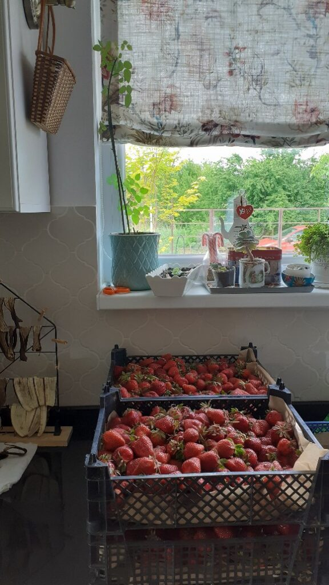
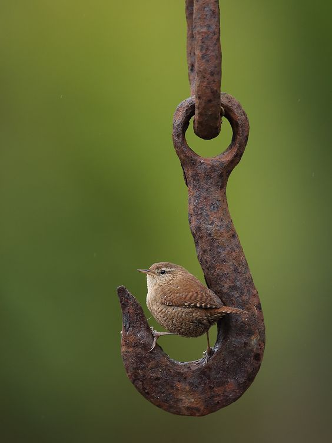

Deși am amânat cât am putut de mult, deși am ignorat cu bună știință intensitatea, amica mea, Sfredeluș, durerea de cap, mi-a dat o trezire total nelalocul ei. Am căzut frântă, dar fericită, aseară și nici nu știu când s-a făcut prea-dimineață, dar amica mea n-are probleme cu orientarea în timp, așa că m-a înghiontit până am parcat somnul, pentru diseară. Mă doare tare, în aceeași arcadă stângă dar știu că mi se trage de la munca de salahor pe care am prestat-o ieri. Că eu, hulpavă așa de felul meu pare-se, nu m-am mulțumit doar cu făcutul curățeniei, în toată casa, nu, eu a trebuit să și tund toată grădina, ca să știu de ce cad lată. Și de ce mă seacă Sfredeluș la ceas infim de noapte-dimineață. Cu știutul ăsta în mine, mă adun și mă cobor, să-mi beau apa, să fac ceva că poate pe verticală, durerea nu se mai simte atât de acut ca pe orizontală.

***

Aiurea! N-are Sfredeluș sensibilități cu altitudinea, ea știe una și bună, mă săgeată tot capul că nu-mi mai doresc nici apă, nici smoothie, ci doar un prosop cu apă rece, sau cu gheață, simt eu că mi-ar domoli durerea asta arzândă.

Am și o senzație de foarte cald, așa că totuși, apa mea caldă cea de toate diminețile, poate mi-ar face bine. Mă urnesc cu greu, parcă strânsă-n mine mică, cu respirație și mai mică, doar-doar nu mă mai vede amica mea și pleacă mai departe, prin Univers. Apa nu a rezolvat durerea dar a răcorit febrilitatea și mi-a adus un mic respiro. Tot m-am ridicat, hai să mă apuc și de smoothie, am totul la îndemână, în bucătărie miroase demențial a căpșuni, nu pot să mă fac că plouă, doar pentru că mă chinuie, de-a dreptul odios câteodată, o durere în cavitatea oculară stângă. Am și mâncat vreo trei căpșuni, sunt dulci și buni-buni, o să mă răsfăț diminețile ce urmează cu așa minunății de fructe.

***

O clipă cred că n-am fost atentă la cameră, sau poate, din cauza durerii, timpul la mine s-a contractat, cert este că în treacăt trecând cu ochii, văd că patul e gol. Ooops, da' ce devreme s-a trezit. Ooops, da' dacă mă gândesc mai bine, chiar mă bucur că a făcut-o. Pentru că vreau să-i duc smoothieul și tot tacâmul și apoi vreau să mă așez, cu prosopelul ud și rece pe față, să potolesc nebuna asta care mă interoghează atât de devreme și atât de nemilos.

Probabil că a plutit în aer surpriza, că și mama a fost uimită de vizita mea matinală. Îi spun că nu mi-e chiar bine, deși știu, din istorie și din statistică, că fie nu contează, fie nu reține. Dar m-am folosit de clipa aia în care m-a privit și a simțit că nu-s ok, am strecurat în ea smoothieul și pastilele, rugămintea să-i dea ea lui Sassy să pape și stăruința mea să coboare singură la micul dejun și să mănânce. Eu sunt jos, dar e posibil să nu pot să fiu ospătarul de serviciu și azi. Cred că toate astea au durat mai mult, că a lăsat pe dinafara clipei esențiale, partea cu micul dejun. Așa mi s-a părut, dar voi vedea dacă am început să-i citesc fața corect sau încă mă surprinde.

***

Timpul meu magic a fost tare bun cu mine: am adormit, puțin ogoită de prosopul rece, și am plecat total o oră și un pic. Trezirea a venit cu o propunere blândă dar fermă: dacă mă doare mai puțin, mă ridic și nu-mi dau voie să mă mai aolesc ca dățile trecute. Am respirat, am simțit-o pe Sfredeluș la datorie, dar e o țâră mai temperată. Și-n respirația asta pe care am luat-o, în miezul ăsta mic de stare fără durere acută, am simțit că pot să duc. Și pe amica mea și orice altceva, fizic, pentru că hotărârea asta care mă circulă vine dintr-o altă sursă, ce n-are legătură cu nicio fizicalitate. Pur și simplu, am decis în mine să fac o schimbare de abordare. Să las durerea să se exprime dar să nu mă mai exprim eu prin gura ei. Nu, n-a plecat, nu, nu s-a sinchisit ea de fantasmagoriile mele altfel, dar nici eu nu m-am mai perpelit că vai, ce mă doare. E drept, că n-am schimbat poziția, toate astea le-am gândit și trăit tot întinsă, tot cu prosopelul pe ochi. Dar deja hotărârea-mi antrenează un mușchi timid și-mi pune alți ochi deasupra nasului, că ăștia de-i port deja sunt nițel tarați de viața tânguitoare.

***

Două lucruri m-ar fi mângâiat în dimineața asta mai mult ca orice altceva: mama să coboare singură, să nu fiu eu nevoită să mă ridic, și să mănânce singură. Există o vorbă din bătrâni, cu care nu sunt de acord dar, culmea, cu toate astea, o mai folosesc din când în când, când mă fură viața netrăită: nu poți să le ai pe toate. Că poți, e o poveste pentru altă dată. Azi însă, p-astea două nu le-am avut, în schimb am avut, din nou, un pic de iritare. Dar și asta începe să se tocească, devine fumată, nu mai are putere să se reinventeze mereu la aceeași amplitutidine ca (fiecare) dată anterioară. Poate la un moment dat, o să dispară, așa, de la sine, că văd că eu nu fac nimic conștient să o opresc. Cum deschid ușa, mama are un zâmbet larg pe față, mă aștepta să vin, că-mi topește toată rezistența asta la viață pe care o am azi, accentuată de o, deja familiară, durere de cap.

Ok, dac-am intrat în horă, apăi să joc. Îi pregătesc micul dejun, îmi fac și eu o cafea și mă și așez cu ea la masă, să-i țin companie. Toate astea cu zvâcniri de ochi stâng și hotărâri de inimă dreaptă că nu mai bag în seamă durerea.

Stoicismul meu o fi-ndurat pe vreundeva ceva în Universul meu, că mama nu s-a pornit la povești și nici nu s-a lălăit azi. A stat cât i-a trebuit să mănânce, plus un strop mai mult, să-i spăl niște căpșuni, să ia sus la ea. Niciodată nu urcă cu mâna goală, asta e lege ce nu ține cont de demență.

***

Doamne, sunt buni, miros fain, dar sunt mulți tare! 24 de kg de căpșuni, de spălat bucată cu bucată, de tăiat codița, tot bucată cu bucată, de cântărit, de pus în punguțe, de stivuit în congelator. Deși genul ăsta de activități e d-ăla de te nihilește, am descoperit că pe mine mă liniștește, mă duce într-o zonă de calm. Și-mi pune la testare răbdarea, cu care nu am fost și nu sunt nici acum tot timpul, prietenă.

  

Nu simt nevoia de liniște așa că mă pun pe ascultat, Mi-a spus aseară o doamnă faină de-un podcast despre moarte așa că dau play și mă apuc de căpșuni.

Talking about sex, won't make us pregnant, talking about death, won't makes us dead. Ce deliciu lingvistic! Așa a început podcastul, îndeajuns încât să-mi incite curiozitatea. L-am ascultat integral și apoi mi-am pus amprenta discernământului pe ce-am auzit.

Mie nu mi-e frică de moarte. Una din tipele din podcast, de câte ori se vorbea serios despre moarte în jurul ei, somatiza atât de puternic frica, că se strica la stomac. Eu n-am o frică așa de viscerală. De fapt, judecând la rece, nu mi-e frică și punct. Ah, că pusă în fața unui pericol de încetare bruscă a vieții, reacționez instinctiv și da, mă sperii, e și normal și natural, că doar port în ADN frici de mii de generații. Dar, altfel, nu pot să spun că mă ia cu leșin când mă gândesc. Este foarte posibil să vină și din inconștiență, din aceeași inconștiență cu care am sărit cu parașuta, sau am făcut bungee jumping sau mi-am dat drumul pe-un tobogan de apă de vreo 15 metri înălțime.

Am însă o mare curiozitate. Și egoul meu bine crescut și umflat are ceva urme de regret că urmează o dizolvare, o reîntoarcere în oceanul din care m-am tras ca picătură s-o experimentez pe Biannca Locatelli. Se zice că-n momentele dinaintea morții nu există decât adevăr, iar dulceața lui poate să-ți adune pe la toartele inimii niște regrete. Așa că plec din podcastul ăsta cu convingerea și mai întărită că adevărul e singura fantă de ușă prin care trebe să te strecori, s-o crăcănezi și să te stabilești cu trăirea acolo.

***

Eu n-am terminat căpșunii, dar coana mare a terminat digestia micului dejun și vrea prânzul. Nici nu e nevoie să mai verbalizeze, frichineala de pe marginea patului, la geam, iar pe marginea patului îmi pune clar asta. Urc să o aduc la masă și-mi validează intuiția cu un zâmbet larg.

Cu același zâmbet, îmi dă farfuria cu căpșuni înapoi că nu-i poate mânca, sunt tare acri. Wow, cum așa?! Iau unul, explozie pe mugurii papilelor gustative! Cum, măi mamă, să fie acri?! Ce sens are să o conving? Doar mă-ncearcă o părere de rău. Un căpșune nu va bate la puncte o prăjitură din comerț. La punctele de zahăr procesat. Dar un căpșune câștigă detașat la sănătate. Numa' că n-am interlocutor care să priceapă asta, așa că abandonez. Lasă că le va mânca în smoothie!

***

Termin într-un final apoteotic căpșunii, termin și rufele de spălat și întins, spăl și terasa și-mi aștept puiuțele în vizită. Pentru prima oară în cinci luni, copila mea o aduce pe Maya aici. Am un neastâmpăr mare și-un dor de același calibru. Mi-e dor de mica mea buldozer, de mirosul ei, de lătratul ei neînfricat la orice și oricine, de personalitatea ei care calcă totul în picioare.

Am tăiat și ultima sarcină de pe listă taman când m-a anunțat că au pornit spre mine. Le aștept pe terasă și profit de ultimele raze de soare să-mi trag sufletul.

Deși am avut-o parteneră toată ziua pe Sfredeluș, nu m-am oprit din a face ce mi-am propus pentru ziua de azi. Cât de sincer pot privi, nu știu dacă asta e o chestie de lăudat sau dimpotrivă, de criticat. Pe de o parte, mă văd bătându-mă pe spate cu condescendență și mândrie că nu m-am lăsat pradă durerii, pe de altă parte parcă-mi pare rău pentru mine că nu am stat să mă odihnesc. Nu să mă complac în durere, ci doar să trag frâna de mână și să fac o pauză. Ce e făcut, e bun făcut, dar poate culeg ceva pentru viitor de aici.

***

Argintul viu, aka Maya, m-a înlocuit rapid în clasamentul preferințelor. E și normal, câinii se atașează de cei care le dau mâncare, cică. Eu m-am atașat de ea și mi-a umplut sufletul, chiar dacă ochii ei erau numa' după copila mea. Am stat în curte, a alergat, s-a jucat cu mingea, cum o făcea când era aici, pentru câteva secunde a plutit în aer viața noastră de dinainte de decembrie. Iar secundele astea mi-au strâns stomacul și umplut ochii. O, cât aș face undo! Da, mi-am făcut salbă de lecții-nestemat de când e mama aici și clar mă așteaptă și lecții-diamante rare, dar cred că aș fi putut să trăiesc o viață mișto și fără astea. Sau nu? Asta e temă pentru acasă.

***

În noaptea asta mi-aduc domnul acasă. Mi-e tare dor de el.

***

Dac-ar fi să iau doar un singur plus din ziua asta, ar fi cu siguranță schimbarea atitudinii mele în fața durerii de cap. Azi am deschis o nouă cărare și sper ca data viitoare s-o apuc tot pe drumul ăsta, să nu mă întorc la calea aia bătătorită în care mă doboară durerea fizic(ă). Și dac-ar fi să iau trei recunoștințe, ar fi pentru:
1. Micul somn atât de fain al dimineții!
2. Căpșuni parfumați și dulci!
3. Maya mea iubită!

Și 4, cea mai importantă: pentru domnul meu!

Clipa mea de echilibru frumos:

  

