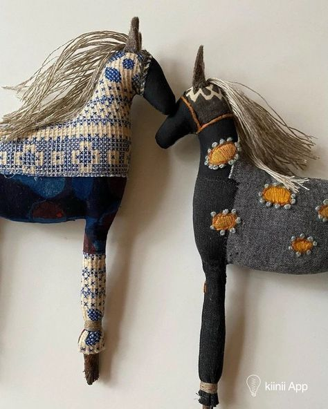

+++
date = 2022-05-28
title = "Ziua 137"
description = "Pe drum, își exersează speech-ul pe care-l va spune doctorului. Realizez, la un nivel atât de superficial, că e o bălărie ce spune. Dar, la a doua repetiție de speech, mă lovește claritatea și pot să privesc cu ochi noi informația: da, e o aberație la prima vedere, dar pentru ea a fost colacul de salvare al unor timpuri extrem de tulburi și de dureroase. Dacă pentru ea această informație a făcut, la propriu, diferența între viață și moarte, și 7 azi mai târziu, e încă aici, cu ce drept cataloghez eu asta 'bălărie'?! Mama, care toată viața ei a practicat jocul de-a nevăzutelea atunci când prezentul îi era dureros de nefavorabil, a pus, la nivel inconștient, toată puterea în bălăriile în care credea, iar ele au devenit liane ce au transportat-o, nevătămată fizic, în momentul următor al scenariului ei de viață."
authors = ["Biannca Locatelli"]
[taxonomies]
tags = []
[extra]
math = false
diagram = false
image = "images/ziua-137.jpg"
+++
---

Confortul mental și emoțional, conferit de prezența omului iubit lângă mine, e strecurat atât de subtil în niște adânduri d-ale mele, că trezirea după doar patru ore de somn, s-a făcut cu zâmbete-n vene și mișcări. Nu m-am mai agățat de marginile cerului strigând să-mi dea mai mult somn, nu m-am mai răstit în mine la mașinăria corpului că nu răspunde la iuțeala cu care comandă panoul central, creierul. A fost tare naturală trezirea și m-a dus cu gândul la ce am auzit o dată la Sadhguru: dacă știi mecanica vieții, și 3 ore de somn îți sunt de folos și suficiente. Evident că sunt în clasa zero la școala mecanicii vieții, dar azi a fost o mostră mișto de "uite că se poate și așa!".

***

Mândra Chichirică nu a dormit deloc cu noi, pesemne a fost tulburată de și geloasă pe prezența lui Mr. H în partea de pat revendicată de ea zilele cât el a lipsit. Cu o mică uimire și-un gând strâmb de grijă pentru ea, am pornit spre parter, să-mi las domnul să-și continue visările. Ce mă bucur că e aici!

***

Da, Spiky nu a dormit cu noi și a stat, bumbuțată, pe treptele din dreptul ușii noapstre. Acolo mă aștepta, cu niște chi-chi-uri ascuțite, a ceartă și a "m-ai trădat!". O palmez, că nu-i așa mare, îmi trece tremurul torcăcelii ei și mie-n sânge, și coborâm amândouă vibrând. Amândouă pline de iubire și de viață bună. Mulțam!

***

Îi dau drumul ei afară dar eu încă nu ies, că mama s-a trezit și ea cu noaptea-n cap și vreau să mă duc la ele sus, cât mai repede.

Parfumul căpșunilor striviți pentru smoothieuri e sublim. Iar amestecul lor cu para, avocadoul și banana, e cel mai sublim (hahaha).

Acum 7 ani, n-aș fi sesizat delicatețea parfumului, mirosul fiindu-mi alterat zdravăn de un pachet jumate de țigări pe zi. La vreun an după ce am renunțat să-mi intoxic celulele, au început atât mirosul, dar și gustul, să mi se curețe de nesimțire și am experimentat mici explozii. Am descoperit subtilități de care habar n-aveam că există, și am putut să privesc altfel experiențele prin care trec.

***

Camera mamei este scăldată-n lumină, e fereastra larg deschisă, ca un zâmbet care invită soarele să intre într-o cameră mai mereu întunecată. Și ea e bine, e totul acolo numa' zâmbet și lumină. O, doamne, împrăștie-le tu p-astea două și prin interiorul ei, și prin al meu, să nu mai fie loc de demență, gânduri ne-bune, oboseală sau grijă. Suntem în dimineața asta ca două vrăbiuțe, ciripim bucuroase, iar eu adun în micul buchet de bine al puiului de zi care s-a născut azi și starea mamei, lângă binele meu adus de prezența lui Mr. H în casă. Poate nu intru-n vârtej de treburi și uit să cresc buchetul ăsta, să-l fac punte peste hăurile care-mi încearcă prezența și vigilența.

***

Timpul meu magic chiar a fost al meu și chiar a fost magic. Dar magicul ăsta are arome diferite mereu iar azi a avut miros de balsam. M-am lăsat îmbrățișată de pătura proaspăt spălată și m-am învăluit în miros fain. Mi-am întins oasele și mușchii obosiți și-n întinsul ăsta am găsit voluptate. Mi-am pus simțurile la treabă și-am tras cu nesaț din tot ce-mi e în jur. Și, cireașa de pe tort, m-am delectat cu experiențe de trai off grid, departe de civilizația așa cum o știm noi. O parte din mine ar pleca acum să locuiască liber de toate constrângerile și toate plăcerile vinovate aduse de confortul modern, o parte din mine îmi oprește elanul cu gânduri legate de îmbătrânire și fix același confort. Las să se coacă tot ce e de decis și știu că dacă e ceva care să mă decidă cândva, o va face. Nu mintea mea e implicată în procesul ăsta decizional. Altceva mă decide pe mine, așa a fost toată viața mea și ăsta a fost și motivul principal din cauza căruia, sau datorită cui, nu am încăput în cutia convențiilor societății, cu designul universal ce nu ține cont de particularități de suflet.

***

Mi-am adus o mamă veselă la micul dejun. Am simțit că va fi unul prelungit și nu m-am înșelat. Ce păcat că n-avem subiecte noi, că ea coboară cu unele în plasa minții și până nu le deșartă pe toate, și le întoarce pe toate fețele, cu câte variante poate ea imagina, nu e loc de nimic nou. Ajunge însă informația că mi s-a întors domnul acasă și mă întreabă surprinsă: a fost plecat?!

Trebe să-mi obișnuiesc și mintea, dar și inima, cu plesniri d-astea de realitate. Chiar dacă nu pot intra în realitatea ei, pentru că nu pot citi în mintea ei, trebe să învăț să mă adaptez rapid la situații, să țopăi din contrast în contrast între cele două realități, a ei și a mea. Știu că se lasă cu amețeli dar ființa umană se adaptează la orice. Literalmente la ORICE.

***

După o oră și de mic dejun, urcă cu cafeluța proaspăt făcută la ea, s-o savureze în liniște.

Mă amuză cum consideră ea că zgomotul îl produc eu dar nu mă mai atacă-n interior. Ușor-ușor, par că se dezarmează, prin spargere de concepte, toate emoțiile alea care mă luau în brațe când mă simțeam insuficientă la vreo vorbă de-a mamei. Nu înseamnă că le-am rezolvat eu, mă prind și de asta, ci doar că puterea pe care mama a avut-o asupra mea, autoritatea cu care am investit-o eu ca ființă ce mă protejează și pe care nu trebe s-o dezamăgesc ca să nu mă abandoneze, se tocește considerabil, din cauza demenței. Realizez, la alt layer de profunzime, că mama devine incapabilă, așa că-mi iau autoritatea înapoi și, odată cu asta, mai spăl și niște mizerii.

M-am surprins la aeroport, când mi-am luat domnul, că încă mă doare să privesc cum un tată își așteaptă fiica, sau cum o familie își așteaptă puii. Sentimentul de protecție e unul pe care nu l-am bifat în viața asta. Nu a fost să fie, asta e încă rană sângerândă, nu știu cum s-o închid, pare că o revizitez și o revigorez ocazional, fără ca măcar să fiu conștientă. Poate că într-o zi n-o să mai aibă lacrimi de sânge și atunci se va închide. Poate.

***

Vine la micul lui dejun domnul meu și aduce cu el povești de viață proaspătă, e un suflu nou care spală repetițiile mamei de mai devreme. Îi ascult povestirile din călătoria ce tocmai s-a gătat și plec și eu cu el acolo. E funny cum noi, ființele umane, avem capacitatea asta extraordinară de a ne imagina iar eu mi-am exersat-o constant, până mi-a adus și beatitudine dar și balauri colosali. Pentru Mr. H e doar o reamintire, o retrăire la scară mai mică a ce a experimentat, pentru mine, care sunt și extrem de vizuală, e o trăire nouă, de viață nouă, excitantă, care se întâmplă undeva, acolo, unde eu nu ajung. Cică gelozia cuprinde dorințele și visele tale cele mai adânci, blocate de frică. La mine nu se potrivește integral, ne-libertatea de mișcare-mi limitează trăirea în fapt, dar da, am fost un strop geloasă pe el. Doar un strop.

***

În iureșul ăsta nebun al timpului, avem programare la dermatologie, pentru a găsi o soluție la copitele mamei. Sună aiurea dar ăsta e crudul adevăr: după nebuniile de chimio și radioterapie, s-a ales cu o pereche de copite, i-au crescut niște unghii atât de groase și de contorsionate, că trebe să le tai cu drujba. Degeaba pilesc eu la ele, n-am nicio șansă.

S-a echipat singură, s-a parfumat, pedanteria din ea probabil că o va părăsi odată cu ultima suflare a ei aici, și pornim. Pe drum, își exersează speech-ul pe care-l va spune doctorului, ocazie cu care aflu și care este constructul ei mental legat de unghii. Și-aduce ea aminte (!) că după ce a operat-o și i-a scos juma' de plămân și sânul, doctorul i-a zis că-i face o injecție, adusă de afară, care o va ajuta să nu mai facă niciodată cancer. Realizez, la un nivel atât de superficial, că e o bălărie ce spune. Dar, la a doua repetiție de speech, mă lovește claritatea și pot să privesc cu ochi noi informația: da, e o aberație la prima vedere, dar pentru ea a fost colacul de salvare al unor timpuri extrem de tulburi și de dureroase. Dacă pentru ea această informație a făcut, la propriu, diferența între viață și moarte, și 7 azi mai târziu, e încă aici, cu ce drept cataloghez eu asta "bălărie"?! Mama, care toată viața ei a practicat jocul de-a nevăzutelea atunci când prezentul îi era dureros de nefavorabil, a pus, la nivel inconștient, toată puterea în bălăriile în care credea, iar ele au devenit liane ce au transportat-o, nevătămată fizic, în momentul următor al scenariului ei de viață. Că au vătămat-o într-un final mental, e altă poveste, uite că totuși a ajuns la 74 de ani.

Așa că, deși și eu îmi pregăteam speech-ul, în minte, care să o contracareze în fața medicului, am capitulat blând dar plină de înțelegere în fața tenacității ei de viață. Poate să spună orice, dacă asta o ajută, asta e tot ce contează. Și tot ce a contact pentru ea până acum, anyway.

***

N-am rezolvat mare lucru, medicul e depășit de realitatea de la picioarele ei, dar am obținut o recomandare către cineva care cu asta de ocupă. Deși nu am rezolvat nimic concret, pentru mama a contat enorm că am fost la clinică. A fost firul de ață necesar de a începe să-și croiască "bălăria". Bun așa! Oricum vom merge mai departe dar pentru moment e un mic confort pentru ea.

Nu am gătit azi așa că profit de ieșire, mergem la un restaurant de unde luăm mâncare la pachet, pentru toți și ne întoarcem acasă tot vesele, cu ochii inimii bucurați de exploziile de flori de pe drum. Mama e extaziată, zice că nu a văzut niciodată așa ceva și o cred. E foarte posibil. Pentru că ea nu-și mai aduce aminte, nu că n-a mai văzut trandafiri până acum.

***

Ultima brumă de energie pe care o mai am pe ziua de azi e pusul prânzului. Mâncăm în trei, și deși am respins până acum cu putere, începe să se simtă asta ca un nou normal iar eu încep să mă simt bine. Chiar și așa, cu poveștile ei repetitive.

***

Afară se pornește ploaia, e o atmosferă mișto, de somn. Am anunțat pe toată lumea că nu mai vreau să fac nimic, că nu mai pot duce nimic mai mult. Am agățat pisica de-o toartă și am plecat cu ea sus, la noi, că mă ajută s-o văd cum doarme. Plus că aduce în cameră un vibe liniștit, care s-adună cu vibe-ul ploii și care m-au dus rapid pe-un tărâm cald și calm. Am dormit vreo 20 de minute dar a fost intens și odihnitor. Desigur că intra mult mai mult dacă vecinii nostri nu s-ar fi apucat de tuns iarba. Printre stropi de ploaie. Și statul la casă are minusurile lui, dar sunt oricum depășite de plusuri.

***

Tot restul zilei, m-am aruncat cu aceeași voluptate ca a dimineții, în lălăială. Am stat în pat, la noi, am citit, doar am stat, ca într-un final să mă hotărăsc la un documentar pe NetFlix - Kiss the ground. Am tot auzit de el și azi mi-am și permis să-l văd.

Mi-a validat filmulețul ăsta aproape toate credințele la care am ajuns prin propria experiență. M-a ajutat să pun și un strat de știință peste ce am aflat pe pielea mea, prin palmele mele, în cazul, des întâlnit, în care sunt întrebată de ce bio. Dacă aș putea, aș rula documentarul ăsta pe streetboarduri, să-l vadă lumea care stă în stații de autobuz, așteptând.

Explicația extrem de simplă dar de mare impact, pe care o conține ar trebui strigată către toată lumea: într-un mod simplist explicat, putem rezolva încălzirea globală cu ajutorul pământului. Pentru că țărâna asta fantastică, dacă-i dai în pliuri semințe, de orice fel, el creează microuniversuri pline de viață și stochează buzunare de carbon în burta lui. Extrage din aer carbonul și-l înmagazinează în adâncuri, ca papa bun pentru firicelele de viață ce pornesc să se înalțe din el. Dacă omul ar renunța la a ara pământul și implicit a distruge aceste miliarde de microuniversuri de sub tălpile noastre, dacă nu ar folosi insecticidele și pesticidele la o scară de neimaginat dar mai ales, neștiută de omul de rând care le mănâncă pe pâine, dacă am întoarce pământului resturile compostabile, am contribui și noi, ca mică parte ce suntem, la ciclul vieții, am opri deșertificarea, am opri extincțiile, am opri dezastrul. M-a marcat când Woody Harrelson, naratorul documentarului, a spus simplu: mai avem 60 de recolte. Adică 60 de ani. Atât mai are pământul rezerve să ne dea. După aia, dacă nu facem ceva acum, Dumnezeu cu mila.

Nu degeaba Sadhguru a pornit în călătoria vieții lui, cu motorul și cu sloganul Save the soil, acum.

Partea nasoală este că noi credem că nu ne privește pe noi, că nu noi avem puterea să facem ceva, ci aleșii noștri prin vot. GREȘIT! Avem toată puterea în mâinile noastre. Să votăm, să ne informăm părinții, bunicii, pe cei din jurul nostru care trăiesc în ignoranță, să plantam pe orice petic de pământ, orice, o floare, un pom, o bălărie, să compostăm resturile vegetale separat, să fim un strop mai atenți și la altceva decât pătrățica în care trăim. Că în pătrățica aia, pe care o lăsăm moștenire copiilor, în 60 de ani, va bate vânt neprielnic și va fi praf în ochi. La propriu.

***

Îmi închid ziua tare bine, legănată de sunetul ploii, cu omul tare iubit alături, cu sufletul plin de elan de a face, și cu recunoștință pentru:
1. Corpul meu, templul în care mă așez în fiecare zi și care mă slujește, dragul de el, în fiecare zi!
2. Noua înțelegere ce mă pătrunde, vântul nou ce bate dinspre mama și care zburătăcește vechile judecăți!
3. Pământul ăsta, țărâna asta pe care eu chiar o iubesc, înainte de a exista Kiss the Ground sau Sadhguru, pentru că din ea mă trag și-n ea mă-ntorc!

Clipa mea de fain:

  

 

 

  

    <a href="/blog/ziua-136/">Postarea anterioară</a>
  

  

    <a href="/blog/ziua-138/">Postarea următoare</a>
  

