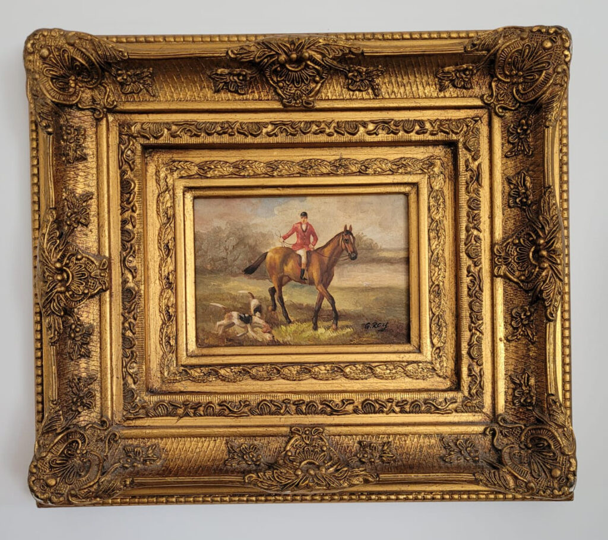

+++
date = 2022-05-31
title = "Ziua 140"
description = "Deși mă apasă întunericul din camera ei, aerul închis, toate exacerbează anxietatea și tristețea din mine, cred că mai e în mine, din ce în ce mai puțină și mai slabă și neajutorată, speranța că mama e mamă. Că din tot peisajul de emoții și plaja de sentimente, Creatorul a pus într-o mamă p-alea cele mai alese ca să poată să crească viață nouă. Inima mea refuză să creadă că a fi mamă este întâmplător, că conceptul de dătătoare de viață e doar unul biologic, o mecanică simplă și o expulzare brutală. Încă mai am în mine gândul că dacă mă așez pe scaunul potrivit, dacă-mi calibrez potrivirea vibrațională cu a mamei, reușesc să ating coarda aia de mamă și ne conectăm. "
authors = ["Biannca Locatelli"]
[taxonomies]
tags = []
[extra]
math = false
diagram = false
image = "images/ziua-140.jpg"
+++
---

Am plâns ieri atât de mult până când nici plânsul n-a mai vrut să mă plângă. Oi fi înduplecat niște energii, oi fi înmuiat niște ziduri, că cineva, undeva, s-a milostivit de mine și, cu ochii secați și cu oftatul agățat de inimă, am adormit zdravăn, fără niciun sunet perturbator. Și așa a fost până dimineață. Aveam nevoie de asta.

***

Când am deschis ochii, aproape că i-am închis la loc instant, pentru că nu vreau să mă trezesc în realitatea asta. Am lăsat aseară, în potențialul ăsta de viață, vestea aia teribilă despre Maya și vreau să nu accesez azi același potențial. Vreau să mă duc într-un destin paralel, în care Maya e perfect normală și sănătoasă, fără malformație congenitală rară. Numa' că nu ne-a predat nimeni pe nicăieri cum să găsim ușile către alte posibilități și ne zbatem ca nepricepuții să forțăm îndoiri și plieri de realitați, după cum ne e pofta inimii care iubește adânc.

Ca să-mi valideze că nu aici vreau să mă trezesc, domnul meu mă anunță că nu se simte bine. Simțisem oricum că ceva nu e cum trebe, de vreo două zile tot tușea scurt, iar acum părea grena la față.

Deci, full speed, dacă se poate, către o altă realitate, vă rog!

Cum nu e niciun șofer care să mă ducă, fac eforturi și de minte și de inimă, să mă pun în varianta asta de viață. Mă scobor din pat, încet, că poate îl mai ia somnul pe domnul meu, și mă duc spre bucătărie.

Mama e trezită deja, o altă nuanță care-mi respinge și mai dramatic realitatea. Ce-am făcut, unde-am fost, când mi s-a cangrenat așa de tare viața?! Pare că am spart o infecție și curge tot puroiul, de mă satură de tot și de toate. Nu vreau nimic din tot ce mi-a venit azi în cărțile zilei. NIMIC!

***

Beau apa fără niciun Dumnezeu, fac smoothieurile fără gânduri și plec, trăgând picioarele a resemnare, sus, la mama. N-am niciun chef de plângerile ei dar le înghit, n-am niciun spor de curățenia de la ea dar o bifez, n-am nicio dorință de vorbă și totuși o fac. Cineva, mai presus de mine, asta tăvălită pe jos, o altă variantă a mea, mai deșteaptă și mai elegantă, manevrează mașinăria la care m-am redus în dimineața asta. Și cu gândul ăsta, mă las manevrată.

***

Domnul meu coboară și el, nu mai poate dormi dar cred că încăpățânarea e o trăsătură care se ia, ca râia, dacă stai prea mult, prea aproape de cineva. El, cu o ușoară fierbințeală, cu corpul de zici că-i bătut mărunt, se duce la birou! Că așa a zis și că așa trebe. Cum să-i explic eu, cu ce argumente să-i silesc sufletul să înțeleagă că nu există "trebe"? Eu, care fac fix ca el?! N-am, așa că îi pregătesc micul dejun, pun în el toată iubirea mea, îi dau o lămâie la el și îl las să plece. Că așa vrea el iar eu nu decid  în locul lui. Niciodată.

***

Mi-a înflorit un iris, alți doi sunt pe care să se desbobocească, două clematite au ridicat și ele, fiecare câte-un căpșor, un ranunculus grena se ridică încet, alte 2 anemone și un fir de mac plăpând întregesc și ele opera mea de artă începută în curticica de flori. Am o mică tresărire în suflet, parcă mă mângâie blând priveliștea lor, parcă vor să mă tragă de mâneca inimii să-i arate că e frumusețe pe lumea asta, că nu se oprește nimic în loc dacă eu îs tristă și că oricum nu pot schimba nimic dacă mă prăvălesc. Cred că știu asta, dar inerția durerii care nu-mi lasă nicio portiță pe unde să-mi trag sufletul, mă acaparează prea cu totul.

***

O aduc pe mama la masă deși nu am niciun chef, nici de mic dejun, nici de mama. Pur și simplu, mi s-a luat de amândouă. E temporar, știu și asta, dar numa' gândul că trebe intru în aceeași buclă de timp, cu aceleași discuții, mă umple, până la refuz, de greață.

Ca să variez un pic, o iau și pe Sassy și cu ea în brațe, ignorând nu-urile mamei, coborâm la parter. Grăsana e în delir, îi place și ei să exploreze, mama e agitată, iar eu sunt indiferentă. Nu mai încape alt fir de emoție în mine, cel puțin nu la acest moment. O urmăresc absentă pe Sassy cum umblă fericită prin tot parterul, o ascult absentă pe mama cu repetițiile ei, nederaiate de noutatea Sassy, așez pe masă ce vrea să mănânce și tot absentă stau pe scaun lângă ea. Simt că-s plată, e o stare ca un mucilagiu scârbos, dar nu mă pot smulge din ea. Mă uit la mama că mișcă buzele, văd gesturile ei și știu ce spune, că doar îmi spune every fucking day, dar nu mă pot aduce în prezent. E o senzație de fugă din mine și din prezent care mă sperie. Că e doar o senzație, mă simt înțânată-n starea asta ca o gumă și mă irit că nu pot să decid o direcție: fie stau în prezentul ăsta nașpa, că poate s-o mai lumina cândva, fie plec din prezentul ăsta undeva unde e deja lumină.

Nici nu știu când a terminat de mâncat. Am văzut-o că se ridică, am luat și eu pisica în brațe că de grasă ce e, nu poate urca prea multe trepte singură, le-am dus pe amândouă la etaj și am rugat-o să stea puțin cuminte, că fug să iau niște carmol și vitamina c pentru domnul meu plus ceva să-i fac o supă. Îmi promite, mă schimb rapid și plec.

***

Am rămas cu un "defect" în urma cursului de Pace cu mine, și văd că-l fac și când nu sunt conștientă: mi-am exersat tare mult atenția distributivă și cuprind cu ochii, fizici și ai minții, multe din lucrurile pe lângă care trec. Așa se face că întâi am văzut ochii, apoi mersul și apoi m-a trecut un fior pe toată șira spinării. E în viață!

Acum cinci ani, când m-am apucat de construcția casei, în fiecare dimineață în care veneam la ce avea să devină Ever After Cottage vedeam, la plimbare, un tip. Slab, tras la față, îmbrăcat gros, indiferent de cât de rece sau de cald era afară. Poate pentru că și eu am simțit suflarea morții generată de cancer, cu mama, am știut, intuitiv, că tipul are cancer. Nu am vorbit niciodată cu el, cred că și el deja mă recunoștea, ne vedeam foarte des, și mereu îi trimiteam un gând de liniște și de împăcare. Câteodată mai și plângeam pentru el și pentru tinerețea lui.

Apoi, chiar înainte să ne mutăm, intersectările noastre s-au oprit brusc. În fiecare dimineață îl căutam cu ochii pe drum și după câteva luni, am închis în mine subiectul cu o lumânare aprinsă.

Well, azi, i-am recunoscut ochii și mersul pentru că în rest, este de nerecunoscut: s-a înzdrăvenit, i-a crescut părul, are culoare la față, e un alt om. Cum e și normal să fie, după ce treci de furtuna cancerului. Joe Dispenza are o chestie tare mișto care spune că pentru a te face bine, trebe literlamente să devii alt om. Acum înțeleg asta și prin prisma energiei și vibrației, dar e destul de simplu de văzut oricum. Vorba lui Einstein, nu poți rezolva o problemă de la același nivel de conștiință care a creat-o. Nu poți să te faci bine, dacă-ți păstrezi același stil de viață, același mod de gândire, același tipar de simțire. Simplu de zis, al naibii de greu de practicat zilnic.

Cu toată starea mea de scârbă față de ce-mi servește viața acum, e al doilea semn pe care-l văd azi, după florile din curte, al doilea semn care vrea să-mi spună ceva. Iar eu știu ce vrea și tot nu vreau să-mi aplec urechea.

***

M-am întors cât de repede am putut dar nu îndeajuns să o prind pe mama asupra faptului. Deși am rugat-o, deși mi-a promis că nu coboară, nu a răbdat-o sufletul, sau poate că a uitat, sau poate că nu o interesează oricum, și a coborât să caute ceva dulce. Vorba domnului meu, creierul cere dulce, și cu cât creierul e mai defect, cu atât cere mai mult. M-am supărat pe ea, m-am dus să-i spun că am venit, că știu că a coborât și am închis ușa spunându-i că am nevoie să pot avea încredere în ea. Așa, și?! N-are nicio apăsare. Probabil că nici eu n-ar trebui să am.

***

I-am făcut supa domnului meu, prânzul e gata și pentru coana mare dar ea doarme, așa că stau atârnată, nu mă apuc de nimic, aștept să se trezească.

***

Poftește la supa lui Mr. H, nu-i bai, e destulă. I-am pregătit friptură de porc la cuptor, că asta a vrut. Îi pun în farfurie, ia o gură și împinge farfuria deoparte. Nu-i place. Pot să bag mâna-n foc că e gustoasă, oricât sunt eu de vegană, miroase în bucătărie bine pentru un carnivor. Cu toate astea, ei nu-i place.

Mi-a pus capac. Iau farfuria din fața ei, îi prezint alternativele vegane, strâmbă din nas la toate și hotărăște că oricum s-a săturat cu supa. Palmează trei bomboane, vrea să ia și un foietaj, moment în care izbucnesc. Chiar n-are nicio limită. E de o nepăsare și de o neînțelegere care o încununează pe a mea! Nu o mai las să ia nimic dulce, îi explic, răstit, că dacă face diabet s-a terminat și cu viața ei, și cu a mea, nu cred că sensul a oprit-o, ci nervii mei care nu mai pot sta cuminți.

'Tu-i mama ei de treabă!

M-am apucat de aruncat resturi de mâncare și de spălat vase și mi-am adus aminte de jurământul pe care mi l-am făcut cu multe vieți în urmă, în viața asta.

Am trăit în copilărie nu vremuri îndestulate, dar nu era numai la noi, așa era cam pe la toată lumea, însă n-am făcut niciodată foamea.

Până în prima lună de facultate, când m-am trezit că ai mei nu mă întrețin și nu mai am, la propriu, ce mânca. Nu voi uita cât oi trăi, cum Universul, sub forma unui grup de Martori ai lui Iehova, ne-a bătut la ușa căminului din Regie, să ne spună varianta lor de poveste a Creației. Pesemne că nu mai aveam putere să zicem nu și i-am ascultat, eu și prietena mea, din același oraș cu mine, fostă colegă de liceu. După o oră și ceva de povestit și povestit, s-au ridicat și au plecat. Iar după altă oră, s-au întors cu o pungă plină de eugenii! Doamne, am mâncat din punga aia o săptămână întreagă, și la mic dejun și seara, că prânzul îl săream. Mi-am spus atunci că o să fiu atentă la fiecare coajă de pâine. N-am fost mereu, am mai fușterit și risipit din când în când, dar când o făceam, senzația aia de stomac lipit de spinare, de foame, mă urmărea cu greutate din spatele minții.

Am același disconfort când văd risipa pe care o fac pentru mama. Și nu mă pot împiedica să nu gândesc că, undeva într-un viitor, toată mâncarea asta bună dar aruncată, se va răzbuna pe ea. Nu-mi doresc asta, e un program instalat într-o disperare dar uite că nu pot să-i fac uninstall.

***

Domnul meu bolnav se adună și el pe acasă, îl hrănesc și dădăcesc, s-a lipit o viroză de el și el de ea și până nu se satură unul de altul, nu prea am ce-i face. Are supă bună, suc proaspăt de fructe, vitamina C, fructe, pat și liniște să se odihnească, mâine e zi liberă, poate lasă puțin încăpățânarea deoparte și ascultă de corp. E decizia lui oricum, eu îi creez spațiul și condiții optime să-i fie bine. Dar de trecut strada, dacă nu vrea, nu-l trec.

***

Nu știu de ce am avut ideea nepotrivită, mai ales azi și mai ales în contextul în care mă zbat de două zile, să stau cu mama la o vorbă, când i-am dus sucul și pastilele. Deși mă apasă întunericul din camera ei, aerul închis, toate exacerbează anxietatea și tristețea din mine, cred că mai e în mine, din ce în ce mai puțină și mai slabă și neajutorată, speranța că mama e mamă. Că din tot peisajul de emoții și plaja de sentimente, Creatorul a pus într-o mamă p-alea cele mai alese, ca să poată să crească viață nouă. Inima mea refuză să creadă că a fi mamă este întâmplător, că conceptul de dătătoare de viață e doar unul biologic, o mecanică simplă și o expulzare brutală. Încă mai am în mine gândul că dacă mă așez pe scaunul potrivit, dacă-mi calibrez potrivirea vibrațională cu a mamei, reușesc să ating coarda aia de mamă și ne conectăm.

Îi spun, sugrumată de lacrimi noi, de vestea cu Maya. Îi explic, simplist, că tot așa am înțeles și eu până acum, ce are și care sunt riscurile. Când am terminat, tot ce a putut să zică, plat, sec, rece, este că Maya trebuie eutanasiată. Parcă mi-a tras cineva brusc scaunul ăla de sub mine și mi-a dat cu el și peste ochi, și peste inimă. Cum naiba am putut eu să mă păcălesc iar că corpul ăsta din fața mea e capabil de vreun sentiment?! Doar ieri dimineață citeam că unul din simptomele demenței este capacitatea din ce în ce mai redusă de a simți emoții.

Păi dacă n-are emoții, nici nu se va simți ofensată dacă mă ridic și plec. Că n-are cum, nu e niciun resort acolo care să activeze vreo căldură umană sau cel puțin nu e acum. La apelul meu de azi, mama a eșuat nu de la a fi mamă, ci de la a fi umană.

***

S-a pornit furtuna afară, toarnă a potop, fulgeră și tună, e copia fidelă a interiorului meu. Și tot indigo a și pornit, mai devreme era un soare demențial, ciripele și zumzăieli peste tot. Nu doar la mine se schimbă planul într-o fracțiune de secundă. Viața mea e o replică la scară redusă a vieții Cosmosului, nu doar viața mea are susuri și josuri, furtuni și tunete, toate au. Nu doar eu contez sau libertatea mea sau nevoia mea de conexiune, și mama contează și are nevoi, chiar dacă nu și le mai știe, vreau să-mi forțez mintea să se ducă lângă inimă și să nu-i mai lipească etichete. Poate că și mama are nevoie de conexiune dar zău dacă știu cum să găsesc drumul către locul din care să mă lansez cu ea în spațiul unde-i ei bine. Dacă va fi nevoie să învăț, sunt sigură că viața mă va învăța. N-a ratat până acum nicio ocazie.

***

Paradoxal și pentru prima oară în viața mea, furtuna asta mă liniștește. Nu-mi mai creează panică, frică sau anxietate. Pentru prima oară, sunt capabilă să fiu recunoscătoare furtunii. Aia din planul fizic, aia care mereu mi-ataca sentimentul de siguranță și-mi strecura fiorul morții neașteptate. Yep, confirm, în miezul furtunii zac comorile cele mai mișto, dar trebe să ai cohones să stai în ochiul ei și să le cauți.

***

Trag cortina înserării peste o zi amestecată, mai mult bilă neagră decât albă, cu mici semne, cu mari daruri încă neînțelese, și cu recunoștință pentru:
1. Viața amicului meu necunoscut! Să-i fie bine mult de acum înainte!
2. Percepția nouă asupra furtunii!
3. Mr. H în viața mea și eu în viața lui Mr. H!

Frumosul meu azi și de toate zilele de acum înainte este:

  

Magnifique
