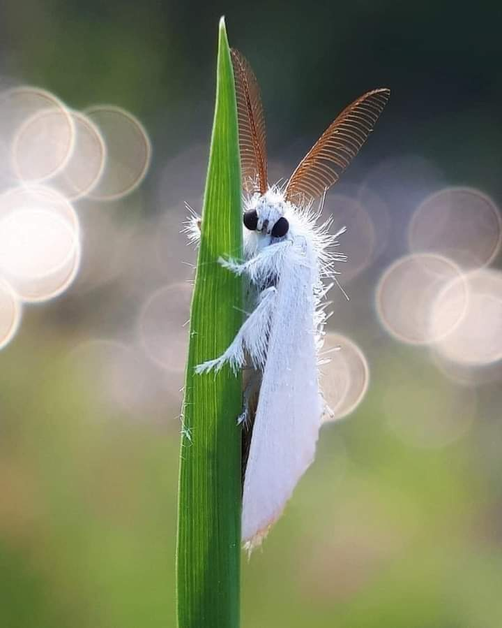
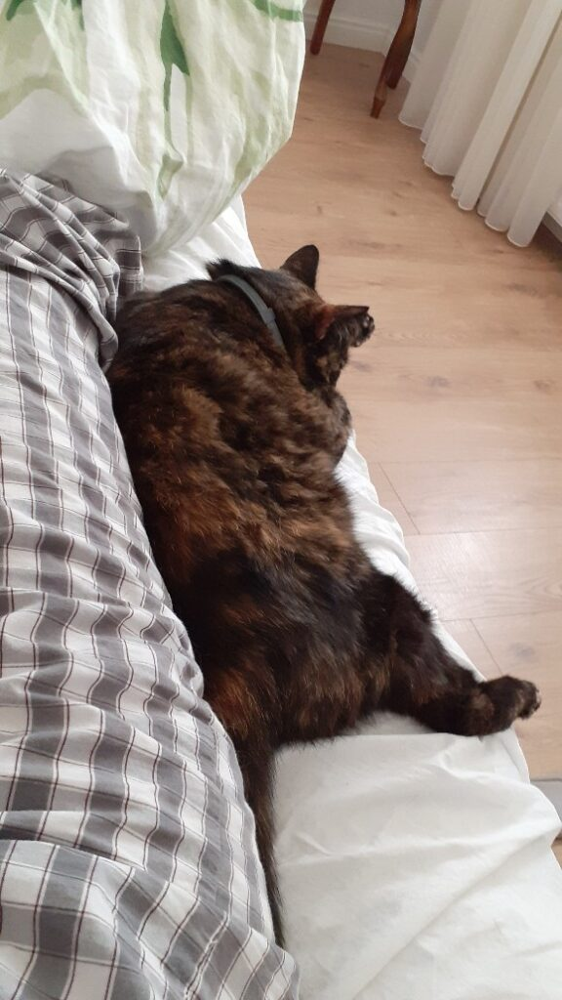

+++
date = 2022-06-02
title = "Ziua 142"
description = "Gândul că bărbații nu au fost echipați, de natură, cu un prag ridicat al durerii, mă oprește să am porniri împotriva domnului meu. Nu e vina lor că femeile sunt de pe Venus și bărbații de pe Marte, că, by default, prin setarea de fabrică, doar femeia se despică-n două să dea naștere. Dacă ar fi să aduc o perspectivă nouă asupra acestui fapt, eu cred că Creatorul ne-a dat o indicație a naibii de clară că, dacă joci după regulile vieții, durerea nu e în peisaj decât excepțional și atunci e cu un scop care depășește durerea în sine. Doar că noi am pocit sensul la o cotitură și acu’ mai mereu ne doare de ne scăpăm pe noi, ca să mă exprim academic."
authors = ["Biannca Locatelli"]
[taxonomies]
tags = []
[extra]
math = false
diagram = false
image = "images/ziua-142.jpg"
+++
---

Nu știu dacă sunt bucuroasă că m-am trezit, dar știu sigur că alternanța de frig-fierbinte m-a ținut în șah toată noaptea, trează sau semi-adormită. Gâtul a acompaniat și el cum a putut, iar tusea aia mică și seacă, cu usturimi pe la final, a întregit tabloul. Virozul nu se dă dus și numa' roz nu e. Sora lui, viroza domnului meu, pare că și-a luat tălpășița.

***

Spiky m-a păzit toată noaptea și când a simțit că m-am trezit, a venit lângă mine. Incredibil ce senzori are animăluțul ăsta și cum îmi dă înapoi înmiit față de ce-i dau eu. Am plecat amândouă să lăsăm un Mr. H să mai doarmă puțin, că, deși nu l-a mai chinuit viroza, a avut o pauză de somn de la 3 la 6 dimineața, pur și simplu nu s-a lipit somnul de el.

***

Ce bine mi-a făcut și apa ușor fierbinte, și intenția arzătoare trimisă să întâmpine ziua, și liniștea prea-dimineții. În poziție verticală simt și o durere de cap dar e difuză și răspândită, nu s-a acutizat undeva și nu e doborâtoare.

Mama e trează deja, habar n-am la cât s-a trezit, iar asta, în loc să mă activezez ca până acum, a pus o nouă perspectivă peste ochi și peste minte: dacă s-a trezit de ceva timp, oricât, că nu știu cât, și nu s-a întâmplat nimic, nu se va întâmpla nici de acum înainte. Așa că m-am pus pe făcut smoothie cătinel, să nu mă zdruncin prea tare, că mi-e că se lasă cu scârțâieli.

Deși e indicat să nu amesteci prea multe în smoothie, monofructul e cel mai rapid digerabil de către organism, azi mi-am permis aroganțe: căpșuni, afine de pădure, avocado, pară, banană, vișine. O nebunie de culori și cu siguranță o nebunie de gusturi. Poate nu era bine azi să forțez corpul cu atâtea de descompus, dar nu m-am putut stăpâni. Simt nevoie de papa bun, cât mai mult, să împing virozul afară din sistem.

***

Intru la mama mascată, nu știu dacă știe de ce sau nu, dar n-am timp să aflu: îi las smoothieul, pliculețul pentru Sassy și pastilele de dimineața. O rog să se ocupe de ele și plec înainte să văd vreo reacție de la ea. Mi-e teamă să nu-i dau și ei viroza și prefer viteza de reacție a mea în fața vitezei de înțelegere a ei. Oricum mă uit pe cameră și văd că, deși poate nu a înțeles ce-am zis, mecanic, știe ce e de făcut. Iar eu pe mecanica asta încep să mă bazez mai mult decât pe înțelegerea ei.

***

Cu frisoanele grămadă pe mine, mă așez încetișor, să nu mă sparg, pe colțarul din living. Spiky, sus, pe marginea colțarului, cu un ochi pe mine. Îi confirm, dacă cumva mai era cazul, că da, o iubesc. Nu pun grade de comparație între ea și Maya, că-s iubiri diferite dar îi confirm că are un loc la masa inimii mele, acolo lângă mine. Îs onorată de grija ei, că acum e singura care mi-o poartă.

Dau drumul la TV, pe BBC nature și bine fac. O imagine cu un fluture colorat pe o floare mov închis de liliac, m-a străfulgerat cu căldură și cu bine și cu frumusețe până departe, în suflet. La propriu, am simțit fiori mișto, sclipiciul ăla ca de artificii, prin tot corpul meu. Și nici măcar nu eram atentă la tv ci doar mi-au căzut ochii pe el pentru o clipă.

Știu viață, știu că ești frumoasă, știu că avem o relație de love and hate, știu că-mi vine să te schimb cu alta de la magazinul de vieți câteodată dar, în momente mici ca ăsta, nu pot fată să nu recunosc că ești a naibii de frumoasă și de interesantă!

Trebe să-i dau Cezarului ce-i al Cezarului.

Într-o pauză publicitară și un scroll pe social media, fățuca asta de molie a reușit să-mi înmoaie definitiv, pe ziua de azi sper, rezistența la bucuria de viață și de frumusețe. Doamne, de ce ne complicăm noi, umanii, atât de mult?

  

Viața e nouă cu fiecare început de zi. Practica, la fel. Eu, care am bătătorit calea aia în care ȘTIAM că dacă am înțeles ceva, e înțeles pe vecie, îmi iau țeapă în fiecare zi că nu e așa. Nu înseamnă că uit, nu înseamnă că sensul e altul, înseamnă doar că nu aplic în practică ce știu în teorie. Sau ce-am aplicat ieri. Sau acum un an. Viața asta se trăiește zi de zi și tot ce știi se aplică zi de zi. Doar că mie, din postura de victimă pe care mi-o iau câteodată, parcă nu-mi vine să mai aplic. Parcă-mi vine să caut vinovați în afara mea, că așa mi-e mai ușor.

***

Domnul meu își ia micul dejun în birou, ca să nu se intersecteze cu mama în bucătărie, unde i-am lăsat totul pregătit și am ieșit în curte. Vorbesc cu ea din curtea de flori dar oricum nu este interesată nici de mine, nici de conversație. Așa că, după câteva replici fără răspuns, am priceput și eu că nu e nimeni acasă și n-am mai bătut la ușă.

Mi-am alintat anemonele, le-am urat bun venit în realitatea mea celor doi crini asiatici roz, am vorbit cu ranunculusul ieșit care e de culoare vișină putredă, nu alb cum scria pe plic, roșiuțele mele au fost ultimele care au beneficiat de bruma mea de vlagă din dimineața asta. Fuga în casă, să-mi fac salata de crudități, să beau multă apă, să pompez ceva în instalație să mă ajute să trec prin ziua asta. Nu se anunță roz, la capitolul putere.

***

Încerc să finalizez ideea pe care o am în cap pentru tabloul cu declarația mea către Mr. H, dar nu știu cum se face, că nu reușesc. Știu că vreau să scot tabloul și mesajul și totul în față, ca un punct focal, prin niște tușe de culoare verde închis pe fundal. Dar nu reușesc să încropesc vreo juma' de oră să termin ideea asta care-mi va plăcea la nebunie. Am ales deja culoarea și-mi dă cu plus de câte ori o văd. Cu ceva timp în urmă, mi-am luat multe bobârnace peste ochi încercând să stabilesc o culoare de perete punând-o în contrast cu peretele alb pe care ar urma să fie aplicată. Mare greșeală! Ochii sunt atrași irezistibil de culoare, oricare ar fi ea, și nu de non-culoarea alb dar prin contrastul mare, orice culoare va părea mult mai intensă decât va arăta cu adevărat când tot peretele va fi vopsit în culoarea respectivă. Abia apoi am înțeles obsesia designerilor pentru culorile curajoase: puse pe un întreg, nu mai par deloc sălbatice. Și chiar dac-ar părea, dacă mie-mi plac, who cares?

Well, n-am avut energia azi să pensulez verdele ăla superb pe porțiunea din spatele tabloului dar mă mângâi cu gândul că așteptarea face rezultatul și mai spectaculos. C-așa e mai comestibilă nereușita, în genere.

***

Am urcat la noi în dormitor, să încerc magia portocalie a unui mic somn. Mi-a făcut poftă mama și și simt nevoia de odihnă. În timp ce urcam pe scări dar și în dormitorul nostru, am realizat că eu merg în vârful picioarelor, să nu fac zgomot. Iar asta a dus la o realizare și mai mare: eu nu calc apăsat niciodată. NICIODATĂ! Tot timpul, când merg prin casa mea sau prin orice casă, merg ca și cum nu vreau să deranjez. Pe cine și ce, habar n-am! Giiiz, cât de mult s-a ascuns în mine nevoia de a fi plăcută, de a nu deranja, la un nivel fizic pe care nu l-am văzut niciodată până acum. De vreun an, poate chiar doi, am niște probleme cu piciorul stâng, în general, și cu talpa stângă, în special. Conform Noii medicini germanice, problemele cu picioarele au în spate teama, rușinea și frica de a merge înainte, no matter what. Descoperirea de azi a fost pe cât de nesemnificativă în sine, pe atât de șocantă pentru mine. Eu nu pun toată talpa piciorului pe pământ, de parcă contează în ochii cuiva dacă merg apăsat sau nu, de parcă cineva mă premiază că merg ca o gazelă și nu se simte nimic. Nu numai că eu nu calc apăsat, dar îi mai și judec pe cei care o fac. Asta așa, că sunt eu mai cu moț.

N-am reușit să adorm, poate am fost prea încântată de descoperirea făcută, că nu mi s-a legat nicio picoteală. Am o senzație de moleșeală și de sfârșeală, amorul meu, pe față deja, cu virozul, mă secătuiește de puteri. Am scăpat însă de frisoane, am dat-o-n transpirații, toate supravegheate îndeaproape, lipită de mine chiar, de Spiky.

  

***

Cu vocea schimbată, cobor pentru prânzul meu și al lui Mr. H pentru început, și apoi al mamei.

Gândul că bărbații nu au fost echipați, de natură, cu un prag ridicat al durerii, mă oprește să am porniri împotriva domnului meu. Nu e vina lor că femeile sunt de pe Venus și bărbații de pe Marte, că, by default, prin setarea de fabrică, doar femeia se despică-n două să dea naștere. Dacă ar fi să aduc o perspectivă nouă asupra acestui fapt, eu cred că Creatorul ne-a dat o indicație a naibii de clară că, dacă joci după regulile vieții, durerea nu e în peisaj decât excepțional și atunci e cu un scop care depășește durerea în sine. Doar că noi am pocit sensul la o cotitură și acu' mai mereu ne doare de ne scăpăm pe noi, ca să mă exprim academic.

Zici că m-a lovit trenul, din spate, m-am ridicat, m-a lovit și din față și apoi, din laterale, au venit alte două trenuri ca să flancheze și să termine treaba. Dar fix ca-n Die hard nu știu cât, trebe să mă ridic, să pun masa, să pregătesc dușul mamei, să stau în picioare când efectiv nu pot să stau în picioare. E un efort care-mi torturează mușchii, de-mi tremură carnea pe mine. Curg apele și nu știu dacă e de la viroz sau de la efortul mare de a sta pe verticală și de a face.

***

M-am întors iar împotriva ei. Și-n timp ce-i făceam duș, i-am șoptit în gând că-mi pare rău și că-i cer iertare. Că n-are nicio vină ea, așa cum nici eu n-am nicio vină. Amândouă urlăm a neputință, una de bătrânețe și de boală, alta de tinerețe și de zbor înfrânt.

Nu mai pot. Nu mai intră nimic. Sunt în pat, văd cum îmi crește temperatura pe termometru și-mi scad puterile pe puterometru. Cel mai mare confort al meu acum rămâne apa, pe care o beau când pot și cât pot. Mi-am pus mari speranțe-n ea și-n hidratare și o s-o scoatem la liman.

***

After all, tomorrow is another day, cum zice Scarlett O'hara. O zi de intensități fizice dar și-n recunoștință pentru:
1. Fluture, liliac, sclipici!
2. Apa mea de toate clipele de bine!
3. Conștientizarea mersului superficial, sau mai bine zis, a dedesubtului colosal al lui!

Frumosul meu azi este:

  

