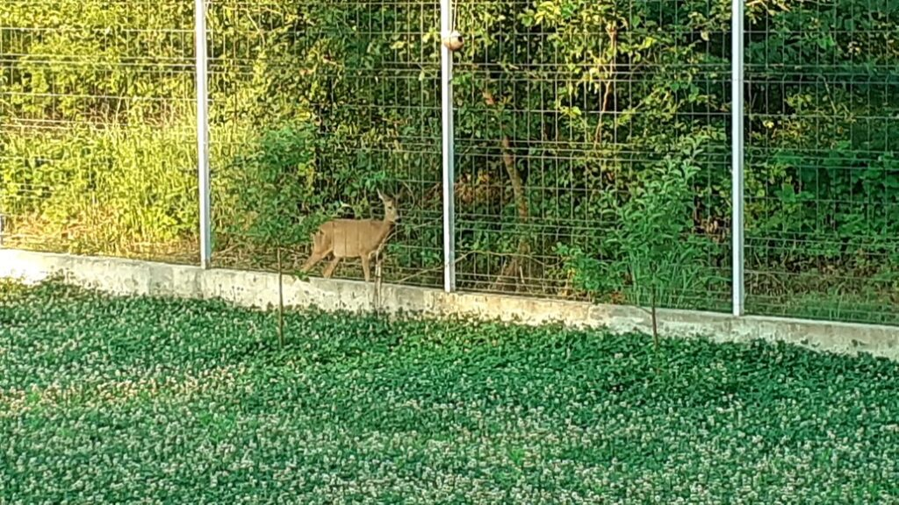
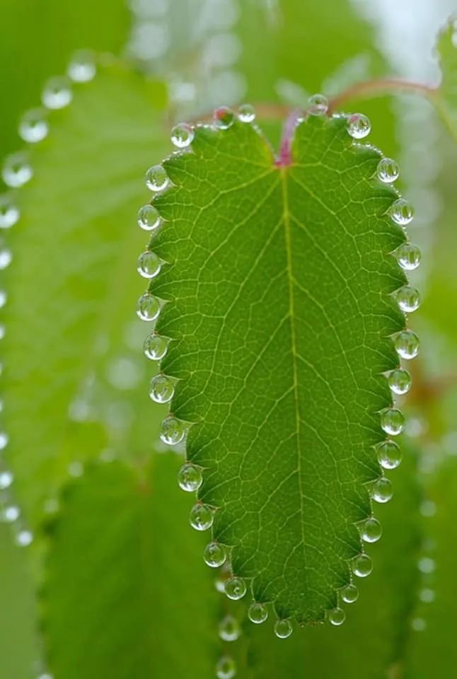

+++
date = 2022-06-09
title = "Ziua 149"
description = "Îmi dau seama că nu mai caut căldură umană ca un pansament peste niște răni vechi. Nu, caut conexiune adevărată, nu vreau milă, nu vreau rezolvare, vreau să pot să fiu eu, să mă dezbrac de urlete și să mă primenesc lângă cineva care să poată să ducă asta. Să stea lângă mine, conectat la mine, înfrângându-și pornirea de a-mi rezolva împrejurările, să-mi dea spațiu să fiu golașă fără să mă simt jenată sau mai puțină, de a nu-mi pune eticheta de x sau y, ci de a înțelege că starea pe care o traversez este x sau y."
authors = ["Biannca Locatelli"]
[taxonomies]
tags = []
[extra]
math = false
diagram = false
image = "images/ziua-149-1.jpg"
+++
---

Am dormit în salturi, cu treziri generate fie de frisoane, fie de dureri de spate, fie de o sete imensă. Fiecare trezire a fost insoțită îndeaproape de starea aia de leșin imediat, chiar dacă mă așteptam ca corpul să n-apuce să conștientizeze trezirea în așa scurt timp. Ca niciodată, căderea înapoi în somn s-a petrecut de fiecare dată rapid, ca și cum în trezirile mele scurte am dat și o tură cu plugul și-am arat o brazdă-două.

Așa că trezirea pe bune, pe la 5 și un strop, n-a fost pentru corpul meu nicicum diferită de cele nocturne, dându-i repede îndrumător, pentru zi, pe fratele leșin. S-a lipit starea asta de sfârșeală apropiată ca o a doua piele de mine și nu scap de ea, orice aș face. N-am dormit în viața mea atât de mult și cu toate astea, uite că tot nu pot sta în picioare.

***

Puțineii stropi de energie, pe care zici că i-am stors dintr-o cârpă semi-uscată, mi-ajung fix cât să fac smoothieurile. Apa mi-o beau stând ghemuită pe scaun, pentru că leșinul ăsta are un tentacul în stomac, care mă doare de nu pot sta dreaptă. Ceaiul îl fac după ce termin apa și în reprize: pun apa la fiert, mă așez pe scaun, aduc ceaiul din cămară, mă așez pe scaun, pun ceaiul și apa fiartă, mă așez pe scaun. Oribil dar e bine și așa, decât deloc. Ziua de ieri a fost una din zilele cele mai nezile din întreaga mea existență de până acum: să dorm întruna, fără nicio ancorare în prezentul ăsta al meu, e o chestie nașpa, parcă m-am dizolvat în eter și în toate și nu mă puteam închega înapoi în Biannca. Bine că a trecut, orice vine după asta e înmiit mai bun.

Și ca să-mi arate că așa e, Universul mi-a "plantat" o căprioară lângă gard, în dimineața asta, care mi-a pus niște luminițe în ochi. Am urmărit-o din casă, de pe scaun, să nu o stresez, dar animăluțul ăsta mi-a dat un pic de bine din binele lui.

  

***

Pentru că deja îmi cunosc traseul energiei, îi duc mamei smoothieul și medicamentele, lui Sassy pliculețul și mi-e greu să văd mizeria de la ele. Oricât de mult vreau să pot, nu pot. Mai am și două măști pe față, când oricum respir destul de greu, dar nu am putere să mă apuc să mătur și să spăl pe jos azi. Gunoiul e plin, totul e fix cum nu-mi place să fie dar, deși zvâc există în mine, nu e dublat de putere, și va rămâne așa până voi putea să curăț. Plec încet, ținându-mă de pereți și de mâna curentă a scării, până în living, unde mă întind să mă liniștesc.

***

Aspiratul pe nas se simte ca și cum ar fi luat foc nările pe dinăuntru, și parcă și am un miros de ars în nas. Am un tremur constant în toți mușchii, dacă nu mă așez când simt că pic, vomit sau mă stric la stomac instant, durerea de stomac, din capul pieptului, vine imediat să secondeze sfârșeala. Eu știu că domnul meu, fie că se simte un strop vinovat, fie că nu vrea să vadă, tot insistă că-i viroză, dar mie mi-e clar ca niciodată că ăsta a fost, și încă este, covid. L-am bifat și p-ăsta, că altfel viața mea nu era completă.

***

Mă bucur că el s-a pus mult mai repede pe picioare și e capabil să o aducă el pe mama la micul dejun. De altfel, în zilele trecute în care n-am fost pe aici, tot el s-a descurcat cu ea, cu măști duble și cu ce a găsit prin frigider. Azi însă va pleca după micul dejun iar eu va trebui să-mi adun toți stropii de energie de unde pot, să gătesc ceva pentru mama. Până una-alta, are micul dejun pregătit, coboară, nici nu mă vede, dar nici nu vreau să mă vadă. N-aș vrea să se îngrijoreze, dacă mai e posibil asta, și nici nu vreau să stau să-i explic ce am, că mă conserv pentru mai târziu.

Mă bucur imens că am reușit să o protejăm. Dacă eu am trecut așa de greu prin el, nici nu mă gândesc cum ar fi trecut ea.

Nu pot să nu mă gândesc la cât am urlat eu către Univers că vreau să dorm mai mult, să stau mai mult în pat. Ia de-aici! Dormi și stai în pat! Am zis eu și mai demult, Universul ăsta are un simț ciudat al umorului și trebe să fiu mai atentă ce și cum îmi doresc. Că s-ar putea să-mi dea să mă cocoșeze.

***

Domnul meu pleacă la treburile lui iar eu mă forțez să mă apuc de gătit.

Când am făcut cumpărăturile, nu am prevăzut leșinul în program și fasolica verde cumpărată aproape că se strică. Deci asta va fi meniul: ciorbă acră de legume și mâncare de fasolică verde cu usturoi. Mi-a luat trei ore jumate să le fac! Eu, care îm vremurile mele sănătoase, fac trei feluri de mâncare, un aperitiv și-un desert în trei ore. Funny cum viața asta te pune pe diverse scaune, să simți și să vezi aceleași lucruri, diferit. Dacă în alte dăți, aș fi ascultat vreun podcast, sau vreo zicere ceva, acum abia puteam să mă concentrez la gătit. Totul cu pauze dese, de stat pe scaun sau de mers la baie, când forțam nota. Când am terminat, într-un final apoteotic, eram și eu terminată. Mâinile îmi tremurau vizibil iar stomacul se chirchise atât de rău că nici apă nu puteam să beau. Era ca o cârpă răsucită ce nu primea nicio picătură. De abia după jumătate de oră de stat în pat, cu ochii în tavan, mi s-a relaxat musculatura și, odată cu ea, și stomacul.

Jumătatea asta de oră mi-am dat seama de cât de mult tânjesc după conexiune umană. Nu mai deschid povestea trecutului să văd de unde vine asta, că știu deja. O fi de la leșinul ăsta care lasă pe dinafară orice rahat neesențial, o fi că poate s-o fi dizolvat, nu știu, cert este că îmi dau seama că nu mai caut căldură umană ca un pansament peste niște răni vechi. Nu, caut conexiune adevărată, nu vreau milă, nu vreau rezolvare, vreau să pot să fiu eu, să mă dezbrac de urlete și să mă primenesc lângă cineva care să poată să ducă asta. Să stea lângă mine, conectat la mine, înfrângându-și pornirea de a-mi rezolva împrejurările, să-mi dea spațiu să fiu golașă fără să mă simt jenată sau mai puțină, de a nu-mi pune eticheta de x sau y ci de a înțelege că starea pe care o traversez este x sau y. Am atât de puțini oameni cu care sunt conectată așa… iar acum, în clipele astea când sunt atât de neputiincioasă fizic dar cu aripi virtual, simt că oamenii nu sunt făcuți să trăiască singuri. Nu suntem croiți așa. Din nu știu ce motiv sucit, am uitat să ne apropiem între noi, fără să vrem să rezolvăm noi situația celuilalt. Situația lui e o treabă pentru care are skillsuri doar el, că d-aia trece el prin ea. Noi doar putem să radiem liniște și putere și încredere și dragoste și să facem mantie peste sufletul sau trupul sau spiritul lui zdrobit momentan. Dar am uitat cum se face.

***

Mulțumesc Universului că mama a mâncat tot ce i-am pregătit! Cred că aș fi urlat la propriu, cu ultimele puteri, să descopăr că m-am chinuit degeaba atâtea ore. Oricum, e totul atât de aleatoriu cu ea că nici nu știu de ce a mâncat: că i-a plăcut, că i-a fost foame sau, cum zice ea câteodată, de gura mea. Oricare e varianta câștigătoare, chiar mă bucur. Și mă surprind că mă aplec, din nou, asupra lucrurilor mici și le fac bucurii mari. Că după ce scapi de prinsoarea odioasă a răului fizic, orice briză de "puțin mai bine", vine la pachet cu inimă mulțumitoare. Când te fălești în durerea ta de inimă, vine o durere de fizic care te reduce și readuce cu picioarele pe pământ, să înveți umilința și să apreciezi viața și micile prezențe. N-am ieșit din groapă, dar simt că prind puteri. Poate azi încă nu stau în picioare dar mâine o să stau puțin. Și poimâine, puțin mai mult.

***

Forțez un duș și realizez repede că deja sunt pe minus cu energia, urlă senzorul de panică-n mine și în trei mișcări, l-am gătat. Decât deloc, e bun și așa. Cu carnea fremătând pe mine, cu câteva frisoane, mă bag în pat și încerc să mă relaxez, să se oprească tumultul ăsta din mine, să pot controla puțin frigul ăsta care mi se urcă pe spate. Ce să zic, sunt norocoasă că trec prin experiența asta la doi ani de la debutul pandemiei, și nu atunci când era calvar peste tot. Și și mai norocoasă sunt că, deși nu pot sta în picioare, nu sunt într-o cameră de ATI. Sunt la mine acasă, cu omul meu iubit.

***

Fără ca măcar să fi făcut vreun efort, ziua mi-a așternut, parcă să-mi dea peste nas pentru absența din zilele trecute, recunoștința pentru faptul că sunt în viață și pentru:
1. Căprioara dimineții, atât de frumoasă, de ireal de aproape de mine, și la propriu, și la figurat!
2. Prânzul mamei!
3. Seara lângă domnul meu!

Clipa mea de frumos este:

  

