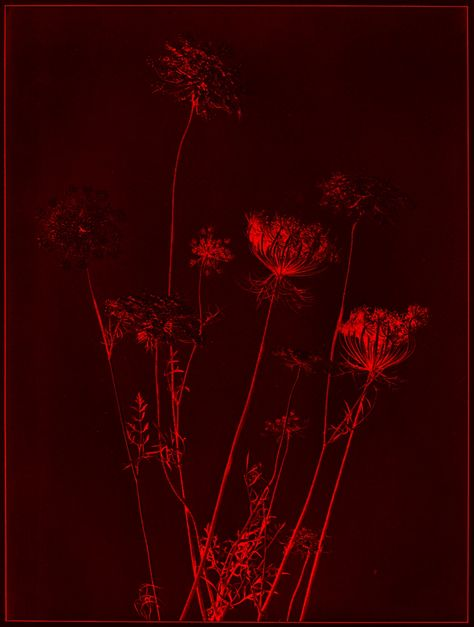

+++
date = 2022-06-10
title = "Ziua 150"
description = "Poate, data viitoare, nu mă mai înfierbânt așa. Poate, data viitoare, o văd ca pe un copil. Nu al meu, ca să nu-mi permit nimic, un copil al Universului, rătăcit cu mintea într-un trup de femeie bătrână. O sa-mi fac o mantră vizuală din asta și sper să pot să mi-o aduc în minte ori de câte ori s-apucă ea să trosnească aiurea. Că mintea trebe antrenată, inima e cuminte și blândă și înțelege. Doar că n-are același tupeu și nu-i la fel de vocală."
authors = ["Biannca Locatelli"]
[taxonomies]
tags = []
[extra]
math = false
diagram = false
image = "images/ziua-150.jpg"
+++
---

Am visat oribil, niște vise construite tare ciudat, cu entități supranaturale care mă smulgeau cu forța de lângă oameni pe care nu-i cunoșteam, dar de lângă care nu voiam să plec. Strigătele mele disperate din somn au răzbătut în realitatea din dormitor și m-am trezit cu gura plină de sunete.

O, ce bine că m-am trezit!

Boala asta prin care trec are o simbioză fantastică cu somnul și, dacă nu sunt pe fază, alunec fără măcar să realizez înapoi în somn și în coșmar. Așa că mă forțez să țin ochii deschiși, să mă gândesc la ceva frumos, să nu mă întorc în vis unde, culmea, zbor, dar e un zbor nedorit și nu e cu înălțare. Spikylina e la picioarele mele așa că mă întind către ghemul ăsta catifelat și cald de blană și mângâiatul ei îmi alină unda de șoc ce a traversat brutal corpul meu în urma trăirii intense nereale. Îi mulțumesc copilei mele blănoase pentru prezența ei acum aici și pentru prezența ei lângă mine, pe parcursul acestei perioade. Domnul meu mi-a spus că nu s-a mișcat din camera noastră zilele astea, cât am dormit. Și am dormit! Cum știam deja, ne suntem una celeilalte înger păzitor.

***

Starea aia de neputință încă este prezentă dar a mai scăzut din intensitate. Oricum, începutul de zi, în genere, are ceva putirință prin rezervor, așa că trezirea în prea dimineața asta mă face și atentă și chibzuită la cum consum rația pe care am primit-o.

Pe scări, de la durerea din capul pieptului mă cocoșez treptat și ajung la bucătărie în formă de L. Nu-i bai, cunosc deja aroma, mă așez pe scaun, trag aer în piept, iar simt mirosul de ars dar parcă intră mai mult aer în cavitate azi. Fac lucrurile secvențial, eu care sunt multitasking, reîncep să fac lucrurile liniar. Dacă fac analiză pe text și pe boală, nu pot să nu văd că frâna asta care a venit la categoria "impuse", m-a făcut să aplic, fără să vreau, ce propovăduiește Eckhart Tolle cu prezența: fiecare lucru trebe făcut în secvența lui de timp, cu bucata lui de atenție și cu efortul necesar lui. Suprapunerea de activități, cu care ne fălim noi, femeile, în genere, și femeile secolului 21 în special, nu e chiar atât de sănătoasă din punct de vedere al prezenței în viață. Că nu degeaba o exista și vorba-n popor: cine aleargă după doi iepuri, nu prinde niciunul. One step at the time.

***

Cu toate pauzele de scaun necesare, am terminat ritualul prea dimineții iar mama încă doarme. Recunosc că mă simt stoarsă de puteri și mă întind în living, cu ochii când închiși, când pe cameră. Zici că mi-am stabilit o legătură directă cu somnul, e de ajuns să stau o țâră liniștită că mi se adună pe la ochi și mă îmbie la o plecare portocalie. Fac eforturi să nu răspund afirmativ, că doar am văzut zilele astea ce înseamnă la mine somn: adorm rapid și dorm cu orele. Acum trebe să bifez smoothieul și pastilele mamei și apoi, dacă încă mai suntem prieteni, pot să "plec" vreo oră și-un pic.

Dau drumul la TV, să mă țină trează, pentru că mama nu dă semne de trezire și nici eu nu am inima să mă duc peste ea.

Am nimerit peste un documentar de călătorie, de-a lungul Mediteranei, și ce bine mi-a făcut. Mi-a plăcut tot ce-am văzut, mi-au plăcut filmările, naratorul și firul poveștii, am fost și eu acolo și am evadat din prezentul care-mi ține corpul la orizontală, pentru că verticala dă cu leșin.

Între timp, s-a trezit și coana mare, așa că mă reped să las ce am de lăsat și să mă reîntorc pe colțar, poate mai prind un picușor de somn, c-așa mi-am promis.

***

N-a mai fost să fie, poate și pentru că mi-am excitat mintea cu documentarul de mai devreme și ea încă e în starea de vizitator, nu intră în modulul de odihnă. Dacă tot stau întinsă, dacă tot am prins gustul călătoriilor, las să curgă imaginile și mă las și eu să curg în ele. E un documentar despre Italia, cu comorile ei, iar auzul limbii îmi picură balsam în suflet. Îmi face tare bine să aud italiana acum, pesemne e sângele care vorbește în mine, azi mi se potrivește pe larghețea inimii, stilul relaxat al italienilor, dolcele lor far niente. Poate că oi avea și eu, într-un colț din mine, de la bunicul meu, asta, dar a intrat peste, cu bocancii, femeia destoinică, ce le face ea pe toate, și s-a ales praful de far nientele meu. Niciodată însă nu e prea târziu. Cum azi viața m-a forțat să fac pas cu pas, acțiune cu acțiune, poate mă voi dresa să mai las și relaxarea să-mi mângâie fascia. Totul e o alegere, as usual.

***

I-am pregătit mamei micul dejun în deja binecunoscuta cascadă de secvențe: scos din frigider, așezat pe scaun, spălat, tăiat, așezat pe scaun și tot așa. Cât de repede se adaptează omul! Sau așa credeam, până m-am prins că de fapt nu se adaptează: le face că trebe făcute dar nu le integrează. Și ele se strâng, ca lava sub piele, și când se sparge buba, îi nașpa tare.

O anunț pe coana mare să coboare, eu mă retrag din bucătărie dar îi las radioul să cânte. Iar trece prin living și nici nu mă vede și eu iar profit de asta și o urmăresc. O fi de la absența asta a mea din viața mea din ultimele zile, o fi de la absența ei din viața ei în general, cert este că am din nou senzația de înstrăinare față de femeia asta care stă cu noi în casă. Vorbitul minimal cu ea a creat un hău emoțional în mine și observ că fac eforturi să mă aproprii de ea, din nou. Nu stau mai mult asupra acestui subiect, pentru că în ultimele zile totul mi s-a părut cu josul în sus și nu vreau să amprentez decizional o stare doar pe câteva crâmpeie, și-alea destul de rupte de realitate.

Termină de mâncat și o văd cum se duce, legănat și încetișor, la ea în cameră. Resortul ăla de compasiune din mine s-a activat și o dau dintr-una într-alta: mă simt vinovată puțin de răceala asta care pleacă de la mine către ea. Deși, dacă stau strâmb și mi-amintesc drept, prima care a început a fost ea.

***

Domnul meu e plecat iar eu nu mai am medicamente pentru mama. Așa că, cu un curaj nebun, mă duc la farmacie. Și la Mega, că e aproape. Mă întorc fleașcă de transpirație, stau în mașină până-mi potolesc tremurul picioarelor, dar am făcut-o. De undeva trebe să reîncep. Că și corpul cred că se mulează pe ce-i dai. Am deja o săptămănă de tras cu boala asta, trebe să coabităm, mai în felul ei, mai în felul meu.

***

Iar felul meu azi ar vrea să facă puțină ordine. Minimal, nu fac revoluție dar e nevoie, în special la mama. Cu întors de stomac, cu tot cu două măști pe față, am bifat tot ce puteam bifa, am schimbat și așternuturi, am spălat și grasa de Sassy la fund și am primenit camera lor. Simțitul ăsta de bine făcut și de curățenie lăsată în urmă mi-a dat mai multă putere decât mă așteptam. E adevărat că mi-a luat mult mai mult, pentru că m-am tot dus la noi în dormitor să mă întind dar am desțelenit puțin treaba și mi s-a luat o grijă de pe creier. Nu știu cum mi s-a strecurat ideea dar, tot citind că bolnavii de demență încep să aibă probleme cu igiena personală, nu vreau ca mama să vadă dezordine sau mizerie în jur. Nu știu de ce am eu credința că dacă vede curat, se va strădui să mențină așa, mai ales că ea toată viața a fost o femeie curată și cochetă.

Domnul meu finalizează parterul așa că suntem mulțumiți amândoi de reușita noastră. Nici el, chiar dacă e mult mai bine decât mine, nu e întremat total, mai are urme de slăbiciune fizică, ca a mea.

***

Cu casa curată, o întreb pe mama, prin ușă, dacă îi e foame. Da, ar mânca. Bun, să mai stea puțin, că o chem eu când să vină.

Nu ajung bine în bucătărie, să îi pregătesc masa, că se deschide ușa. În prag, mama. Eu, fără mască. Strig la ea să stea afară, să aștepte să-mi pun masca și o cert că a coborât. Nu ți-am zis că te chem eu?! Mama, cu ochii spre geam, se face că nu m-aude. Moment în care mă simt efectiv ca o balanță: într-o mână am iritarea, că îi spun că suntem bolnavi, că trebe să o ferim și pe ea o doare-n paișpe, și-n cealaltă mă simt rușinată că o cert și ea, ca întotdeauna când e ceva ce nu-i face plăcere sau o doare, se face că nu vede și ignoră. Îi pregătesc masa și ies din bucătărie, cu balanța înclinând dramatic în partea cu părerea de rău. Poate eu am judecat prost că nu o interesează, la o gândire mai profundă pot să văd că mama nu a compilat informația până la capăt, ea doar a înțeles că trebe să coboare, și asta a făcut. Iar jos, eu, balaurul, am luat-o la ceartă. Off, cum mă ia gura și judecata pe dinainte și nu stau puțin, așa cum fac la bricolat: măsoară de 2 ori, tai o dată. Nu, impulsiva din mine imediat se inflamează, găsește două-trei motive pentru agitație și gata cocktailul exploziv. Dar nu întotdeauna ce e la suprafață e și mai în adâncime. Mă bazez pe faptul că mama va uita și-mi cer, din nou, iertare în inima mea de la inima ei. Poate, data viitoare, nu mă mai înfierbânt așa. Poate, data viitoare, o văd ca pe un copil. Nu al meu, ca să nu-mi permit nimic, un copil al Universului, rătăcit cu mintea într-un trup de femeie bătrână. O sa-mi fac o mantră vizuală din asta și sper să pot să mi-o aduc în minte de câte ori s-apucă ea să trosnească aiurea. Că mintea trebe antrenată, inima e cuminte și blândă și înțelege. Doar că n-are același tupeu și nu-i la fel de vocală.

***

Nu mai intră nicio trebușoară, nicio analiză, nici în mintea mea întinsă azi ca un elastic, nici în corpul care începe să mă lase pradă tremuratului. Starea de leșin cu gheara aia în stomac mă strâng din ce în ce mai tare, așa că nu mai forțez nimic. Am făcut azi lucruri la care ieri nici nu speram, așa că mai bine mă opresc aici și sunt recunoscătoare pentru:
1. Spiky!
2. Puterea de a face curățenie, și p-aci prin plan material și p-acolo, prin alte planuri, mai subtile!
3. Ploaia asta care toarnă din cer și pe care mi-o imaginez cum mă spală și pe mine, și pe mama, și casa, și toate faptele, gândurile și vorbele noastre!

Frumosul meu e azi:

  

 

 

  

    <a href="/blog/ziua-149/">Postarea anterioară</a>
  

  

    <a href="/blog/ziua-151/">Postarea următoare</a>
  

