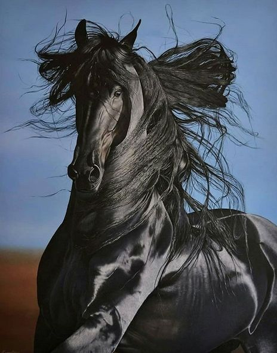

+++
date = 2022-06-13
title = "Ziua 153"
description = "Atunci ești conectat, abia atunci când nu forțezi ideile tale cu furca pe gâtul unui om care nu le digeră, abia atunci ești cu el în barca lui și el simte. Iar asta, e tare greu de făcut pentru că noi, la un nivel de care nu suntem conștienți aproape deloc, suntem profund îndrăgostiți de noi înșine, totul e despre noi sau ne privește. A fi empatic înseamnă să te prinzi că nu-i așa. Și să și transmiți asta."
authors = ["Biannca Locatelli"]
[taxonomies]
tags = []
[extra]
math = false
diagram = false
image = "images/ziua-153.jpg"
+++
---

După o noapte tulbure, o prea dimineață clară ar fi făcut o nota discordantă, așa că m-am trezit în aceeași ceață pe care am lăsat-o aseară la poarta somnului. Mi s-a așezat pe piele de cum am deschis ochii și am simțit-o, aproape carnal, cum mi se infiltrează în sânge. Am închis ochii la loc și m-am grăbit să-mi zic mantra de claritate și intenția pentru ziua care, e drept, nu-mi place cum a început să se profileze. Am pus în mantră și-n intenție câtă putere am avut în mine, ca să spulbere mai repede mâzga asta de mă acoperă încet.

Descopăr, cu uimire tristă, că verticala e la fel de nașpa ca și ieri, nu mă încurajează deloc să mă țin dreaptă și să mă duc liniștită către bucătărie. Slăbiciunea pe care o resimt în tot corpul dar cu sediul central în stomac, spre capul pieptului, mă împiedică și azi să mă bucur de trezirea la o nouă zi. În fiecare seară mă culc cu încrederea că mâine îmi va fi mai bine iar deziluzia dimineții începe să mă descumpănească. Dar m-am trezit, m-am ridicat și cu voință-n picioare, am ajuns și la bucătărie.

***

Când în tine nu mai găsești de ce să te agăți, te prinzi de tot ce poți din jur. Iar în prea dimineața asta, la îndemână-mi sunt apa caldă, smoothieul, ceaiul și, mai nou, din nou, cafeaua. Îmi împart puterea și le-o pun lor în mână, cu intenția să mă ajute ele, acolo unde eu eșuez lamentabil în ultima vreme. Să-mi dea ele un boost de energie, de viață, de bucurie, de orice, să mă urc pe "picul" ăla de bun și să încep să dau din andrele și să-l fac mai mare.

***

Știu că mama e deja trează, am văzut pe cameră că deja e pe tabletă. Mă bucur de asta și mă hotărăsc să termin întâi cu smoothieul ei și apoi să-mi fac eu tot ritualul de apă, smoothie, ceai și, dac-o mai intra, cafea. Îmi dau seama că urmez tiparul pe care l-am aplicat mai toată viața mea: întotdeauna aleg să fac partea cea mai grea, mai neplăcută, mai nașpa la început ca apoi, ca o recompensă, să mă bucur de ce e mai ușor. Nu de puține ori, mi-am luat țeapă cu modul ăsta de a fi  pentru că, după ce am rezolvat partea cea mai grea, am fost prea obosită sau prea scârbită să mă mai bucur de partea ușoară dar, în genere, mi-a ieșit.

Le-am dus să mănânce, Sassy cel puțin nu mai avea nici măcar bobițe și era într-o foame disperată, mama e ok, parcă mai volubilă decât ieri, iar eu deloc dornică să m-apuc de curățenie. Dar trebe s-o fac, deschid să și aerisesc, m-apuc să strâng și să spăl și simt cum mă lasă picioarele. Imprim viteză, atât cât pot și plec înainte să mă prăbușesc în baia ei. În aceste clipe, când sunt vulnerabilă fizic, să fac curat în baia ei mi se pare o treabă extrem, dar extrem, de odioasă.

***

Am ajuns pe colțarul meu drag, unde îmi las corpul să tremure din toate încheieturile și unde ochii mi se închid ca la păpușile stricate. Pur și simplu, în câteva minute a ieșit din mine toată vlaga. Și, dintr-o pornire tâmpită, fără niciun calcul minimal înainte, mi-am consumat puterea și nu am nici apa, nici smoothieul și nici ceaiul gata. Rămân întinsă și aștept să mi se potolească și inima, care bate ca nebuna și agitația asta din carne, că nu o să țină la nesfârșit.

După 10 minute, mi-am sorbit și apa, mi-am pasat și smoothieul și e gata pus și ceaiul. Am pornit și aparatul de cafea, sunt cu toate pânzele sus. Și cu un zâmbet larg, de izbândă, pe toată fața. Habar n-aveam că pot să trăiesc așa o bucurie imensă doar pentru că am fost capabilă să execut 4 activități. Doamne, cât m-a forțat viața și covidul să trag frâna! Incredibil, cum ajung să sparg acțiunile unei zi în micro-acțiuni și să mă bucur ca un copiluț când reușesc să fac una câte una.

***

Cu smoothieul în brațe, pe canapea, încerc să mă ancorez cât pot eu de mult în prezentul dimineții, în viața mea, din care mi se pare că am cam fost plecată. Încă sunt amețită, încă mi-e greu corpul și mișcările-mi sunt încete dar ochii mei vor să absoarbă cât mai mult din ce-mi oferă camera. Îmi alint și papilele gustative cu bunătatea de fructe și cam atât mă bazez pe simțuri. Tinnitusul meu parcă e o țâră mai acut în dimineața asta, sunetul ăla de router vechi îmi sună constant în urechi iar mirosul, deși e la locul lui, nu prinde nicio miasmă. Când o să fiu în stare, o să-mi aduc din nou în casă caprifoi, în toate camerele. Deocamdată, mă bucur de smoothie și de cameră. Și-n bucuria asta mică, sunetul aparatului de cafea, care se curăță și se închide singur, m-a umplut de lacrimi: este un sunet familiar, al vieții mele de dinainte și-mi dă așa un sentiment de "hai, că se poate" că mă copleșește la propriu. E tare, am început să plâng de la sunetul aparatului de cafea! Nu cred că pot să spun asta cuiva fără să creadă că-s plecată și eu cu mama, dar adevărul este că, orice sunet, senzație, miros, orice care mă aduce înapoi în viața mea, devine de neprețuit acum. Îmi dau seama că-mi dau shut down cu fiecare zi care trece și eu nu particip la viața mea așa că mă gripez adânc cu orice pot, cu orice-mi vine la îndemână. Că, cel mai sigur, nu-mi vine la îndemână întâmplător.

***

Întărită de fructe dar și de cafea, îi pregătesc micul dejun al mamei.

Nu-mi sunt clare multe lucruri în ultima perioadă dar un lucru mi-e limpede ca lumina zilei: mă distanțez emoțional de mama, cumplit de mult. E ca o auto-conservare, e ceva în mine care taie conducta între noi pentru că în partea în care se mufează la mine, e rană și nu mai suport. Fără să vreau, inconștient, mă separ de zona care-mi dă bătăi de cap și tristeți de inimă.

Întotdeauna am fost empatică. Târziu m-am prins și am putut să articulez că asta e un cuțit cu două tăișuri. Ajuți și te consumă, consumi și te ajută. Și o faci cu adevărat atunci când înțelegi limbajul emoțional al celui care are nevoie de conexiunea asta, când spui ce ai de spus, dacă ai ceva de spus, pe limba lui. Atunci ești conectat, abia atunci când nu forțezi ideile tale cu furca pe gâtul unui om care nu le digeră, abia atunci ești cu el în barca lui și el simte. Iar asta, e tare greu de făcut pentru că noi, la un nivel de care nu suntem conștienți aproape deloc, suntem profund îndrăgostiți de noi înșine, totul e despre noi sau ne privește. A fi empatic înseamnă să te prinzi că nu-i așa. Și să și transmiți asta. Dar ce te faci când viața te forțează să fii empatic cu demența? Cum să găsești limbajul emoțional al unui bolnav de Alzheimer când el nu mai are emoții? Sau dacă le are, le ține atât de ascunse, într-o lume în care n-are nimeni acces, sau și mai trist, câteodată nici măcar el? M-am prins că joc la perete empatia cu demența mamei și ca să nu mai consum energie aiurea, I quit the game. În anestezia prin care trec acum, nu pot să spun cu siguranță dacă mă simt sau nu vinovată de neimplicarea emoțională a mea. Cum spuneam cândva, pedeapsa celui care iartă mult cade o dată, cu greutatea tuturor iertărilor. Pesemne că la mine a căzut. Vom vedea.

***

Ca și zilele trecute, după micul dejun la mine deja se dă stingerea la vlagă. Nu mă plâng, vreau să se consemneze asta, tot ce scriu este pentru că vreau să rămână scris. N-am fost nici din grupa celor care nu cred în Covid, nici în tabăra celor care vor vaccinul. Însă nici nu vreau să-mi imaginez cum ar fi fost să fi avut Covid atunci, la început.

Profit de orizontala obișnuită și mă uit la documentare.

Well, în feed-ul meu de Youtube de regulă vin chestii de design sau de grădinărit. Din când în când, câte-un video despre traiul off-grid.

Azi, întâmplător NOT, mi-a apărut un documentar despre grounding - împământare. Eu am mai cochetat cu asta, simt în mine că face parte din adevărul ăla mare dar azi aproape că n-am respirat o oră și ceva cât a durat documentarul. Și, pe lângă mine, și domnul meu.

<a href="https://www.youtube.com/watch?v=44ddtR0XDVU" target="_blank">https://www.youtube.com/watch?v=44ddtR0XDVU</a>

La final, eram convinși. Atât de convinsă încât, cu toată ceața din mine, cu toată neputința din corp, am ieșit desculță în curte. Și m-am plimbat desculță prin trifoiul plin de albine. Și am cules vișinele coapte, tot desculță. Și tot desculță, am smuls buruieni vreo oră!! Nu, împământarea nu mi-a luat răul cu mâna. Da, am făcut eforturi supraomenești, cu ajutorul respirației, să nu leșin și să mă lățesc, să fac împământare cu tot corpul. Dar senzația aia de pământ cald, umed de la furtunile trecute, de sub tălpi a fost SUBLIMĂ! Sunt convinsă, și asta e tot ce contează, că am descărcat ceva din răul ăsta care mă cutreieră în pământ iar el m-a încărcat cu ce trebe să mă balansez. Iar ăsta este un început. Ca întotdeauna, ca să merg mai departe, trebe doar să mă întorc la mine, în mine.

***

Domnul meu a pregătit prânzul, sub supravegherea și la indicațiile mele, de pe scaun. Sunt epuizată fizic dar am un zvâc în mine și un știut că, într-una din zilele ce vor veni, voi fi bine.

Tot el o aduce pe mama la prânz, folosind un mic truc șantajist: dacă mănâncă prânzul, are și o surpriză. Cu ochii dați peste cap, mama acceptă prânzul, ca și cum îi face lui o favoare. Eu sunt obișnuită cu toate astea dar el nu. Până la urmă contează rezultatul final, mama a mâncat tot ce a avut în farfurie, plus jumătate de "surpriză", o savarină. Așa că trucul folosit a dat roade.

Măncăm și noi, amândoi, chiar câte două porții. Mici, ce-i drept, dar am mâncat.

Azi e clar o zi fie de prime dăți, fie de noutăți.

***

Nu-mi forțez norocul și restul zilei îl petrec întinsă. Ba visez cu ochii deschiși, ba mă uit la un film, ba mă uit la apus. Și-n tot pelerinajul meu prin după-amiaza asta, mi-a fost partener un gând venit de nu știu unde, cu nu știu ce scop: nimic din ce am nu-mi aparține. Doar se află în posesia mea, momentan. Sunt sigură, că doar știu din istorie, că gândul ăsta nu a venit așa, doar la defilare. Aștept cuminte episodul edificator, că-s sigură că e după colț deocamdată și nu-l văd cu ochiul liber.

***

Cu toată starea asta de rău, slăbiciune, leșin, bag pentru azi o bilă albă. Și mai multe biluțe albe de recunoștință pentru:
1. Micile mari bucurii!
2. Împământare!
3. Prânzul împreună cu omul iubit!

Iar frumosul zilei este:

  

 

 

  

    <a href="/blog/ziua-152/">Postarea anterioară</a>
  

  

    <a href="/blog/ziua-154/">Postarea următoare</a>
  

