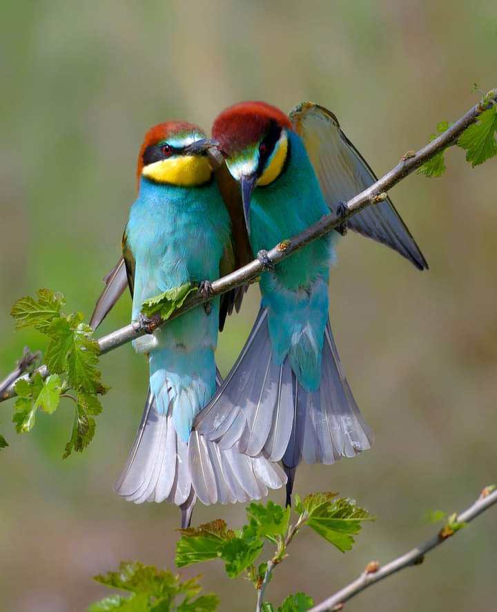

+++
date = 2022-06-14
title = "Ziua 154"
description = "Când tot ce faci e să faci, nu prea mai ești. Iar eu capitolul ăsta vreau să-l scriu pe ultimele mele pagini din jurnalul acestei vieți. Vreau să fiu. Capsula asta de a fi vine în ea cu multe promisiuni, cu multe explorări, cu multe libertăți, cu multe trăiri și fără vise. Se spune că visele sunt extensia prezentului croșetată de o minte cu acces la o bază de date limitată. Niciodată un vis nu va fi ceva out of this world. Iar eu cam asta vreau, c-așa m-am făcut eu, sofistricată."
authors = ["Biannca Locatelli"]
[taxonomies]
tags = []
[extra]
math = false
diagram = false
image = "images/ziua-154.jpg"
+++
---

Trezirea mi-e lină, nu pentru că n-ar mai fi somn ci pentru că deja e lumină și să n-aibă mama gânduri năstrușnice așa, la prima oră. Nu că până acum ar fi avut des, dar dacă am înțeles ceva cu adevărat din demență este că you never know.

Îmi cercetez corpul, parcă-mi dă cu plus la scanarea exterioară așa că-mi iau, liniștită, câteva secunde să mă ocup pe de-a-ntregul, să-mi sun deșteptarea în toate marginile, să nu mai pornesc în zi cu părți amorțite și cu părți absente. Mi-am lansat și intenția zilei, aceeași în fiecare zi deși câteodată, timid, în mintea asta analitică, îmi zic că ar trebui să am intenții mici, specifice. Eu, ca haplea care sunt, am ales o intenție umbrelă, nu 2 în 1 sau 3 în 1 ci all in one, să fie. Acum, cu Universul ăsta nici nu știi cum s-o dai: o dată zici într-un fel și iese, data viitoare o zici la fel și te trosnește. Las și eu să plece intenția mea batoză în eter și o însoțesc cu trăire curată. Cică să te lași cu încredere în ce vine. Ok, hai să vedem.

***

Mersul mi-e mai drept, gheara aia în capul pieptului este încă acolo dar nu mai am starea generală de prăbușire. Bun și mulțam!

Îmi fac ritualul dimineții în liniște și într-o stare mentală bună dar mai ales fără grabă, pentru că mama doarme dusă. Pentru că am liniștea asta ce mă îmbracă și pe interior și mă învăluie și p-afară, observ că apa băută stârnește niște demoni acolo, în stomac. Gheara aia de mă ține-n clește, în capul pieptului, începe revolta. O ignor, că la asta mă pricep, și-mi văd de ale mele. Arunc o privire și în curte, din bucătărie, și-mi dau seama că mi-e dor de viața mea, de micile mele trăiri, bucurii, de dinainte de a-mi fi rău fizic. Și da, înțeleg și ce vrea boala asta să-mi transmită: întotdeauna poate fi mai rău când nu te bucuri de binele ăla, chiar și mic, pe care îl ai în viața ta.

***

Dacă ieri a fost o zi de noutăți, azi e episodul doi din același serial. E ora 7 și mama încă doarme. O văd pe cameră că mișcă, deci nu-mi fac griji, doar stau așa, în așteptare.

La 8 mi se termină și mie răbdarea și începe panica, așa că mă echipez cu toate bunătățile pentru ele, plus botnița, și mă duc. Sassy e vocală și m-ajută ea cu trezirea mamei. Nu vreau să fac valuri multe, o las să vină în zi în ritmul ei, doar mă mișc să las ce am de lăsat, să arunc o privire în baie și apoi o privire scrutinitoare pe fața ei. E buimacă de somn, cum e și normal, altceva nu deslușesc acolo. Îi las spațiul și timpul necesar și mă duc să mi le iau și eu pe ale mele.

***

N-am decât o juma' de oră de timp al meu iar azi mi l-am vândut pe tot, cu toată acceptarea, visării. Am urmărit crâmpeie dintr-un episod de viață în Franța rurală iar mintea mea a făcut salt cu boltă peste imagini și s-a dus departe, în locuri unde sufletul meu întâlnește picuri din alte vieți și le recunoaște. Sunt irezistibil atrasă de castele, de vechi, de piatră, de modul simplu cum se făceau odată lucrurile, de traiul în familie mare, apropiată, de pădure, de cai. Azi, juma' de oră, mi-am adăpat sufletul cu hrana lui preferată și mi-am adăugat muguri noi pe ramurile astea ce s-au lăsat la pământ de greutăți mai mult sau mai puțin imaginare. Parcă mă înnoiesc.

***

Și Mr. H este mai bine, suntem amândoi pe drumul ăla bun, ce ne promite că ne scoate la liman.

Și dacă tot sunt mai bine, mă hotărăsc să folosesc timpul liber până la micul dejun al mamei, care acum clar s-a decalat, să fug la cules de sunătoare și mușețel. E o hotărâre curajoasă dar nu mai pot aștepta, că se trec și rămân fără material de ceai. Iar asta, nu e o opțiune pentru mine.

***

M-am dus cu mașina în câmp, de unde am cules anul trecut cu copila mea o mașină plină de mușețel și brațe întregi de sunătoare. Nu știu ce s-a întâmplat într-un an dar câmpul e plin de falsul mușețel, de ambrozie, de brusture, ciulini și bozie. Ici colo, mici tufe delicate de mușețel iar sunătoarea e rara avis. E câmp cât vezi cu ochii și sunt doar pâlcuri mici de ce am eu nevoie. M-am plimbat în dreapta și-n stânga degeaba, a trebuit să recunosc că deja mi se termină bateria și că trebe să scot zona asta de pe lista mea de plante de ceai: am strâns o mână de sunătoare și un braț de tije de flori superbe de mușețel. Am mai lăsat pe câmp, poate se înmulțește și la anul ne bucurăm de o revedere bogată.

Cu sufletul mic, nu pentru că nu am cules eu, ci pentru că se pierd comorile naturii, am pornit spre casă, cu oprire la Mega-ul din sat, să îi iau câte ceva mamei pentru micul dejun. Da, am forțat, iar corpul îmi întoarce lipsa de delicatețe prin tremur. Mi s-a strâns stomacul brusc, îl simt înnodat, curg apele pe spate dar îmi promit că ajung acasă și ne liniștim.

***

Ajunsă acasă, îmi dau seama că micul dejun se apropie de prânz, pentru că mama doarme din nou. Profit de somnul ei să-mi iau eu micul dejun și să mă așez puțin, să-mi liniștesc sistemul. De câte ori mănânc, stomacul doare. Când o să simt că mă ține, vreau să țin post o zi, două, trei. Fără mâncare, doar cu apă și eventual suc de fructe, să dau un reset mic fratelui porc, corpului, care mă ajută și el cum poate în aceste vremuri de nebine fizic și emoțional. E un cadou de la mine pentru mine. Dar să mă decid întâi.

***

Nu știu unde intră atâta somn la mama. Nu știu nici dacă e normal dar s-a făcut de prânz și ea nu dă semne de trezire. De dimineață, în elanul meu că mă simt mai bine, i-am spus că aș vrea să meargă cu mine la Carrefour, să facă un strop de mișcare, să-i iau rebusuri noi, am tentat-o cu diverse, numai să-i obțin acceptul. Nu a fost prea încântată, dar a zis da.

Hotărăsc să mă duc la ea, să văd dacă totul e bine. Nu dormea, picotea așa că la deschiderea ușii, a deschis și ea ochii. O întreb cum e, îmi zice că amețește, reiau rugămintea mea zilnică să facă mișcare, să se dea jos din patul ăla în care se scufundă cu totul toată ziua dar începe cu scuzele. De mers la Carrefour nici nu se mai pune problema. De fapt, tot somnul ăsta este refuzul ei de a se mișca din pat. Pentru că imediat cum ies din cameră, amărâtă și că refuză mișcarea, nici foame nu-i e, se ridică, se duce la baie, își dă drumul la Tv și se așează, confortabil, în pat, cu tableta în brațe.

Dacă am învățat ceva în ultima parte a vieții mele, este că corpul este plastilină în mâinile minții și ale spiritului. Avem o putere extraordinară în noi pe care o putem folosi pentru noi sau, în multele noastre momente de inconștiență, împotriva noastră. Suntem creatori de content, nu doar d-ăla de pus pe rețele sociale, ci creatori de content de viață. E una din legile fundamentale ale Universului și ea există, indiferent că noi o acceptăm sau nu.

***

Ies pe terasă, să spăl recolta pentru ceai și să culeg doar florile, să le pun la uscat. Dacă tot e proaspătă experiența și cunoașterea împământării, de câte ori ies afară, merg desculță. E o deprindere treptată, o reîntoarcere graduală, simt că mă trec fiori neplăcuți de câte ori mai calc pe câte-o piatră.

Mi-aduc aminte, când eram copiluță fericită la măița mea, mergeam desculță mereu. Doar dacă mă trimitea în sat, la cooperativă să iau jumătatea de pâine rotundă și neagră, îmi luam ceva pe picioare. Altfel, era autostradă directă între mine și pământ. Vara, pe asfaltul încins, străbăteam în gașcă kilometri întregi să ajungem în satul vecin, unde se ținea bâlciul. Oboseala și arsura tălpilor era răsplătită de bulgărele de floricele roz, dulce, de cornetul de semințe negre coapte și sărate de la țigănci și de brifcorul rece. Tot acolo, printre ceilalți copii adunați la bâlci, era și domnul meu, pe care aveam să-l întâlnesc juma' de viață mai încolo, în București. Domnul meu a copilărit în satul vecin. Să mai zici că există coincidențe…

Azi, împământarea nu mi-a fost cu răsplată dulce ci cu una care m-a usturat până-n adâncuri.

Pentru că boala ne-a dat la glezne și la putirință, trifoiul nostru, netuns de două săptămâni și ceva, e mare și plin de flori. Flori din care se hrănesc hărnicuțele albine. Pe astea le-am văzut și când pășesc pe trifoi, întâi dau cu piciorul ușurel pe deasupra, să se prindă că vine ceva și să plece. Pe lângă fetele astea faine, un strat mai jos, mai aproape de pământ sunt viespile de pământ, alea cu corpul subțirel și negru. Eh, p-astea nu le-am ginit la timp și una s-a răcorit pe mine. Frate, înțepătura aia veninoasă mi s-a dus până în rărunchi, noroc că aveam furtunul de apă în apropiere. Frecție la piciorul de lemn, am stat cu apa minute întregi, răceala ei nu răcorea în niciun fel arsura. Am renunțat și m-am întors pe terasă, pe scaun, să aleg plantele pentru viitorul ceai, iar cu timpul am și uitat. Doar pășitul mi-amintea de înțepătură dar știu eu că veninul de viespe e anticancerigen. Așa că azi am făcut un strop de terapie naturistă.

***

Am terminat fix înaintea furtunii, care a întunecat cerul și a blocat priveliștea. O răpăială atât de abundentă că nu vedeai nimic în față iar curtea s-a inundat în câteva minute. Îmi privesc de la geam roșiile, florile, mi-am pus și niște busuioc și mă gândesc când de efemer și de neprevăzut e totul. Și-mi dau seama, dacă mai era nevoie, cât de ridicolă este ideea de control. Nu am nimic în control, nimic. Nu pot controla corpul, nu pot controla gândurile, nu pot controla năvala de evenimente zilnice care vin să-mi coloreze viața, nu pot controla nimic. Și cu toate astea, sunt creatorul vieții mele. Azi, în ceas de furtună, s-au ciocnit două concepte și se lasă cu scântei. Nu mă îndârjesc cu niciunul, le las acolo, unul peste altul și vedem ce se alege.

***

În afară de smoothie și de sucul de seara, mama nu a mâncat nimic altceva. Pe la 17 și ceva s-a pus din nou la somn, cu o mică trezire la 19 pentru pastile, apoi înapoi, în lumea ei.

Pentru că vreau să scot din mine rahaturile și fricile și panicile și grijile, să poată intra din nou bucuria, și pofta de viață și îmbrățișatul de momente mici, decid că nu vreau să mă îngrijorez. Luna viitoare poate reușesc să-i mai fac un set de analize dar, până una alta, ea fizic pare sănătoasă. Cum spuneam, corpul e o păpușă în mâinile minții iar dacă mintea e împrăștiată, corpul i se supune. Altfel, e fascinantă ființa umană. Iar dacă mă dezbrac de emoțiile atașate, s-o observ pe mama cum, cu toată voința și dorința și timpul meu puse la dispoziția ei, își distruge singură prezentul, e un studiu de caz cum poate nu voi mai avea ocazia să văd vreodată. Sper.

***

I-aș da zilei de azi o bilă albă doar pentru că m-am simțit o țâră mai bine fizic. În rest, îmi dau seama acum că mi-am încununat clipele cu alegeri triste, m-am lăsat dusă de valul ăla din mine care trage mereu către prăpăstios, am mai decis pe ici pe colo altfel, dar ziua mea a fost mecanică, de lucruri de făcut. Încep să mă întorc la atitudinea de a face tot timpul iar asta nu știu dacă e de bine sau de rău. Când tot ce faci e să faci, nu prea mai ești. Iar eu capitolul ăsta vreau să-l scriu pe ultimele mele pagini din jurnalul acestei vieți. Vreau să fiu. Capsula asta de a fi vine în ea cu multe promisiuni, cu multe explorări, cu multe libertăți, cu multe trăiri și fără vise. Se spune că visele sunt extensia prezentului croșetată de o minte cu acces la o bază de date limitată. Niciodată un vis nu va fi ceva out of this world. Iar eu cam asta vreau, c-așa m-am făcut eu, sofistricată.

***

De dragul bifei, îmi număr recunoștința pentru:
1. Statul în picioare din ce în ce mai mult!
2. Imaginația mea vividă!
3. Delicatețea și frumusețea florilor de mușețel și de sunătoare, ambele cu stropi de soare în ele!

Frumoasele mele azi sunt prigoriile:

  

