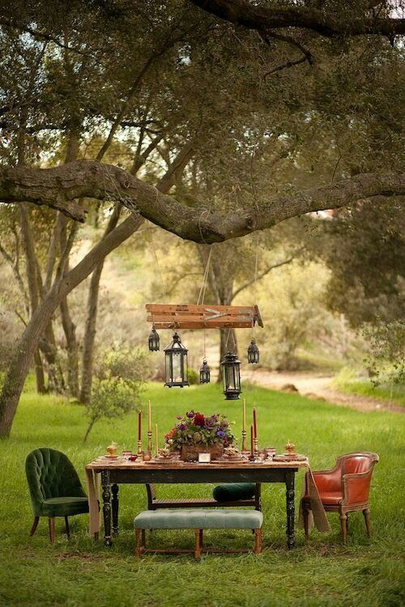

+++
date = 2022-06-18
title = "Ziua 158"
description = "Privește cerul! E îndemnul genial pe care-l vezi, la propriu, pe mai toate gardurile, atât de 'pe mai toate', că s-a perimat și nu ni-l mai facem plancardă pentru ochi. Nu-i mai ridicăm, nu ne mai spălăm mâgzăleala ce ni se încâlcește-n zilele alea în care facem tot mai mult și suntem din ce în ce mai puțin. În dimineața asta, mi s-a născut o nouă întrebare de pus sufletelor apropiate sau dragi sau celor deschise s-o înțeleagă: cum ți-e cerul azi?"
authors = ["Biannca Locatelli"]
[taxonomies]
tags = []
[extra]
math = false
diagram = false
image = "images/ziua-158.jpg"
+++
---

Trezirea mi-a fost întâi olfactivă, apoi vizuală și abia la final tactilă. Nu mi-au venit toate simțurile buluc, tocmai ca să-mi dea răgaz să mă bucur de fiecare în parte. Mirosul dulceag de tei și-a croit drum până la noi, deși teii pe care-i știu în zonă sunt la ceva distanță de casa noastră. Legănați de-un fir de vânt, mi-au gâdilat nările fain tare. Mie-mi place la nebunie teiul dar nu m-am învrednicit să plantez unul și la noi. Când am căutat, am găsit numa' tei american dar eu vreau neaoș românesc, d-ăla nobil, de ceai. Iar ce găsesc, e de dimensiuni mici și eu nu mai am răbdare. Așa că, de fandosită ce sunt, n-am pus deloc. Interesantă abordare.

Apoi, incitată de miros, mi-am deschis ochii, să cuprind realitatea asta în care îmi învârt zilele. Îmi place ce văd, domnul meu e întotdeauna o priveliște frumoasă iar camera îl încadrează natural. Mi-am croit un setup fain. Ăsta a fost primul gând. Al doilea, aproape că l-a încălecat pe primul: mulțumește-ți și ție dar și Universului pentru asta, că, din culise, s-au aranjat lucrurile de așa natură ca tu să ajungi la setupul ăsta.

Abia la final, după ce-am trecut în revistă, în doar câteva clipe, o grămadă de senzații și gânduri, m-am întins în pielea mea și m-am ocupat în întregime. Mi-am scanat corpul, de la degetele de la picioare până la frunte și mi-am relaxat mușchii. E nevoie de câteva clipe, sub un minut clar, de atenție, de prezență, de voință. Dar purcederea asta lină și întreagă cu întreaga mine în zi e mult mai plină de sens și sensuri decât aia rapidă, de tăune, pe care o fac de multe ori, când zici că mă aleargă demonii nerăbdării. Tihna is the new black!

***

La fel de tihnite mi-au fost mișcările și la parter, unde am ajuns două și-am rămas una. Cred c-o taie pe la dorsală pe Spiky, că freacă insistentă la ușa de la terasă și-i dau libertate. A dispărut instant iar eu m-am așezat pe terasă. În liniște și-n privit. Nu observat, nu analizat, nu catalogat, doar privit. La un moment dat, am început să mă joc. Cu cât îmi dau voie mai mult să mă joc, cu atât mi se îmbârligă-n fascia ființei și-mi vine mai des s-o fac. Am închis ochii, să nu mai cuprind culorile de afară. Dar, la mine, închisul de ochi echivalează doar cu închisul ușii la realitatea asta, pentru că mi se desfășoară altă lume, alte imagini, în spatele pleoapelor. Cu ochii închiși, am urmărit filmul de acolo. Și brusc, i-am deschis la realitatea asta. Wow, ce intense-s culorile acum! Ce verde verde și ce albastru total.

Și-n uimirea asta, mi se varsă-n tot corpul și-n toată mintea, conștientizarea că sunt o norocoasă, că am acces la două realități în care sunt lucidă. Gândul ăsta a deșirat după el unul care m-a făcut să și râd: cu ce e mama diferită de mine? Că și ea vede mai multe realități.

Hahaha, câte programe avem downloadate-n noi după care catalogăm și jalonăm viața asta simplă per se. Ne consumăm timpul pe analiza celorlalți, disecăm alte vieți de parcă ăsta e scopul suprem al propriei noastre vieți. Închid din nou ochii. Mă scutur, fizic, să arunc de pe mine, analiza de vieți la ora asta crudă a prea dimineții. Pe bune?! Vezi-ți fato de apă și de smoothie și lasă parabolele și paralelele pentru altă dată!

***

Chiar dacă m-am introdus în bucătărie, pe mine mă trage ața-n prea dimineața asta la boemie, la cai verzi pe pereți, la o lume ideală și la utopie. Nu mi-am desenat în detalii lumea aia ideală, caii sunt animalele cele mai dragi sufletului meu, indiferent că-s verzi sau murgi, dar clar cu fibre lungi și zvelte, boemia o văd o libertate frumoasă, de exprimare artistică, fără atingeri scabroase de ego sau atingeri de ego scabros, iar utopia ar fi să ne vedem fiecare doar de viața noastră dar să ne contribuim major unul altuia, fără așteptări și fără etichete.

În visarea asta a mea, îmi sorb apa lămâioasă și ochii mi se duc, natural, spre cer. Privește cerul! E îndemnul genial pe care-l vezi, la propriu, pe mai toate gardurile, atât de "pe mai toate", că s-a perimat și nu ni-l mai facem plancardă pentru ochi. Nu-i mai ridicăm, nu ne mai spălăm mâzgăleala ce ni se încâlcește-n zilele alea în care facem tot mai mult și suntem din ce în ce mai puțin. În dimineața asta, mi s-a născut o nouă întrebare de pus sufletelor apropiate sau dragi sau celor deschise s-o înțeleagă: cum ți-e cerul azi? Dacă aș putea s-o scriu cu litere bolduite în memoria mea și a celorlalți, să ne facem timp să ne verificăm cât mai des cerul zilei, aș face un mic pas spre lumea aia ideală. Mișto, îmi place: **cum ți-e cerul azi?**

***

Cred că mama își reintră în ritmul de somn pe care îl știam, nu mai doarme non-stop și asta-mi răspunde la semnul de întrebare: când nu socializează sau doar știe că nu are cu cine, nu consideră că timpul merită trăit trează. Nu-i place realitatea asta așa că pleacă în altele, tară de care știu că a suferit toată viața și de care nu se dezice mai cu seamă, acum, la demență.

Sunt bine fizic, sunt bine și emoțional pentru că sunt bine fizic, iar asta se vede prin toți porii mei. O avea ea multe hibe, i s-or fi atrofiat sau închis multe din simțuri sau simțiri dar nu e oarbă, iar energia pe care o eman clar ciocăne și-n câmpul ei de energie și ea percepe subtil. Se bucură că sunt bine, dar partea din mine care acum suflă și-n iaurt, nu mai cumpără bucuria ei fără s-o ia la bani mărunți, să vadă ce dedesubturi perfide are în spate.

Nu știu dacă sufăr sau nu de mania conspirațiilor dar, istoric vorbind, mama, în relația cu mine, a fost mai mult interesată. Când m-am angajat, după prima lună de facultate, cu naivitate, i-am răspuns la întrebarea clasică "cât câștigi?", asta deși, în interiorul meu, mă pușca revolta că m-au lăsat de izbeliște, și ea, și tata. Știu că atunci am resimțit extrem de acut interesul mamei, care s-a presărat de-a lungul întregii noastre relații ulterior: s-a bucurat pentru mine, eu așa am crezut, dar cu prima ocazie cu care am ajuns acasă, a început să mi se plângă că nu are cutare lucru, să mă manipuleze și să mă conducă grațios, fără să mă prind, acolo unde voia să ajungă, la bani. I-am dat atunci și de atunci de nenumărate ori, însă trădarea aia mi s-a întipărit în inimă și iese prima de câte ori mama se bucură de ceva, cu sau pentru mine. Nu mai cred în bucuria asta nici azi, când știu că de fapt în spate este ușurarea ei că toate vor fi ca înainte de a-mi fi rău, la botul calului, conform expresiei extrem de sugestive.

Doar strâng superficial pentru că mi-am propus ca azi să-i fac curățenia generală, mă asigur că-și bea smoothieul și ia pastilele și plec un strop întristată. De amintiri, de neîncrederea mea, de trădarea ei.

***

Mi-am petrecut timpul liber în curte, inspectând pomișorii, bucurându-mă de roadele multe, multe ale murilor puse acum 2 ani, de reușita supraviețuirii a doi smochini care se chinuie din primăvara anului trecut să se prindă iar acum au frunze noi, la baza bățului uscat pe care nu m-am îndurat să-l scot și să-l arunc, dudul pus în toamna trecută are 3 crenguțe firave dar, dragele mele dragi, sunt pline de dude mov, mari și coapte, piersicii mei sunt supărați și aproape toate fructele s-au înnegrit, de amărăciune zic eu cu sufletul mic dar, în realitate, habar n-am ce au, clematitele de la Lidl au făcut toate flori, hortensiile înfloresc în explozii de bulgări mari albi, busuiocul meu cu gust de scorțișoară crește ca Făt Frumos, m-am umplut de recunoștință pentru tot, cu un mic regret pentru piersici. Dar le-am promis, și eu când promit, fac, că o să am grijă să-i fac bine din toamnă, pentru anul de recoltă următor. Și nu neapărat pentru recoltă, ci pentru că sunt și ei puii mei și mă simt datoare să le fie bine. Au viață care circulă prin trunchiul lor firav și orice formă de viața merită grijă.

***

Pentru că i-am spus mamei că vin la curățenie și că neapărat trebe s-o bag și pe ea la baie, a decis că rămâne în pijamale până vin eu. Numa' că mai e un pas intermediar - micul dejun și pentru că nu vrea să coboare cum e îmbrăcată, îi duc masa la pat. Toate se leagă cum trebe, în felul ăsta iau și eu micul dejun de weekend cu domnul meu, în liniște și bucurie și împărtășire.

***

Deși n-am niciun chef, mă pornesc să răscolesc casa, să curăț, scutur, frec și spăl. Întâi la mama, unde e cel mai grav și durează cel mai mult, mai ales că o bag și pe ea tot la capitolul de spălat.

Îmi servește din nou o mostră de circumstanțialitate, sau pe românește, de fabulație grosieră spusă cu atitudine maximă. E legat de unghiile ei, transformate de chimio și radioterapie în copite, iar acum nu mai e vorba de o injecție făcută în București ci de două, făcute în orașul ei, de medicul ei de familie. Tot el a și operat-o de altfel la sân și la plămân, în spitalul din același oraș. Doamne, cu câte detalii și cu ce viteză debitează inepțiile astea. Bine că știu despre ce vorbește, că doar eu am fost și atunci toiagul de sprijin, care am alergat ca bezmetica doi ani din viață între holuri de spitale și camere de chimio. Dar ea-mi neagă asta în mintea ei și, deși inițial m-a revoltat, m-am prins rapid că e un ego-n mine care se inflamează și l-am lăsat în pace și pe el, și pe ea. Ce mai contează ce zice și ce-am făcut eu pentru ea? Bine c-am făcut și punct.

În timp ce o clăteam și ea scotea sunete de încântare, pentru puțin timp am ieșit din postura de fiică și am devenit doar ființă umană. Am privit detașată și curățată de orice emoție, de orice fel, a fiicei mamei mele. M-am îmbrăcat într-o haină anonimă de uman și din postura asta, am urmărit și scena dar am și făcut parte din ea. Am râs cu femeia care făcea baie, am glumit cu ea, m-am jucat cu cuvintele și nuanțele și intonațiile să văd dacă le prinde, fix ca cu un copil mic. Nu mică mi-a fost mirarea când a percutat la unele dintre ele. Am lăudat-o pentru ascuțimea minții cu care a perceput umorul fin din spate, am văzut-o cum creștea sufletul în ea, cum luminițe vii îi apar rând pe rând în ochii negri, poate de la ego, poate doar de la plăcerea pură de a fi observat și plăcut și atât. Poziția asta neutră, fără bolovanii cu care vine fiica mamei mele din copilăria unde ultima n-a trecut clasa de mămicie, e mult mai mișto și mai curată și mai fără pretenții. Ooo, păi dacă știam eu asta, mă înnoiam cu costumul ăsta demult! Mi se pare fabulos că putem să fim oricine și orice, dacă vrem. Și chiar dacă sună a tulburare de personalitate multiplă, cred că atât timp cât faci disocierile conștient, cu scop curativ pentru ambele părți implicate, nici nu mai contează cum sună.

***

Și-am tot făcut curat, m-a ajutat și Mr. H la parter cu aspiratul, c-am terminat cât să nu ratez prânzul mamei. Oricum am stat cu o geană și pe camera de supraveghere, să nu cumva să-mi tragă clapa și să se culce, dar a rezistat eroic, de altfel în zgomotul de aspirator nu cred că somnul i-ar fi fost lin. A mâncat și azi tot, e adevărat că furată de povestirile mele, care îndrug verzi și uscate, să-i abat atenția de la numărul de îmbucături pe care pare că le numără, și pe la trei, decide că sunt suficiente. Hai că-i mai povestesc de capitolul adopției puilor lui Spiky, stai că-i arăt poze cu puiucii ei, hai mai ia o gură, aproape că mai am puțin și fac faza clasică cu avionul pe care o fac părinții la bebeluși, să deschidă gura. Dar mai cu una, mai cu alta, a mâncat tot, nu s-a simțit forțată și i-a făcut plăcere să facă parte din poveștile mele. Se vede asta. Chiar dacă am rămas în salopeta aia confortabilă de umană și nu în stretchul care mă strângea de fiică a ei, observ că mă înmoaie pe la inimă starea ei de bine. Nu mă înfoaie dar nici nu o mai văd ca bifă mecanică. Parcă e o mică pâlpâire acolo de grijă și de dorință ingenuă de a face să-i fie bine.

***

Încărcată cu binele ăsta mic, am luat și noi doi prânzul și ne-am făcut curaj unul altuia să atacam tunsul trifoiului. Eu una nu m-aș băga azi, că am tot muncit, dar domnul meu vrea să termine cu grija asta și s-o șteargă de pe creier. Bine că ne-a decis natura, care a dat o răpăială fix cât să încarce trifoiul de apă și să fie greu la tuns și descărcat din lada mașinii de tuns. Mulțam, mai bine decât atât eu nu puteam să fac, să dau skip la sarcina asta care nu-mi făcea nici cu ochiul, nici plăcere.

***

Încheiată cu relaxare, ziua asta mi-a plăcut de la rădăcina prea dimineții până la floarea serii. M-a condus fain prin zone noi din mine, m-a trimis în explorare și-am venit cuceritoare înapoi, așa că-mi listez doar trei din multe recunoștințe ale zilei, pe care le-am onorat, pe fiecare în parte, cu mulțumire vie:
1. Pentru teiul mirositor!
2. Pentru realitățile în care pot fi, doar printr-o clipire de gene!
3. Pentru întrebări noi ce se nasc în lumea mea!

3 bis. Pentru anonimul uman ce descarcă greutatea de a fi fiica mamei mele!

Clipa mea de frumos este:

  

