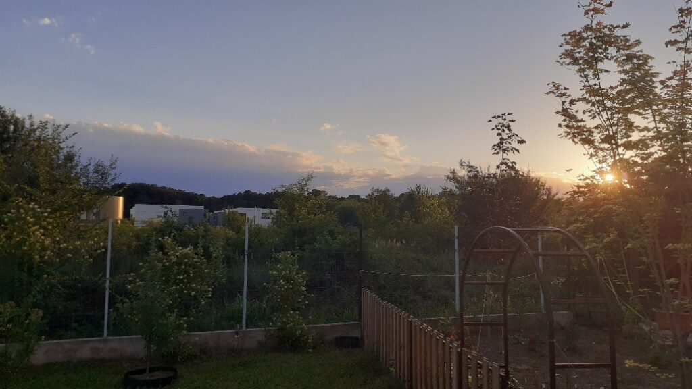

+++
date = 2022-06-23
title = "Ziua 163"
description = "Nu mai am stavilă: cobor pe scări, dar mă înalț în aripi. Curg lacrimi, dar sufletul meu râde ca nebunul, cu atâta eliberare și explozie, că-mi bubuie și inima. Doar pentru că mi-am dat voie să am o zi roz, deja am primit de m-am gogoșit. And the day is still young."
authors = ["Biannca Locatelli"]
[taxonomies]
tags = []
[extra]
math = false
diagram = false
image = "images/ziua-163.jpg"
+++
---

Asta are, aia n-are, care e câștigătoare? Fix așa, am nimerit alba azi, după câteva negre și m-am trezit lin. Trecerea dintre somnul adânc, pe alte tărâmuri, la trezirea din realitatea asta a fost așa de naturală, ca și cum fie n-am dormit deloc dar m-am încărcat super fain de undeva, fie încă nu m-am trezit și visez la realitatea care mi se coace în dormitor. Nu am simțit nicio jenă, n-am greutăți nici de pleoape, nici în corp, am însă o ușurință și-o curiozitate blândă pentru ziua de azi. Nu e programat niciun eveniment major, nu e nici Crăciun sau altă sărbătoare dar cu toate astea, eu, cu tot ce sunt, am o bucurie că m-am trezit în această zi. Statistic, că de când scriu pot să fac și măsurători, când o zi începe bine, chiar dacă pe parcurs se mai zbârcește pe ici, pe colea, în principiu are o culoare roz în ochi care mi se oglindește cam în tot ce fac.

***

Lin mi-am rostit și eu, cu voce interioară calmă și caldă, intenția, am trimis-o întâi prin mine, să văd dacă simt la scanare vreo parte din corp care se contractă, nope, sunt toată calmă și caldă și așa pleacă și ea în Univers. Însoțită de gândul meu interesat că dacă intenția s-a dus pe-o pală de pace, se înfrățește ea cu altele la fel și-mi întoarce pace-n minte, în conjuncturi și-n reacții. Așa să fie!

Spiky nu e în dormitor, mă așteaptă pe trepte și coboară cu aplomb ca și cum "nu mai veneai odată?!" Mi se pare, de fapt mereu mi s-a părut fantastic cum ființele umane pot înțelege ce transmit alte ființe care trăiesc pe lângă ele. Sau cum mamele își înțeleg pruncii când ei încă nu articulează nimic coerent.

Deschid toate ferestrele de pe traseu, să intre aerul curat și răcoros al prea dimineții și mă proptesc, cu tot cu coconetul răsfățat, pe terasă. Pentru că am lanterna pe mine, gând și faptă, mi-am simțit colțurile buzelor ridicându-se instant la văzul unei mierle. Nu a fost ceva conștient, că nici n-am avut timp să cataloghez imaginea în categoria păsări și să scotocesc în baza de date să văd ce pasăre e, a pornit din mine un zâmbet involuntar, viața din mine a recunoscut și salutat, cu plinătate, o altă viață. M-a trecut la propriu un sclipici prin corp când am înțeles cât de mare sunt. Când mi-am lărgit marginile limitate de un trup până n-am mai putut să mi le cuprind. Timpul de pe terasă, încremenit în timpul universal, mi-a fost martor la expandarea mea fără limită. N-a durat mult senzația asta de supradimensionalitate dar îndeajuns încât să vărs lacrimi de recunoștință uimită. Giiiz, abia acum parcă m-a pătruns ce zicea băietul fain Wayne Dyer: dac-ai știi cine merge cu tine în fiecare clipă a vieții tale, nu ți-ar mai fi frică de nimic. Asta e o trăire de pus la inimă, e bună-bună și împlinitoare.

***

Cred că acum și dacă mi-ar fi căzut bucătăria-n cap, nu m-ar fi zdruncinat nimic.

Cu seninătate neperturbată de nimic și nimeni, de niciun gând și de nicio faptă, ritualul meu matinal s-a aliniat momentului. Apa mi s-a scurs prin toate crăpăturile și mi le-a uns, am pus sclipici și-n smoothie să-i dea și mamei niște artificii prin-năuntru, mi-am făcut și ceaiul și-am privit cât de mișto sunt floricele mici-mici de soc care s-au umflat de la apă, plutesc deasupra și arată ca niște stele la scară redusă. Mi-am cercetat momentul și-am priceput că încep să renunț, fără să fac eforturi colosale, la stări de scorțoșeală. Ca și la scris, ăsta e un efect secundar al faptului că îmbib clipele cu cât mai mult mine, sunt și spectatorul și trăitorul lor și încep să se coacă roadele. Nu mă îmbăt cu apă rece, știu că oricând pot să retrogradez dacă-mi pierd vigilența but for now, sunt aici și acum. Ce va fi, voi vedea când va fi.

***

Invit răcoarea și la mama în cameră și o invit și pe ea să participe la ziua mea roz.

Prin toți porii vocii mele se simte un zâmbet iar mama-l culege, fără să se prindă. Yep, zâmbetul e contagios, nu poți privi o față zâmbitoare și să rămâi încruntat sau plat. S-a băgat și coana mare în hora mea, stau cu ea să-și bea smoothieul, să ia medicamentele și îi povestesc cascadoriile lui Spiky. Râde cu poftă, eu m-aș duce la baie să fac curat dar mama vrea să stau cu ea, să-i mai povestesc. Lasă că face ea curat, are toată ziua la dispoziție. Mă uit din nou la ea, mai cu atenție, ca și cum aș vrea să citesc, pe ridurile ei, starea interioară. Încă n-am deprins limbajul ridurilor dar la scanare, mama chiar pare că știe ce zice. Bun, parchez curățenia, mă așez pe fotoliul de la ea și stăm la bârfă. Despre casa ei, despre domnul meu, despre curajul meu de a ridica o casă, despre faptul că-i place la nebunie aici, la mine (!), despre copila mea, despre mâncarea de la prânz.

Dacă mai devreme o țâră credeam că nimic nu poate depăși starea aia superbă de imens, acum sunt de-a dreptul extaziată. De când e la mine, și s-au făcut 7 luni, mama nu a fost niciodată atât de articulată și de mai cu mințile la un loc ca acum. Iar cireașa de pe tort, care m-a topit și m-am prelins și iar m-am topit a fost când mi-a zis "Bi".

Pentru că până acum câțiva ani, de teamă, de jenă sau rușine, am reprimat și ascuns tare multe trăiri, încă mai am momente, cum e și ăsta de acum, când mă spumez de emoție, mă umplu de lacrimi dar îmi vine să fug undeva să nu-mi vadă nimeni lacrimile, chiar dacă sunt lacrimi de bine. Nu știu dacă mama ar înțelege că plâng de la un cuvânt și o dimineață ca niciuna alta în 7 luni, așa că mă ridic, nu brusc dar destul de repejor, să nu pornească la vale pe obraji emoția aia curgătoare. Îi spun că ne vedem la prânz și închid ușa pe un "da, puiule". Bine c-am închis-o, că nu mai am stavilă: cobor pe scări dar mă înalț în aripi. Curg lacrimi dar sufletul meu râde ca nebunul, cu atâta eliberare și explozie, că-mi bubuie și inima. Doar pentru că mi-am dat voie să am o zi roz deja am primit de m-am gogoșit. And the day is still young.

***

Atât de plină sunt, că dau pe dinafară și nu simt c-ar cadra să bag acum documentare sau citit sau ascultat. Parcă aș vrea să iau la puricat impresia asta a mea care mă separă de mama, senzația asta care mă pune antagonic față de ea când de fapt e și ea din același aluat cu mine.

Nu m-am gândit niciodată pe bune la asta, cu intenția clară de a primi din mine răspunsurile adevărate, nu cele fabricate de-o minte și-un ego. Mereu mă agăț de scame și uit esențialul. Mă plâng că sunt paznicul unui corp care-și doarme 70% din timp în loc să respect decizia pe care o ia corpul ăsta, în viața asta. Dacă nu ar dormi 70% din timp, cu siguranță aș găsi alt motiv să mă plâng. Dar de ce o fac? Pentru că mi s-a întipărit atât de mult să caut vinovații în afară, pentru că mi-e mult mai ușor să-mi produc, inconștient evident, durerea decât s-o simt și s-o dizolv. Îmi dau seama că disocierea între ființele umane vine cu greutatea atâtor generații care au uitat înțelepciunea ancestrală iar asta face cu atât mai important dar și mai greu, să sparg tiparul. Simt că asta mi se cere, prin toate "lecțiile" prin care trec, repetitiv, simt că-s așteptări de la mine să iau premiul cel mare dar încă mă bâlbâi. Și-o să mă tot bâlbâi până mi-o ieși, mama ei de treabă, ca la carte. Sper să mă țină mosorelul și să-mi dea timp.

***

Rozul mă locuiește în continuare și-n timpul micului dejun cu dragul inimii, și-n timpul micului dejun cu mama. Recunosc că rozul n-a înfrânt gândul ăla mârșav care mă împunge pe-o cracă a minții: oare mama e la fel cum am lăsat-o? Da, e la fel, poate nu chiar la fel de articulată, dar mintea ei s-a hotărât să stea azi cu ea mai mult. Și cu mine. Mulțam pentru asta!

***

Mi-am propus să termin azi bibilitul curții, cu tot jumulitul și curățatul prin toate cotloanele. Piersicii mei parc-ar vrea să dea semne de mai bine așa că azi îi mai ajut cu un șpriț de vermorel, combinația eficientă în meciul care se joacă între mine și afide: ulei de măsline, amestecat cu săpun lichid de vase. Aproape că i-am îmbăiat, m-am bucurat că gărgărițele și pupele lor au zburat, semn că are ceva efect. După 7 zile, mai repet o dată figura și apoi decid dacă salvez rețeta pentru viitor sau trec la următoarea.

Ca mai întotdeauna când sunt la "munca câmpului" vine câte-o idee pe care o iau la ronțăit.

Azi, pe tapet s-a afișat ideea de suflet pereche. Multă vreme, conceptul ăsta mi-a ținut de cald și mă îmbățoșam cu el de câte ori aveam ocazia. Mult timp, am crezut că domnul meu e sufletul meu pereche, mai ales că eu am căzut ca secerată doar la auzul vocii lui, nici măcar nu l-am văzut și m-am îndrăgostit. Long story short, acum înțeleg că sub pojghița de suflet pereche stă de fapt voința și dorința unei ființe umane de a avea o relație cu altă ființă umană. Sau doar ființă. Chiar dacă plăsmuirea romanțoasă ne umple gurile și, credem noi, și inimile, realitatea este că nu există suflet pereche, ci există cineva care vrea să facă parte din viața ta, care poate să te ia cu bune dar mai ales cu demoni, cu răbdare, care e dispus să construiască cu tine, să-și pună pe masă căptușeala sufletului, aia ascunsă, la despicat și văzut, care te place pentru ce ești și ce nu ești, care știe că nu există potrivirea perfectă nicăieri, că d-aia se numește ideal sau ireal, dar e hotărât să crească în relație, să se crească și să te crească. Când omul din relație, oricare ar fi ea, înțelege că nu jocurile de putere, că nu micirea e soluția, că nu șantajul subtil și manipularea emoțională și mai subtilă sunt chei de statornicie, atunci garantat aia e o relație. Și se poate replica la orice scară, cu orice. Doar să fie voință și dorință.

***

M-au scos din adâncurile mele, iubitul copilei mele și tatăl lui, care au venit cu daruri: araci de stejar, de doi metri, pentru roșiile mele. Plus complimentul că roșiile arată fantastic. Dacă iau în calcul că omul ăsta are solar și cultivă legume de ani buni, apăi îmi dau seama că și complimentul ăsta are roz în el. Sper să nu le deochi și să dea roade într-un final, ca să pot să zic că se poate și bio. De fapt, să demonstrez că se poate, că eu știu că se poate. O fac alții cu succes, deci e posibil clar.

Ce bine mi-a făcut ruperea asta de ritm! Plus că sorb cu aviditate orice vizită, mă bucură oamenii într-un mod cu totul nou. A trebuit să vină o demență ca să curețe terenul și să pună semințe noi. Să vedem acum și care s-or prinde.

***

Mama se închide încet dar sigur, am putut să simt asta în timpul prânzului. Chiar dacă îi povestesc cu patimă despre daliile mele, despre cum dau eu la roșii cu drojdie și pastă de tomată și ele cresc ca nebunele, despre trifoi, despre examenele copilei mele, ultimele dintr-o facultate care numa' facultate nu a fost, o pierd pe alocuri. Nu mai e atentă, pare obosită și s-a retras. E atât de palidă că dacă n-ar avea ochelarii pe nas, s-ar confunda cu albul peretelui. O forțez, simt c-o forțez, dar o scot în curte, la aer. Recompensa dudelor din fundul grădinii a urnit-o, destul de greu oricum. I-am făcut un tur de grădină, am tinut-o bine de braț pentru că se dezechilibrează, s-a bucurat de dude și de dalie și a vrut să intre în casă, că e prea multă lumină și bate vântul. Scuzele au fost mereu primele pe care le scoate la înaintare dar eu mă bucur că a făcut și tura asta mică de curte. Ne-am întors la Biannca dar cred că rozul s-a lipit tare pe ziua de azi că nu mă părăsește.

***

Mai am doar o bucățică mică de curățat din curte dar trebe s-o pun în hold, până pregătesc prânzul și pentru noi. Mi-a ieșit o bunătate de drob deși, dacă aș vrea să-l mai fac încă o dată, n-aș mai știi. Asta e frumusețea la veganism: pui după gust, din ochi, ce-ți place și sigur iese mișto.

Cu burtica plină, fratele porc, aka corpul, mă trage la somn, că toată energia s-a dus să mistuie mâncarea. Așa le-aș lăsa baltă pe toate și m-aș înfige în pat! Mai ales că și mama doarme, Spiky e și ea împrăștiată pe-un fotoliu, hai că poate merge.

Nu merge pentru că mintea e mai hoțomană decât corpul: păi după ce-ai mâncat, te pui la somn?! Să se așeze mâncarea aia pe șolduri, burtă și alte zone apetisante?!

Cu câtă vervă am terminat de jumulit! Bune și gândurile astea de autosabotare câteodată!

Arată curtea noastră boboc, sunt satisfăcută și mă declar mulțumită. Mai am de făcut dar mai sunt zile, ce a intrat pe farfuria zilei, am bifat și îmi închid seara pe terasă, la fix să-i zic noapte faină marelui galben. Cerul meu de azi a fost sublim, și acum e la fel, domnul mi-e pe coclauri cu bicla, iar eu pe coclauri cu mintea.

  

Mă aduce în moment Dolores, pe care-am pornit-o apăsând din greșeală telefonul:

**God is in everything. God is in you and you are God.**

Ce greșeală caldă, care mi-a umplut și mintea și inima și corpul!

***

Cred că o să fac un borcan și pentru zile roz, nu doar albe sau negre, că uite că apar și-i păcat să nu-i dau creditul meritat. Azi am pus prima bilă roz. Nu-mi urez la mai multe, nici nu mă gândesc dacă o să mai fie, ci doar trăiesc în ea, cât pot eu de mult, și-mi număr recunoștințele:
1. Pentru linul începutului!
2. Pentru mama mea care azi e mama mea!
3. Pentru zile roz!

Frumosul zilei mele:

  

