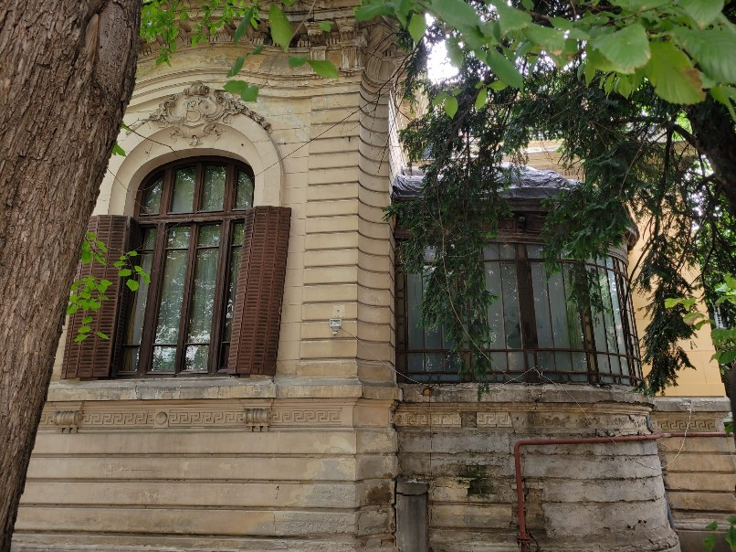
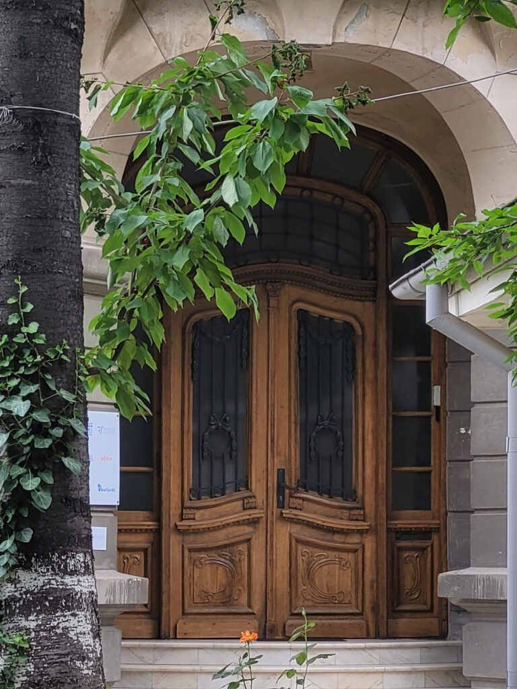
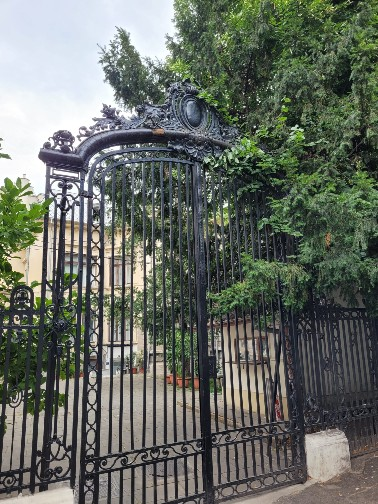

+++
date = 2022-06-26
title = "Ziua 166"
description = "De cum am deschis ușa am simțit că răcoarea de afară s-a transformat în răceală în femeia din cameră. Nu are nicio reacție, dacă nu i s-ar mișca ochii care mă urmăresc seci, aș zice că-i încremenită, stană de piatră. Mă trece cu fiori de oroare, chiar nu reușesc să mă prind de ce mi se întâmplă asta de fiecare dată când simt că am în față un corp inert, neluminat de nicio minte momentan."
authors = ["Biannca Locatelli"]
[taxonomies]
tags = []
[extra]
math = false
diagram = false
image = "images/ziua-166.jpg"
+++
---

În cuptorul nopții, Universul a pus-o de-un copt de liniște iar ea mi s-a strecurat, nevăzută și necercetată de nimeni, în corp. Asta e singura explicație plauzibilă pe care mi-o dau acestei prea dimineți extrem de prea dimineață, în condițiile în care aseară m-am culcat tare târziu. Deși n-am decât puținele ore de somn, am în mine o liniște atotcuprinzătoare și de corp și de minte. Niciunul nu se revoltă în niciun fel, și nu-i din amorțeală sau inerția netrezirii. Doamne, s-o fi prins în mine sămânța aia de mi-o tot plantam cu inima dar n-o udam cu mintea: să mă trezesc cu o stare bună. Că peste zi, mă mai curcănesc eu, văd și știu c-o fac, dar simt eu că mi-e o țâră esențială plecarea-n zi. Parcă ea dă tonul iar în ultimele zile, fie cu odihnă, fie cu puține ore de somn, mă îmbrățișează de la prima clipire de gând sau de gene, o împăcare.

Nu mai generalizez, am făcut fobie de asta, ca și cum Universul stă cu urechea pâlnie pe mine și dacă-mi iese un porumbel, îmi dă situații care mă scot din starea pe care consider c-am implementat-o. Sau, cum se poartă-n lumea spiritualității, taman d-aia mi le dă, să vadă dacă mi-am croit pantofii pentru drumul pe care zic eu c-am pornit, sau mă bat pe la margine și încep să schiopătez după câțiva pași. Nu știu întotdeauna care e adevărul, dacă sunt teste sau dacă inconștiența mea merge pe culoarul de inconștiență și evident că doar asta întâlnește, dar am ajuns la o maturitate să văd că nimic nu e constant, totul e într-o schimbare fantastică. Da, îmi doresc consecvență, da, bag voința la înaintare pentru asta, dar nimeni și nimic nu-mi garantează rateurile și nu e nicio dramă că se întâmplă așa. Doar mintea mea, îmbătată de impresia că aș avea vreun control asupra propriei vieți, îmi ordonă să nu mă abat de la cărare.

***

E încă mai mult noapte decât zi, iar în intersecția dintre cele două, mă așez cuminte și-mi șoptesc intenția. Am adăugat o nuanță nouă la mantra mea matinală veche și asta aduce și o valență nouă. Vreau, ca înainte de a-i da drumul ca mesajul din sticla văzduhului, să o trec prin mine, să văd dacă mă strânge pe vreundeva sau dacă o primesc întreagă așa nouă și la fel o va primi și Universul. Îmi place despre ea, îmi place despre mine cum mă simt când o plimb prin corp așa că o trimit cu putere și încredere în tot ce mă înconjoară. Atât de hotărâtă să-i dau elan am fost, că am imprimat și corpului o mișcare de înainte și, deși am perceput-o subtil, am continuat-o cu datul jos din pat. Pentru Spiky e prea devreme totuși, așa că rămâne să păzească somnul domnului meu și să se întreacă în mici triluri.

***

Acum câteva seri am realizat că, pe cât de mult aș vrea să n-am sfornăici în viață, fix p-ăștia îi atrag: primul care a început a fost domnul meu, care, și după două operații, nu a reușit să scape de trilurile nocturne, apoi a fost Maya, care le sforăia maxim, rasa brahicefalică fiind o rasă predispusă la respirații grele și, implicit sforăit, iar acum câteva seri am avut șocanta surpriză să descopăr că Spiky, asta mică de-o bagi în poșetă și-ți mai rămâne loc și de portofel, are și ea porniri de soprană, evident calibrate pe dimensiunea la scară redusă la care se încadrează.

Cu mulți, mulți ani în urmă, am urcat la o cabană în munți unde se dormea la grămadă, în paturi suspendate. Eu în patul de sus, jos un domn un strop prea voluminos prin zona burții de bere. Am crezut în noaptea aia că fie mi se oprește mie inima, fie lui. Avea nenea ăla niște grohăituri într-o gamă largă de note cum nu mai auzisem niciodată până atunci și nici de atunci încoace n-am mai avut nenorocul să aud. Pornea cu note joase, de subteran, de-mi dădea mincinoasa impresie că e ceva ce pot să duc, pot să arunc somnul peste zgomot. După notele astea, veneau la câteva minute, când eram gata să alunec în vis, altele un strop mai înalte dar nu înfricoșător de înalte. Pentru că lăsa o perioadă de minute între grohăituri și pentru că eram teribil de obosită, uitam rapid nota anterioară și-mi ziceam că pot să duc p-asta nouă, o să adorm. De pe la al treilea rând de note, din ce în ce mai stridente, am intrat în alertă. Omul avea și apnee, începea cu grohăituri care, între timp, deveniseră ascuțite, dar era un crescendo acolo care pe mine mă făcea să cred că ăla moare acolo, în patul de sub mine. Ce somn frate, nici nu mai respiram, eram atât de acut atentă dacă se mai aude respirația lui că n-am pus geană pe geană. M-a ținut din șoc în șoc că a doua zi dimineața, mi s-a părut că a fost cea mai lungă noapte din viața mea iar coborârea a fost cea mai grea ever, de oboseală. Yep, am o saga cu sforăituri și nici nu o văd a se încheia cumva.

***

E răcoare și-n casă și afară așa că apa caldă mă și alcalinizează și încălzește pe dinăuntru. Am sorbit-o încet, pe terasă, unde am luat notă de alt rând de anemone înflorite, de alți boboci înfloriți la unica dalie care a făcut flori până acum, de gladiolele care vor înflori foarte curând, florile încep să iasă de sub frunze și trag cu greutate, în jos, tija plăpândă a plantei. Nu am șansa unui răsărit azi, pentru că sunt foarte mulți nori iar soarele nu îi dă la o partea în bucata mea de zonă. Mie-mi place și așa, poate chiar mai mult azi, că nu am parte de niciun stimulent exterior care să-mi alunge pacea asta nou instalată.

Câte-un crăuit de fazan, ce-și strigă cu patimă căldurile pentru făzănițele din zonă, mai sparge liniștea acestei zile de duminică în care, cel puțin la ora asta, nimeni nu face nicio muncă care să genereze zgomote deranjante. Am auzit foșnăială și mi-am mutat privirea și așteptarea pe zona de unde venea zgomotul, la fix să-i văd coada stufoasă de vulpiță șmecheră. Eu mai arunc diverse din ce mănâncă mama și nu intră în compostor, la gard, pentru că știu că trec animale sălbatice și le mănâncă. Vulpița a învățat ea că acolo mereu gășeste câte ceva și vine la intervale de timp, să se răsfețe. I-am trimis un gând-zâmbet, am stat nemișcată s-o și văd pe de-a-ntregul dar pesemne, de după frunze, ochii ei mă urmăreau neștiuți de mine și nu s-a avântat în câmp deschis.

***

Mi-am mutat fizicul în casă deși mi-am lăsat mintea pe afară, la vietăți, la natură, la cer. Nu-mi trebe cine știe de concentrare la smoothieuri așa că mi-am lăsat-o acolo până am terminat și am chemat-o să facem echipa care salută o nouă zi și în viața mamei și a lui Sassy.

De cum am deschis ușa am simțit că răcoarea de afară s-a transformat în răceală în femeia din cameră. Nu are nicio reacție, dacă nu i s-ar mișca ochii care mă urmăresc seci, aș zice că-i încremenită, stană de piatră. Mă trece cu fiori de oroare, chiar nu reușesc să mă prind de ce mi se întâmplă asta de fiecare dată când simt că am în față un corp inert, neluminat de nicio minte momentan. Că a mea minte meșterește niște balauri cât mine de mari, privirea aia rece și seacă, doar ochii ăia care se mișcă parcă sunt din filmele de groază, alea puține pe care le-am văzut la viața mea. Vorbesc cu ea, cu o voce înceată parcă aș vrea să vorbesc, dar parcă n-aș vrea să vorbesc, așa că sper că nu mă aude și o zbughesc rapid, să nu mă umple oroarea, că-s vulnerabilă-n liniștea mea acum. E încă plăpândă starea asta a mea nouă, nu i-am întărit rădăcinuțele și nu vreau să ma smulgă demența asta și să dea cu mine de toți pereții, cum a mai făcut-o.

Mama nu-mi răspunde, chiar nu știu dacă nu m-a auzit că am vorbit încet sau nu m-a auzit că nu-i acasă-n ea, cert este că i-am pus rapid păpica pisicii, am lăsat smoothieul și medicamentele și am tulit-o. Vin mai târziu să văd dacă a băut și a luat pastilele, când poate s-o scutura inerția asta oribilă din și de pe ea.

Am închis ușa și cred că dacă aveam cheie pe dinafară, aș fi încuiat cu cheia. Giiiz, mă înfricoșează maxim aceste momente ale ei și-mi vine s-o țin încuiată acolo, să nu plece ca un zombie prin casă.

***

Ajung la parter și mă așez puțin pe colțar. Îmi trag emoțiile împrăștiate peste tot prin mine, mă adun un pic și-n gânduri și-mi dau seama că frica asta e o aberație plăsmuită de o minte atrasă de senzațional. Evident că mama nu-i zombie, evident că e nașpa că e așa, dar nu o să-mi facă rau că n-are nici puterea necesară și nu cred că va fi vreodată cazul. Îmi scot rând pe rând gândurile astea și le pun pe tapet, deșir fir cu fir croșetatul minții nebune, a mea de data asta, și decid, adânc în inimă dar și-n minte, să nu mă mai sperii data viitoare. Chiar sunt curioasă dacă va intra pilotul automat, calea bătătorită sau va prelua frâiele decizia de azi.

Mă uit pe cameră și văd că mama își face patul, cu mișcări vioaie, grosolan de deosebite de încremeneala de acum câteva minute. Oare s-a prefăcut când am intrat eu și acum își vede de viața ei, așa cum vrea? Zău dacă știu care-i răspunsul dar știu că azi am simțit din nou trădarea ei, am simțit din nou cum eu mă pun candid lângă ea iar ea nici nu mă vede. Story of my life. Upgrade în demență. Dubla nșpe.

***

Nu mi-am permis, destul de brutal dar convingător, să alunec într-o victimizare sau într-o stare de neroz. Nu e decât o pierdere de timp.

O altă temă pentru acasă pe care o am în derulare, de ceva timp, este să nu mai încadrez instant în corect sau incorect, bun sau rău, etc. Deși mi-e clar că nu există lucruri corecte universal, ce e corect pentru mine, pentru altul poate să nu fie, mi-a luat 40 de ani să fac slalom și să-mi definesc corectele și incorectele că n-are cum să se dărâme eșafodajul ăsta peste noapte. Poate nu mi-o lua tot 40 ca să le deznod, dar în clipe ca astea, dau examenul la ce am aprofundat până acum. În clipe ca astea, când îmi vine să strig din toți rărunchii că nu-i corect ce-mi face, tot ce pot să fac e să simt că nu asta e ce contează, ci că nu trebe să-i lipesc timp trădării, să scurtez din timpul pentru bucurie cu o bucată pentru o trădare, reală sau imaginată, dar care nu are niciun beneficiu pentru creșterea mea. Sau doar pentru existența mea pe această planetă. Așa că azi, deși în background mai comenta viciat gândul că "vai, ce mi-a făcut mama!", în prim plan m-am bucurat de timpul meu, al meu și mi l-am făcut magic.

***

Am citit și m-am dus atât de cu totul în carte, că n-a mai fost mare loc și pentru altceva. Mi-am pus și-un bețigaș să fumege, mi-am înșirat pe măsuță smoothieul, ceaiul și cafeaua, să fie, m-am așezat confortabil, cu o păturică subțire dar mângâietoare și m-am lăsat pe mâna lui Marc Levi, într-o carte ușurică, fix ce-i trebe unei minți excitate la maxim. 1-0 pentru mine, aia prezentă în viața mea. Iupiii!

***

Am împins micul ei dejun cât mai încolo din două motive calculate: să-i fie foame cu adevărat și să mănânce bine, s-o țină până spre mai târziu. Azi, tot la casa cărturarilor, e festival indian și copila mea ne ia pe sus din nou, ceea ce înseamnă că o las pe mama singură câteva ore. Îmi iau aceste libertăți cu inima strânsă dar conștientă că va fi din ce în ce mai rău și nu o să mi le mai permit deloc. Acum, încă pot și vreau să profit.

O aduc la masă, nu mai e chiar ca mai devreme, dar nici nu debordează. S-a mai adunat un pic, mănâncă la fel de pic, din păcate, și o anunț că vom pleca cu copila în oraș. Zice că foarte bine, ea o să fie cuminte, la ea sus, că mai trebe să ieșim și noi. Da, câtă dreptate ai mamă, dar habar n-ai că nu pot s-o fac și de ce nu pot s-o fac. În majoritatea timpului, mama, în afară că e bătrână, nu știe că suferă de demență. Sunt puține dăți când iese din ea conștientizarea asta, care, în tot atâtea dăți, ține tare puțin. Iar eu nu am inima să-i spun, mereu și mereu, că are Alzheimer. De fapt, nu i-am spus niciodată asta. Am articulat că uită dar n-am putut niciodată să pun punctul pe i. La ce ar ajuta-o?

Deși a terminat de mâncat, mama rămâne pe scaun. Parcă-i într-o așteptare. Cred că instinctual sau doar dintr-un moment de claritate maximă, am simțit că mama are nevoie acum, mai mult ca altă dată, de socializare, de stat cu mine. Așa că mi-am tras lângă ea castroanele cu vișinele culese ieri și-am început să dau și din mâini, și din gură.

Am povestit, teatral, cum se plimbă Hitlerică, vagabondul de motan ce-mi pândește tomberoneza, pe la noi prin curte, cum defilează el în pas de sictir fix pe lângă gardul din spatele căruia lupițele fac spume de lătrat neputiincios iar pe el îl doare la basca ce-o n-are, cum mă face din chi-chi-uri Spiky a mea când vrea ea ceva și eu mă fac că nu înțeleg dar mă-nmoaie a cedare întotdeauna, cum am învățat-o eu pe Maya să coboare scările, treaptă cu treaptă, de era să rămân fără dinți de la atâta exersat cu o cățea așa de încăpățânată ca ea, toate poveștile deșirate cu veselie debordantă care-au făcut-o pe mama să râdă cu poftă. Exact ca un copil mic, tot mai voia povești, tot mai cerea, "mai spune-mi, mai spune-mi!" Am povestit de nu mai aveam salivă-n gură iar ea nu se mai dădea dusă. Pesemne am darul povestirii dar nu-s nici eu nelimitată precum cererea mamei. Dac-ar fi după ea, am sta la povești zi și noapte așa că o potolesc și o opresc, cu promisiunea că mai dondănim la prânz, când mă întorc din oraș. Irelevant că uitase că plecăm.

***

Ce ți-e și cu tinerețea asta! Când pierdeam o noapte, nu o resimțeam aproape deloc, poate și pentru că eu am avut anduranță cu lucratul la aeroport unde intram azi dimineață în tură și mai ieșeam mâine dimineață iar de acolo la facultatea pe care am făcut-o de bifă și ca să fug dintr-un oraș mort, cu niște părinți reci și ei prin interior. Domnul meu, a plătit o noapte de festival Nostalgia, cu două nopți de somn.

Pentru că într-o oră vom pleca la festivalul indian, unde clar e și mâncare indiană și unde clar ne vom înfrupta din bucatele preferate, ia un mic dejun întârziat frugal dar eu nu mai am cuvinte în tolbă așa că suntem mai mult muți, ne ascultăm unul tăcerea celuilalt.

Să nu ne fie cu deochi, dar am ajuns, după rateuri consistente, să nu mai fim stânjeniți de tăcerea dintre noi. Zâmbetul ochilor lui frumoși, care desenează laba gâștei pe la colțurile lor, e suficient să mă lase să mă bucur de prezența lui și să-mi dau seama că tăcerea lui e doar a lui, nu e generată de ceva din mine sau făcut de mine. Avem fiecare moduri diferite de comunicare: el îmi arată cu ochii care mă privesc într-un fel anume iar eu îl anunț scurt motivul pentru care sunt tăcută, să priceapă și el că n-are nicio legătură tăcerea mea cu ființa lui.

Îmi iau un timp mic de mine cu mine, că parcă m-am împrăștiat și m-am pierdut o țâră prin povești, o anunț pe coana mare că plecăm și am pornit către copilă și către festival.

***

La pomul lăudat să nu te duci cu sacul.

Comparativ cu VegFest, că-i cel mai proaspăt eveniment de același gen din viața mea, festivalul indian a fost o palidă idee de ce e indian cu adevărat. Câteva standuri cu bețișoare, creme naturale sau pictat cu henna, un stand cu lipii, doar cu carne și un singur restaurant, cu produse limitate, mai mult reci și mai puțin picante. Plus un mare ring de dans acoperit unde rula în continuu aceeași piesă de dans. Mi-a părut rău că n-a reușit să capteze esența, chiar și la scară mai mică, a ce este India cu adevărat dar m-am bucurat de clipele petrecute cu ai mei dragi.

Apoi am pornit la picior, ca turiști prin București, prin zona caselor vechi, de chiaburi. Am căzut în extaz de nenumărate ori, m-am lipit de gardurile înalte, cu lanțuri în porți, ale unor case splendide dar abandonate și lăsate să se degradeze, mi-au venit lacrimi în ochi de neputință în fața acestor case de care mă leagă ceva inexplicabil. Poate doar cineva la fel ca mine ar putea înțelege câtă plăcere îmi face să văd astfel de case, să pun mâna pe piatra lor veche, veche, să-mi sucesc gâtul privind ferestrele înalte, să-mi imaginez baluri și petreceri somptuoase sau doar seri de lectură și de muzică, să visez că trăiesc într-una din ele, încărcată de istorie.

Bucuria mea curată și intensă a fost știrbită de gândul că-n viața asta, nu cred că mai apuc să am castelul meu sau casa boierească sau conacul vechi. N-am putut doar să trăiesc clipa pentru că mă-nghesuia mintea și neputința unui viitor. Care poate nici nu va fi așa. Poate voi face o cheta internațională, voi convinge oameni să mă ajute să-mi realizez visul cu promisiunea că ușa mea le e deschisă de vor vrea să vină în vizită. Poate câștig, de fapt, poate mai întâi joc și apoi câștig la loto. Poate cineva din lumea asta mare îmi va lăsa moștenire un castel. Sunt atâtea variante, unele pe care mintea nici nu le poate concepe, dar eu mă cantonez în neputința asta libidinoasă care-mi suge seva bucuriei aceste clipe.

Am strâns totuși ceva bucurie și-am pus imaginile într-o cămăruță de inimă, de unde știu că-mi vor ieși de câte ori o să am nevoie de ele. 1-1 între mine și prezență.

***

Cum mă așteptam deja, mama nu a coborât cât am fost plecați absolut deloc, deci nu a mâncat. Ajunsă acasă doar ce m-am descălțat și-am urcat la ea, să văd cum e. Băgată în pilotă până la gât, se uită la televizor și nu, nu vrea să mănânce. În cameră miroase a măr iar în coșul de gunoi văd și cojile lui dar și cele de banană.

Nu i-o fi foame dar n-a uitat că vin cu o nouă serie de povești, că așa i-am promis de dimineață. Nu am mare chef, verva nu mai animează descrierile mele, ea oricum nu poate pricepe de ce sunt eu atrasă de casele vechi la gradul la care sunt, schimbă subiectul, mă întreabă de "fiica mea", de cățeaua ei, de Spiky și mă conduce fix unde vrea ea. Văd asta, mai scot din desagă câteva istorisiri dar oboseala mă prinde, orele puține dormite își spun și ele păsul așa că închid repertoriul mai repede decât i-ar fi plăcut ei. Azi n-o înțelege multe dar cred că se vede că-s obosită și mă eliberează de datoria poveștilor.

De când a venit căldura iar curtea îmi cere din ce în ce mai mult timp, nu am mai jucat table. Oricum, ea s-a adâncit extrem de mult în rebus și în table așa că m-am mulțumit cu noul setup, care-mi convine de minune. Azi însă am simțit că poveștile pe care mi le cere sunt o nouă formă de table. O să văd cum evoluează lucrurile și voi opri înainte să intru pe panta de sacrificiu. Nu mai sunt nici dispusă, nici inconștientă să mai accept astfel de dealuri.

Într-o ploicică lentă, liniștea dimineții s-a întors, în toată plinătatea ei, în mine, înaintea serii. Am terminat toate sarcinile și m-am refugiat în dormitor, lângă domnul meu.

***

Mi-e greu să decid cum a fost ziua de azi, clar n-a fost bilă neagră dar nu-s nici 100% sigură că a fost albă. Mai fac un borcan, de zile-amalgam interesant, că și astea încep să se adune. Am, până acum, 4 borcane: bile albe, bile negre, bile roz și zile amalgam. Pe 31 decembrie, o să trag linia. Deși, îmi iau zilnic din exercițiul ăsta mult mai mult decât o statistică: îmi iau atenție pe clipe, îmi iau bucurie de viață, îmi iau teme pentru acasă.

În ziua asta amalgam, sunt recunoscătoare pentru:
1. Prietena mea nouă, liniștea!
2. Arhitectura veche!
3. Curticica mea de flori și roșii!

Frumosul meu sublim a fost azi:

     &nbsp; &nbsp; &nbsp;
     &nbsp; &nbsp; &nbsp;
    

