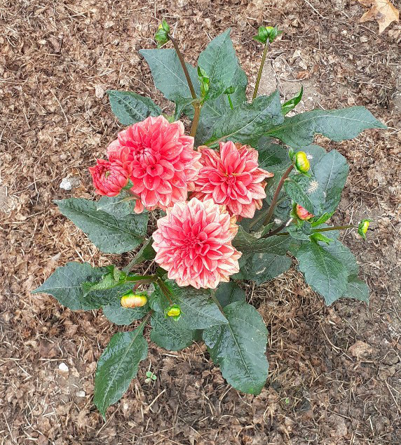
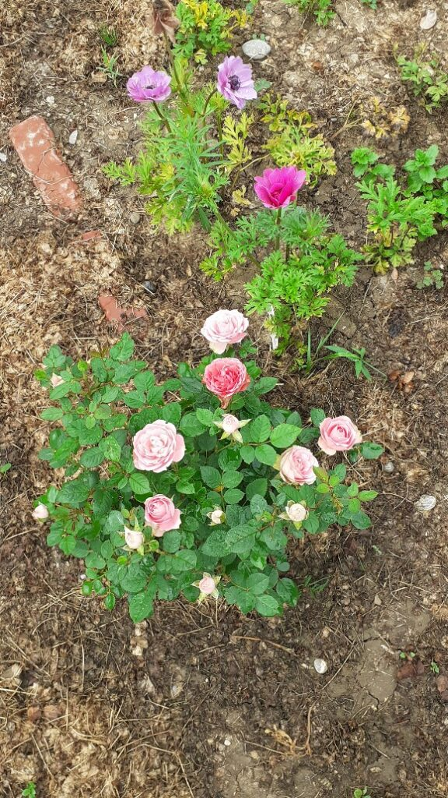
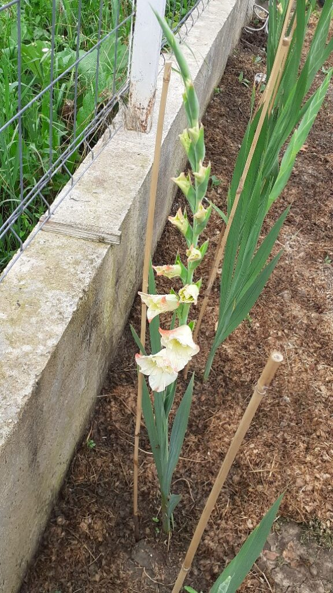
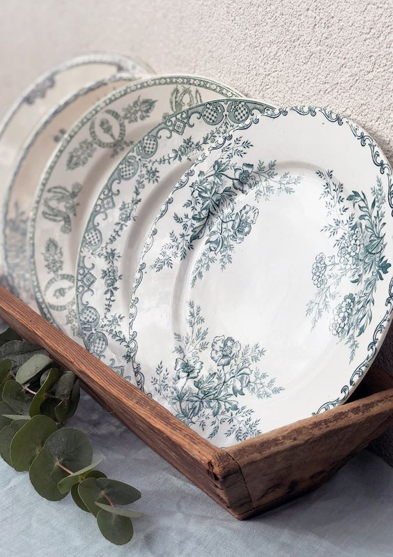

+++
date = 2022-06-28
title = "Ziua 168"
description = "Zău că sunt dăți când îmi doresc ca, așa cum există camere cu termoviziune, să existe camere cu afișare de prezență-n corp. Nu-mi duc niciodată gândul ăsta dorință până la capăt, că nu știu să-mi răspund la 'și dacă aș știi, ce s-ar întâmpla?' În diminețile cu 'ne pare rău, abonatul solicitat nu e în aria de prezență!', nu m-aș mai duce la ea? Cred că și neștiutul are farmecul lui."
authors = ["Biannca Locatelli"]
[taxonomies]
tags = []
[extra]
math = false
diagram = false
image = "images/ziua-168.jpg"
+++
---

Pe principiul "să nu mă dedulcesc la bine prea des", în prea dimineața asta iar am plumb în mine. Încă netrezită-n corp, în spirit mi-a scăpat o părere de zâmbet că viața asta e fascinantă, nu mă lasă să mă plictisesc nicio clipă. Când una caldă, când una trece, adrenalina de la extreme nu mă lasă să băltesc într-o stare neutră de bine. Încep să înțeleg că nici măcar nu e utopie ci de-a dreptul prostie, să-mi doresc să fiu într-o stare de călduț continuă. Ar însemna că mă înscriu, de bună voie și tâmpit, la o lobotomie directă a ceea ce înseamnă viața cu adevărat. Are Pink o melodie mișto care zice fix așa: you taste so sweet, but I can't eat the same thing every day. Dacă mi-aș folosi doar un simț, deși mi-au fost plantate mai multe, restul s-ar atrofia și mi-ar limita dramatic experiențele.

Când stau să scriu firul momentului, pare lung și-mbârligat, realitatea însă se petrece în secunde de procesare. Pesemne că cel de-a măsurat acele aproximativ 60.000 de gânduri care trec prin mintea umană zilnic, n-o fi fost chiar departe de adevăr. La cât rumeg eu, tind să-i dau dreptate omului.

***

Afară fie plouă, fie e-nnorat, că lumina ce se strecoară peste noi e mică și tulbure. Poate d-aia și plumbul nu se dă dus, n-are lumina asta intensitatea suficientă să-l alunge și-o mai pluti prin aer și îmbierea aia naturală dintre somn și ploaie.

Curioasă din fire, am încercat mai demult să înțeleg de ce când plouă, așa te-mpinge o picoteală pe la gene, de-ți vine apă-n gură de poftă de somn. Creierul uman, mașinăria asta supermegaparaextramirobolantă pe care o deținem, este foarte atent la sunetele pe care le trimite urechea, scopul lui primordial fiind să le studieze, filtreze și să ne dea panica de fight or flight sau relaxarea care face atât de bine imunității. Sunetul ploii este unul sacadat, ritmic și liniștitor pentru "ochiul vigilent" al creierului, spre deosebire de un sunet strident, iar creierul dă unde verde pentru "toate armele jos". Așa se face că, natural, ființa umană, involuntar și inconștient, alege relaxarea și implicit repararea sistemului imunitar versus cortizolul din stresul că-l prinde leopardul și end of story.  Corpul nu minte niciodată, cum zice Alice Miller. Doar că nu mai știm să-l ascultăm, nici măcar nu-l mai auzim.

***

Cu ochii încă închiși, cu niște mustăți ce-mi miros curioase nasul și-mi aduc zâmbetul în faptic, reușesc să mă centrez și să-mi caut intenția zilei.

Mi-am propus să continui acest mic ritual, cu oricâte sincope ar veni el, dar să mai diversific intenția. Să granulez mai mult, să ies puțin din repetare monotonă, învățată pe de rost. Vreau să pun mai multă prezență nu doar în actul lansării ci și în cel al creării de intenție. Iar azi, mi-a ieșit din plin. Am avut impresia că aveam toate cuvintele astea oprite undeva, în spatele ușii intenției actuale, și nu le permiteam să iasă la lumină. Cum am decis că sunt pregătită de schimbare, cum Universul mi le-a servit, să-mi fie de ajutor. În momente de-astea văd extrem de clar că e nevoie doar să vrei, să vibrezi a schimbare și schimbarea e acolo, pentru tine.

Anita Moorjani, în "Dying to be me", a spus o chestie care mi-a rămas pentru toată viața asta în memorie: când a trecut în altă dimensiune, pe lângă că toate simțurile i s-au ascuțit la un nivel pe care ființa umană nu-l poate cuprinde mental, a avut senzația că știe tot și toate, că are acces la orice. Comparația ei e vividă: e ca și cum ai fi într-un hambar, seara, cu o lanternă și vezi doar lucrurile pe care pui lanterna. Trecerea într-o altă dimensiune e ca și cum cineva aprinde lumina și cuprinzi cu privirea și înțelegerea tot ce e acolo și era și înainte, doar că era neluminat (necunoscut).

Azi am mutat lanterna pe intenție, am decis fără dubiu să schimb și am primit inspirație, să-mi creez intenții toată ziua, dacă aș sta să fac numai asta.

***

Un picușor mai limpezită, sondez verticala și las în urmă un bărbat frumos și-o pisică curioasă. Nu știu cum de m-am mișcat mai repede decât ea, că era trează de ceva timp și ne investiga respirațiile pe rând, când pe-a mea, când pe-a domnului meu. Cred că și-a luat rolul de înger păzitor în serios, altfel nu-mi explic grija asta a ei pentru trezirea noastră.

***

Un pic de neîndemânare tot mi-a mai rămas prin vene, că am încălzit apa pân-am dat-o-n fiert. Nu-i bai, trec la ceai și la smoothie și mă întorc la ea când oi putea-o acomoda cu gâtlejul. Cerul nu pleacă nicăieri, nu-i albastru, ci plumbul alungat de mine s-a lipit de el. Sau cred că invers, din plumbul lui mi-o fi dat și mie un strop în prea dimineața asta iar acum și l-a pus la loc, în norul de unde a ciupit.

Deși dormea când m-am apucat de smoothie, mama s-a trezit dar stă cuminte în pat, cu ochii la televizor, înfășurată în pilotă ca o sărmăluță.

Zău că sunt dăți când îmi doresc ca, așa cum există camere cu termoviziune, să existe camere cu afișare de prezență-n corp. Nu-mi duc niciodată gândul ăsta dorință până la capăt, că nu știu să-mi răspund la "și dacă aș știi, ce s-ar întâmpla?" În diminețile cu "ne pare rău, abonatul solicitat nu e în aria de prezență!", nu m-aș mai duce la ea? Cred că și neștiutul are farmecul lui. În mod cert, la mine, elementul surpriză mă ține afară din butoiul cu bălteală.

***

De abia în dimineața asta am realizat cât de mult mă ajută de fapt Sassy. Nu am conștientizat până azi că pisicuța asta, sora mea blănoasă, secondează, sau în unele dăți, chiar primează, viața din camera mamei. Chiar dacă mama nu e acolo, Sassy e și mieunatul ei, frecatul ei de picioarele mele, sunt elemente care ar putea să mă ancoreze în viață în loc să mă încarc de oroarea neprezenței mamei.

Nu e cazul azi, dar acum am putut să văd că am și opțiunea asta pe farfurie. Mama e cuminte, nu tare sociabilă și vorbăreață, dar are un zâmbet liniștit pe chip. O las în pacea ei, mă apuc de curățenia din baie, iar la plecare, perforez și cartela de prezență a ei în ea: "ne vedem la micul dejun, puiule". Yes, ma'am!

***

Îmi iau apa răcorită și ies afară, unde nu plouă ci doar e înnorat. Aplicația de pe telefonul meu zice că n-ar ploua dar mi-a mai dat o dată țeapă, așa că nu sunt prea sigură. Ca să nu am emoții, dau drumul la udatul roșiilor.

Culmea, și varianta gri a cerului este liniștitoare, parcă-i o țâră mai elevată așa, mai sofisticată, față de albastrul ăla copilăros. Azi atribui calități culorilor, ce tare! Mâine o să vobesc cu mirosurile, săptămâna viitoare aud vocile și-s coaptă, gata, hahaha! Beau apa și zâmbesc singură la ce-mi trece prin cap dar adevărul este că azi am simțit în mine aceste calități ale celor două culori.

***

Timpul meu liber de azi mi l-am făcut magic prin cotrobăit pe site-uri după porțelanuri vechi.

Favoritele mele, din ce în ce mai rare, rămân franțuzitele Sarreguemines și Terre de Fer, însă încep să cochetez și cu englezitele Ironstone, Myotts și Royal Tudor. Toate au ediții limitate, fiecare cu un tipar specific și, în contextul potrivit, sunt sigură că-s superbe. Ca-n orice în viață, acum sunt la momentul imediat următor îndrăgostelii, când am devenit compulsivă. Mi le-aș aduce pe toate acasă dar îmi dau seama că nici nu am loc pentru toate și nici nu mă calcă musafirii, atât de mulți și atât de des, încât să le scot și să le onorez cum ar merita. Până una alta, temperez compulsivitatea cu privitul, consum avidă imagini, mă rafinez, încep să deosebesc colecții iar asta îmi place la nebunie. Încă un raft în biblioteca minții mele dar e un raft așa, mai de doamne-ajută, mai prin față, că mi-e apropiat sufletului.

***

Domnul meu e și azi, la micul lui dejun, trezit de-a binelea, așa că pot să-i aud și altceva decât tăcerea. Mă încarc și de la el și cu puțină stare de bine, și cu puțină liniște și cu mai mult drag. C-așa-s eu, mai hârciog. Să fie.

***

Am coborât și grasa mea dragă și blănoasă, Sassy, la micul dejun al mamei, să se bucure și ea de explorat altceva decât camera mamei și baia. Iar o apucă fremătatul, iar miaună extatic pe unde trece, Spiky e deja p-afară așa că Sassy are toată casa la dispoziție pentru mirosit și marcat teritoriu prin frecare. Observ din nou egoismul mamei care-o vrea pe Sassy doar pentru ea, dacă s-ar putea ca mândra asta mică să-i stea la picioare, cât timp mănâncă, ar fi minunat. Din nou îi observ mișcările brutale, datul cu piciorul, nu grosolan, dar îndeajuns ca să o deturneze pe pufoasă de la traseul pe care și l-a stabilit. Ca să evit astfel de lovituri care mă strâng în interior, rămân cu mama în bucătărie și închid ușa, lăsând-o pe Sassy să se destrăbăleze în tot restul parterului, inclusiv la Mr. H în birou.

În contextul ăsta, mamei nu-i mai arde de povești, vrea să termine repede mâncatul și cu ultimul dumicat încă nemestecat, pleacă spre camera lor. Eu, după ea, să iau grasa s-o urc la etaj. Ia grasa de unde nu-i! Frumoasa regală cu ochi albaștri e la etaj deja, a urcat singură și așteaptă, cu ochi rugători, să i se deschidă ușa să intre în cușca în care stă de obicei. Obișnuința-i haină grea. Pot să-i dau eu câtă libertate vreau, ea tot în cameră se întoarce. E o fidelitate în carnea nostră, a tuturor ființelor, care, dacă nu e întrebată și nu e puricată, ne conduce invariabil și tăcut.

***

Un mesaj pe whatsapp, de la o doamnă faină, iubitoare maximă de blănoși torcăcioși, mi-a dat o bucurie. Știam că am 5 persoane care mă citesc dar azi am aflat că-s șase. Și pentru că eram într-o pauză de acțiune, am făcut studiu de caz pe mine și reacțiile mele.

Prima reacție: mi s-a scurs brusc sângele din cap, ca și cum am făcut ceva rău.

Primul gând după prima reacție: am scotocit prin memorie, cât am putut, să văd dacă ce scriu se încadrează la bune sau nebune.

A doua reacție, când draga de ea mi-a spus că-i place ce scriu: pfiu!

Al doilea gând: cum de mă citește?! Și de ce o face?! Cine are timp să citească bloguri?!

A treia reacție: m-am gogoșit și topit de complimentul că scriu bine.

Al treilea gând, pe care-l articulez cu toată responsabilitatea: în urmă cu puțin timp, am citit câteva zile din ce am scris. Am rămas impresionată. Era scris mișto. Dar nu eu am scris. Și nu o zic nici din modestie, nici din umilință, ci dintr-un interior al meu care este extrem de limpede: eu simt că sunt un canal prin care sunt transmise toate astea, în exterior în lume. Nu știu de ce sunt transmise, dar poate cândva, cuiva, îi vor fi de folos. Pe bune, să scrii ZILNIC 168 de zile și să continui, nu e ceva ce ține de o simplă ființă umană, că n-ai cum să ai atâta inspirație. E ceva ce s-a folosit de experiența prin care trec și și-a croit drum dintr-un tărâm imaterial într-un blog material. Așa că gogoșeala de mai sus am trimis-o pachet la sursa care-mi suflă prin degete ce să scriu.

A patra reacție: recunoștință lacrimogenă pentru sursa asta care curge prin mine și pentru doamna asta faină care m-a pus azi, fără să știe, să mă disec chirurgical în gânduri și reacții.

Iar ultima ei mențiune, fără legătură neapărată cu subiectul blogului, a fost că ar fi vrut să mă sune când eram bolnavă DAR s-a gândit că n-am chef de vorbe.

Acum mulți ani, avea Vodafone o reclamă care m-a atins și atunci, când încă-mi vindeam timpul pe bani și stres: **lucrurile pe care nu le spui, se pierd.**

De ceva timp, dacă-mi vine în minte o persoană sau un gând pentru o persoană, pun mâna pe telefon și dau un mesaj. Dacă omul vrea să ne auzim, răspunde. Și până acum, n-a fost unul care să nu răspundă! Nu avem de unde să știm cât bine poate face o vorbă bună sau un gând cald, cuiva, oricând. Nu cred că există limită la a împărți bun. Doar că DAR-ul ăsta omoară în fașă un bun care-ar fi dat aripi sau stări sau disecări unei alte ființe umane. Mulțam!

***

A crescut busuiocul purpuriu ca nebunul, cel verde e mai potolit și mai puținel, așa că azi am hotărât să-i ciupesc vârfurile și să-mi fac paste cu pesto de busuioc. Partea asta cu ciupitul mi-a venit natural, deși mi-a trecut cândva pe la ureche informația dar nu am practicat niciodată, până azi. Sub frunzele vârfului, la baza următorului rând de frunze, sunt alte frunzișoare, mici, mici, mici care cresc și dezvoltă firicelul în tufă atunci când rupi, delicat, frunzele din vârf. Mi-a fost azi atât de limpede că așa trebe să fie, că nici nu m-am mai uitat pe net să validez dacă e așa. Mi-am strâns recolta, m-am umplut de miros sublim de busuioc și-am savurat niște paste demențiale. Asta tot de la bunicul mi se trage. Aș mânca paste pe pâine, atât de mult îmi plac. Iar pâinea poate să fie ciabatta, focaccia, că nu mă supăr deloc.

***

Micul dejun-prânz cumulat al meu a fost imediat urmat de prânzul domnului meu, care a terminat el pastele care n-au mai avut loc în mine. Am stat la bârfă, am mai pus-o de-un plan, două și-am simțit că mă-npunge un somn mic. Cum mama nu a mâncat, și nu e chiar ora ei de prânz, nu pot să mă strecor și să fur o oră de odihnă. C-un ochi pe cameră, e mai greu. Domnul meu mă provoacă: fac pariu cu tine că nu vine până la 16? Singura care m-a oprit să fac pariul a fost poate dorința mea aprigă ca el să aibă dreptate, să strecor un închis de pleoape și-o plecare portocalie cât să-mi încarc rezervorul minune de energie. Că e minune pe bune, vine de pe alte tărâmuri, nu de pe ăsta al nostru: se umple de la somn dar și de la o bucurie făcută sau una primită sau de la un gând fain sau de la un stat cu mine în mine, și pură și simplă.

N-a terminat bine propoziția, că se deschide ușa de la bucătărie și mama e în prag. Domnul meu e uimit, eu mă bucur aiurea-n mine că a înțeles și el cum e cu predicția în cazul mamei.

Îi pregătesc masa mamei, mai scot din pălăria magica de povestitor o istorisire scurtă și îi spun că mă bucur tare că a coborât, că mi-ar prinde bine un somn de prânz. Cum mama e aici azi, a înțeles și nu m-a pisat pentru și mai mult de povestit și de râs. A mâncat tot ce i-am dat și a plecat, într-o stare plăcută de bine, la ea sus. Cu tot cu starea mea de picoteală, care nu știu unde-a fugit că n-am mai dat de ea în niciun chip.

***

Afară a început să răpăie, ies pe terasă să aduc felina la adăpost dar ea s-a plantat lângă arțarul galben și nu se vrea desplantată, cu toată ploaia ce-o șiroiește. Mă uit la ea, o îndemn, râd cu poftă cum stă ea încăpățânată acolo, floarea Spiky. O las în pace, la un moment dat apare pe scaun pe terasă, din nou îmi dă cu flit, din nou o las în pace.

Mai citesc, dacă tot nu mi-e somn, dacă afară plouă iar în casă am treburile terminate. Din când în când, mai verific să văd dacă mă onorează și ea cu prezența. La a treia deschidere de ușă, să mă ia cu leșin: Spiky, venea în viteză, către mine, cu o vrăbiuță în gură. Pentru că am scos o onomatopee necontrolată la vederea actului, de cruzime în mintea mea, de ofrandă, în mintea ei, a făcut stânga-mprejur și a luat-o la fugă prin curte. Și eu, după ea. Am strigat-o calm, m-am așezat pe jos să vină să-mi aducă cadoul, nimic. Doar viteza mea de reacție, când a vrut să treacă pe lângă mine, a făcut posibilă prinderea vânătoresei. Am dezmierdat-o, deși mi-era greu să văd păsărica în gura ei, am lăudat-o, i-am zis "Bravo" de un milion de ori, până s-a-nmuiat și a decis că m-am calificat la darul ei și a depus păsărica la picioarele mele. Am ținut strâns pisica iar păsărica a zburat nevătămată. Yeeey!

Am băgat-o-n casă, am lăudat-o în continuare, mai răspundea cu câte-un chi-chi, semn că lauda are o energie universală, aceeași pentru toate ființele, și s-a culcat colac lângă mine și cartea mea. After all, ea muncise pentru mine și merita din plin drăgăleala.

***

Marele galben a ieșit o frântură din timpul zilei de azi iar eu am ieșit la o tură de grădină.

Dalia mea, The Dalia, singura deocamdată înflorită, mă sărută înroșită. De Paști am primit de la părinții domnului meu, un trandafiraș pitic care acum mă răsplătește cu mulți trandafirași pitici. Una din gladiole, pe care o voi numi The Gladiola, a început să înflorească și e o combinație tare delicată de alb ivoire cu vârf de petală roz pal. O suavitate plăpândă care-mi aduce aminte de copilăria mea aia fericită de la măița, când primul lucru pe care-l făceam dimineața era să fugim la bujori, să ne spălăm cu roua de pe ei să avem și noi "bujori în obrăjori" și la gladiolele din fundul grădinii, învolburate-n multele flori de pe tijă, roșu pătimaș, să învăț că floricica de mai jos de pe tijă nu e cu nimic mai prejos decât cea de sus de pe tijă. Măița mea dragă, un om simplu și imens în simplitatea ei!

     &nbsp; &nbsp; &nbsp;
     &nbsp; &nbsp; &nbsp;
    

***

Ce ciudat e când n-ai lucruri presante de făcut! Mă blochează nefăcutul a ceva, orice și în loc să mă bucur de asta, caut febrilă să găsesc cevaul, oriceul. Nu mai am banane pentru mâine dimineață așa că am găsit scuze să bag un drum la Mega. Mă întorc numa' bine să-i dau tratamentul mamei, să-mi alint cu papa bun pufoasa de la etaj și să-mi pregătesc lucrurile pentru începutul zilei de mâine.

Cu câtă încredere o fac, amestecată cu inconștiență dar și cu recunoștință. Nu scrie nicăieri că mâine e-n cărțile mele dar îmi văd, nederanjată de gândul ăsta, de scoaterea fructelor din congelator pentru smoothie, de suc, de pusul apei în sticla de cupru să stea 12 ore liniștită și nehurducăită prin țevi și conducte.

EU vreau să am un mâine și față de acum ceva timp, când scuipam că nu mai vreau nimic, asta e o victorie. Esențială.

***

Super albă bila pentru azi, mă bucur că am trăit o zi ca azi și sunt recunoscătoare pentru:
1. Intenția nouă!
2. Viața lui și din Sassy!
3. Surpriza zilei adusă de fosta mea colegă de școală care-mi citește blogul!

Clipa de frumos este:

  

Terre de Fer

 

 

  

    <a href="/blog/ziua-167/">Postarea anterioară</a>
  

  

    <a href="/blog/ziua-169/">Postarea următoare</a>
  

