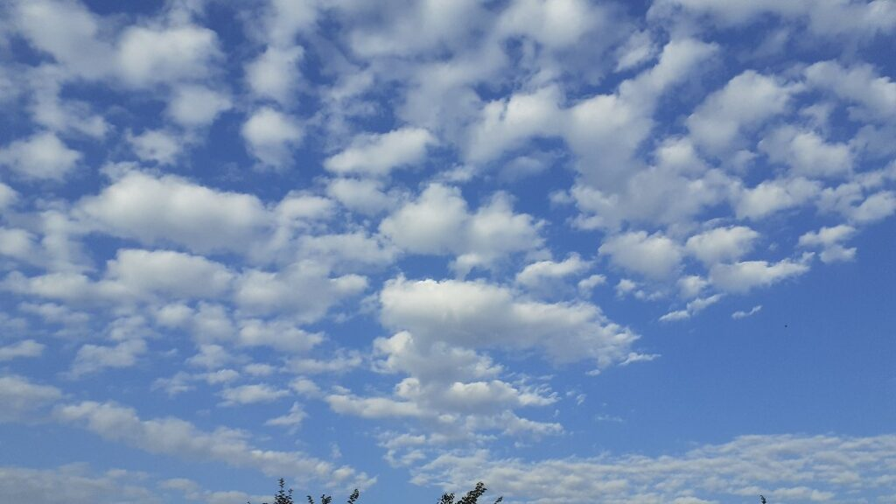
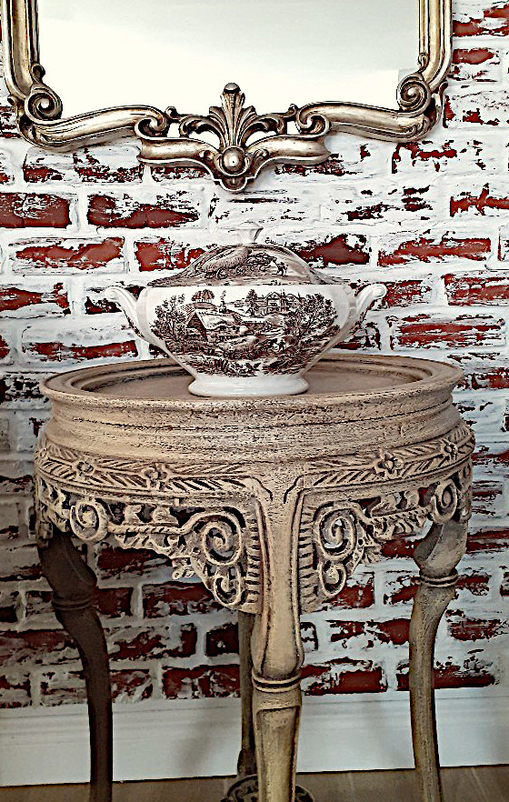
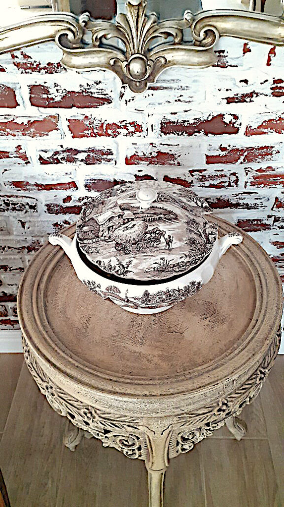

+++
date = 2022-07-01
title = "Ziua 171"
description = "Aprostrofarea ei, în această prea dimineață când e mama mea, mă pune din nou la colț, la locul meu de copilă a ei, parcă și-a luat din nou hățurile autoritare pe care i le-am predat la o vârstă cruzișoară. Brrr! Pentru că ieri n-am avut răbdare să văd ce e după momentul ăsta de impact, azi mă înfig mai adânc în fotoliu, să n-am vreo zvâcnire mai cu avânt și să plec, evitând clipa. Deși sună dramatic, acum este un moment de furtună, la scară mai mică, dar este: să stau acolo, nu în apărarea copilei ce-am fost, ci în împăcarea ei cu adulta ce-am ajuns."
authors = ["Biannca Locatelli"]
[taxonomies]
tags = []
[extra]
math = false
diagram = false
image = "images/ziua-171.jpg"
+++
---

Mi-am deschis ochii și inima direct într-o grijă, un zgomot înfundat și o mișcare sacadată mi-au tăiat brusc cordonul ăla prin care mă cuplez vârtos la somn, seară de seară.

Lângă mine, Spiky, parcă tușește, parcă vomită. Îmi dau seama că ceva nu e tocmai cum trebe dar, stăpânirea mea de sine, aproape chirurgicală, pe care o am în momentele intense, îmi temperează mișcările agitate, să nu sperii puiul ăsta ce se chinuie deja lângă mine. O dezmierd ușor și efectiv simt cum caut, ca într-un folder cu articole, p-ăla care să-mi răspundă la ce ar putea avea blănoasa. Nu-i știu copilăria, bănui eu că nu i-a fost tocmai roz și am mai bănuit eu că a tras niște geruri cândva care i-au afectat și corzile vocale, din moment ce nu ia și ea octavele armonioase pe care le iau semenele ei. Atunci când am bănuit i-am și făcut control de plămâni și a ieșit ok. Laringele e o țâră afectat dar veterinarul a zis să nu ne ambalăm, că nu e cazul. Deci trec rapid peste fișierul cu "ceva la plămâni" și mă duc să accesez "ceva la stomac". Nu știu pe unde hălăduiește când pleacă la plimbare dar știu că dacă ar mânca ceva aiurea, asta s-ar vedea imediat după, nu la 10 ore distanță. Deci nu accesez nici fișierul ăsta iar baza mea de date-mi livrează singura variantă plauzibilă: a venit ceasul să elimine propriul părul pe care-l înghite când se spală. Nu știu dacă coconetul așa a fost dintotdeauna sau a devenit după ce și-a tras casă și sclavi umani, dar se spală de nșpe ori pe zi, de-i lucește blănița mai ca abanosul. Da, mintea mea s-a oprit la asta și a făcut click. Ok, stau lângă ea, o mângâi în continuare dar ea se oprește. Asta a fost tot. Habar n-am ce-a fost.

***

Cu mândra-n brațe, cobor spre începutul de zi și de viață. Am decis eu în mine să-mi spun, cât de des mi-aduc aminte, că o dimineață e mereu egală cu o nouă viață. Nu în sensul că viața de până ieri s-a șters cu buretele, ci în sensul în care aș putea să-mi curăț ochii și inima, dar mai ales mintea, de multele tare care vin o dată cu viața "veche" și aș porni un stropșor mai "curată" și mai neîntinată într-o viață, care la propriu, începe în fiecare dimineață. Alegere și intenție, ingredientele cheie pentru crearea realității.

***

S-a liniștit, starea ei e bună, are și chef de ieșit afară așa că o însoțesc, cu apa mea lămâioasă și caldă.

E un cer ireal de frumos. Pe albastrul pe alocuri celest, pe alocuri regal, Creatorul a aruncat vată de zahăr pe care o deșiră încetișor, în suflu de vânt mic. Ochii mei au pierdut printre pufarinii ăștia toată grija și o pace cu aromă de "o să fie bine" începe să mă coloreze pe interior. Ori m-am cuplat eu cu cerul, m-a fermecat și îndrăgostit până peste cap, ori într-adevăr privitul lui, pe bune, cu tot ce sunt, e curățător de scame și de gânduri. E un schimb subtil, bilateral, de care însă nu mă simt stânjenită, pentru că, în romanța asta a noastră, nu există poziționări și nici reproșuri. Există un echilibru perfect și rotund.

  

Mult mai înfiptă în realitatea de pe pământ, Spiky sapă cu efervescență, semn că o taie niște necesități. Deși mi-aș fi întors ochii către calmul și albastrul meu iubit, ochii ei care stăruie fix în ochii mei, de la distanță, mă hotărăsc să îi susțin privirea. Este un act de iubire să nu întorci privirea de la un animal care te privește în momentele lui de maximă vulnerabilitate. E ca acel arătat de burtică, animalul îți arată că are încredere totală în tine iar asta, venind de la o pisică, e mare lucru. Pesemne c-am bifat căsuța corectă, că mândra vine la mine și intrăm amândouă în casă, să pregătim bunătățuri și să le împărțim.

***

Sauna umedă de la mama mă activează sârguincios să caut scurtături și-n acțiuni, și-n vorbe.

Deschid larg ferestrele, îmi mai spăl o dată și ochii și sufletul în cerul ăsta marmorat și-mi scapă, involuntar, un "mulțam!". Ce-ai zis-ul mamei e stegulețul care-mi arată că mama e și cu simțurile și cu mintea în cameră cu mine, sub același cer mișto. Păi dacă tot e curioasă, hai s-o dau jos din pat, să se bucure și ea. E și ea mama mea, nu doar eu sunt fiica ei, a picat și ea într-un extaz, frate mai mic al extazului meu, dar totuși, a fost capabilă să vadă și să recunoască frumusețea. Acum mi-e mult mai ușor să leg taclaua cu ea, avem deja ceva în comun, împărțim același cer, și la propriu, și la figurat.

În timpul conversației cu ea, îmi dau seama că am momente în care-i vorbesc rar și apăsat, ca atunci când vorbești unui om care nu te aude sau unuia care-i dus cu pluta prin locuri unde noi, majoritatea, suntem lăsați la mal. Nu e o chestie conștientă pe care o fac dar e un modul care intră by default în mine când intru în contact cu mama. Nu mă calibrez la ea mereu dar nici n-aș avea cum, că oricât de rapidă aș fi eu gândire și-n acțiuni, demența asta a ei mă face șah instant și nu apuc. Nu știu când e și când nu e, așa că gimnastica asta de a sări când pe-un picior, când pe altul se lasă și cu fault și cu renunțat, la un moment dat.

Azi are însă așa o ascuțime în simțuri, că mă întreabă, parcă aspru, de ce vorbesc așa. Boom! Mă redresez și încerc să mi-aduc aminte cum mă conversam cu ea acum un an. Nu mai știu. Îmi dă cu eroare așa că improvizez, vorbesc cât pot eu de normal dar deja m-am strâns ca melcul în mine. Aprostrofarea ei, în această prea dimineață când e mama mea, mă pune din nou la colț, la locul meu de copilă a ei, parcă și-a luat din nou hățurile autoritare pe care i le-am predat la o vârstă cruzișoară. Brrr! Pentru că ieri n-am avut răbdare să văd ce e după momentul ăsta de impact, azi mă înfig mai adânc în fotoliu, să n-am vreo zvâcnire mai cu avânt și să plec, evitând clipa. Deși sună dramatic, acum este un moment de furtună, la scară mai mică, dar este: să stau acolo, nu în apărarea copilei ce-am fost ci în împăcarea ei cu adulta ce-am ajuns. Cred că datul mâinii peste timp și durere, între cele două aspecte ale ființei mele, ar face pace cu bucățica aia mică din mine care i-a cedat acum mamei puterea, din nou, dintr-un impuls de supunere inconștient, încarnat în copilă, cu rezultantă-n adultă.

N-am plecat dar la un moment dat, am simțit furnicături în palme: îmi încleștasem, fără să-mi dau seama, degetele pe brațele fotoliului, din încrâncenarea pe care o simțeam încercând să am o discuție articulată, cu glas, cu mama și una interioară, mută, cu mine. Nu-i ușor să fii 2 în 1, dar mi-a ieșit.

Furnicile din mâini s-au scurs în baie, unde am dereticat rapid, fără comentarii și fără plăcere și am ieșit transpirată. Deși mi-ar plăcea să zic că-i de la saună, îmi recunosc efortul și consumul intens prin care tocmai am trecut. "Banalități" care sug din mine energie dar le mulțumesc c-au venit la ceas mic de zi, să pot să-mi pun atenția pe ele și să dizolv ce s-o dizolva. Că simt eu că se primenește, pe ici, pe colo, copila aia care n-a-nțeles de ce.

***

Smoothieul a venit ca o binecuvântare și pentru papile și pentru mintea mea. E ceva bun ce-mi face bine și acum am nevoie să lipesc înapoi energia consumată, că ziua de abia începe.

Strecor lângă el și-un plecat prin Maldive.

Albastrul canar al apei de-o parte și albastrul frumos al cerului meu de altă parte, mi-au creat spațiu unde mi-am pus hamacul imaginar și m-am lăsat purtată de valuri, de liniște, de vis. Eu nu știu să înot dar îmi place la nebunie să mă bălăcesc. Am luat o dată lecții de înot, împreună cu domnul meu, dar pentru că el a renunțat, nu m-am mai dus nici eu. Stupid. La un adânc pe care nu pot să pun încă degetul, statul în apă mi se pare libertatea totală. Nici măcar sky diving-ul nu a bătut senzația pe care mi-o dă apa. E ceva în ea atât de alintător și de plin și de liniștit care sigur accesează fix același lucru și în mine, că nu degeaba-s 70% apă. În ultima perioadă, în momentele când mi-e greu, mă duc în baia noastră, iau apă, nici prea rece, nici prea caldă, în căușul palmelor și-mi scufund fața în ea. Îmi place la nebunie.

***

S-au aliniat planetele azi noapte și domnul meu e-n vervă la micul lui dejun. În genere, mă mulez după el, pentru că pot. Nu înseamnă că n-am și eu momentele mele de revoltă când eu îs exuberantă și el molcom, dar, după ceva timp, mă calmez când realizez că fiecare e cum decide EL să fie, nu cum și-ar dori altul. Azi râdem, suntem împreună aici și acum și asta mă ajută să mai completez rezervorul. Bun așa!

***

Făcutul listei de cumpărături la micul dejun al mamei îmi demonstrează, cu subiect și predicat, că mama is back azi! Vrea lapte bătut, dar, dacă la prima vedere nu pare îndeajuns de bătut, pe drumul spre casă să-i trag o bătută zdravănă! Hahaha, asta e ea, spumoasă și pontoasă! Mă dedau și eu la aceeași practică și ne lansăm în glume și nuanțe și-am uitat de lista de cumpărături de-a dreptul. Bine că ea n-a uitat că trebe să și mănânce, dintr-una într-alta, a terminat din farfurie și m-am trezit și eu din feerie: ar fi bine s-o iau din loc acum, dimineața, pentru cumpărături, ca să nu mă-ntorc întâi fiartă-n suc propriu, apoi perpelită, apoi coaptă, că se anunță caniculă.

***

Dacă ești o țâră atent și prezent, cumpărăturile sunt un prilej plin cu de toate pentru toți. Mi-am tras scaunul de observator, și la mine și la cei din jur și let the show begin!

Nu e prima dată când observ asta, dar ciuntirea-n fizic are corespondent dual în modul cum omul, năpăstuit c-un handicap sau binecuvântat cu el, interacționează cu cei din jurul lui. Azi am avut norocul să le văd pe amândouă, în toată splendoarea. Pentru că, chiar sunt aur curat situațiile astea.

În parcarea de la Carrefour, e un domn, șontâc de-un picior, care adună cărucioarele răspândite peste tot și le aduce în interior. Îmi imaginez că pe căldura asta, când și asfaltul se modelează sub tălpi, nu-i chiar o bucurie să faci munca asta. Așa că, pentru că amândoi ne-am nimerit să vrem să intrăm în clădire, eu, ca o floare, el împingând la șirul ăla mare de cărucioare, m-a impresionat gestul: s-a oprit, cu tot cu cârdul lui care a mai înaintat puțin din inerție, să mă lase să intru eu prima. Nu a contat pentru el că n-am bagaje, că-s femeie, că "nu vezi ce-mping aici?!", că nimic, respectul lui pentru o alță ființă umană, născut dintr-o candoare sufletească a surclasat clar orice altceva. Nu mă îmbăt cu apă rece, știu că, cel puțin o bună bucată de vreme în viața lui, și-n candoarea asta e tot o coadă vârâtă de ego: în genere, omul cu un handicap fizic, indiferent de natura lui, se va vedea mai puțin decât alții și va încerca, prin altceva, să compenseze asta. Că prin exersare, unii ajung să-mbrace piele nouă și sufletul lor înțelege și prinde nuanța adevărului, e o altă poveste. Dar, real este că oamenii ăștia, fără nicio vină pe pământ, își pierd șui o bucată mare de timp.

La Lidl, o singură casă deschisă, coadă de oameni care se întinde printre rafturi. Sunt muncitori, obosiți și arși de soare, care stau doar cu o apă-n mână sau o bucată de pâine. Sau bere, ăștia mai pofticioși. Câteva femei, cu cărucior, printre care și eu, și un domn, spilcuit, îmbrăcat în haine de in imaculat, aerisit, rasat. Casierul casei la care ne aliniasem toți, ca soldații, apasă butonul magic și anunțul salvator răsună în magazin: "Deschidem casa 7 pentru dumneavoastră!". Nu m-am mișcat, aveam căruciorul greu de la baxurile de lapte vegan și mi-era și lene. Dar rasatul domn a țâșnit ca din pușcă și, șontâc-șontâc, s-a înfipt la casa 7. Nu conta că era printre ultimii, nu conta că efectiv a dat din coate și a vocalizat să-și facă loc pentru că, evident, nu avea cum să ajungă la casă înaintea muncitorilor, cu picioarele întregi și cu mușchii antrenați. S-a folosit de handicapul lui să-și asigure locul în față, unde și-a descărcat tacticos multele produse pe care le avea în cărucior. Sub ochii perplecși  și de-un respect amestecat cu teamă, ai muncitorilor: ăsta sigur e un baștan din zonă!

Două situații care implică același handicap. Într-una handicapul a săpat cât a săpat până a dat de ape liniștite în interior și le-a adus la suprafață, în cealaltă handicapul fizic s-a dublat în timp și de-un handicap emoțional, de o frustrare, care n-a putut fi domolită și scoasă mai într-o poale a egoului, ci s-a lipit strâmb fix de miezul omului.

Pentru că n-am judecat, deși am avut pornirea, spectacolul a fost o delectare.

***

Am fiert un picuț în suc propriu așa că prietena mea, apa caldă, mă răcorește.

Acum o mie de ani, în viața mea de demult, am învățat în Antalya, de la turci, să nu fac niciodată baie cu apă rece când mi-e cald și cu apă caldă când mi-e frig. Corpul reacționează fix pe invers, bagă lemne-n centrală când îi dai apă rece, că-i e frică că mori și se grăbește să-ți crească temperatura, fix aia pe care tu vrei s-o cobori, și invers, să nu cumva să te damblagești de la prea multă apă fierbinte, îți bagă niște ace de gheață prin vene, să te răcorească. Magnificul corp!

Mult mai bine, trec pe la coana mare să-i spun că m-am întors și s-o-ntreb dacă i s-a făcut foame. E drept că am fost plecată vreo două ore, am stat o grămadă și la farmacia umană și la cea veterinară și cu tot descărcatul, cred că s-au dus spre 3 ore și ceva. Chiar nu mă așteptam să zică da, dar mama e mereu surprinzătoare. Știa ea că-i iau "prăjiturele ei", au devenit prilej de sărbătoare, că nu le mai are zilnic, așa că mintenaș coboară la prânz.

***

Dacă aveam vreun dubiu mic, s-a spulberat, cea mai mare iubire a mamei, despre care e capabilă să vorbească non-stop, e Sassy. Nu-s invidioasă, ar fi stupid, dar mă face să mă-ntreb dacă ea, rănită-n toate cele de oameni, din toate părțile, nu cumva și-a vărsat pornirile naturale de iubire, care se află în orice om, către o necuvântătoare.

Mama, deși nu-și amintea pe 19 decembrie prin ce trecuse pe 18 decembrie, ziua ce ne-a cotit drumul vieții odios, aș fi zis atunci, interesant, aș zice acum, avea o singură întrebare pe buze: unde e Sassy? În tot întunericul care o inundase brusc, pentru că eu sunt convinsă că ceva dramatic s-a întâmplat brusc în ea atunci, o singură lumina fila și lumina asta era Sassy. Când i-am adus-o, la câteva zile după, m-a impresionat teribil: o explozie de emoție de la mama către pisică și de la pisică către mama. S-au crescut una într-alta și orice timp de dezlipire doare. De fiecare data, fie la mic dejun, fie la prânz, mama, când pleacă zice, negreșit: mă duc la Sassy a mea. E doar a ei și, în același timp, o extensie a ei.

***

Am pescuit sincronicități, la greu, azi. De fapt, la o privire mai atentă, am plantat în conștiința colectivă gânduri și ele au pescuit situațiile.

Pentru că am aplicația Act for Good a Carrefourului, știu în timp real care e costul coșului. Frate, puneam trei surcele, trei lulele în coșul fizic și se adăuga milionul vechi de lei în coșul virtual. Așa că am plantat gândul că "Toate s-au scumpit!".

La prânzul meu cu Mr. H, fără să deschid acest subiect, în cu totul alt context, domnul meu scapă porumbelul "Toate s-au scumpit!". Eh, întâmplare.

Între cele două prânzuri, al mamei primul, și al nostru, al doilea, l-am ascultat pe Dr. Eric Berg despre cum să ne reducem riscul de cancer cât mai spre zero și, la final, mi-a plecat gând de recunoștință pentru cel care mi l-a pus în ochi și-n urechi pe dr Berg. Guess what, în inboxul meu aveam email de la fix el, așa că am avut șansa să-i mulțumesc direct. Eh, întâmplare.

După prânzuri, îmi trag sufletul un strop și gândul îmi zboară, fără niciun alt gând coerent în spate, la profa mea de curs, ce mi-a devenit și prietenă dragă inimii. Cum ea e mai antrenată la chestii d-astea ezoterice, a simțit sigur gândul că într-o oră m-a sunat. Aș putea s-o clasific și p-asta tot la întâmplare dar dacă pun pe tapet că în timpul convorbirii cu ea, am menționat-o pe mama ei, iar după ce-am închis telefonul, aveam mesaje pe whatsapp, de la mamă, venite fix în timpul callului meu cu fiica, parcă nu mai sunt toate coincidențe sau potriviri. Deepak le numește sincronicități iar eu mă bucur că, o dată apărute, there is no way back, de acum înainte, dacă sunt prezentă, o să mi le tot creez și o să mă tot bucur de ele.

***

Discuția cu profa/prietena mea m-a umplut. Am râs mult și cu poftă, din toate vintrele, am strecurat în mine zâmbete peste tot, ne-am făcut una alteia piele de găină prin povești, am simțit sufletul ei atât de aproape de sufletul meu că a făcut atât de mult sens faza cu oamenii potriviti la momentul potrivit și pentru varianta potrivită a mea. Nu ne auzim des dar și de trec luni, parcă ne-am auzit ieri. Și nu e numai cu ea așa, văd că cu cei care au ales să-mi locuiască în inimă și-n timpul ăsta, am aceeași senzație. Yep, timpul e doar un construct al acestei planete, d-aia sufletul meu nu are pauze în întâlnirea cu alte suflete. Ca și moartea, de altfel. Am citit de curând undeva o perspectivă care mi s-a părut corectă: motivul pentru care nu poți să-ți visezi momentul imediat următor morții este pentru că creierul nu știe ce e după. Încă mai ronțăi la ea, să văd dac-o simt și adevărată.

***

Pandemia asta a adus și multe lucruri faine în realitatea asta, printre care și telemedicina.

Cum mi-e mai greu să mă deplasez cu mama pe la doctori și nici nu vreau s-o stresez mai mult decât e cazul, am accesat consultația online pe dermatologie, să încercăm să rezolvăm "copitele". Am completat anamneza într-un formular online și am primit diagnosticul. Plus că medicul mi-a stat la dispoziție, pe email ce-i drept, și mi-a răspuns la toate întrebările.

Azi începem tratamentul care trebe să dureze două luni și care presupune pilirea copitelor în fiecare seară, cu simț de răspundere, dat cu cremă cu uree și înfășurat degetul în folie alimentară, să stea cu crema așa peste noapte. Plus o cremă cu care o dau ziua. N-am nicio problemă să mai pun și asta în sarcinile mele, problema e că mama se culcă super devreme și uită. Dar, ca stresul zilei, o să mă înființez în fiecare seară la ea și, sper eu, în două luni să birui copitele. Vom vedea.

***

Mi-a plăcut ziua asta. A fost super mișto, cu adâncimi și cu râsete, plină de o mine faină, cu recunoștință pentru:
1. Cerul splendid!
2. Varietatea umană!
3. Prieteni!

Clipa mea de frumos e superbitatea asta veche de porțelan, extensie a mesei pe care am adus-o acasă acum câțiva ani, într-o stare groaznică. Am curățat-o, vopsit-o și acum i-am dat pereche o supieră Ironstone Ridgway, colecția Hayride.

   &nbsp; &nbsp; &nbsp;
   

