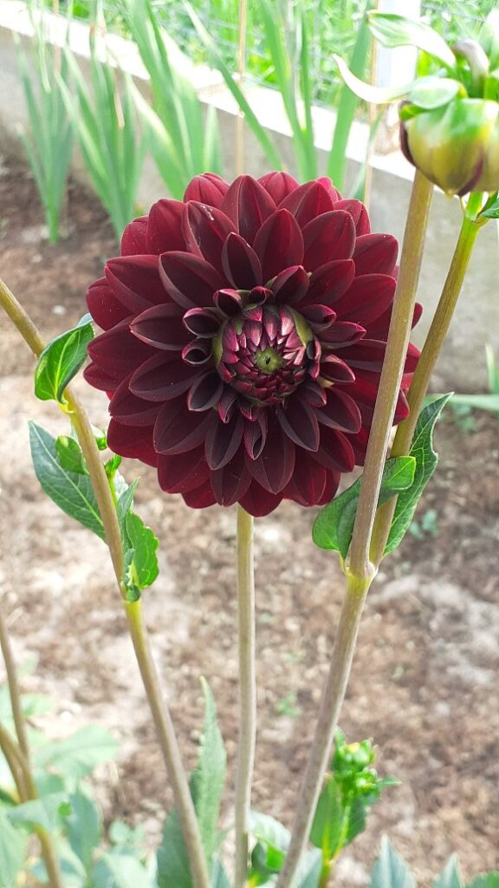
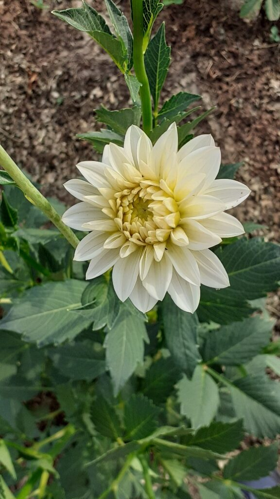
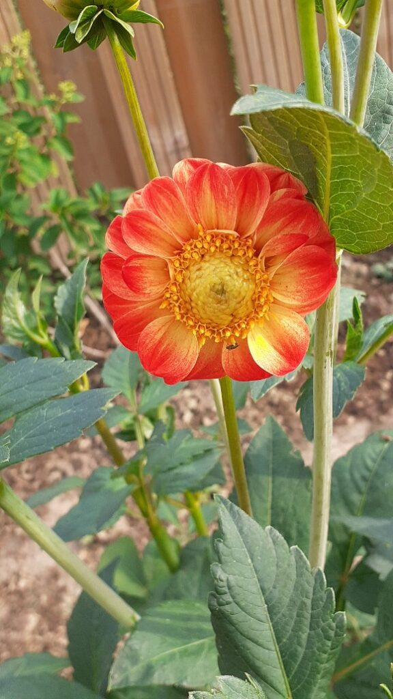
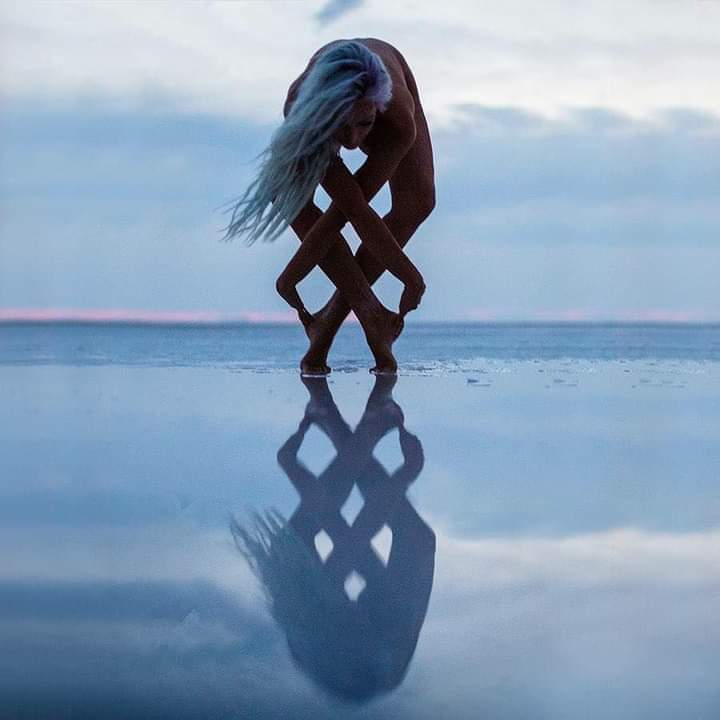

+++
date = 2022-07-02
title = "Ziua 172"
description = "Dacă verticala crucii începe să tremure, zgâlțâiala nu vine de la susul verticalei, ci de la baza ei, acolo unde divinitatea și-a pus straiele de om și ființează pe acest pământ. Cea mai provocatoare este însă orizontala, care are la ambele capete ființe umane. Aici apar uraganele, aici e zbaterea cea mai mare și tot aici se adună suferința de la care omul, nemaifiind susținut de o pace și-o nemișcare absolută, se adapă cu gura plină și mai împroașcă și pe de lături, să se prelingă și-n ăla de lângă el."
authors = ["Biannca Locatelli"]
[taxonomies]
tags = []
[extra]
math = false
diagram = false
image = "images/ziua-172.jpg"
+++
---

Mi-am crescut în mine, pic cu pic, în timpul somnului, noua zi așa că atunci când s-a simțit ea coaptă, trezirea mi-a venit natural. Fără scobitori să-mi țină pleoapele sus, corpul e moale și relaxat, dar odihnit, iar mintea pare că a dereticat deja prin casa ei, a făcut curat și e up&runnin'. Cred că eu că mintea asta am mea de fapt nu se oprește nici în timpul în care-mi parchez corpul pentru realimentare, prea e acolo la orice clipă imediat următoare trezirii.

Cu impresia-n carne că am tot timpul din lume în față, încep să mă conțin, să mă parcurg bucățică cu bucățică, să adun impresii de pe traseu și să-mi țes covorul pe care mi-l aștern în noua zi și noua viață. La prima simțire, nu-i nicio jenă și nicio strângere pe nicăieri, chiar sunt integral într-o lipsă de tensiune. Dacă la apelul carnal, toate se prezintă corespunzătoare, în minte-mi curge un pârâuaș de veselie, de joacă. Nu deslușesc de unde a izvorât, doar simt curgeri cu sclipici și stropi mișto, parcă mi se pune de-o zi plină de râsete. Lărgesc cât pot eu de mult această senzație, s-o fac mare, mare și s-o împing în Univers să se concretizeze. M-am prins, destul de târziu e drept, că nimic din ce țin cu dinții lângă sau la mine, nu rămâne cu mine. Culmea culmilor, la tot ce dau drumul fără încrâncenare, la tot ce mângâi aripile și le dau vânt să zboare, vine înapoi. Și nu vine așa, sec, nu, vine cu adăugiri, e ca un fel de bancă. Am decis s-o numesc banca de libertate unde, deși dai drumul, vine înzecit înapoi. Mâna Universului e mult mai potentă decât mâna muritorului.

***

Cu limpezimea pârâuașului în minte, nașterea intenției pentru azi se întâmplă ușor, nu mai am travaliu inutil și nu mă mai adorm între cuvinte. Țâșnește direct, plină de sevă, se adună cuvintele ca prietenii buni, fiecare aduce ceva de calitate și iese o intenție de pomină. Hai cu mușchii emoționali, s-o lansez și pe proaspăt născuta intenție în eter, să licurească ea ce-am pus în ea, acolo, în imensitatea aia unde sunt de toate.

Chiar vorbeam ieri cu domnul meu și mi-a dat o explicație, pertinentă, pentru mult prea uzitata expresie "totul e în echilibru". Orice rău se întâmplă într-un colț de lume, un bine se întâmplă în alt colț de lume, așa că totul se echilibrează constant. Dacă intenția mea duce, prin prezență și conștiență, un fulg de bine, acolo unde sunt doar energii, va contrabalansa fulgul unei intenții, neprezentă și inconștientă, care s-a dus tot acolo, unde se întâlnește totul, în akasha. Deși nu ne place, orice gând, frântură sau fractură de gând emis se înregistrează în akasha de unde, dacă e dospit și susținut constant, dă în pârgă și apoi scuipă înapoi un fruct, în lumea materială.

***

Ușurică-n cuget și simțiri, mă scurg diafan(ă) spre parter, secondată la pas, parcă la fel de veselă, de tomberoneza noastră dragă. E și asta mică un pui de duduită, ca stăpână-sa, că atunci când coboară scările, n-are deloc delicatețe-n ea ci coboară ca tancul sovietic, de mereu îmi vine s-o șâșâi, să facă mai puțin zgomot, că-i trezește pe toți din casă. Ei nu-i pasă, evident, de prostiile astea, și bine face, ca să mă-nvețe și pe mine ce e cu adevărat important și ce nu. Cred că animalele sunt cei mai buni învățători la capitolul ăsta, în clipa lor nu e decât clipa lor și atât, nu ca noi, care mai punem și-o floricică, mai un brizbriz, mai un rahat ca să tempereze strălucirea, mai o amintire, mai o imaginație. Spiky a mea acum e la ușă și doar asta contează pentru ea.

***

Cerul de azi, contrar seninului din mine, are o culoare nedefinită: e un amestec blurat între albastru pal și roz pal, cu tușe gri pe alocuri, privit în ansamblu parcă-i lipsește strălucirea caracteristică. Nu stă a ploaie, de abia se naște ziua, doar că pare că nu s-a trezit și nu și-a pus capa regală pe umeri. O duioșie caldă mă cuprinde și-mi rup instinctiv din veselia mea interioară și-i întind candid și cerului meu drag o bucată generoasă. A venit momentul răsplatei pentru toate diminețile în care și el mi-a dăruit onest o calmitate albastră, să mă căptușească bine și să mă protejeze. Chiar și așa tern, eu tot în el mi-am agățat ochii, în timp ce mă lămâiește apa caldă, loialitatea mea nu se măsoară-n zile de strălucire doar, ci în toate zilele în care mi-amintesc să îl privesc. Cum mi-e cerul azi? chiar mi-a devenit gest matinal iar între mine, pe pământ și azuriul în înalt, nu reușește nimic și nimeni să se strecoare.

***

Fac doar un smoothie, cel al meu, pentru că e încă tare devreme iar mama sigur nu se trezește acum. Cu încrederea asta, mi-am fiert și ceaiul de salcâm, mi-am parfumat nările cu mirosul lui suav și-am ieșit în curte, la udat. Canicula asta e neiertătoare cu toate ființele și vreau să le dau plantelor mele apă blândă la temperatură, nu șoc hidric. Îmi laud cu gura până la urechi roșiile, ziceam eu că nu-mi trebe araci de doi metri, ba s-ar putea să da, așa cresc ele de la o zi la alta.

Gladiolele de lângă gard sunt pline de surprize: după The Gladiola a ieșit Purple Velvet, așa am decis s-o numesc, are niște flori exact de catifea iar culoarea e una pe care eu nu am văzut-o la gladiole. Și asta nu e din capitolul ăla "eu am flori cum n-are nimeni", ci e pe bune, nu am mai văzut așa pe nicăieri, eu oricum n-am niciun merit decât că am luat un pachet de bulbi de la Hornbach și atât.

  

Purple Velvet

Încep să apară și daliile, una mai diferită decât alta dar aici mi-a dat cu virgulă: am două soiuri de dalii, din ce se vede cu ochiul liber, unele care nu cresc în înălțime dar au floarea mai mare și celelalte care sunt sky rocket de înalte, peste 1 m, dar au niște flori micuțe. Eu nu mă așteptam nici la unele, nici la altele, ci la unele mari, așa cum am văzut în toamna trecută la Râșnov, în curtea unui gospodar.

  <figure>
    
   <figcaption>Burgundy</figcaption>
  </figure>
   &nbsp; &nbsp; &nbsp;
  <figure>
    
   <figcaption>Ivoire</figcaption>
  </figure>
   &nbsp; &nbsp; &nbsp;
  <figure>
   
   <figcaption>Roundy</figcaption>
  </figure>

  

Pentru că nu am studiat subiectul dalia, am crezut că toate-s la fel ca dimensiune, ce le deosebește fiind culoarea. N-a fost așa dar nu-i bai, la anul mai bag o fisă, acum știu ce să caut. Asta nu înseamnă că nu le-am drăgălit și pe ele, că nu le-am adăpat bine-bine, să treacă mai ușor peste încă o zi de fierbințeală.

***

La 7 eram cu toate treburile din curte gata, inclusiv dat cu vermorelul papa bun și bio și la roșii și la pomii fructiferi. M-am mișcat cu super talent și viteză și-mi rămâne o grămadă de timp pentru mine, mai ales că azi e și sâmbătă. Știu că pe Univers îl doare la bască de sâmbetele umanoizilor, de semnificațiile pe care și le-au lipit ei pe zile, pe nume, pe instituții și pe oameni dar eu încă mă agăț de senzația asta de weekend, de relaș, de stat cu oameni dragi.

Cu  bunătatea de fructe pasate-n cană, cu pliculeț pentru sor'mea blănoasă și cu pastile, m-a înființat la coana mare, cu verva-n mușchi deja. A dormit bine, e și ea bine, se vede asta, așa că lucrurile merg ca unse. Parcă n-avem destule cuvinte să-nchegăm o conversație, deși amândouă suntem deja alerte-n zi dar nu e cu supărare, important e că e veselă, mulțumită și cu mintea-n zonă. Avem timp de vorbit, o grămadă.

***

Cobor în zbor parcă, în timpul meu liber, să mi-l umplu de magie. Pun un strop de cunoaștere, un pic de estetică, un pic de trăire dar pentru că mintea mi-e trează bine, mi-aduce la ronțăit mai profund un lucru pe care mi-au căzut ochii scurt, fracțiune de secundă: crucea.

Mi-aduc aminte cum o femeie tare faină, învățătoare de yoga tradițională la acel moment al pandemiei, ne povestea despre prietenul ei indian ce era mereu oripilat de Iisus răstignit pe o cruce. De fapt, nu neapărat de un om în chinuri evidente ci de adorația oamenilor la vederea unui om în chinuri. Vălul care acoperă ochii ce nu mai văd realitatea cruntă era ce-l intriga. Nu intru în bucata asta de religie, nu pentru că mi-e frică de cutia Pandorei, ci pentru că fiecare e liber să vadă și să creadă ce vrea și poate el. Că doar știu cât m-am chinuit să cred și eu, de mic copil și până spre 30 și ceva de ani, cât mi-am tăiat păreri care creșteau rebele-n mine dar erau divergente de crucea asta religioasă, cât de crâncen mă simțeam strâmbă că nu intram pe "calea celor drepți" și evlavioși. Pesemne că în mine a fost o flacără mai puternică, care nu s-a stins cu nimic și care, într-un final, după arderi intense, m-a eliberat către adevărul meu.

Dar și-n adevărul meu, crucea a rămas super prezentă, ca simbol genial, pentru că ea conține cele două aspecte ale ființei umane: verticala, legătura omului cu divinitatea atotcuprinzătoare și creatoare din care s-a rupt să fie el însuși divinitate creatoare, "the being" și orizontala, legătura omului cu ceilalți, ele însele divinități creatoare sau radianțe ale acesteia, "the doing".

Mi se pare mereu fantastic că-n toată simbioza asta faină, punctele care generează turbulențe sunt ființele umane. Dacă verticala începe să tremure, zgâlțâiala nu vine de la susul verticalei, ci de la baza ei, acolo unde divinitatea și-a pus straiele de om și ființează pe acest pământ. Zbaterea noastră în această relație jos-sus nu se lasă cu cutremure decât pentru josul verticalei, susul e permanent imperturbabil și neclintit, e capătul frânghiei ținut de o mână fermă, care știe că, indiferent ce este sau vine, mâna ține zdravăn funia salvatoare. D-aia ni s-a-nscris în carne privitul în sus, poate d-aia am o eu așa relația faină cu cerul, poate nevoia asta intrinsecă a omului de a știi că e cineva sau ceva, care la nevoie, "always has my back", s-a încarnat adânc că știm, involuntar și inconștient, că susul e salvator.

Cea mai provocatoare este însă orizontala, care are la ambele capete ființe umane. Aici apar uraganele, aici e zbaterea cea mai mare și tot aici se adună suferința de la care omul, nemaifiind susținut de o pace și-o nemișcare absolută, se adapă cu gura plină și mai împroașcă și pe de lături, să se prelingă și-n ăla de lângă el. Orizontala asta se-nfige-n capete în doi oameni care, dacă nu sunt capabili să țină măcar unul spațiul în care celălalt să fie, așa cum e el, se lasă cu fault la inimă și cu ochii ridicați a rugă, câteodată, sau reproș, de multe ori, spre mâna aia fermă a susului de verticală.

Când am înțeles eu mecanica asta simplă, după zbucium atât de intens că simplitatea ei s-a lăsat cu spargere-n mine, mi-am propus să încerc să fiu un capăt de orizontală ușurel, cât mai liniștit, cât mai amortizor de șocuri. Nu-mi iese mereu că lecția asta se reia în fiecare dimineață, dar am sârg în mine și propunerea a prins deja rădăcini acolo. Iar atunci când pot, mai deschid gura să-mi iasă propunerea asta și pentru alții, să încerce și ei să fie capete de orizontală bune, poate ușor-ușor, unda asta se propagă și echilibrăm, atât de înțesată de probleme, orizontală.

***

Micul dejun al coanei mari s-a lăsat cu mofturi, a alunecat din nou pe panta aia în care nimic n-are gust. I-am pus toate variantele pe masă, și nu-s puține, de mic dejun pe care le am. Vrea ceva, mănâncă, nu vrea, nu mănâncă, e fix alegerea ei. Pesemne că statul ăsta al meu drept și fermitatea din voce i-a tras semnalul de alarmă din creier că s-a decis la laptele bătut și la un sendviș, timp în care eu îmi ascultam interiorul. All good, nu m-am aricit pe nicăieri, semn că hotărârea mea de a fi capăt bun și azi funcționează. Cu mama e greu să păstrezi balansul, intră în context grija mea idioată că nu mănâncă suficient și că ea nu mai e capabilă deplin să ia decizii corecte pentru corpul ei. Dar eu sunt?!

***

Am trecut în micul dejun al domnului meu, unde mă scutur de orice umbră aș avea și mă conectez la alt capăt, de altă orizontală. Cheia autenticității e să nu uit că sunt o singură esență care se conectează la capete de orizontale, să nu-mi mulez păreri și comportamente determinate de celălalt capăt. Altfel, țopăi aiuritor între orizontale, pe de o parte, și versiuni alterate de mine, pe de altă parte și I've been there, done that.

Oricât de mult m-aș lălăi cu domnul meu azi, în miros de cafea și-n lumină blândă, la o discuție de suflete, trebe să fac puțină curățenie, mai ales la mama și să și gătesc.

***

Nu mă trage ața deloc, recunosc și-n mine și cu voce tare, dar n-am alternativă și mă trag cu forța dintr-o zonă unde-mi plăcea să stau. Am observat recent că atunci când exteriorul mi-e forțat spre o schimbare pe care n-o doresc, mă întorc spre mine și-mi colorez interiorul în ce-mi place , astfel pot trece mai ușor momentul ăla-n care-mi vine să scrâșnesc din dinți sau, mai brut, să scap vreo nezisă prin buze.

Pentru că am de stat la ea, profit de timp și deschid ferestrele larg, să iasă toată sauna asta care-o coace încet pe mama, în camera ei.

Nu știu de unde are ea impresia că de afară vine frig că nu mai e nicio părere de d-ăsta prin atmosferă, dar ea ține geamurile închise să nu cumva să înghețe. Sassy priponită lângă ea, în pat, că mereu o sperie aspiratorul, mă privește cu ochii ei superbi albaștri a dojană. Ignor ce-mi trimite dar nu pot să nu observ cât îi de faină pisica asta: are niște ochi de-a dreptul translucizi și, mi se pare mie, tare expresivi. Nu mi-am făcut timp să mă aplec prea mult asupra mândrei blănoase până acum dar de când e la noi, o drăgălesc constant și s-a deschis și ea către mine. Azi mă ceartă că-i tulbur leneveala dar mă mișc cu talentul pe care mi l-am înțepat în vene de la prima oră a prea-dimineții, și deretic rapid. Baia e mai consumatoare de timp dar o dovedesc și pe ea din scurt. Pentru că mama doarme cu găinile cele mai găini, alea de se culcă aproape de cum s-au trezit, dușul de seara l-am mutat mai pe la miezul zilei așa că în sclipirea de curat a camerei, adaug și încântarea mamei de primeneală, plus cremuirea corespunzătoare pentru "copite". Am lăsat și curat și bine la mândrele mele, una blănoasă, una mama-copil și mă duc să fac val-vârtej ordine și la noi și la parter și să pornesc oalele.

***

Televizorul mamei, pornit non-stop, mi-a adus în minte o altă formă perfidă de orgoliu.

Era o emisiune despre nu știu ce sportiv și erau părerologi care spuneau despre relația lor cu celebrul om.

Am întâlnit și eu des asta și mi se pare una dintre cele mai urâte fețe ale egoului uman: să tragi spre tine, să te îmbrace și pe tine un colț din haina unui om care a muncit și, pentru că așa e experiența lui, a devenit și faimos ca urmare a muncii lui. Nu-i judecată aici, e strict observație că și eu mă mândream, în corporația care m-a crescut, că-l știu pe x sau pe y, oameni cu greutate în acea corporație. Deci am stat pe scaunul ăla.

Mă bucur însă că am putut să-mi spăl tonele de zoaie de pe ochi și să mă pătrundă lumina clarității până-n miez, acolo unde a așezat înțelegerea plină că sunt unică. Indiferent cum sunt, sunt unică, nici mai nu-știu-cum față de unii, nici mai fistichie față de alții, doar unică. Mi se pare o grosolănie maximă la adresa vieții și a timpului ăsta limitat aici, să te acoperi și tu cu meritele altui om doar pentru că ați copilărit împreună sau stați pe aceeași stradă. Perdeaua asta găurită pe care o aduci și peste tine e doar un pansament pe care-l pui peste puroiul ce se adună necercetat în ograda proprie. Doamne, cât de mult mi-ar plăcea ca la școală, sau chiar de la grădiniță, să se introducă o disciplină prin care să fim învățați primordial că suntem unici, că exprimăm o nuanță pe care nu o mai exprimă nimeni, nicăieri și nici nu o va mai exprima vreodată altcineva și doar asta ne face atât de măreți încât să nu mai vrem niciun alt merit al nimănui. Să se scoată din școală competitivitatea și să se introducă cunoașterea de sine, evident la nivel elementar. Există aur curat în fiecare dar, cum ființa umană s-a șmecherit în timp, mai bine iau aurul gata scos la lumină de altul și-mi torn și eu puțin pe creștet, că-i mai rapid și mai dătător de stimă. Pe termen scurt, așa e, pe termen lung, singurul pierzător e falsul poleit.

***

Gata și cu curățenia, și cu mâncarea și parc-aș mai avea un strop de timp până la prânzul mamei și al nostru. E doar o părere, că domnul meu se oferă să mi-l umple cu o rețetă de lipii, pe care vrea s-o experimenteze, dar are nevoie de "puțin ajutor". Experiența mea de trai cu el știe ce înseamnă "puțin" așa că-mi iau adio de la timpul liber și mă avânt și eu, cu inima deschisă, în experimentul lui, făcut cu mâinile mele. Dintre toate rețetele de lipii posibile pe internetul ăsta mare, cred c-a ales-o p-aia cea mai mermelitoare, că atâta bibileală la cele 16 bucățele de aluat nu am făcut eu nici la cozonaci. Dar el e încrezător, mă dau și eu după el și până să le termine, ne trecuse orice chef și orice poftă.

Îl las pe el să și le prăjească și urc s-o aduc pe mama la prânz.

Coana mare e ciufută, zice c-o doare capul, nu-i neg durerea, dar nici nu-i amplific starea de aoleală așa că, ajunse jos, pare c-a mai scăpat din țepii ce-o ariceau. La bucătărie însă am simțit că nu era clar în largul ei, pentru că era domnul meu acolo și ea nu-mi avea atenția totală. A mâncat tăcută, nu a participat la discuțiile ce aveau loc, cu glume pe seama poveștii fără de sfârșit al lipiilor. Pesemne că domnul meu a a vut o breșă in sistemul de apărare a stării emoționale, pe unde a pătruns parte din ariceala mamei că s-a luat și la el: în genere, starea lui se alterează relativ ușor dacă îi e prea cald, sau prea frig sau prea somn sau prea foame. Acum era fiert de la atâta lipileală și i se luase. Ca noi toți, când ești arici, răstorni pe cel de lângă tine așa că s-a vărsat pe mine iar mie nu mi-a plăcut. Cu mama în bucătărie, n-am avut loc de întors așa că am ieșit scurt în curte, am scuturat starea aia mlăștinoasă ce-mi fusese servită și m-am întors cât de cât ok.

O altă chestie pe care încep să o văd din ce în ce mai des la mine este modul cum iau decizii. Dacă înainte egoul mă umplea și "unde scuipam, nu mai lingeam", viața asta nouă de-o trăiesc mi-a dat peste partea aia de minte unde orice decizie luată era o închidere. Când spațiul unei trăiri este umplut până la ultimul milimetru de o decizie, nu mai poate intra nicio altă perspectivă nouă, iar strâmtoarea deciziei ce nu cunoaște elasticitate, ce nu lasă loc de înmuiere și schimbare, începe să se cangreneze pe la marginile stătute, prin suprimarea de idei-sânge proaspăt, și pute. O decizie d-asta finală, la fel ca și o concluzie, e tâmpit definitivă, nu e o curgere, așa cum este totul în acest Univers. Orice contravine legilor simple din Universul ăsta superb în care ne trăim bucățica de timp, e ca o fulg împotriva unui colos, mai devreme sau mai târziu, vei fi strivit sub greutatea propriilor decizii definitive.

Așa că nu mai decid în mine că nu merit eu să fiu ținta domnului meu, care s-a săturat de făcut lipiile pe care și le dorea. Las deschisă ușa să intre înțelegerea că e alegerea lui de a fi cum poate în acel moment și alegerea mea să nu mă umplu de alegerea lui oleacă deraiată de căldură. Atât de granulat poate fi exercițiul zilnic al practicării deciziilor-elastic.

***

Am mâncat și noi, mi-a plăcut dar nu mă atașez prea tare de lipiile-minune, că nu cred că va exista o a doua oară.

Ultima brumă de energie ce-o mai aveam, a fugit brusc să digere ce i-am dat iar bateriile mele pâlpâie a epuizare. Am obosit și nu mă mai țin baierile pentru altceva acum.

Nu-mi iese de somn dar îmi iese genial de-un dolce far niente. Oo, ce bine e unul d-ăsta într-o după amiază fierbinte! L-am sorbit până la ultima picătură, mi-am întins cu plăcere calmul lui prin toate oscioarele și mușchi, m-am relaxat ca pisica asta de mi se-ntinde paralelă dar totuși cu o lăbuță pe mine. Am mai scrollat pe social media, am mai pescuit frumuseți vechi p-acolo și-am aflat și de moartea tatălui uneia din femeile mele de suflet nou, din "tribul" de femei ce s-a-nchegat după cursul dătător de sens.

Chiar dacă ea a postat pe facebook, ca lumea să afle, mie mi se pare delicat sufletește să-i scriu separat, un mesaj, să pun în el energia clipei în care m-am conectat la vestea citită și la sufletul ei. Femeia asta e veselia întruchipată deși viața ei numa' așa nu a fost. E fascinant cum unii au așa o putere în ei, de întorc armele cu care-i "lovește" viața peste dinți fix în favoarea lor, și merg sprintenel înainte ca și cum nimic nu-i poate dărâma. Așa-i și femeiușca asta care, după mesajul meu, m-a sunat. Discuția cu ea mi-a confirmat că sclipiciul pe care-l are-n vene e tot acolo, chiar dacă tatăl ei nu mai e. Lejeritatea ei e inspirațională. Dar ce m-a impresionat, că și acum când scriu, îmi dă cu piele de găină, a fost finalul: Te iubesc Biannca! Wow, dar ce bucată mare de suflet mi-a dat ea, din mărinimia ei! Deși eu voiam să-i dau un strop de drag, să știe că nu e singură, uite că mi-a dat ea cu vârf și îndesat. M-a umplut și declarația în sine dar energia aia din spate a fost extraordinară, mi s-a împrăștiat instant în toate colțurile și mi-a adus cu ea și mie sclipici în sânge! Mulțam, mulțam, mulțam! Ca întotdeauna, când te simți văzut și apreciat, umpli conștient dar nu egotic, un rezervor din care să dai mai departe vedere și apreciere.

***

Am închis o zi făinuță, zic eu, cu mulțumire plină pentru:
1. Purple Velvet!
2. Deciziile mele elastice!
3. Femeiușca cu sclipici în vene!

Clipa mea de și mai fain este:

  

 

 

  

    <a href="/blog/ziua-171/">Postarea anterioară</a>
  

  

    <a href="/blog/ziua-173/">Postarea următoare</a>
  

