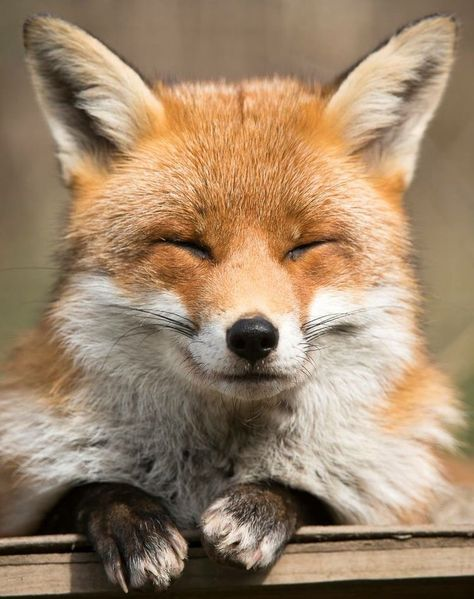

În prea dimineața asta aș fi supt toată odihna disponibilă în lume și mi-aș fi făcut-o fular, să-mi odihnesc și capul, și ideile, și gândurile și, mai ales, trupul. Mă simt obosită dar nu e o senzație d-aia trecătoare, parcă am o oboseală adâncă pe care am tot amânat-o și tot împins-o că acum s-a gogoșit îndeajuns încât să-mi vină cu forță-n față. Durerea de cap cu care mă trezesc în ultimele zile e mereu prezentă acolo, câteodată mai difuză, alteori, ca azi, mai vocală și știu că dacă mi-aș permite două zile de somn și odihnă și hrană vie, m-aș reface. Numai că nu mi le permit acum, așa că încerc să strecor printre munci pauze mai dese și mâncare mai bună.

Ca niciodată sau poate tocmai că acum e momentul ideal, azi am avut o clipă clară de disociere între haina asta grea de carne și de minte, și spiritul din mine, ușurel și bucuros de viață. Sub toată mantia asta de oboseală, de plumb și de apăsare, am simțit o flacără ghidușă, un sâmbure mic de scânteie a minunii că sunt încă aici și acum. Și-n picușorul ăsta mi-am turnat și eu mulțumirile, cu o ungere incredibilă comparativ cu ruginirea corpului în astă prea dimineață. Mi-am adăugat în camera inimii unde stau cuminți recunoștințele și cele simțite ieri și mă simt din ce în ce mai grasă în mulțumire. Cu fiecare zi în care văd și apreciez că sunt, camera asta se umple și se decorează, se rafinează și dă pe dinafară câteodată, cum e azi, iar în spuma asta revărsată mă îmbăiez și-mi iau efervescență pentru o nouă zi și-un nou început de viață. Toate durerile și grijile și apăsările trec dar minunea de simțire din clipa asta e de-a dreptul sacrilegiu s-o las să treaca just like that, pentru că aș mai dormi sau m-ai lenevi. M-am culcușit emoțional într-un bine, răsărit din mine, și sunt gata să pornesc în zi.

***

Prima pe care o întâlnesc ochii mei la deschidere este Spiky, întinsă de-a lungul, paralelă cu mine, și-mi duc mâna să mângâi o pufoșică. Se bucură, se întinde și ea, și pornește motorașul de tors care, culmea, dintr-un pieptișor atât de mic, vibrează în patul nostru imens. Iau și torsul ăsta ca pe un dezmierdat și sunt gata să mă deschid zilei.

Asta mică, prea dimineața, este tare econoamă în mișcări și nu se dă jos din pat până nu e sigură că mă duc la scări. Și-o fi luat ceva țepe când mă opream la baie și acum nu se mai riscă. Iar când mă simte că-s la scări, se aruncă-n parchet ca obuzul că, invariabil, îmi trezește frumosul adormit, pentru câteva clipe.

Pe traseu se repliază rapid și ajungem la bucătărie, ea, în plină vervă, eu, domoală dar vie.

Prima oprire, a amândurora, este geamul ce dă spre terasă și curte și rămânem cu privirea scrutătoare acolo, câtva timp. Două fete cucuiete privesc aceeași curte și cu siguranță văd lucruri total diferite. Am zâmbit la imaginea noastră împreună, ca și cum m-aș fi privit din afară, am zâmbit la curte, am zâmbit zilei și mi-am zâmbit mie, că tare bine face un zâmbet ce pornește din interior și se varsă pe tot exteriorul.

Mi-am adus viață și-un strop de aromă cu un fir de busuioc mov, cu gust de lămâie, doar îl strivesc puțin între degete, să elibereze seva aia pișcătoare și-l arunc în halba mea de toate diminețile.

***

Cu colțul ochiului văd mișcare pe camera de la mama și mă bucur că s-a trezit și ea. Bucuria asta e ingenuă și are două straturi: primul, că s-a trezit și al doilea că s-a trezit acum și pot să duc sus la ele, ce am de dus, să fac ce am de făcut și să fug în curte, la roșii, că e zi de udat.

Cred că am depășit etapa de oroare vizuală, însă nu reușesc să-mi sigilez nările și să nu respir la ele în cameră, până fereastra deschisă nu-și face treaba și aerul bun, curat, îl scoate afară pe cel viciat. Aerul ăsta greu îmi dă în ficat aproape la propriu și câteodată, e cel mai greu de dus. Ca să nu mai stau în percepția acută, nazală, îmi fentez mintea și încep o conversație cu mama, despre cum a dormit, despre orice, nu contează care e subiectul, ci doar să-mi duc atenția departe de simțurile revoltate. E bine, nu prea a dormit din cauza cățelelor care au tot lătrat, dar altfel e bine. Sassy se gudură pe lângă picioarele mele, mă opresc s-o drăgălesc, să mă pierd în ochii ei superbi și să mă bucur, ca un copil, că am câștigat, în sfârșit, iubirea și încrederea acestei feline regale. Cu ochii ei de-un albastru adânc în retină și cu un aer mai proaspăt în cameră, curățenia merge mai ușor și se termină mai repede.

Pe mama am pierdut-o în favoarea tabletei, s-a cuplat la ea și, nu sunt sigură dar așa pare, nici nu cred că mă mai simte în cameră. Bun și așa, nu mai am așteptări de la ea. La 7 luni după șoc, cred că ideea că mama are demență începe să se așeze într-o bază din mintea mea, care radiază înțelegerea asta către orice porniri aș avea să aștept chestii pe care ea nu mai e capabilă să le facă. Sper ca această idee să crească cât mai sănătos acolo și să ocupe tot spațiul, să nu mai lasă să răsară întrebările de gen "de ce?!" sau mirările de tip "cum e posibil?!"

***

Am sărit direct în saboții cauciucați de curte, direct printre roșii. Giiiz, e o junglă aici, au crescut dragile mele în toate părțile, au rod pe fiecare etaj unele dintre ele, e o feerie ce-mi încântă partea aia de mămică de roșii. Sper să nu le deochi, să țină roșiile până la capăt, să se coacă și să aibă gustul ăla de roșie, pe care nu l-am mai simțit decât rar, de la salata făcută de măița și mâncată în curte, sub nuc. Am mai copilit pe unde am văzut că e nevoie, mi-am udat și gladiolele, daliile, vița de vie, trandafirii care sunt la a doua înflorire pe anul ăsta, hortensiile care sunt niște bulgări pufoși și albi, crinii care stau să se deschidă, menta ce se face tufă, spre deliciul și încântarea mea, smochinul care a crescut incredibil de mult și are o mică smochină deși în primăvară voiam să arunc bățul ăla de 20 de cm care părea mort, mi-am udat din plin arțarii și pinul și euonymusul.

Pentru că nu mă dau dusă din curticică, mi-am luat smoothieul și mi-l savurez printre plăntuțele mele dragi, în miros de pământ reavăn. Savurez e puțin spus, pesemne că înțelegerea de ieri, prilejuită de doamna cu ochi vii, începe să-și lucreze magia în mine, m-am înfruptat cu toată gura din smoothie, l-am prețuit pentru fiecare sorbitură care-mi aduce numa' bunătăți în sistem. Cred că e prima oară când mă bucur atât de intens de dragul meu prieten care îmi e alături de peste un an, cred.

***

Micul dejun al domnului meu a fost chiar mic și tăcut, eu sunt deja plină de bine iar el încă nu-i trezit de-a binelea. Nu-i bai, pot să stau bine și-n tăcerea noastră, chiar dacă cică la început a fost cuvântul. Legându-mă strict de sensul simplu, nu de înțelegerea profundă care stă de fapt în spatele acestei sintagme, logica mea spune că la începutul începutul a fost tăcerea, peste care s-a lăsat apoi cuvântul. Așa-mi justific eu câteodată multele tăceri care mă cuprind și care-mi plac.

***

Lasă că azi mama are cuvintele la ea, chiar dacă sub forma acelorași povești din copilărie pe care le știu dar pe care nu le-am mai auzit de mult de la ea. E în formă, efectiv văd cum i se bulucesc cuvintele în minte și nu prididește să le arunce-n bucătărie, o las să le descarce și pe ele dar mai ales emoția care o cuprinde când le aduce în realitatea noastră, din această dimineață. Din nou, umbrele care-i trec prin amintiri dar și pe chip sunt fratele ei, despre care crede că a murit, și sora mea, unde se întreabă, retoric deja, cum se face că deși a crescut-o, uite că n-o caută. O las să scoată afară ideile legate de cei doi protagoniști, nu vreau să i le înăbuș dar îi explic că

1\. nimeni nu e vinovat de nimic, nu poți să te superi pe un om că nu are, în construcția lui, ceva ce ție ți se pare natural să fie și

2\. nimeni nu e dator cu nimic nimănui.

Le acceptă dar umbrele-i rămân acolo, pe chip.

***

Deși oboseala mă înghiontește și așa m-aș așeza la o relaxare mică, trebe să gătesc prânzul și să folosesc ce am prin frigider, să nu facem risipă. Am validat cu mama opțiunile și mă apuc de tocat legume și ronțăit idei. La mine cred că s-a format un automatism, cum sunt într-un timp de mine cu mine, cum parcă-mi vin și analizele pe tabla minții, să fiu o țâră mai atentă la ele decât aș fi în vâltoarea vieții.

Faptul că m-am rotunjit în înțelegerea demenței mamei, ca boală per se în primul rând și ca boală a ei, în al doilea rând, îmi spune că subconștientul meu, care a știut tot timpul adevărul și l-a priceput pe de-a-ntregul, mi-a tăiat din colțuri treptat până când m-am trezit, conștient, că parcă nu mai am așteptările de la ea mari cât Universul. Fără să văd, tot eu am făcut și rotunjirea, în subsidiarul ăla la care nu ajung decât dacă sunt dispusă să mă scufund în mine, tot cu un act de voință, la o scară mai mică, dar constant. Mi se pare fascinant cum funcționez pe două layere: unul brut, pe care-l văd și-l înțeleg direct, fără subtilități și-n care dacă vreau să fac ceva, fac printr-un act de voință conștient, mai mare sau mai mică, după putirință și context și al doilea, care de fapt mă face el pe mine, tot în direcția în care aș face și eu dacă mi-aș încorda voința și putirința pe situația pe care vreau s-o rezolv, gradual dar consistent. Într-un final, ajung la același rezultat prin ambele, dar n-ar fi mai mișto să scurtez drumul și să câștig timp? Ce mă oprește să-mi activez voința și putirința tot timpul? De ce mă complac și mă lălăi și mă aolesc când aș putea să-mi adun țăndările de pe jos, să mă lipesc și întocmai ca un veritabil porțelan reparat prin Kintsugi, să mă duc rachetă mai departe, la următoarea lipitură, să mă bucur de fiecare reparație și s-ajung, la linia de finiș, aur pur de lipituri? Răspunsul, simplu și totuși atât de împiedicător, este egoul. Păi el din ce s-ar mai hrăni? Cum s-ar mai înveli el în povești care mai de care mai dramatice, cum ar capta el atenții și compasiuni, cum și-ar justifica el acțiuni ne-bune? Cum deja știu și simt că nu voi anihila, în această experiență cel puțin, a doua piele a mea, egoul, și nu cred că poate cineva să facă asta, îmi lansez în forul interior provocarea să găsesc căi prin care să împac și capra și varza.

***

Nu mai știu ce să-i dau mamei la mic dejun, devine din ce în ce mai mofturoasă, iar azi am reușit să aflu că-și dorește iaurt simplu și crenvurști, că doar ce mă anunțase că nu mai vrea carne. Plus cașcaval afumat, că ăla simplu "n-are niciun gust".

Cu lista de cumpărături în telefon și cu dorința mea de a "răzbuna" moartea Ciupilicăi prin viața altor doi peruși într-o familie iubitoare, nu într-o vitrină la vânzare, plec la cumpărături, pe 100 de grade câte sunt afară.

M-am întors fiartă și răscoaptă, cu durerea de cap activată dramatică, pulsatilă, în miezul capului, cu un disconfort general fizic dar cu o stare de împăcare emoțională. Am făcut ce-am simțit și ce cred că trebuia făcut pentru Ciupilica mea, puf alb, și abia acum am închis o rană, mică, care mi se zbătea-n minte, nelămurită. A venit timpul să o las să plece din mine și să-mi fac spațiu liber pentru altceva. Cu puțină atenție și prezență, poate să fie altceva bun.

***

Mai am un stropșor de timp până la prânz, așa că stau cuminte, cu prosop cu apă rece pe frunte, să-mi liniștesc nebuna asta de mă răscolește prin creier și să-mi ostoiesc și oboseala care mă cuprinde, bucățică cu bucățică. Ce face omul când se odihnește o țâră? Scroll pe social media. Big mistake! În loc să mă odihnesc, să las o liniște și-un lin să-mi pătrundă-n minte și-n fibre, m-am surprins încordându-mă, pe măsură de scrollam. Peste tot numa' vești fie rele, fie d-alea de suspans, peste tot competitivitate și comparații, toți sunt fericiți și au nevoie să arate asta altora, lumea e în fierbere și dacă faci greșeala să mai citești și comentarii, să vezi mai multe perspective pe un subiect, te umpli de lăturile pe care și le aruncă unii din plin. Hai, că-i tare! Am crezut că mă potolesc un pic și acum m-am trezit că am două zbuciumuri de domolit: primul, de durere și agitația cumpărăturilor și al doilea, de răutatea asta care se întinde ca o plagă peste toți. Plus nebunia asta de comparații inutile și bolnave pentru suflet. Am închis telefonul și ochii și-am stat cu mine, în mine, în Universul care mie oricum mi se derulează și cu ochii închiși. Așa trebuia să fac de la bun început.

***

Nu pot mânca nimic dar pot fi companion la ambele prânzuri de azi: al domnului meu și al mamei. Primul îmi aduce un domn vesel și, din nou, am senzația acută că toți ne jucăm de-a maturitatea dar suntem nici copiii. Al doilea, mi-aduce o mamă, care nici ea nu s-a maturizat sau înțelepțit prea mult, că a dat din nou în mintea copiilor. Din nou, pare puțin nefuncțională, dacă nu-i pun eu pe masă tot, nu știe de unde să le culeagă dar nu mă mai miră, nici uimește și oricum, în principal, eu îi pregătesc masa cu tot ce e nevoie.

În fundal, de vreo juma' de oră, latră lupițele vecinului, obsesiv de continuu. Poate le-aș fi lăsat în voia lor dacă mama n-ar fi verbalizat același gând: că latră prea mult și de prea mult timp. O las la masă și ies să văd care ar putea fi cauza. Recunosc că duc grija bătrânului meu vecin, mai ales că știu că tinerii vecini sunt plecați iar el e singur. De multe ori, animalele agitate pot fi de fapt o alarmă pentru alții că stăpâni lor nu-s ok. Ies în curte, mă duc după lătrături, ambele cățele latră cu spor la gardul din spatele casei. Este un drum dosit, nefolosit, cu bălării cât mine. Mă întorc să mă încalț cu cizmele de grădină, să nu mă muște vreo lighioană pe care aș deranja-o fără vrere și vin să cercetez gardul cu pricina. Caut, dau cu mâna ușor să văd dacă mișcă ceva, nimic. Lupițele, în delir, mai că scoteau năsucurile prin gard. Ok, mai caut. Dau la o parte o grămadă de crengi uscate și găsesc comoara după care erau ele disperate: un arici. N-am văzut niciodată un arici sălbatic așa de mare! E cât un pepene galben ca mărime dar e deja făcut minge și înțeapă îngrozitor. Mă echipez și cu mănuși corespunzătoare și iau comoara, s-o duc în câmp, departe de nasul și lătrăturile alarmante ale lupițelor. În momentul în care l-am luat în palme, m-a topit. Tremurul din tot trupușorul ăla mic, învelit în țepi zdraveni, mi-a pus miere în voce, i-am vorbit calm, m-am liniștit eu în interior să simtă vibe bun, și, până am ajuns în câmp, la umbră, a scos căpșorul din interiorul unde se băgase. Două biluțe mici negre lucesc și mă privesc iar năsucul se mișcă frenetic să mă adulmece. Sunt prafă, din nou! Îndeajuns încât să nu mai fi atentă pe unde calc, să pun piciorul greșit și să mă zdruncin brusc, cu tot cu comoara din palme care, ca melcul, s-a ascuns rapid sub platoșa de țepi. Indiferent cât de scurtă ne-a fost întâlnirea, știu că știe că nu-i fac rău și știu că va fi bine. Îl depun cu grijă, tot într-o zonă îndesită și umbroasă și fug în casă să aflu de pe net cu ce se hrănesc aricii. Am ales să-i tai bucățele mici de măr, mai ales că acum știu ce botic mic are și să-i pun apă rece într-un recipient. Fuga înapoi și, ia ariciul de unde nu-i. Voinicelul o luase la trap, l-am găsit ceva mai încolo, unde s-a aricit din nou, dar am putut să-i las păpica prin-mprejur, să-i mai zic o vorbă de drag și să-l las să-și urmeze calea.

A doua parte bună din toată povestea asta a fost că mama, de curiozitate, m-a așteptat afară, pe terasă, la aer, unde-am mai stat o țâră să-i povestesc toată întâlnirea plină de iubire dintre o copiluță în costum de femeie și-un arici pogonici în platoșă aparentă de țepi.

***

Posibil ca acest eveniment să fi deblocat vreun seif de energie, că după, mi s-au legat toate acțiunile: mi-am strâns și aranjat la locul lor hainele uscate, mi-am băgat nasul în parfumul lor delicat și l-am inspirat cu poftă, am strâns și spălat în bucătărie după prânzurile celor doi și m-am bucurat de apa rece, cu care m-am stropit pe față și pe gât, mi-am făcut calculele pentru necesarul de materiale aferent straturilor înălțate pe care le vreau din toamnă, am mai bifat o lecție din cursul de permacultură și m-am îndulcit cu noua descoperire făcută, un iaurt cocos bio fără adaos de zahăr, o piersică și o caisă tăiată în bucăți mici, un pumnișor de migdale înmuiate ca să îndepărteze inhibitorii enzimatici, câteva stafide și pe deasupra un splash de sirop de arțar desăvârșește desertul ideal pentru vară, în afară de fructele coapte reci, bineînțeles. Îmi place la nebunie și mănânc pe terasă cu atâta poftă și cu bucurie, că nu-i face nicio plăcere durerii de cap care pleacă scârbită, în altă parte. Iuuupiiii!

***

Singurul obstacol în calea unei seri reușite este calvarul unghiilor mamei, pe care nu reușesc nicicum să-l integrez ca o parte normală din zi și cu cât îl resping mai mult, cu atât devine el mai respingător. Cică orice obstacol este de fapt o ușă spre creștere, e o deschidere către un nivel la care n-ai acces decât prin ușa asta nașpa. Cică cea mai eficientă cale de a anihila suferința, orice fel de suferință, este antrenarea continuă pentru acceptarea fiecărui moment care vine ca și cum l-ai ales tu dinainte, ca și cum deja îl aștepți și el vine, așa că nu se lasă cu nicio faultare când vine efectiv. Antrenarea asta înlătură orice aghiuți ar veni în minte și s-ar plânge că vai, nu așa trebe să fie, sau vai, de ce doar mie mi se întâmplă sau variațiuni pe aceleași teme. Știu teoria, are sens total în mine și cu toate astea, nu activez voința aia, nu mă văd la tejgheaua de vândut momente cum îl cumpăr p-ăsta de pilit copite și îl accept, că știu deja că e al meu, l-am cumpărat și decis deja. Nu mi se leagă imaginea iar mirosul din realitate mă înfige și mai abitir în respingere. Până una-alta, până subconștientul meu lucrează el tacit la acceptare, mă mulțumesc să conchid în mine că asta e, n-am ce face, so move on.

Deși-mi curățasem pepene pentru o delectare de final de zi, n-a mai intrat, după momentul de mai devreme. Asta e, data viitoare să nu-mi mai fac planuri d-astea curajoase, de savurat, după ce-mi îngrețoșez ficatul și nu o să mai am păreri de rău și pentru asta.

***

Închid seara destul de binișor, bag bila albă în borcanul zilei și-i mulțumesc pentru:

1. Mirosul ud de pământ!
2. Minunea țepoasă ce mi-a tremurat în palme și mi s-a deschis cu curaj!
3. Desertul zemos și suculent și crunchy și bestial al zilelor mele de vară!

Clipa mea de fain:

