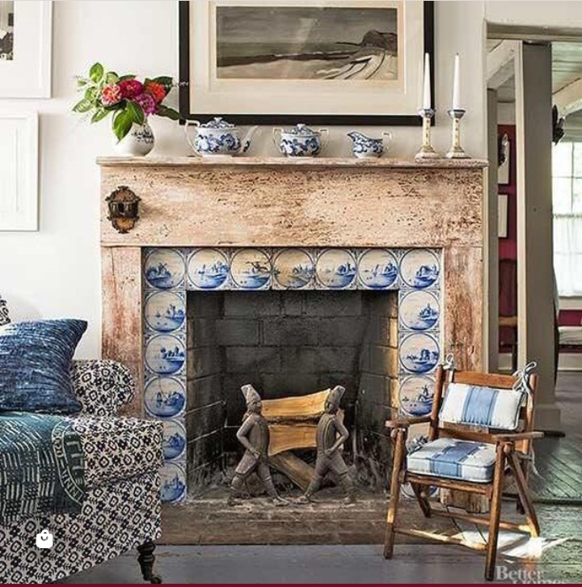

+++
date = 2022-07-16
title = "Ziua 186"
description = "Ea nu a crezut în sinea ei niciodată că este cochetă, că este deșteaptă. Tot timpul a fost o cârpeală și s-a simțit asta pentru că nu și-a însușit niciodată cochetăria sau inteligența, pentru ea. Era masca pe care o flutura oamenilor, ca să le câștige admirația dar, în adâncimea ei, s-a simțit o impostoare. Pentru că dacă n-ar fi fost așa, dacă ea ar fi trăit astea ca fiind realități irefutabile ale felului ei de a fi, acum cochetăria ei, inteligența ei n-ar fi fost bătute crunt de demență."
authors = ["Biannca Locatelli"]
[taxonomies]
tags = []
[extra]
math = false
diagram = false
image = "images/ziua-186.jpg"
+++
---

Bărbosule, s-ar putea să am câteva zile doar nopți? Din alea cu plecare portocalie și apoi cu uitare, profundă și odihnitoare, de sine? Ș-apoi, după o noapte d-asta, să vină altă noapte, fără nicio pauză luminoasă și plină de treabă a zilei? Unde fac o petiție? Se poate online? Că sigur mai cooptez și alți munciți și obosiți…

Corpul meu nu vrea, sub nicio formă, să se trezească. N-am nicio pornire de gest sau mișcare în el și nici mintea nu-i chiar limpede și gata de învârtit pe bandă rulantă gânduri-țânțar. Am o moleșeală generalizată, e limbajul corpului care-mi strigă deja că mai trebe să trag frâna, să-i mai dau și lui pauze și odihnă. Eu îl aud dar, în inerția caracteristică, nu știu cum să-i răspund.

Ok, dacă tot e așa molcomeală-n mine, dacă tot nu mă bâzâie atât de multe gânduri deja, hai cu traista de mulțumiri, să le scot afară, ca pe aur curat și să le împart cu Universul. Știu că le știe dar eu, nativ, nu-s hapsână, nu țin pentru mine, plus că ritualul ăsta e ca o curgere minunată a prea dimineții, efectiv mă las purtată pe-un fir de energie care plutește cu mine și ale mele recunoștințe printr-o imensitate de nimic, plină cu de toate. Știu cum sună dar știu cum se trăiește și asta e singura caracterizare cât mai aproape de realitatea asta în care cuvintele-s sărace, nu pot comprima absolutul în ele.

***

Mi-a făcut bine mica mea trăire în marea mea lâncezeală și, pe-o cracă mai sus a stării de spirit, îmi încerc corpul. Durerea de cap e tot acolo și am o jenă în zona pancreasului. Plus o durere ascuțită care-mi taie tot mijlocul, la bază. Ok, gata inventarul, nu-i tocmai roz scanarea dar asta avem, cu asta defilăm. Mai stau o țâră să-mi întind mușchii, încă un pic să găsesc maneta să dea drumul la mișcări, un picușor să o alint pe Spiky, nițeluș să-mi privesc domnul ce doarme lin. Trag de timp cât de mult pot, să nu fiu nevoită să-mi bag picioarele-n papuci și-n zi, într-o stare de frustrare. It is what it is. Să plec de aici, zic.

***

Ca să preîntâmpin obuziera de Spiky să mă urmeze cu aplombu-i caracteristic, o culeg de-o aripă și plecăm amândouă, una mai netrezită ca alta, amândouă cam chefless.

Pe scări îmi desfac simțurile și le trimit ca tentaculele, să mă umple de senzații, iar ele să mă umple de viață. Văd firicelul de rază care se strecoară printre storurile din biroul lui Mr. H și cum se prelinge pe podea. Aerul ce vine prin ferestrele larg deschise mă ciupește răcoros și-mi dă un val de piele de găină. Hai că mi se trezește și corpul la o nouă zi și viață.

Jumătatea de lămâie pecetluiește, prin strepezire, prezența acută la ce mă înconjoară și-mi șoptesc încet, și mie, și apei, și aerului, și Universului că-mi intenționez ziua să-mi fie bine. Și undeva mic, e și un gând-suport, care îi șoptește el Universului că "bine" poate e un bine pe care să-l pot duce.

***

Am urmărit-o pe mama și cât am făcut smoothieurile și ceaiul și nu s-a mișcat din poziția pe care a luat-o, în pat. E întinsă la o perfectă orizontală și se uită, chinuită, cu mușchii gâtului încordați la maxim, la televizor. O întreb dacă e bine, îmi zâmbește și răspunde că da, dar parcă a rămas înțepenită în postura asta extrem de incomodă pentru ce vrea ea să facă. Ca să nu se simtă prost, o fac să se ridice ca să guste, chipurile, din smoothie și să-mi spună dacă-i place. S-a ridicat și apoi i-am aranjat perna la spate, să stea confortabil. Fără vorbe, am simțit din corpul ei că i-am făcut un bine pe care, fie nu mai știa să și-l facă singură, fie îi era lene și mintea nu mergea mai departe.

Nu sunt tocmai într-o vervă așa că ne conversăm minimal, durerea mea de cap se revoltă, la fel și nările dar mâinile se apucă de dereticat și bifez destul de repede curățenia. Mai drăgălesc și-o blănoasă superbă și plec în timpul meu liber, cât a mai rămas.

***

Vreau să îngrămădesc atât de multe în timpul meu liber că nu știu cum să le prioritizez. Aș vrea documentare de călătorie dar și design, vreau un pic de studiu dar aș vedea și niște trai off-grid, vreau și castele dar și să citesc. În toată zumzăiala asta agitată din minte, mi s-a strecurat o claritate mică: durerea mea de cap se datorează ad litteram aglomerației pe care o am constant în minte. Vreau să fac atât de multe, că îndes multe într-un timp mic și începe să doară, la propriu. Nu știu cât de validă e ideea asta de mi-a răsărit, dar voi pune puțin lupa pe mine să văd cât adevăr scot din ea. Orice e posibil.

A câștigat designul și l-am savurat, alături de smoothie, cu plăcere. Nu cu mare plăcere, pentru că, în ultima vreme, îmi surprind un gând ce trage după el un leș de vină, care să mă facă să desconsider orice valoare ar putea avea esteticul în fața necesității. Sunt oameni care mor de foame în lumea asta și alții care cheltuie o mică avere pe un corp de mobilă, de exemplu. Dacă în trecut făceam rapid discharge la acest gând, adormindu-mi sentimentul de vină cu conceptul "nu poți ajuta pe toată lumea!", nu-mi mai iese acum și vreau să văd de ce și cum găsesc o cale sănătoasă să împac pasiunea mea pentru frumos cu trăirea mea pentru ajutorarea altora.

***

Am ieșit ușor descumpănită din timpul meu liber, semi-magic azi și m-am întâlnit la ieșire cu domnul meu, bușit de somn. Are încă urme de pernă imprimate de față și ochii mijiti cât să vadă pe unde merge. Mai evident de atât că nu e cazul să mă prezint în micul lui dejun până nu butează complet, nici nu cred că se putea. Am zâmbit larg, l-am cuprins cu sufletul și în sufletul meu și mi-am văzut de treaba mea. Nu oi trăi eu roz în toate, dar la capitolul relație de suflet cu omul drag, trăiesc the time of my life.

Micul dejun al mamei a fost așa, o părere. A vrut un crenvurști, i l-am fiert și apoi a mâncat două bucățele. Vrea cașcaval cu ardei. Îi dau, ia un strop, nu mai poate. Parc-ar bea lapte bătut. Îi dau laptele, după o gură, renunță și la el. Gata, s-a săturat. Ăsta a fost micul dejun. Fuga sus la ea, la Sassy. Cum spuneam, ca o părere.

***

Am decis, mic, în mine că azi aș vrea să mănânc numai crudități așa că mi-am făcut o salată mare cu bunătățuri. Între timp s-a terminat și butarea de început de zi a domnului meu și, la văzul salatei, salivează și el. Recunosc că visez la un frigider plin doar cu fructe și legume. Visez la scăpatul ăsta de gătit, dacă nu în fiecare zi, clar o dată la două zile. Visez să mă simt ușurică după fiecare masă, nu cu bile greoaie în stomac atunci când mănânc, că-s pofticioasă tare, tot felul de găteli. Încă nu-s acolo, încă nu am făcut switchul de la renunțare la hrană vie dar încep prin a-mi obișnui corpul cu cruditățile, azi un pic, mâine un pic, până când, exact cum e cu smoothieul, îmi cere el singur să-i dau, și îi vine apă-n gură de poftă.

Îmi crănțăn salata pe terasă și-mi las domnul cu obsesiile lui, tastaturile.

Cu toată durerea asta de cap, am chef de muzică așa că dau să caut pe youtube ceva ce-mi place. N-apuc să fac asta că feed-ul îmi servește o imagine cu un french bulldog ce tremură din toate încheieturile. De când o avem pe Maya, am devenit super senzitivă la această rasă de câini cu fețe de oameni supărați, așa că am dat click pe filmuleț. Nu m-am învățat minte! Long story short, French-ul era o fețită folosită să dea naștere pe bandă rulantă la pui, o născătoare continuă pentru un profit ușor câștigat, pe spinarea unui biet necuvântător. Evident, cățelușa a fost salvată din ghearele acaparatoare ale stăpânului și a cunoscut iubirea și răsfățul, însă pe mine m-a lăsat cu gândul la plaga asta care e ființa umană pentru celelalte specii cu care ne împletim existența aici.

În mine, de mic copil, nimic nu a putut sparge convingerea că singurul limbaj pe care-l avem la îndemână să comunicăm, ca specii pe aceeași planetă, este iubirea. Deși sună clișeic, o pun pe ea ca o etichetă ce tronează pe o cutie plină de grijă, atenție, drag, înțelegere, prezență. Cât de nașpa e ca, după ce că suntem noi fucked up, să le facem asta și animalelor din jurul nostru. E un grad de boală pe care o are ființa umană ce nu se vindecă prin generații noi ci, exact ca la copăceii mei, trebe tratat cu conștiintă și conștiență și educație. Deși nu pot să îmbrac în aceeași înțelegere și omul capabil să facă asta, nu pot să nu văd câte straturi de împietrire și-o fi pus și el peste inima care, nativ și garantat, la ființa umană e iubitoare. Dar, la capitolul ăsta, încă judec și mă doare cumplit când văd (și) animale suferinde.

***

Ceea ce mă întoarce, că se pare că azi este lait-motivul zilei, la oamenii neștiuți, care mor de foame la propriu.

Mi-aduc aminte de Ștefan Mandachi, moldoveanul fain care mi s-a lipit de inimă, cum spunea el într-o postare un adevăr pe care eu nu-l văzusem până atunci. Crescută în cutuma că dacă faci un bine, nu te lăuda cu el, ca să nu te preamărești, că e PĂCAT, mult timp actele mele mici de ajutor către alte ființe, cuvântătoare sau nu, s-au petrecut în tăcere. Până când a ieșit băietul ăsta la rampă și a zis cu gura plină:

_"Când vă mai dă lecții vreun cretin cu mintea odihnită că ”binele se face în liniște”, să-i repetați că-i prost, până înțelege. Binele se face în gura mare! Iată un exemplu foarte simplu: astăzi am văzut pe pagina lui Iancu Guda că hrănește de la distanță doi copilași flămânzi din Africa printr-o aplicație SHARETHEMEAL, supervizată de ONU. Nici prin cap nu mi-ar fi trecut că-i atât de simplu să dai de mâncare la niște copii loviți de soartă, care tremură după o bucată de pâine și o cană cu apă. Deci, dacă Iancu ar fi fost modest, sfios și tăcut, acum ZECE COPILAȘI (pe care i-am ”adoptat” eu pentru un an) ar fi stat flămânzi, cu burta goală. Înțelegeți? REPET: eu habar n-aș fi avut dacă nu făcea ”zgomot” cu binele făcut. Și iată ce s-a întâmplat: din cauză că n-a făcut binele în liniște, alți ZECE copii cărora le achit EU două mese pe zi (așa zice aplicația), vor zâmbi cu burtica plină._

_Ei sunt din Africa, din Siria, din Nepal. Nu-i cunosc, dar nu contează._ **_Nu uitați: binele se împrăștie! Vocal! Zgomotos! Răul se face în liniște!_**"

Mai bine de atât eu n-aș fi putut zice, iar aplicația este

<a href="https://sharethemeal.org/" target="_blank">https://sharethemeal.org/</a>

si cu 3,5 ron plătești o masă. Incredibil!

A făcut click cu spargere-n mine și am putut să dezlipesc prejudecata aia lipită atât de strâmb în fiecare donație către un spital ce se construiește sau către un adăpost de necuvântătoare, într-o masă caldă pentru un străin sau un cadou dorit pentru cineva care nu și-l permite. Dacă om cu om cu om ne-am imprima în bucata de carne responsabilă cu făcutul, nu doar cu gânditul, și-am împrăștia fiecare măcar un gest d-ăsta "păcătos", what a wonderful world it would be. Azi am articulat clar asta în mine și-am putut să disociez limpede, și fără niciun gând-dubiu în spate, că vorbitul despre o faptă bună nu-mi gogoșește egoul, ci mă umple de bucurie că pot prinde și eu o mână în cordonul lung de alte mâini prinse-n ajutorul celor care au mâinile ocupate cu ruga către un Dumnezeu exterior. Cu cât vorbitul se soldează cu și mai multe mâini, cu atât mai bine. C-așa ne facem bine, cu toții.

***

Eu îmi rămân credincioasă propunerii de a mânca numai crud azi, așa că nu-i însotesc pe cei doi colocatari în fapt, ci doar în prezență. În continuare, prânzul în trei are un element de stânjeneală, venit dinspre partea domnului meu și pe care-l percep doar eu, evident. El nu știe ce subiecte să deschidă, văd că și el are tendința de a vorbi rar și simplist, ca să înțeleagă și mama iar la ea, pe chip, nu citesc dacă asta o ajută, că într-adevăr e limitată în capacități, sau o enervează, că înțelege mai mult decât arată. Nu-mi bat capul prea mult cu această descifrare pentru că nu aduce valoarea adăugată mai deloc momentului și oricum, se schimbă de la o zi la alta, de la o oră la alta. Ieri de exemplu știa că "aparatul care scoate sunete" e aparatul de făcut cafea, azi mă întreabă senină "ce e ăla?"

Ca să scurteze starea de disconfort, mai mult pentru el și mai deloc pentru ea, domnul meu se grăbește să termine prânzul și rămânem doar noi două. Nu exagerez cu nimic dacă spun că am simțit, organic, în energia din bucătărie, ușurarea mamei. Până la urmă, de fapt și de drept, pe ea nu o deranjează modul cum îi vorbește domnul meu, ea este încordată pur și simplu doar de prezența lui. Asta se datorează faptului că obișnuința mamei este să fiu doar eu prin-mprejurul ei iar acum știu cât de greu-atârnătoare este în demență, obișnuința.

***

Îmi bubuie capul, afară s-a întunecat brusc așa că mă decid, eu pe mine, că-s singura din calea mea, să mă duc în dormitorul nostru, cu un prosopel cu apă rece-rece pe frunte, să încerc să adorm, să meditez, să mă liniștesc, să orice ar putea să-mi ușureze puțin intensitatea asta din miez de cap.

Nu-mi iese cu dormitul, dar mi-a plăcut la nebunie furtuna ce s-a iscat, m-am afundat mai cu voluptate în salteaua mișto, am stat cuminte-n sonor de stropi mari și grăbiți și, fără să fac ceva anume, mi-am calmat în mine zbaterea durerii și ne-am liniștit treptat amândouă. Am nevoie de odihnă, asta vrea să-mi spună și corpul și durerea, mi-am răspuns singură, foarte clar, în această după-amiază. Nu pot să-mi promit nimic pentru că valul demenței șterge rapid țărmul pe care-mi scriu eu promisiunea dar o să fiu atentă să fac cât mai des posibil astfel de liniștiri de zbateri de dureri, de gânduri, de emoții, de povești.

***

Nu scap nici azi de povara zilei, chiar dacă durerea s-a mai domolit, e tot acolo, iar copitele mamei tot la locul lor.

În timp ce mă duc spre dormitorul ei, îmi dau seama, observator și critic, de greșeala pe care o fac zilnic de a considera 20 de minute din seara mea drept "povară" și de devotamentul meu față de mama, care habar n-am de unde vine. Titlul ăsta de "povara zilei" pus pentru momentul pilirii unghiilor i-a imprimat, la propriu, greutate momentului, a gogoșit în el o energie densă, de povară, că doar așa-l numesc și percep. Ok, pentru moment, am luat notă de greșeală, o să mă ocup de ea când i-o veni rândul. În ceea ce privește devotamentul către mama, cât mi-a fost sau îmi este de greu, eu nu am lipsit de la a face ceva pentru ea în detrimentul de la a face ceva pentru mine. Inconștient, nevoia asta de validare din partea ei a rămas cu mine, în mine, toată viața mea și acum e cea care mă pune drepți în fața oricărei nevoi, scârboasă sau nu, ar avea mama. Deși, conștient, m-am prins că nu mai vine nicio validare și tot conștient, m-am prins că nici nu-mi trebe de fapt o validare, uite că perfid mâna acestei nevoi primordiale a copilei din mine ghidează nevăzut, dar sigur, mare parte din acțiunile mele. Ok, notat și asta, o să o pun sub lupă, când s-o putea. Cu cât mai repede, cu atât mai bine.

Restul serii mi l-am petrecut în pat, cu prietenul meu rece ca gheața, prosopelul, dar cu o stare de spirit bună, în ciuda durerii care încă mă străbate și lombar și din mijloc de cap.

***

A fost o zi bună, fără excese nici spre partea răului, nici spre partea binelui, m-am păstrat pe-o neutralitate cuminte dar faină. Ca să închid cercul început de dimineață, îmi număr recunoștintele și apreciez rotund complet pentru:
1. Lămâia pișcătoare!
2. Voința mea!
3. Furtuna de azi, atât de mișto pentru mine, cea de azi!

Frumosul meu azi:

  

