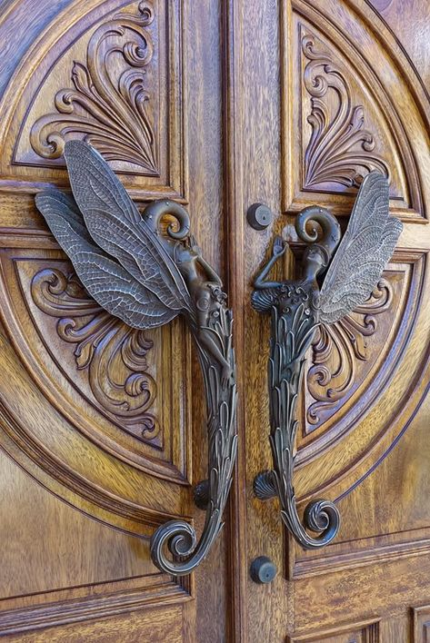

+++
date = 2022-07-18
title = "Ziua 188"
description = "Înainte de asta, să mulțumesc 'din suflet/inimă', sau 'cu tot sufletul/inima' sau să răspund 'nu ai pentru/de ce!' atunci când cineva îmi mulțumea mie, mi se părea firesc. Acum nu-mi mai dau bucăți de suflet sau de inimă nimănui, pentru că oricum n-ar avea ce să facă cu ele, dar pe mine m-ar dezîntregi. Acum răspund 'cu drag' sau 'cu plăcere, pe bune!' și-mi iau cu toată plinătatea mulțumirea pe care mi-o dă omul, învăț să primesc curat. Nu mai zic decât rar, dar corectez rapid, 'săracul de el' ci am înlocuit cu 'dragul de el' pentru că nu vreau să trimit în câmpul omului sărăcia."
authors = ["Biannca Locatelli"]
[taxonomies]
tags = []
[extra]
math = false
diagram = false
image = "images/ziua-188.jpg"
+++
---

Durerea de cap a venit atât de repede și de intensă cu clipa trezirii, că nici n-am avut timp să strecor măcar gândul posibilității unei prea dimineți roz, sau doar albă. Primele momente ale zilei mi le-am petrecut încercând să fac spațiu în mine, în jurul acestei perdele dense care-mi apasă nervii și-mi dă niște pulsații dureroase. Aproape că era să alunec pe panta "Păi da, că nu pot să încep și eu o zi ca toată lumea, să mă prindă, dacă chiar trebe neapărat, durerea un strop mai târziu, ca să-mi rămână mai puțin timp dureros al zilei!", dar l-am mirosit imediat pe "demonul" victimizării și mi-am oprit rostogolirea. Mda, e nașpa, dar nu mai pun automat "Life sucks!" după observația asta. E bună și pauza asta între cele două, că mă scoate din context și mă face cel puțin curioasă.

Printre respirații mici, c-așa le am mereu când am vreo durere, mi-am trimis lasou în Univers mulțumirile și, ca să fiu culmea tupeului, i-am mulțumit și durerii care sigur vine să-mi dea un semnal, să-mi acționeze fie butonul de panică, fie direct maneta de frână, doar că eu mă încăpățânez să mă fac că plouă. Nu am găsit varianta prin care să fac câte am de făcut și după ce le fac, să mă simt odihnită. Zona din creierul meu responsabilă cu livrarea acestei soluții cred c-a plecat în concediu, la fel ca mai toată lumea, care-mi trimite poze sau filmulețe de pe unde e plecată. Încă n-am hotărât în mine dacă e lipsă de considerație din partea lor față de mine la care concediul e un vis sau din partea mea față de ei că nu mă bucur pentru ei și atât, fără să mă bag, egoist, în ecuație.

Nici nu mi-aș mai lua la puricat corpul să văd dacă mai tresare vreo durere, că parcă mi-ajunge una pe lista zilei. Pentru că-mi place maxim, mă întind cât sunt eu de lungă, să mă trosnesc și să mă deschid către noi începuturi, chiar și-așa, faultată pe la tâmple.

Întâlnesc o blănoasă în stretchingul meu care se întinde și ea, cu ghearele în carnea mea, că poate eu nu m-am trezit de-a binelea și mă ajută, cu niște cuțite mici și scurte. Zâmbesc și-mi dau seama că se poate trăi, poate chiar bine, și cu durerea de cap.

***

Cerul meu e morocănos în dimineața asta, atât de tare că soarele, ce-mi întinsese niște jocuri de lumini și umbre pe trifoi, s-a speriat și s-a ascuns. Deși nu prind nicio nuanță de senin, să-mi umplu ochii de el și pe mine toată, de pace, cred că mi-a intrat în reflex să mi-i țin sus, în înalt, prea diminețile. Din femeia cu capul în nori am devenit, atât de subtil și încet, femeia cu ochii-n cer. E mișto reflexul ăsta pentru cineva care, multe perioade din viață, nu și-a ridicat ochii din pământ, când eram în josurile mele sau din rahaturile pe care le numeam dătătoare de viață, când eram pe valul creșterii în societate și ochii lumii.

De azi vreau să fac o schimbare, esențială, pe care n-am văzut-o până n-a pus Sadhguru degetul pe ea: în toate prea diminețile mele, de vreun an și ceva, eu m-am folosit de apă ca de un instrument util în starea mea de bine. Niciodată nu m-am gândit să îi fiu recunoscătoare, în acele momente, la nivelul la care merită acest lichid fără de care viața nu ar exista pe pământ. Efectiv parcă mi-am luat o palmă peste ochi și mi i-am așezat mai bine, că nu vedeam măreția acestui lichid pe care mi-l însușeam așa, că puteam. Știu cum sună, știu cât de cruciș m-aș fi uitat eu la cineva, acum 7-8 ani, care mi-ar fi spus să mulțumesc apei sau aerului. Wtf, păi d-asta am eu timp acum? aș fi răspuns. Eu am treburi importante, de alergat, de produs bani, de dat bine la imagine, ce-s prostiile astea?! Și totuși, la cel mai simplist nivel, și cel mai adevărat nivel, fără astea două, n-ar exista viață. Punct. Și având în vedere că nimeni nu muncește să le producă, ci ne sunt puse la dispoziție dintr-o mărinimie care ne depășește intelectul, putem măcar să ne punem inimile la interval și să băgăm o mulțumire, două, că nu strică.

***

Pentru că nu mai vrea smoothie, interacțiunea mea cu mama se rezumă la și mai puțin decât înainte. Mă duc doar cu pliculețul pentru blănoasă, care mă întâmpină mereu la ușă și apoi rămân în baie, să-mi exersez veleitățile la frecatul obsesiv. Peste tot, și-n cameră și la baie, sunt întinse pijamale de-ale mamei, la uscat, semn că încă transpiră dar, ca de obicei, nu comentez nimic. Azi, cu atât mai mult, cu cât durerea, răscolită pe la ficat de spălat și curățat, mă ciocăne cu pumni de baros în lateralele capului. Mama e ok, nu culeg nimic din limbajul ei corporal, pare că articulează corect, dar pentru amândouă e încă prea devreme. Trag ușa după mine cu un sentiment de ușurare, nu știu de unde l-am cules, dar l-am simțit în carne, printr-o respirație mai relaxată. Ca și până acum, în afara camerei ei sau în afara prezenței ei, sunt ușurată.

***

Timpul meu liber rămâne doar liber, n-am bagheta să-l fac magic, doar stau cuminte în living, în așteptare. Parcă nu intră nimic, vreau doar liniște așa că singurele sunete pe care le percepe urechea mea, antrenată în direcția asta, sunt ciripitul de păsărele de afară, din zona murilor și strigătele de fazani, din câmp. Încă nu se aud flexuri și bormașini iar sunetul satului încă adormit îmi place.

Încep să devin din ce în ce mai "săracă" în zgomote, și încep să percep diferite nuanțe și trepte ale liniștii. Poate d-aia și răsună căteodată atât de tare cuvintele altora în mine, că m-am băgat într-un cocon unde-i tăcere și unde-s doar eu, în genere, cu gândurile mele, zeci de mii.

***

În starea asta de liniște se rostogolesc și cuvintele lui Mr. H, venit la micul lui dejun, trezit bine și cu vorbele la el. El n-are diplomația mea să culeagă informații din exterior și să vadă dacă e momentul să toarne conversații sau nu, dar nu resping discuțiile cu el. Sunt o țâră mai cumincioară, îl las pe el să se desfășoare, îl ascult și-l privesc și sunt acolo iar asta câteodată echivalează suficient o efervescență-n dialog.

Profit de elocvența domnului meu și-o aduc și pe mama la micul ei dejun. Menghina asta din tâmple nu-i dă nicio șansă chefului de vorbă și mă leg de prezența lui ca să umplu un timp și-un spațiu de care azi nu am chef să mă ocup: micul dejun al mamei. Îi pregătesc ce vrea să mănânce și, după trei înghițituri, iar nu mai vrea sau nu mai poate. Dacă nu mai am în mânecă poveștile spumoase, care o fac să uite număratul de dumicați și decizia că "gata, nu mai intră!", așa se întâmplă, juma' de mâncare este din nou sortită animalelor ce ne trec pe lângă gard. Zău dacă am simțit când s-a ridicat și-a plecat, că eram cu spatele la ea, spălând vasele la chiuvetă. Dacă ar fi așa de sprintenă și la un ieșit p-afară, prin curte, ce bine ar fi.

***

Sunetul insistent al mesajelor de pe Messenger m-a scos din privitul retrospectiv la închiderea treptată a mamei. Las pe altădată analiza asta și deschid să văd cine arde de nerăbdare să-mi spună ceva. Este o conțărancă din sat, mare iubitoare și salvatoare de necuvântătoare, care are nevoie urgent de un transport până într-un alt sat, la ceva distanță de noi, la un cabinet veterinar.

Fac calcule rapide, mama de abia a mâncat deci o perioadă stă cuminte, domnul meu e acasă, dacă e ceva, mă sună, mă întorc până trebe să plec la doctor, că am programare stabilită de ceva timp și nu vreau s-o ratez, așa că decid să ajut necuvântătoarea.

Cred că am setat ceva pe undeva prost, că-mi livrează Universul numa' situații cu miros de dat la ficat. Cățeaua pe care trebe s-o transport are râie și cine știe ce-o mai avea dar miroase de-ți pică părul de peste tot, epilare definitivă, ce să mai. Deschid larg geamurile din față, și cu vântu-n plete, bag piciorul în accelerație să ajung la destinație și să mai am și ceva ficat și ceva respirație la purtător. Draga de ea, stă pe bancheta din spate, capitonată bine în vreo trei cearșafuri, și geme. Mă umple de drag și de compasiune și de dorință de a face orice numa' să-i fie bine. Vorbesc cu ea, ea geme către mine, și uite-așa, din vorbă-n geamăt, am ajuns la cabinetul veterinar care o așteaptă și o preia. Mi-am luat vreo 10 minute de respirat aer curat și de aerisit mașina, dar minutele astea nu mi-au scuturat tristețea care mi s-a așezat în pleoape și-n gât. Sper să-i fie ușor de acum înainte, știu că medicii vor avea grija ea, dar nu mă pot opri să nu plâng. Drumul înapoi a fost cu descărcări emoționale, tot cu vânt în plete dar și cu niște fiori reci pe la inimă. Cum e, măi, posibil ca această cățea să ajungă-n halul în care este, trăită în jurul unor blocuri? Cum, măi, din sutele de oameni care trăiesc acolo, să nu fie unul să-i dea o bucată de pâine-nmuiată-n ciorbă și, în weekend, niște oase? Cum naiba suntem atât de orbi și nu scoatem nasul din pătrățica aia de "să-mi fie bine mie!"? Cu mult timp în urmă, nu am înțeles, sau n-am vrut să înțeleg că nu-mi convenea, ce spunea maica Tereza cu clasicul ei citat: "Există foamete pe lume nu pentru că ar lipsi pâinea ci pentru că nu reușim să-i săturăm pe cei bogați". Fiecare din noi este, într-un anumit grad, mai bogat decât altul care are mai puțin și, cu siguranță, mulți dintre noi suntem cu mult mai "bogați" decât necuvântătoarele ce trăiesc pe lângă noi, între betoanele în care ne trăim pătrățica. 5 MILIOANE DE TONE de mâncare ajunge la gunoi anual în România! Și-o amărâta de cățea nu poate să mănânce de acolo că e bătută cu sălbăticie de "oameni". După cifra asta, în mine se lasă tăcere și uimire. M-am întristat peste măsură.

***

Mă pregătesc pentru controlul medical și apoi pregătesc și prânzul mamei care, evident că a uitat că plec și care, ca de obicei, nu are chef de mâncare. Cât de prost pică lipsa ei de apetit și frunzăreala prânzului peste amintirea cățelei de mai devreme care, la destinație slavă cerului, a defecat în curtea cabinetului: un amestec de paie și iarbă verde, asta mâncase ea…. Primul instinct a fost să-i scuip mamei toate astea, mai ales că fața ei care se strâmbă și e atât de sugestivă că nu-i place sau că nu are chef, mă alimentează din plin. Dar începe să dea roade regula "întâi și înainte de toate și orice, respiră adânc!", așa că-mi dau seama că ea măcar are o scuză, nu mai e "normală" și mă abțin. În continuare, tristețea mă ține îmbrățișată strâns.

***

Merge și domnul meu cu mine așa că ne îmbarcăm cuminți în autobuz și pornim spre centrul Capitalei. Ca întotdeauna, văzul oamenilor e prilej de atenție, mă provoc să mă rafinez în detectare de ego și începe să-mi iasă. Nu că ar fi o virtute asta, mai ales că subiectul provocării nu e așa o bucurie, dar având în vedere bogăția de nuanțe și durata de viață, e un subiect suculent și cu cărniță.

Am mai spus, cursul prin care am făcut Pace cu mine și scrisul ăsta zilnic m-au dus mult mai aproape de esența cuvintelor, de darul sau blestemul pe care îl țin ele între literele ce le compun.

Înainte de asta, să mulțumesc "din suflet/inimă", sau "cu tot sufletul/inima" sau să răspund "nu ai pentru/de ce!" atunci când cineva îmi mulțumea mie, mi se părea firesc. Acum nu-mi mai dau bucăți de suflet sau de inimă nimănui pentru că oricum n-ar avea ce să facă cu ele dar pe mine m-ar dezîntregi. Acum răspund "cu drag" sau "cu plăcere, pe bune!" și-mi iau cu toată plinătatea mulțumirea pe care mi-o dă omul, învăț să primesc curat. Nu mai zic decât rar, dar corectez rapid, "săracul de el" ci am înlocuit cu "dragul de el" pentru că nu vreau să trimit în câmpul omului sărăcia. Nu mai zic "bănuți" pentru că nu mai vreau să-i micesc nici pe ei și nici importanța lor ca energie în curgere. Încă mă mai scap cu "mă zăpăcești de cap!" sau "m-ai înnebunit!" dar încep să mă prind câteodată chiar înainte să scap cuvintele.

Acum, după ce am făcut și încă mai fac munca asta cu mine, pot detecta cu lejeritate tara și la cei din jur. Și sunt mulți. Aproape toți care au vorbit la telefon în autobuz au avut unul din ticurile verbale de mai sus, cel mai des întâlnit fiind cel de "n-ai pentru ce!". Respingem singuri, fără să fim conștienți, darul ce stă pur și curat într-o mulțumire și apoi întrebăm de ce nu primim, un Univers care nu face altceva decât să oglindească.

Vălurile astea care ți se iau de pe ochi, când începi să te întrebi, sunt fascinante, dar nu mai mult decât ce dezvăluie căderea lor. Sunt atât de multe de văzut, înțeles dar mai ales practicat, că abia pot să întrezăresc de ce zic cei cu ochii deschiși că nu e timp pentru prostii în viața asta. Dacă mai și dormi cum am dormit eu juma' de viață, frate, dar ce se îngustează timpul.

***

La doctor, o altă portiță care mă întoarce din nou la mine. Cea care am fost și cea care sunt.

Am avut perioade lungi în viața asta în care pregătitul pentru a doua zi începea de cu seara de dinainte. Îmi alegeam ținutele, le combinam, paracombinam, să fie asortate, ba să nu fie chiar de tot asortate, să fie un pic altfel, să atragă privirile și aprecierile. Mă coțopeneam pe tocuri că na, un toc face piciorul fin și zvelt. Peste toate țoalele, venea să încununeze atitudinea, cea care desăvârșea imaginea și mă hrănea, dar niciodată îndeajuns.

Nu m-am mai machiat de mult, mult timp, n-am mai purtat tocuri de ani buni, port orice, oricum, atât timp cât e comod și curat iar atitudinea e una naturală: nu mă mai simt în niciun fel dacă sunt judecată după aparența înfățișării și sunt capabilă să privesc cu aceiași ochi fix în ochii interlocutorului, fie că e doamnă la curățenie, fie că e femeie de afaceri. Azi la doctor, privind în sală, mi-am dat seama că eu am câștigat, în anii ăștia în care n-am mai lucrat pentru bani, ceva ce nu se poate cumpăra: detașarea. Îmi face plăcere să văd o femeie frumoasă, natural sau ajutată de micile artificii caracteristice sexului "slab", să admir un bărbat îngrijit, îi privesc cu ochi limpezi, fără judecată, dar știu că pentru mine asta nu (mai) e important și n-o să mai fie niciodată. M-am detașat atât de mult de învelișul ăsta care mie îmi acoperea o goliciune sufletească încât acum n-aș mai putea, nici dac-aș vrea, să mă întorc acolo. Și doar ca un indiciu pe care-l miros de la distanță acum: cu cât mai împăiat este cineva, fie cu cârpe, fie cu aroganțe, cu atât e mai trist înauntrul lui. Nu sec, cum spun mulți, ci trist și singur și nu găsește drumul și calea care l-ar face bine.

La întoarcere aproape c-am adormit în autobuz, semn de mare oboseală la mine, care în mașină, orice fel de mașină, nu pot dormi. Mi se trage de la un accident nașpa auto când eram în luna a șaptea de sarcină și nu reușesc să scap de alerta asta care se pune în mine din momentul în care pun piciorul într-o mașină. Am picotit lângă geam, de vreo câteva ori am și dat cu capul de geam în adormire că m-a trezit mai mult râsul meu decât lovitura în sine. Ok, înțeleg, cândva o să și dorm mai mult. Cândva.

***

Ultimul lucru pe care-l mai fac pe ziua de azi este să pilesc unghiile mamei și gata, mă strecor prin duș direct în pat.

Cremele cu care o tot ung pe copite încep să dea rezultate pentru că efectiv încep să se macine. La fiecare pilit, mai cade câte-o bucățică și, dacă conspiră tot Universul în favoarea nasului și ficatului meu, nu cred că ajungem la două luni, vor pica mai repede. Ce să zic, îmi țin pumnii strânși-strânși ca să nu-mi țin nările la fel.

***

Aș mai fi vrut să citesc dar îmi joacă literele prin fața ochilor și nu mi se leagă nicio înțelegere din Karma lui Sadhguru. Îmi scurtez ziua care mi s-a părut și așa prea scurtă, dar bunicică și derulez firul înapoi, pentru articularea recunoștințelor:
1. APĂ și AER!
2. Cabinetele veterinare conduse de medici cu suflet!
3. Detașarea asta care mi s-a așezat în viață atât de mișto și de natural!

Frumosul meu azi:

  

