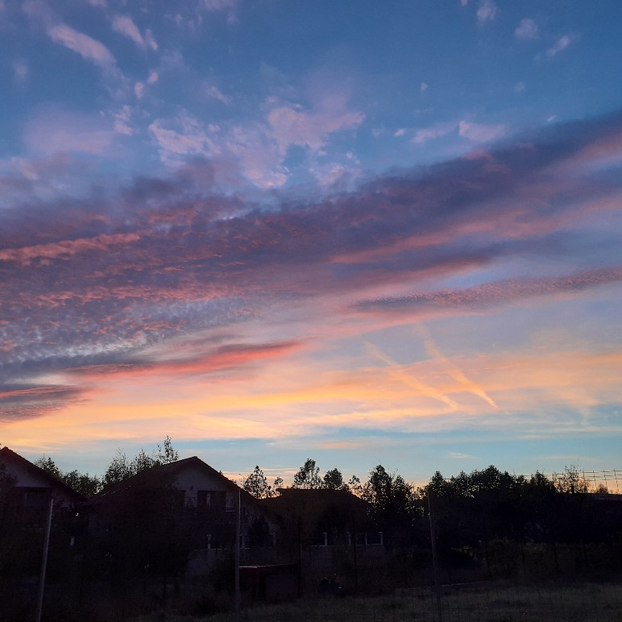

+++
date = 2022-01-30
title = "Ziua 19"
description = "Mi-aduc aminte cât am invidiat, cât m-am chinuit și trunchiat să intru în niște tipare pe care eu le credeam cool sau care credeam că atrag, cât m-am ciuntit pe nedrept și dureros, doar ca să fiu corespunzătoare. Câtă risipă de timp și energie!"
authors = ["Biannca Locatelli"]
[taxonomies]
tags = []
[extra]
math = false
diagram = false
image = "images/ziua-19-final.jpg"
+++
---

Cred că am dormit dintr-o bucată, fără treziri de care să-mi aduc aminte. E drept că am căzut lată dar parcă sunt mai revigorată. Deși, recunosc, că am avut un gând mic de invidie pe domnul meu care rămânea în patul cald, în liniștea nopții.

***

M-am consolat însă cu apa caldă pe care o beau pe stomacul gol. Am pus prezență în moment și am simțit la propriu cum apa călduță mă mângâie și mă alină pe dinăuntru. I-am mulțumit cu un zâmbet, tot interior și mi-am pornit ritualul de to do-uri dimineața. N-a durat mult că s-a aprins lumina și la mama și m-am bucurat că s-a trezit. Da, am realizat că, în tumultul ăsta care ne fură viața, nici nu mai apreciem că ne trezim noi, în primul rând și cei dragi nouă, în al doilea rând. E de la sine înțeles parcă și e obligatoriu. Atât de greșit! Nu e neapărat! Nu ai nicio garanție a clipei d-apăi a unei nopți.

***

Toate bune, am curățat totul la ele sus și am coborât să o răsfăț și pe Spiky, tomberoneza noastră roială adoptată care mă urmează peste tot ca un cățelus.

***

Mi-am sorbit încet smoothieul, cu ochii pe linia orizontului ce-și schimba culoarea din negru în roz, apoi în purpuriu totul pe un fundal albastru impecabil. Se naște o nouă zi și eu îi sunt martoră…

  

După răsărit, m-am mutat pe scrollat, să mă mai inspir din videouri, să mă mai bucur de creativitatea asta imensă care este peste tot.

Și uitându-mă eu așa, apare o tipă, într-o reclamă, în haine imitație leopard. Eu, în loc să lase să alunece imaginea, am băgat-o sub lupă și dă-i cu analiza și cu judecata: de ce are nevoie omul de a se eticheta (eu sunt în cutare fel), de ce vrea mereu să copieze în loc să se lase să fie, în cea mai pură și autentică formă în care poate fi? **De câte ori ne comparăm cu alții, ne dorim să fim ca alții, îi invidiem pe alții, de fapt omorâm în noi sanșa de a fi cine am venit să fim, sanșa de a fi diferit de ceilalți, pentru că fiecare dintre noi suntem o expresie UNICĂ de manifestare a acestei Creații,** a acestei inteligențe iubitoare. Și-mi aduc aminte cât am invidiat, cât m-am chinuit și trunchiat să intru în niște tipare pe care eu le credeam cool sau care credeam că atrag, cât m-am ciuntit pe nedrept și dureros doar ca să fiu corespunzătoare. Câtă risipă de timp și energie!

Cred că ar trebui să fie predată lecția asta încă de la grădiniță: lasă competiția, descoperă-te și trăiește-te dinadins, cum zice profa mea de la cursul schimbător de sens și viață, Pace cu mine.

***

Tot azi, în noianul de gânduri care tranzitează spațiul meu aerian, m-a lovit o revelație: ne îndreptăm către o lume cu cât mai puțină interactiune umană. Iar exemplul cel mai concludent sunt companiile mari de utilităti. Nu că ar fi ceva rău. E o evoluție probabil naturală dar am avut un flash ca din filmele alea ce se petrec prin 2090 în care totul este digital.

Încercam zilele trecute să închid un contract cu Engie și nu poți ajunge la un consilier deloc. Trebe să dai email sau mesaj la ei pe platformă și revin ei în 30 de zile.

Așa că sunt hotărâtă să ies din sistemul ăsta până nu e prea târziu. Aș vrea să punem panouri solare astfel încât să ne producem singuri energia electrică. Puțul îl avem săpat la vreo 75 de metri așa că apă avem. Prin compensarea cantitativă care a apărut acum la energia electrică, am putea folosi iarna ce am stocat în rețea vara. Poate reducem, cu o centrală electrică, și gazele. E o investiție dar cred că e cea mai potrivită și momentul e cel mai potrivit. Cu cât ești mai puțin dependent, cu atât mai bine. Nu mai zic de isteriile create cu creșterea de prețuri, că ne taie rușii gazele, etc.

***

Cât de sofistricat a devenit omul. Mă uitam cu câtă emfază prezenta un bucătar o ființă măcelărită într-o farfurie, alături de o spumă de spanac și 3 fire sos de brânză. Și mulți dau bani grei pentru aceste sofisticării. Pentru că așa dau ei bine, pentru că sunt o elită, pentru că le e mai cald acoperiți de o etichetă decât dezbrăcați în fundul gol dar autentici. Nu-i judec, am fost și eu p-acolo doar sper să sune clopoțelul pentru cât mai mulți cât mai curând. Că e praf în ochi și risipă mare de energie, timp și sine!

***

În tot amalgamul ăsta de trăiri, analize și gânduri, am simțit cum corpul meu replica zâmbetul unei tipe care povestea cum și-a redecorat casa. Nici nu mai eram atentă la ce spune și doar am sorbit energia bună ș-am purtat-o în toate colțurile trupului meu, să mă lumineze și să mă relaxeze. Mișto exercițiul!

***

Mic dejun târziu, bun și cu voie bună.

***

Astăzi am făcut a doua doză de vaccin. Doamne, au zburat 21 de zile într-o clipă! Nu sunt confortabilă cu vaccinul dar înlocuiesc asta cu independența de mișcare și cu bucuria mamei când o voi duce la un tuns, la un magazin și ies pe plus. Mai fac și niște cumpărături și mă reîntorc acasă rapid să pregătesc prânzul și poate să mai apuc să fac ceva la blog.

***

De când scriu, mi-e ușor să observ că gătesc zilnic…

***

Restul zilei nu știu pe unde s-a strecurat: prânz, table, dușul mamei, sucul de seară, scris pentru blog, încercări să dau drumul la blog…sunt iarăși frântă și mă doare și brațul unde sunt vaccinată.

***

Recunoștinta însă-mi stă pe buze și în suflet pentru:
1. Apa caldă pe care o beau dimineața!
2. Cele mai frumoase răsărituri pe care le trăiesc din această casă!
3. Că mama se simte bine, nu-i vine să creadă că am pus-o pe picioare!
