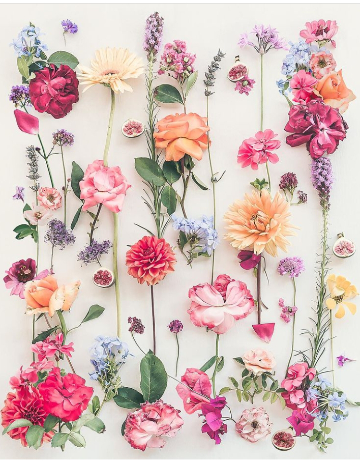

+++
date = 2022-08-03
title = "Ziua 204"
description = "Poate nu se întâmplă, poate copilul experimentează, ferește, e curios, se bucură, e liber, în cuget și-n acțiuni, și-ți dă și ție din libertatea asta, că e molipsitoare, dacă te lași molipsit. Sau poate vă urcați fiecare pe câte-un cărucior, el la 12 ani, tu la 30 și ceva, și faceți întrecere, și vă jucați, și vă creșteți unul pe altul, și vă împuterniciți unul pe altul și vă scoateți din vocabular 'nu e voie!' sau 'ai grijă!', tu, acum la 30 și, iar el peste alți 10 și, când o avea copii la rândul lui."
authors = ["Biannca Locatelli"]
[taxonomies]
tags = []
[extra]
math = false
diagram = false
image = "images/ziua-204.jpg"
+++
---

În cuptorul orei 4 și un pic prea dimineața, eu deja coceam, la foc mic și încetișor, bucățile de recunoștinte, să le trimit bine rumenite-n Universul ăsta care mă primește la înc-o nouă zi de trăit, în brațele lui. Nu știu dacă m-a trezit ceva anume sau a fost naturală spargerea asta de ritm, dar dacă somnul m-a părăsit brusc și dintr-odată, am profitat de liniștea asta profundă, și de afară dar și din-năuntrul meu, și de o tăcere, aproape ireală, de gânduri bărzăune prin mansardă. Ori le-a șocat trezirea bruscă, or au o lene și ele câteodată, dar la ora asta mică de noapte doar câte-un gând rătăcit îmi mai dă târcoale, ca un pasager amețit într-o gară, în miez de beznă. Iar astea puține, vin și pleacă rapid, ca și cum au greșit destinația. E o noutate pentru mine să fie trafic așa de redus și parcă mă furișez, mă tiptilesc spre ceremonia mea neabătută, să nu mă simtă vreunul mai alertă și să dea alarma la restul. Așa cumincioară, mi-am cumpănit toate micile comori care-mi alcătuiesc viața și le-am îmbrățișat într-un drag și-o mulțumire plină, curată, onestă și intensă. Nu știu de ce când mulțumesc pentru ceva, care există deja în viața mea, am în aceeași clipă și imaginea că n-aș avea, iar recunoștința vine cu atât mai profundă și mai caldă pentru ce am și ce-mi contribuie. Nu e ceva ce fac conștient sau poate o fac inconștient, nu am nevoie de lipsă ca să apreciez averea pe care o am și e depozitată în oamenii dragi din viața mea sau în aerul și apa care mă țin în viață sau în corpul meu care mă poartă pe aici sau în toate micile obiecte care-mi fac plăcere sau viața mai ușoară. Ușor-ușor, se instituie ca un must do frumos, pe care nu-l resimt ca pe o corvoadă, ci văd că se înfiripă din neant, la orice oră din noapte, ritualul ăsta al meu de recunoaștere și recunoștință.

M-a învăluit la propriu căldura faină pe care o simt aproape mereu, după eliberarea mulțumirilor, ocazie cu care-mi investighez și corpul. O jenă pe la șale, de la efort, în rest, all good. E încă prea devreme să mă pornesc spre parter, mai stau așa, mă-ntind toată și dau peste coconetul căreia-i generez și ei o întindere și crede că gata, e de plecare, deja s-ar arunca cu aplomb, așa cum numa' ea știe c-o facă, în parchet. O rețin încetișor, prin mângâieri și o simt cum se lasă moale în palma mea. E un moment atât de fain, de liniște și de moale, doar rârâitul intern al Chichiricăi parcă colorează camera și-mi permit, habar n-am cum, o plecare portocalie lină pe tărâmul viselor.

***

M-a trezit încet, dar ferm, lumina multă ce se-ngrămădea neinvitată prin marginile ferestrelor și gureșeala de afară. De când îmi antrenez atenția și prezența, am impresia că o altă mine, e mereu atentă la sunete și mi le redă mie, ăsteia care cică trăiesc realitatea fizică, p-alea mai mișto sau mai importante. Știu că de fapt creierul nostru înregistrează toate sunetele și tot ce se întamplă doar că de ceva timp parcă sunt acut conștientă de ce aud, chiar și când dorm.

Spiky e deja pe podestul de la scări, la geamul larg deschis și sondează libertatea și mișcările de afară. Mă simte, urcă rapid scările dar ajunge fix în picioarele mele și aproape să ne răsturnăm una pe cealaltă. E duduită și asta mică, la fel ca umana ei. Cu zâmbetul venit natural pe buze îndepărtez cuta ce se pornea a încruntare-ntre sprâncene și ajungem, întregi și nerăsturnate, la bucătărie.

***

Iar mi-e tare sete, iar aproape că beau dintr-o gură toată apa, zici că mă consum într-o ardere peste noapte, că dacă aș avea urechi pe traseul apei, zău c-aș auzi sfârâind zonele prin care trece. În zile d-astea însetate, senzația care-mi rămâne în corp, după apa băută, e de ungere, zici că am băut ulei, nu apă. Și culmea, deși beau juma' de kil dintr-o sorbire, nu mă simt deloc cu broaște-n burtă. Let's the party begin!

Doar un ochi îmi trimit spre înalt și-i spun că revin, după ce mă duc la coana mare. Chiar dacă mi-a tăiat-o scurt și urât, că s-o las în pace cu prostiile mele, nu-i mai duc smoothieul, dar mi-a intrat în obicei să o vizitez la prima oră, să văd cum e, să drăgălesc o baronesă blănoasă, să le primenesc locul în care-și respiră ziua.

***

Bine că încep să nu mai am așteptări, dar nici frigeri de suflet când deschid ușa la ele. Sassy mă așteaptă priponită-n ușă, că de-abia pot s-o deschid, iar mama mă privește scurt, doar ca să ia notă de prezența mea. E bine, nici extaz, nici agonie, culmea nici o aoleală n-are-n buzunarele minții azi, așa că o întreb zâmbind, ca să trimit și-n ea un strop de bine, cum a dormit. Ok. Bun așa. Pare deja captivată de ceva ce e la tv iar eu mă strecor la baie, unde strâng și spăl și dezinfectez, las geamurile larg deschise, hrănesc pisica, arunc un ochi să văd dacă mama are vreo așteptare, speranța mea că totuși revine asupra smoothieului e deșartă și azi și plec către ora mea de liber, magic sper.

***

Că-i promisesem, ies la întâlnirea cu imensul senin, pe terasă. E cea mai bună poziție din care pot să mă bucur maxim și de albastrul cu spoieli alb-cenușii și de verdele încă crud al mamei pământ. În jurul meu, intensitatea sonoră începe să crească, lumea se trezește, deja începe lucrul sau munca, natura e și ea alertă, dar eu sunt încă molcomă. Și nu de la somn, am o stare de-o liniște adâncă, parcă nu e doar o pojghiță pe deasupra, e ceva ce nu se zgândăre ușor. Combinația asta genială de albastru-alb-verde adaugă și ea partea ei de contribuție și plec să-mi duc domnul, din nou, la autobuz, într-o stare deplină de calm.

Deși interacționez cu el, liniștea asta din mine nu se zdruncină deloc, e ca și cum nicio vorbă, articulată sau nu, nu trece de carapacea asta dură de calm care mi s-a pus azi pe carcasa de carne. În toiul conversației cu el, am apreciat și mulțumit pentru starea asta ce mă locuiește, deși sunt un strop buimacă, nu știu cum și dacă trebe să împac efervescența mea generată de discuția cu omul drag mie cu liniștea mea generată dintr-un interior nou mie. Le las pe amândouă să fie, s-o distila ce trebe de la sine.

Mai am un strop de timp și-n el dau o fugă până-n Turcia, pe aripile unui documentar tare fain, făcut nu neapărat dintr-un ochi turistic, cât mai degrabă dintr-un ochi de umanitate, de realitate, de zi cu zi. Mi-a făcut bine bucata asta de poveste cu puternic iz de realitate, fără zugrăveala inerentă pusă de turism și m-a făcut mai curioasă s-o vizitez, decât oricare altă strategie de marketing. E adevărat că orice cultură are farmecul ei și dacă ai norocul să auzi povestea depănată cu bune și cu rele, n-are cum să nu se lipească de tine curiozitatea. O să ajung și acolo, some day.

***

Mama vine la micul dejun, mânată mai mult de faptul că după ce mănâncă ea, eu dau o fugă la cumpărături și printre cumpărărturi, a strecurat ea, cu ardoare mare, ruga pentru "prăjiturelele" ei preferate. I-am promis că i le iau și e tare fericită. Aproape că mă simt prost că i le dau cu rația dar pendulez între "am eu dreptul s-o privez de-o bucurie, acum când nu mai are nici mult mosorel, nici alte bucurii?" și "un pic de control trebe ținut, că tot pe mine pică bolile sau răul, când s-o aduna zahărul la nemișcarea asta crasă de care suferă ea, în primul rând!".

Mănâncă binișor, răpită de povestirile mele, pe care i le depăn blând, încă sunt în acalmia de mai devreme. Vrea și o cafeluță, îi fac și o cafeluță, deja se destinde atmosfera și profit de ambianță să-i repet că plec, dar că aș prefera să stea cuminte la ea sus, să nu plece pe scări. Dacă n-aș ști că mama are demență, în aceste clipe nici nu mi-aș da seama. E ca oricare alt om în vârstă, cu neputința specifică bătrâneții, cu lipsa de putere normală pentru anii ei. Mai repet o dată, să mă asigur că n-a uitat și n-a uitat, pentru că-n plecarea asta a mea sunt prăjiturelele ei. D-aia nu uită.

***

Cu graba-n sânge și-un ochi pe camera de supraveghere, plec ca albinuța, la adus bunătățuri acasă, fructe, legume și prăjiturele. Ca de obicei, antenuțele-s în aer, pare c-a devenit obișnuință, nu mă mai montez eu. Am devenit intrinsec curioasă de viață.

Prima care intră în radarul meu este o reclamă farmaceutică, mi-a atras atenția că era cu o femeie în vârstă în poza de marketing. Practic, categoria asta de vârstă, mai ales la noi, trăită în anii comunismului, cu lipsuri grămadă și fără deschidere către altceva decât un acoperiș deasupra capului și-o bucată de mâncare pe masă, n-are nicio șansă decât să se îmbuibe cu medicamente. N-am reținut la ce farmacie era reclama, dar am reținut perfidia marketingului: "Aici sunt ascultată și îndrumată către ce am nevoie să fiu bine!". Giiiz, cât de departe ne-am dus de natură și cât de twisted ne sunt mințile, doar pentru bani. Seniorii din afara României sunt receptivi și la altceva decât pastile și, de cele mai multe ori, și mai longevivi decât ai noștri. Unde s-a petrecut scurtcircuitul? Că străbunii lor nu se-nfigeau cu atâta ușurință-n medicamente, e drept că nici nu erau atâtea medicamente.

Mi-aduc aminte ce oripilată am fost, și încă sunt, la o reclamă pentru o pastilă ușurare bilă, în care o tipă, în prag de o sărbătoare, se îmbuiba cu de toate, era masa plină de prăjeli, fripturi, chestii grele, iar conștiința ei o trăgea de mânecă, "stai așa, ai uitat că ai probleme cu bila?!". Întrebare la care istețul de copywriter a parat cu medicamentul cu pricina. Cu alte cuvinte, bagă-n tine până crăpi și după, ia medicamentul cutare, ca să-și treacă neplăcerile și să o iei de la început. Unde naiba ne-am tâmpit atât de rău?! M-am înfierbântat brusc la reclama asta și-mi dau seama că marea majoritatea fix așa facem. Ne doare ceva, luăm repede o pilulă. Dacă ne ducem la doctor și ăla nu ne dă o rețetă, ne ducem la altul, că ăsta n-a fost bun. Luăm pastile la greu, ne intoxicăm chimic, pe lângă că oricum numa' sănătos nu mâncăm, respirăm noxe sau aer cu miros de plastice arse, mișcare doar cât să ne mutăm fundul până la magazin, de unde luăm procesate și dulciuri, iar de gânduri nici nu ne mai întrebăm, că oricum nu înțelegem și nici nu vrem să înțelegem ce e cu ele. Ș-apoi, la bătrânețe, în loc să facem croaziere sau plimbări sau yoga sau să ne relaxăm cu bucurie pe o băncuță, în virtutea inerției, facem ce-am făcut o viață, crezând, stupid, că vom avea alte rezultate. Cum pot eu să fac undo la toate astea, la mama? Cât de credulă pot eu să fiu să-mi imaginez că mai pot curăța la ea ceva, când ea se încăpățânează la un "biet" smoothie?! Singura șansă este educația, aia adevărată, bazată pe și pentru viață, făcută oricând, la orice vârstă, prin orice mijloace. Dar șansa asta n-are nicio șansă în fața avidității, în fața dorinței de putere și de bani. Oare magnații ăștia ai lumii chiar cred că-s nemuritori? Retorică întrebarea.

A doua înfierbântare, 2 în 1 în același magazin, mi-a fost dată de o mamă. N-o judec, cum aș putea, când și eu am făcut la fel ca ea, dar îmi notez să-i spun fiică-mii să facă copil când o fi capabilă să-l lase liber.

Băiatul doamnei, la vreo 12 ani, cu chef de joacă, inocența-n plină floare, își face vânt cu căruciorul și apoi se urcă în spatele lui cu picioarele, deplasându-se cu tot cu căruciorul care se mișcă singur, din inerție. Mamă-sa, strigă după el și la el: "termină o dată!, stai locului!". Pe lângă că puștiul s-a rușinat de mine, s-a simțit și puțin și greșit, mamă-sa i-a mai tăiat din aripi, să nu cumva să fie liber, să experimenteze, să greșească, să-nvețe. Mi-au stat cuvintele-n vârf de buză și de limbă dar realizez, plin de tot, că tot marea majoritate facem la fel. Pentru că noi înșine ne-am tăiat părțile din noi care nu intrau în tiparul de bun, de cuminte, în societate, acea decizie luată la o vârstă crudă, facem același lucru și cu copii noștri. Ferească Domnul ca el să nu fie cuminte, să iasă din vorba și de pe făgașul părinților, că se pornește urgia amenințărilor, șantajului emoțional sau de altă natură, tăiatul brutal de aripi. Și aici tot educația poate rezolva dar e nevoie de minți destupate, e nevoie să lași copilul să intre cu căruciorul în vitrină, s-o facă praf, să plătești dauna pe loc și s-o recuperezi treptat de la el ca să înțeleagă ce e aia o consecință și să și-o asume, să nu-l cerți, să înțelegi că el vrea să experimenteze, ăsta e scopul lui și al oricărei alte ființe umane pe acest pământ de altfel, să înțelegi că n-o face ca să-ți facă ție rău. Asta, în cazul în care se întâmplă catastrofa. Că poate nu se întâmplă, poate copilul experimentează, ferește, e curios, se bucură, e liber, în cuget și-n acțiuni și-ți dă și ție din libertatea asta, că e molipsitoare, dacă te lași molipsit. Sau poate vă urcați fiecare pe câte-un cărucior, el la 12 ani, tu la 30 și ceva, și faceți întrecere, și vă jucați, și vă creșteți unul pe altul, și vă împuterniciți unul pe altul și vă scoateți din vocabular "nu e voie!" sau "ai grijă!", tu, acum la 30 și, iar el peste alți 10 și, când o avea copii la rândul lui. Așa se educă, așa se spală generațiile, așa ne înălbim și ne eliberăm. Dar ne trebe minți destupate și ochi limpezi. Iar astea, nu-s.

***

Am plecat la cumpărături liniștită și m-am întors justițiară. Nu pot să mă fac că nu văd și, deocamdată, văd, analizez și livrez soluția. C-așa am fost obișnuită, așa fac. La acest moment, știu că e o utopie dar există speranță, cel puțin așa am simțit când am fost la festivalul veganilor, acum ceva timp, și-am văzut câtă lume era acolo, câte familii cu copii mici. Nu pot schimba lumea dar pot să mă schimb eu, pot să deschid gura și să-i spun copilei mele, nu cu forța, ci cu exemplificare. Într-un final, lucrurile se vor schimba, sunt sigură de asta. Poate nu acum, poate nu în timpul meu, dar fiecare are timpul și treptele lui.

M-am apucat de prânzul mamei, în liniște și mi-am adus înapoi calmul dimineții. Îmi place aroma asta, nu mă mai simt grăbită către nimic și cred că înțeleg de ce mă traversează acalmia: în ultima perioadă, timpul meu a fost secvențial împărțit pe a face. Momentele, rare și scurte, când nu făceam ceva, mă simțeam vinovată, nu mă încărcam minunat de relaxare, era mereu o iscoadă mică acolo care-mi bătea obrazul că stau, că nu fac ceva. E adevărat că mereu e câte ceva de făcut, fie în casă, fie afară, dar asta nu înseamnă că trebe să devin robot. Teoretic, știu asta. Practic, bag până nu mai pot și apoi mă aolesc. Starea asta senină de azi e-n vizită tocmai să mă facă atentă la asta: cine mă premiază dacă-mi dau duhul de atâta treabă? De ce e atât de important să tot fac și să nu-mi permit să stau? De ce a sta e o vinovăție?

***

Am terminat prânzul mamei cu un zâmbet și-o satisfacție cât casa pe fața și inima mea: mi-am dat, de fapt, mi-am simțit, toate răspunsurile. E un ego atât de ascuns acolo încât nu l-am văzut până azi. Dar azi, prietena mea liniștea mi l-a adus în față de scârbavnicul mic, l-am privit în ochi și a plecat, descoperit. E tot o nevoie de importanță și-n făcutul ăsta continuu. E tot o nevoie de validare, de acceptare din exterior. I'm only human.

Prânzul a decurs fără incidente, speranța recompensei în prăjiturică a împins-o pe mama să termine tot din farfurie, să fie un strop mai puțin placidă sau măcar să încerce. Mi-a dat o lovitură mică pe la poalele inimii când, povestindu-i eu ceva și menționând că suntem în august, a ridicat ochii din farfurie către mine, dar a privit prin mine, și a spus "Eu sunt născută în august. Dar nu mai știu când..." Știu eu mamă și o să am grijă să știi și tu.

***

Restul zilei mi l-am petrecut în nefacere. M-am uitat la 2 filme, am mâncat floricele, am râs, am plâns, m-am observat cum nasc emoții și cum mor după ce le-am consumat, am fost când prezentă, când în amintiri dusă de-un cuvânt, când în fabricări de vise dusă de-o imagine, am privit apusul, m-am jucat cu Spiky, am cules mure pentru smoothieul de mâine dimineață, am stat în curte, în fund, în trifoi și m-am întins spre cer, n-am făcut nimic din câte erau de făcut și a fost de-men-ți-al! Și, cireașa de pe tort, am fost atentă să nu-mi las vocea aia, care mă făcea vinovată că pierd timpul, să-mi urle-n interior și-am crescut cântecul din mine. Sunt singura care pot alege cum să fiu. Iar acum am ales (să fiu) bine.

***

Mulțam Universului pentru ziua de azi și pentru:
1. Starea asta faină, blândă, care mi-a adus darul nefacerii azi!
2. Claritate mentală!
3. Verde!

Clipa mea de frumos este:

  

 

 

  

    <a href="/blog/ziua-203/">Postarea anterioară</a>
  

  

    <a href="/blog/ziua-205/">Postarea următoare</a>
  

