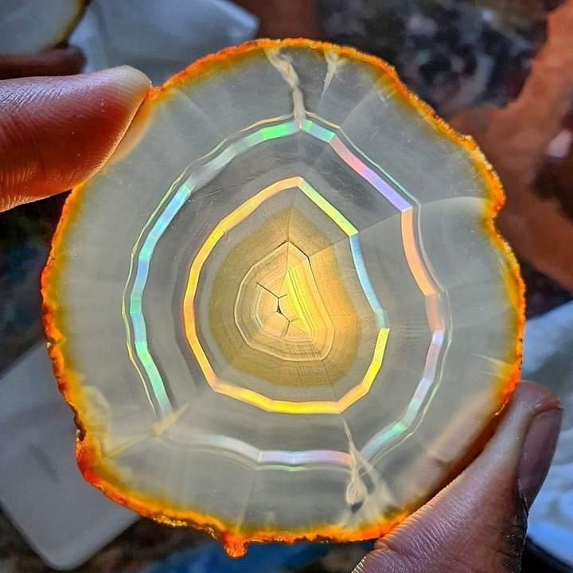

+++
date = 2022-08-05
title = "Ziua 206"
description = "Îmi dau seama din ce în ce mai mult că nimeni nu poate avea pe nimeni, oricât de mult ar urla atașamanetul în el. Te poți petrece cu altcineva o perioadă de timp din viață, dar, să crezi că e omul 'tău', e doar o construcție de posesie croșetată de un ego care are tendința clasică de a-și întinde mâna greblă peste cât mai multe."
authors = ["Biannca Locatelli"]
[taxonomies]
tags = []
[extra]
math = false
diagram = false
image = "images/ziua-206.jpg"
+++
---

Senzația care parcă mi-a făcut parte din corp și din prezență toată noaptea, s-a instalat la prima conștientizare de trezire. Trecerea din somn adânc și totuși subțire, a suprafață, la viața trăită cu ochii deschiși s-a făcut lin, fără sincope, fără greutăți. În ghemul ăsta mic de stare faină, am fugit din nou, în mine, de data asta conștientă și trează, să-mi salut ingredintele ce-mi fac viața asta delicioasă și bună. Chiar și p-alea care-o mai acresc, pe ici, pe colo, că și ele au sens și-un gust și-o experiență de împărtășit cu mine. Atâta de mult mă bucură momentul ăsta, mic de timp dar mare de stare, încât pare că nu-mi va fi greu să-l institui ca obicei. Ține totul de alegere, de voință și de dorință.

Mă doare mijlocul, acum când mă întind, mi-aduc aminte că durerea asta a fost cu mine toată noaptea, la fiecare întors de pe o parte pe alta. E o durere densă, nu mă străpunge median să nu pot să respir, dar e acolo. Poate m-am cam forțat eu și cu tunsul și cu tot felul de ridicări și cărat și șalele-mi dau de veste că nu mai sunt în my twienties. În rest, corpul îmi răspund blând, e ca un cal bun care mă duce peste tot și nu cere mult în schimb. Eu, însă, m-am hotărât să încep să-i arăt iubire, așa că sunt atentă la semnele lui și văd unde mă duc ele și ce schimbări îmi propun.

Coconetul ăsta mic și blănos doarme de-a latul patului, nici prin minte nu mi-a dat vreodată că între mine și domnul meu o să intervină o pisică, dar s-a întâmplat. Eu pe-o margine de pat, el pe alta și-n mijloc tronează Spiky aka Chichirica, o mână de pisică care s-a răscrăcărat și întins cât e ea de lungă, cu lăbuțele deasupra capului, să acapareze cât mai mult din spațiu. Cred că și animăluțele astea au pe undeva, prin ele stocate, dramele prin care-au trecut, altfel nu-mi explic  aviditatea asta de a ocupa spațiu și disperarea cu care mănâncă, de o sută de ori pe zi dacă i-aș da, de o sută ar mânca. Plus ce mai vânează ea pe afară. O mângâi și-o "iert" când începe să toarcă, să vibreze încetișor și fain patul cu noi toți, dintr-un pieptișor atât de mic.

***

Mama e trează, afară e lumină plină, sunt și eu gata să mă scurg în papuci și să mă preling spre bucătărie.

Unde-mi întâlnesc altă prietenă, ce mă așteaptă cuminte s-o pun la încălzit o țâră și s-o lămâiez din plin. Mi-e și nu mi-e sete, dar în momentul în care sorb prima înghițitură, iar nu mă pot opri decât pe la jumătatea halbei. Ce-o fi cu setea asta diminețile? N-am răspuns și mă îndrept, privire și ființă, către albastrul infinit, să-mi culeg de acolo o liniște, o pace și-un răspuns, de e ascuns prin el.

În dimineața asta, pufoșii albi au și-o tușă roz, pe-o parte și totul pe pământ e luminat diafan, rozaliu, e ca-ntr-un tărâm magic de poveste. Și verdele din curtea mi-e îmbrăcat cu o ușoară ceață roz curat, câmpul, deși e pârloagă uscată în mare parte, pare și el un pământ fermecat. Cerul meu drag mi-a dat înapoi un răspuns codat, cum sunt toate-n viața asta: m-am trezit la o nouă zi din viața mea, o zi de poveste. Sau de povestit. Dacă nu uit ideea asta și-o las să se desfacă și să curgă așa, poate chiar va fi de poveste. Doar să nu mă-ncurc pe traseu, că din obișnuiță, știu că fac asta.

***

Îi duc mamei smoothieul, pe care-l bea dintr-o înghițitură, eu nu înțeleg de ce are fuga asta imprimată-n acțiuni. La ea tot ce se face, trebe să se facă repede, mereu în timp ce fac ceva, strigă că trebe să fac și altceva, mereu mă pune pe-o grabă și-o agitație care mă și enervează, dar îmi strică și feng shuiul stării. Pentru că îi permit, pentru că lângă ea, mă transform dintr-odată în people pleaser, pentru că mama trezește în mine copila aia care a căutat-o tot timpul și n-a ajuns la inima ei niciodată. Acum văd libidinoasa poveste care m-a supt de toată puterea atâta amar de vreme și, cu toate astea, uite că reușește, cu ultimele puteri, să mă agite.

După toată observația asta, ce-a durat infim în mintea și inima mea, m-am redresat și mi-am văzut de treabă, nerăspunzând mamei care-mi întinde cana să mă duc s-o spăl acum, să-i dau lui Sassy să mănânce acum, să îi dau pastile acum dar cu apă mai rece, de la frigider, adusă tot acum. Mă uit direct în ochii ei și-i spun scurt, că le fac pe rând, că la născare nu mi-a dat vreo 10 mâini și 10 picioare și nici nu m-a învățat teleportarea. Nu prinde ironia, mie în secunda următoare-mi pare rău că i-am răspuns sarcastic, că n-a adus nicio valoare, doar mă întorc fizic și mă îndrept către baie unde e nevoie de curățenie.

Abia apoi îi dau lui Sassy, îi iau cana și îi aduc apă mai rece pentru medicamente. Are buzele strânse, semn că ceva nu i-a convenit, nici nu o întreb ce ca să nu mai desfac sacul ăla din mine care sare să rezolve imediat, orice ar fi și o anunț că ne vedem mai târziu, la micul dejun.

***

Îmi sondez interiorul, ăla ce se promitea a fi de poveste și simt ceva urme magice pe acolo. E nevoie de o prezență continuă a noii eu în vechea eu, care să fie pe fază când vechea intră în executarea de tipare bine infiltrate în adâncuri. Nu vreau să-i dau conotație de luptă pentru că știu clar că viața asta nu e cu înverșunare. Asta s-a integrat atât de bine în mine încât de câte ori simt încrâncenare, înșurubare într-o situație, a mea sau a altora, devin acut prezență și încerc să opresc, dacă e la mine, sau trec mai departe, dacă e la alții. Pentru că sunt vizuală, m-am făcut o mantră extrem de simplă pentru momente, mai mici sau mai intense, în care simt că mă înflăcărez, deși nimic și nimeni nu trebe să mă aducă acolo: fac un gest cu palma, ca și cum eliberez în marea mașină de spălat la Universului, starea care-mi macină din pace. E un "Ducă-se!" vizual care la mine pare că începe să funcționeze. Nu mereu, nu cu toate, cum aș vrea eu, ca haplea, dar dacă mă antrenez, va intra în automatism și va curăța poate calea aia pe care mă duc des acum, de a mă agăța haotic, cu tot ce sunt, în emoțiile sau stările altora sau mă priponesc în cuvintele lor. Realizez că e stupid și totuși fac asta de sute, de mii de ori.

***

Azi plec la Ierusalim pe aripile unui documentar și-mi place la nebunie. E împletită și istoria în povestirea naratorului, ce are o voce mișto, imaginile-mi trezesc niște emoții printr-o cută a sufletului, pesemne fie am mers cândva și eu pe străduțele astea pietruite înguste, fie am trăit în apropierea lor. În continuare, sunt fascinată de piatră, de intimitatea acestor străduțe și-mi place, la nivel de inimă de data asta, să văd negustorii cu mici tarabe în curba unui drum din ăsta șerpuitor. Azi am plecat nu numai imaginar acolo, azi mi-am dus o porțiune de suflet acolo și i-a plăcut tare, tare mult. Nu neapărat Ierusalimul ci frântura asta de vieți, de oameni, de drum mic pietruit, mi-a atins niște resorturi fine ce vibrează adânc și-mi aduc la suprafața mea o stare de drag. De poveste. Deci încă sunt în povestea în care m-am trezit azi. Bun așa.

***

Micul dejun al domnului meu e foarte micul dejun al lui dar rămâne acasă azi, așa că mă bucur de prezența lui în casă toată ziua. Am avut, pentru o secundă în care i-am privit chipul armonios, gândul pregnant că și după atâta timp, eu tot nu-l cunosc pe omul de lângă mine. Cunosc sintagma populară "nu cunoști cu cine stai în casă după o viață" și o consider adevărată, dar nu în conotația pe care i-o dă lumea largă. Mi se pare fascinant că tot ce am aflat despre domnul meu, în 12 ani, este cum reacționează la unele lucruri. Atât. Deși, mă uimește și bulversează când, aplicând și el informațiile noi despre viața de dincolo de material, mai schimbă câte-o reacție sau câte-o acțiune, pe care eu, din obișnuință, o aștept. Îmi dau seama din ce în ce mai mult că nimeni nu poate avea pe nimeni, oricât de mult ar urla atașamanetul în el. Te poți petrece cu altcineva o perioadă de timp din viață, dar, să crezi că e omul "tău", e doar o construcție de posesie croșetată de un ego care are tendința clasică de a-și întinde mâna greblă peste cât mai multe. Domnul meu nu e al meu, nu a fost și nu va fi niciodată dar, de dragul scrisului, rămân la formula asta. Însă, în substratul meu, știu că nu e așa și mai știu, deși înghit greu, că așa e și firesc. Atașamentul meu idiot mă-mpiedică să simt plin acest firesc adevărat.

***

Nesperat, mama a vrut salată de vinete cu roșii, deși, când am anunțat-o ieri, a zis că ei nu-i place. Peste noapte, informația a lucrat la mintea ei non-conștientă și azi a mâncat cu poftă. Mă bucur, îi spun asta dar împărtășirea mea trece pe lângă urechile ei. Să mai deschid subiecte de conversație sau s-o las în pace? Asta începe să se contureze în dilema majoră pe care o am cu ea și încă nu-i găsesc capătul, ca să știu de unde-o apuc. Cum a venit, așa se va și dezvălui, când va fi cazul. Deocamdată, mama e plecată și absorbită total, cu tot corpul, în farfurie și o las acolo. Doar o anunț scurt că va veni un nene instalator să spele boilerul și va fi apa oprită o perioadă. După ce-am terminat, am realizat că ea va uita rapid asta, nici nu știu dacă a auzit-o, așa că o să stau cu ochii pe cameră după ce se va opri apa, să văd dacă are vreo nevoie.

Mama e din ce în ce mai mică, mai tăcută, mai plecată. E o stare care parcă se scurge de pe ea și prin ea, de liniaritate, de lipsă de bucurie dar nu tristețe, de neparticipare la viață. În afară de Sassy, nu pare să mai aibă vreo bucurie, orice i-aș duce sau face. Nu mai vrea nici să iasă în curte, la mall unde aș duce-o, sau în parc în Herăstrău, nici nu vrea să audă. Se autoizolează și autolimitează de zici că cineva i-a promis fericirea doar în 16 mp. Nu că la ea în cameră ar deborda, dar acolo măcar i se citește, în genere, liniștea pe chip. Cum a ieșit de acolo, cum e pierdută. Mi se pare atât de trist și atât de mic față de cât ar fi putut experimenta din imensitatea asta care e viața. Dar ea își dă, nu cred că cu bună știință, shut down treptat de la toate.

***

În așteptarea instalatorului, mă apuc de gătit prânzul. E o viteză în lăbuțele mele și una în creierul meu. Anul trecut, cam tot pe vremea asta, l-am interpelat pe nenea instalator pentru aceeași sarcină de a spăla boilerul. Atunci pusesem instalația de dedurizare și de osmoză la puțul propriu și voiam să curăț boilerul ca să începem fresh cu toate. Omul a venit, mi-a zis ce să cumpăr și după, n-a mai răspuns nici la telefon, nici la mesaje. A dispărut ca măgaru-n ceață. Pentru că era super recomandat ca fiind de încredere și pentru că și mie mi-a plăcut de om, am parcat subiectul pentru anul ăsta, pentru că golirea se face în perioadă caldă afară, să poți scoate cei 200 de litri cât conține boilerul. Am mai căutat alți instalatori dar am găsit numa d-ăia făcuți instalatori peste noapte, care mă sfătuiau să-mi iau boiler nou, că e mai ieftin așa (!). Eu, știind ce-mi spusese primul, nu mă lăsam convinsă și pace. Până mi-am luat inima-n dinți și i-am scris lui, din nou, aducându-i aminte că produsele ce m-a pus să le cumpăr îl așteaptă cumincioare de un an. Era o manipulare mică acolo, voiam să se simtă într-un fel și să reacționeze. Nimic, niciun răspuns. După câteva zile, nedumerită, dar împăcată că am făcut tot ce mi-a stat în putere iar de acum e fix karma lui, îi scriu că înțeleg că asta e alegerea lui și că-i doresc toate cele. Surpriză, omul răspunde înapoi și-mi scuză un an nebun, cu promisiunea că vine după 1 august. Doar să-l sun să-i aduc aminte. Ceea ce am și făcut și azi ar fi ziua cea mare. Doar că eu am mai avut o zi d-asta mare și acum un an și nu s-a întâmplat nimic.

Cât timp am făcut trei feluri de mâncare, am ronțăit în minte variantele "de lucru": vine sau nu vine? Dacă nu vine, mintea mea deja ticluia mesajul care i-ar fi dat o palmă virtuală. Asta a fost prima reacție. Apoi, fix când adunam cuvintele care să încapsuleze-n ele tăria și să lovească, mi-am dat seama cât de absurd e ce fac eu, din două perspective: prima, că dacă omul nu vine, a doua oară, el e consecvent în purtarea și felul lui iar cea care a greșit sunt eu, că am insistat în a da a doua șansă și că dacă eu cred că cinci vorbe ticluite bine îl vor atinge și-l vor face să-i pară rau, tot eu greșesc. De ce simte omul, în primul rând, impulsul de a întoarce cu rău, un rău perceput?! Mi-am retras mintea de la compunerea mesajului și-am dus-o pe alt drum: dacă omul a pățit ceva? Am început să-i caut scuze și eram atât de afundată în acest drum, că aproape eram convinsă că nu va veni. E drept că nu a fost ora 11 cum a zis, ci ora 13, dar a venit. Și mi-a distrus toate conversațiile mele cu mine, toate dialogurile înțepate ale mele cu el, în capul meu: omului îi sună telefonul din 5 în 5 secunde. E super priceput în ce face și e căutat de oameni din toate satele de prim-mprejur. I-am spus că n-am înțeles de ce nu a venit anul trecut și mi-a spus, onest, că a uitat. Că trebe să insist cu telefoanele și cu mesajele, mai ales seara sau la prima oră, când încă nu e încălecat. Mi-am înghițit toate cuvintele otravă, am pus în locul lor o lecție și am închis subiectul.

***

Am înțeles de ce am avut senzația de povestit de dimineață: cât am stat cu el, adică niște ore bune, omul mi-a povestit toată viața lui, fascinantă de altfel. Împănată de ego, dar fascinantă. Sunt conștientă de egoul ăsta, care e subtil, dar apare clar într-o conversație între un bărbat și o femeie, mult mai atenuat decât apare într-o conversație bărbat-bărbat. Bărbatul simte nevoia, nu e doar impuls, e nevoie, probabil coborâtă și interpretată strâmb din actul de perpetuare a speciei, de a impresiona o femeie cu câte a făcut și a dres el. Eu am plecat de mult de pe aleea asta, mă impresionează mai mult tăceri decât povești de viață, dar l-am ascultat cu atenție, iar lui i-a făcut plăcere. Validarea asta pe care o așteptăm din exterior este îngrozitoare, parcă vedeam în ochii lui cum se umfla înăuntru când îi puneam câte-o întrebare, semn că eram curioasă, sau când citea pe fața mea uimirea. Egoul ăsta este o gaură neagră ce absoarbe timp și energie și nu scuipă nimic înapoi. După juma' de zi petrecută cu nenea instalatorul, m-am simțit suptă de toată energia mea vitală. Partea mai puțin plăcută e că nu a terminat, mai vine și mâine...

***

Mamei nu i-a plăcut nimic din ce am gătit, a vrut șnițel cu cartofi. Ușor-ușor, mă obișnuiesc cu asta, nu poate să zgândere la nesfârșit aceeași reacție de iritare în mine, încep să iau asta ca și un dat, ca și cum așa trebe să fie. Acum îi fac poftele, dar va trebui s-o învăț și eu, tot ușor-ușor, că dacă și-așa nu-i place nimic, poate să mănânce ce gătesc eu, că-i sănătos și făcut în casă. Tot fără conversații, dar agitată și stresată de nenea instalatorul, care e în camera de lângă bucătărie, discută cu domnul meu. Nu-i place zgomotul, o stresează prezența a doi bărbați acolo și pleacă din nou, cu gura plină, molfăind, spre camera ei. Nu-i plac oamenii, bărbații în special. Pesemne întoarcerea în copilăria oribilă, tot mai deasă acum, în demență, îi stigmatizează pe bărbați și pe ea o sperie teribil.

***

După plecarea instalatorului, nu mai am nici chef, dar nici putere pentru nimic. Doar am strâns de suprafață, mai ales câ mâine o luăm de la capăt, și o oră, până la pilitul final de unghii, lâncezesc. Să-mi adun ceva energie, să mă odihnesc o țâră.

Trebe să fiu mai atentă pe unde mi se scurge energia asta că parcă n-aș vrea-o monedă de schimb. Doar ce-am mai schițat scrierea postului pentru ziua de azi și s-a făcut ora de unghii. Nu mai sunt așa îngrețoșată, poate și pentru că-mi sună-n creier trâmbița de victorie aproape, dar devine greu pilitul. A rămas doar baza unghiei, acolo unde e mai groasă și trebe pilit încet să nu rănesc pielea care o înconjoară. Mama și-a pierdut răbdarea repede, mai ales că i-am adus și-o felie de pepene, pe care nu o poate mânca cât timp eu pilesc, așa că mă grăbește. Din nou. E rândul meu să fac pe nepăsătoarea și până nu termin cu tot ce știu eu că trebe făcut, nu mă opresc. Le las primenite, mâncate, aerisite și liniștite. E timpul să mă liniștesc și eu.

***

Am descoperit dușurile aproape reci și încep să-mi placă. Mă strepezește maxim primul jet de apă dar îmi conving fratele porc că este întru binele amândurora și până la urmă, acceptă. Momentul ăla în care curge apa miraculoasă călâie din creștet până-n tălpi, e bestial. Am stat minute bune așa și n-aș mai fi plecat de la duș. M-am încărcat prietena mea bună și adevărată și de-o viață, apa, cu multă stare de bine. Nu neapărat energie, că oricum mă arunc în pat acum, dar a spălat toată negreala dialogurilor din mine, am rugat-o să curețe judecata, pripirea de concluzii și să mă lase curată.

***

Închid ziua de azi senină și bine și mulțumesc pentru:
1. Starea de poveste!
2. Străduțe-nguste și pietruite!
3. Apă!

Clipa mea de frumos este:

  

Rainbow Iris Agate
