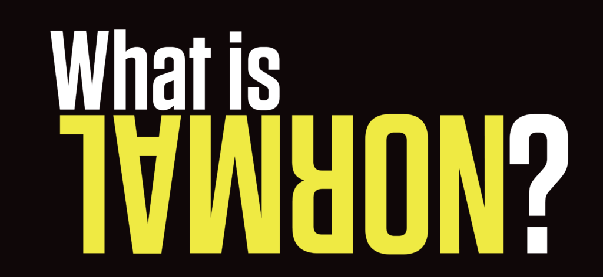

+++
date = 2022-02-01
title = "Ziua 21"
description = "Dintr-un alt punct de vedere, am bilet în primul rând la un nou concept de viață, la un alt fel de viață. Aș putea să o privesc ca o perspectivă fascinantă, dacă nu m-aș bloca atât de mult în normalul ăsta cipat în ADN-ul nostru. "
authors = ["Biannca Locatelli"]
[taxonomies]
tags = []
[extra]
math = false
diagram = false
image = "images/ziua-21-final.jpg"
+++
---

După o noapte mai mult sau mai puțin dureroasă, trezirea mea a fost abruptă. Am avut impresia că aud un zgomot, ca un strigăt și am sărit din pat ca arsă. M-am uitat pe cameră, mama dormea. Ciudat! Eram sigură că am auzit un strigăt dar poate că am visat.

Dacă tot mi-a fugit tot somnul, hai să mă pornesc în zi. Nu mi-a fost mintea prezentă la ce făceam așa că nu am savurat apa caldă de dimineață și nici nu am căutat cu ochii zorii zilei care se mijesc de obicei la orizont la ora asta.

***

Am terminat, mama deja era la baie așa că hai să termin mai repede și sus. În fiecare dimineață, deși din afară pare că sunt relaxată, fiecare mușchi de-al meu e în corzi, vreau să mă duc la ea, să aerisesc, să spăl, să le dau să pape și să plec cât mai repede. Sunt întinsă la maxim și vreau să ies din această stare de "fight or flight" cât mai repede. Corpul meu nu știe că nu mă aleargă niciun criminal, el simte tensiune și-mi pompează cortizol, hormonul stresului, care-mi consumă din resursele altfel necesare imunității. Le știu pe toate, știu cum orice gând aiurea toarnă la propriu otravă chimică în corp și, cu toate astea, nu pun stop. Încă. Dar îmi mai dau șanse.

***

Gata, am revenit la parter, le-am lăsat primenite. Ăsta e timpul meu cel mai fain dintre toate. Am o oră la dispoziție să fac ce vreau eu! De obicei, mă uit pe internet, pe social media, îmi fac un plan pentru zi, beau cafeaua și privesc la cer. Mi-e tare dor de natură! Abia aștept să vină primăvara, să-mi dea un boost de viață și mie, și nouă!

***

Azi am văzut un filmuleț postat de prietena mea cu niște tătici care dansau cu fetițele lor, mici prințese. Măi, e filmulețul ăsta de pus pe rană! Atâta iubire e în ochii prințeselor cât să te încarce pentru o eternitate. Atâta mândrie, atâta bucurie, atâta tandrețe!

Invariabil, m-a podidit plânsul. De câte ori văd din astea sau filme de familie, mi-aduc aminte că și eu am avut un tată, aproape doar pe hârtie. Nu m-a vrut, el voia băiat și am trăit, stigmatizată de el, pe lângă el, ca și cum nici n-aș fi fost. Nu am realizat în anii ăia cruzișori dar această respingere, această lipsă de afecțiune m-a amputat adânc, am pornit deja handicapată într-o viață în care nimeni nu te învață să fii tu, ci cum să fii tu mai bun doar prin comparație cu altcineva. Probabil de-aia am făcut și atât de multe alegeri greșite. Deși, dintr-o perspectivă, nu au fost greșite pentru că m-au adus la acest rezultat care, dacă dau la o parte drama Alzheimerului, e un rezultat superb. Dacă mă întrebai în ultimii 6 ani, cam pe vremea asta, ce fac îți răspundeam instant cu “trăiesc cea mai frumoasă perioadă a vieții mele!” Bad luck so far în al șaptelea an dar e “încă tânăr”, vom vedea ce ne rezervă.

***

O altă conștientizare a orei mele libere a fost că **în orice faci, asigură-te că te simți bine făcând**.

Eu am lecția asta de învățat acum, să trăiesc cu demența mamei și să mă bucur trăind cu ea dar încă sunt repetentă. O să-mi iasă at some point. Ideea e că dacă te simți bine ÎN TIMP ce faci ceva, perioada de timp de încântare este mai mare decât cea a rezultatului. Dacă te bucuri când creezi ceva, te bucuri mai mult, ca și cuantă de timp, decât momentul de secunde în care ai terminat creația. Iar bucuria crește suflet nou, adaugă o buclă faină de viață și impregnează timpul și spațiul ăla în care ai creat cu o ștampilă bună astfel că de câte ori treci pe acolo sau ți-aduci aminte, te mai simți bine încă o dată.

***

Gata, s-a terminat timpul liber, trebe să mă duc să o aduc la micul dejun. În 3. Încerc să evit mesele în 3 pentru că dacă eu trebe să am răbdare cu repetările ei obsedante, altcineva nu e obligat. Dar azi a fost ok, domnul meu a terminat mai repede și a plecat, așa că s-a relaxat și ea, și-a băut cafeluța și s-a grăbit spre apartamentul ei. A înțeles pe moment că nu mi-e bine și a zis că să stau cuminte în pat că și ea stă cuminte în pat.

***

E drept că la propriu, nu prea puteam să fac altceva. Am luat o pastilă, m-am înfășurat într-o pătură călduroasă, mi-am luat laptopul să mai ascult tutoriale ca să dau drumul o dată la blog și m-am așezat pe colțarul din living. Atât de absorbită am fost că nici nu m-am mai uitat pe cameră și nici ușa de la camera ei nu am auzit-o… doar m-am speriat groaznic când m-am trezit cu ea peste mine! A stat ea așa și s-a gândit și nu știe ce i s-a întâmplat de a căzut, cine a găsit-o, cum a găsit-o și tot așa. I-am povestit, a 10 oară, cum s-a întâmplat. Era debusolată, dezorientată, se vedea pe fața ei că nu e cu mintea limpede.

Acum câteva zile a sunat-o o prietenă veche, la care ea ținea tare mult. Au sporovăit atunci mult și bine și după aceea toată ziua mi-a repetat despre Ița, prietena ei dragă.

Azi, după faza cu “cine m-a găsit?” îmi spune “eu nu pricep cine e Ița asta!” M-a blocat!!! Eu credeam că știe cine e, că este o amintire din trecutul ei nu tocmai apropiat, știam că demența afectează memoria de scurtă durată! Am înghițit saliva care mi-a inundat brusc gura, am tras aer în piept și i-am povestit cine e Ița. Nu știe cine e. “Ok, lasă asta acum. Nu te mai gândi la astea. De ce nu stai liniștită?”

A plecat sus, la fel de nelămurită cum a coborât. Iar pe mine m-a lăsat speriată.

***

Azi a fost pentru prima dată când am realizat, puțin, ce înseamnă cu adevărat să nu ai creierul funcțional. De fapt, să ți se atrofieze. E mindblowing! Nici nu am cuvinte să cuprind ce am înțeles.

Noi funcționăm aici, în planul ăsta fizic, ghidați de un normal. E normal sa folosești wc-ul dacă ai nevoi fiziologice, e normal să ieși pe ușă nu pe geam, e normal să bei cu ceva nu să-ți bagi capul în chiuvetă, e normal să nu-ti pui papucii în frigider, etc. Sunt miliarde de lucruri normale după care noi funcționăm. Ei bine, în demență, acest normal nu mai există!!! Iar asta, pentru mine, e înfricoșător. Pentru că nu pot controla situația iar noi, umanii, avem atâta nevoie de control, noi nu ne abandonăm așa ușor!

  

Dintr-un alt punct de vedere, am bilet în primul rând la un nou concept de viață, la un alt fel de viață. Aș putea să o privesc ca o perspectivă fascinantă dacă nu m-aș bloca atât de mult în normalul ăsta cipat în ADN-ul nostru. Dar acum, nu pot. Pentru că e greu de digerat, trebe să creez noi rețele neuronale, să șterg din minte care e normalul și să absorb orice vine. Ușor de zis, al naibii de greu de făcut! Și de neconceput cu mintea asta limitată: cum tot ce știi să nu mai fie valabil?! Cum adică?!

***

La prânz abia dacă a mâncat și nici nu avea chef de vorbă. Voia să stea la ea așa că nu am agresat-o cu vorbe sau cu sfaturi. Face cum simte ea că îi e mai bine. Eu m-am reașezat în living dar mult mai vigilentă de data asta.

Pe la 5 m-am dus la ea, cu toată durerea, să joc table. Era normal. Mă aștepta. ”Dar ce ai, te doare ceva?” Doamne, dă-mi putere! Cât mai multă!!

În timpul tablelor am mai observat o chestie: vorbește urât dacă nu îi iese, înjură, trântește, dă cu zarurile grabită când eu nici nu am apucat să mut piesele, totul e în viteză. I-am zis că jucăm 2 partide dar pentru că oricât aș fi vrut să o las să câștige, zarurile au avut voia lor și am câștigat eu, ea nu se oprea din jucat! Mă vedea că mă apăs pe burtică, că stau chircită, că mă doare dar ea voia să jucăm mai departe. Până câștiga ea. M-am oprit pentru că în acest normal al ei nu există înțelegere, empatie așa că trebe să mi le ofer eu. Nu mai pot și gata!

Nu i-a plăcut, i s-a strâns gura a nervi, ochii îi erau seci și tăioși, am văzut fața hâdoasă a răutății. Încă ceva de adăugat pe farfuria mea, la digerat…

***

Doctorul ei psihiatru zice că demența nu e grea pentru pacient ci pentru familie. Mda, doar că eu sunt singura ei familie. Adică ar mai fi și alții dar lor nu le pasă.

***

Dacă mi-ar da cineva un burete de șters pentru tabla vieții, aș șterge ziua de azi fără niciun regret. Nu-mi vine în minte nicio recunoștință…

 

 

  

    <a href="/blog/ziua-20/">Postarea anterioară</a>
  

  

    <a href="/blog/ziua-22/">Postarea următoare</a>
  

