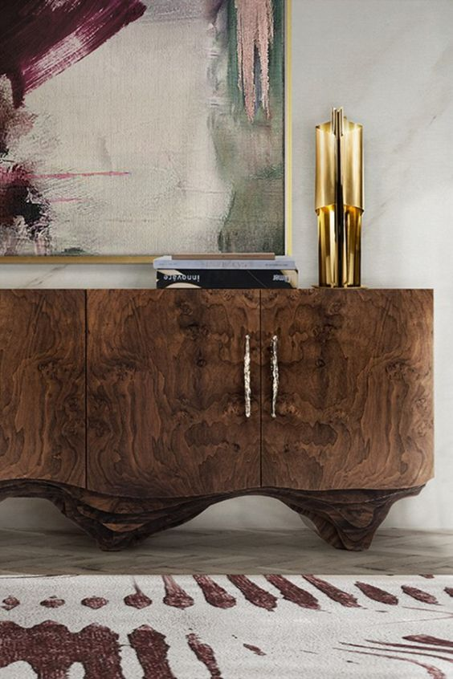

+++
date = 2022-08-10
title = "Ziua 211"
description = "Ieri am desfăcut câteva mecanisme pe care-am pus lanterna și m-am bucurat. Acum m-am prins de ceva mult mai subtil: când pun laterna pe un loc, văd rahatul de acolo și, dacă am sânge-n instalație, mă apuc să fac curat. Cu cât lanterna e mai mare, cu atât luminează mai mult și chiar dacă am făcut curat în locul mic văzut adineauri, în jurul lui, unde-i lumină nouă, e tot rahat, care și el trebe curățat. Cu cât deschizi ochii și demaști mai multe mecanisme, cu atât trebe să speli mai mult."
authors = ["Biannca Locatelli"]
[taxonomies]
tags = []
[extra]
math = false
diagram = false
image = "images/ziua-211.jpg"
+++
---

Melodia alarmei telefonului domnului meu s-a insinuat insistent în somnul meu atât de dulce, că pentru câteva secunde bune n-am realizat că trebe să mă trezesc. Nu-ul meu puternic din dimineața asta vine și el să întărească realitatea aia care spune că ființa umană are negația, de orice fel și a oricărui lucru sau stare, în carne și pe buze, de la prima oră. Da, așa e, dar sunt atât de obosită de nu-mi pot dezlipi pleoapele. Nu pot fizic. Ce ritual, ce ceremonie interioară, ce mulțumiri, ce atenție pe corp, m-am trezit brusc inundată de zgomote de alarmă iar ochii mei refuză lumina, de orice fel ar fi ea.

Cu ochii închiși, mă ridic în fund și adorm pe marginea patului, la jumătatea drumului parcurs de picioarele mele spre papuci. Preț de o secundă, două, am înnodat visul spulberat mai devreme și l-am continuat. Mișcarea domnului meu m-a trezit a doua oară, tot fără succes. Nu sunt în stare să mă trezesc, așa ceva n-am mai trăit de ceva timp! El e deja la baie, eu ar trebui să fiu deja cu ceaiul pe foc și n-am reușit nici măcar să mă încalț. Din nou trebe să-l duc la stația de autobuz iar asta mi se pare o utopie la acest moment. Cum naiba să conduc dacă nu am ochii deschiși?! Cu un efort imens, mă ridic și pornesc somnambulă spre ușă, spre scări cu speranța-n suflet că măcar la trepte o să mă trezesc. Ajunsă la ușă, mă sprijin cu capul de tocul ei și… adorm. A treia trezire, generată de vocea domnului care a răsunat puternic în liniștea mea, în somnul meu mic, a fost cu noroc: am deschis ochii și-am pășit spre parter, ținându-mă de balustradă, să nu cumva să mă duc și mototol, că mototoală deja sunt, până jos. Mă simt cu totul neîncepută și am impresia că sunt încă în vis, lipsa micilor mele momente de ancorare în mine și în zi, mă confuzează și mai mult.

Am făcut saltul direct la apă și la cer, pe care mi le tulbur singură când, dintr-o mișcare a mâini, am făcut țăndări sticla în care a fost siropul de arțar, pe care am spălat-o aseară și am lăsat-o pe blat să se usuce. Nici măcar cioburile nu m-au activat, le-am privit atât de absentă că nu știam de unde să apuc acțiunea. Eu, care m-am lăudat tot timpul că butez rapid, sunt pe undeva pe la un maxim de oboseală, că nu reușesc să mă adun și aduc aici, din lumea viselor. N-am reușit să bifez până la plecarea cu domnul meu decât juma' de halbă de apă de băut și pusul apei în cana mare de ceai, pentru încălzit. Restul o să le fac când mă întorc, sper eu, trezită de-a binelea.

Nu știu când am ajuns acolo, nu știu când am ajuns acasă. Am intrat pe pilot automat să termin apa, ceaiul și smoothieurile, pentru că mama e trează de ceva timp și sigur mă așteaptă. Îmi mai bag o dată fața în palmele pline de apă rece, să-mi spele mai repede brambureala asta ce mă pâclează și urc.

***

Miaul scurt al lui Sassy a fost singurul sunet care m-a întâmpinat și nici nu-mi doream mai mult. Mama e și ea adormită, dar pare ok așa că fac skip la orice activitate de curățenie, las cana cu fructele pasate, pastilele ei, îi pun pliculețul de mâncare roialei cu ochi albaștri și mă tirez. Speranța mea ascunsă este să reușesc să mă culc la loc. Să mă așez cuminte pe colțar și să dorm până scap de ceața asta de pe ochi și din creier.

Cineva acolo sus se încăpățânează să nu-mi dea ce cer că, deși sunt încă bleagă, nu mi se mai leagă niciun somn. Evident că "cineva acolo sus" îmi oglindește fix ce cer, adică lipsa , el nu mă contrazice niciodată așa că timpul meu liber a fost o perpelire de pe o parte de colțar, pe altă parte de colțar, cu ochii-n tavan, cu pleoape închise blând, cu pleoape închise strâns, cu perna sub cap, cu perna pe cap, singura constantă-n tot peisajul ăsta a fost lipsa somnului. 'tu-i mama măsii, unde a fugit frate ăsta așa de repede?! Că doar adineauri ce nu reușeam să-mi deschid ochii iar acum nu reușesc să-i închid… Cum aș putea să mă plictisesc de viața asta a mea?!

***

Îmi fac o cafea strong, dacă tot sunt cal nărăvaș, apăi să mă țină și să folosesc asta, pe parcursul zilei, că treburi sunt de făcut "căcălău, Măria ta!", vorba țăranului către Carol I.

Mă mut cu totul pe terasă și îngurgitez rapid lichidul ăsta amar, ce nu-mi place deloc, dar nu înainte de a-mi umple nările cu mirosul lui, care-mi place la nebunie. Privesc cu ochi noi, mai deschiși, la ce mă înconjoară și-mi dau seama că mi-am pierdut din tabieturi ieșirea dimineață de dimineață pe terasă, să (sur)prind viața din afara mea, nefiltrată. De ceva timp nu mai reușesc nici să termin scrierile fiecărei zi la timp și, deși nu dau socoteală nimănui, îmi dau mie și eu sunt mult mai aspră decât oricine altcineva. Am intrat într-o roată prea mare de lucruri de făcut, care mă acoperă cu mult decât pot duce și, în loc să frânez, eu trag tare să acopăr și mai mult. Epuizarea asta este rezultatul firesc al unor acțiuni tâmpite dar cum deja știu, o să merg înainte până când mă forțează viața să stau o țâră. Dacă, for a change, mă opresc eu înaintea unei frâne d-asta impusă?

Ieri am desfăcut câteva mecanisme pe care-am pus lanterna și m-am bucurat. Acum m-am prins de ceva mult mai subtil: când pun laterna pe un loc, văd rahatul de acolo și, dacă am sânge-n instalație, mă apuc să fac curat. Cu cât lanterna e mai mare, cu atât luminează mai mult și chiar dacă am făcut curat în locul mic văzut adineauri, în jurul lui, unde-i lumină nouă, e tot rahat, care și el trebe curățat. Cu cât deschizi ochii și demaști mai multe mecanisme, cu atât trebe să speli mai mult. It's a never ending story. Realizarea asta mi-a ceva ceva fiori pe șira spinării. Ăsta e butonul apăsat de ego, care-mi trimite semnale de frică și mă-mpunge cu gândul: păi și asta fac toată viața asta, spăl la rahat? Am înghițit ultima picătură de cafea cu știutul răspunsului: da, dar îți muți perspectiva din care privești. Nu speli la rahat, ci te redescoperi, îți lași strălucirea să vadă lumina zilei în realitatea asta iluzorie și te bucuri de asta. Ok, las pe terasă și fiorii, și frica și nemulțumirea. Are sens.

***

Mama s-a trezit și ea și-mi cere, lângă micul dejun, o cafeluță. Nu i-o refuz, mai ales azi când și eu am avut nevoie de cafea, infuzată-n sânge direct dacă se putea, și încep să-i povestesc amorțeala mea de dimineață. Eu povesteam și mama sufla greu. Cu cât accentuam mai spumos oboseala mea, cu atât ea era și mai obosită. M-am oprit din povestit, uimită de ce ravagii poate face în fizic un ego stupid. Mama, de fapt egoul ei, nu poate suporta ca altuia să-i fie mai greu și a preluat frâiele în a fi ea pe primul loc. A început o aoleală care, deși prezentă la jocul egoului, m-a scârbit. Nu știu dacă e judecată sau doar pură observație, dar egoul lăsat de izbeliște pe câmpul ființei umane, este grobian și respingător de-a dreptul. Atât de mult copleșește ființa din interiorul umanului, atât de libidinos o victimizează, încât este un spectacol oribil, greu de privit și de simțit. M-am întors cu spatele la ea, pentru că nu mai suport să văd patetismul ăsta jalnic, de care nu e nici conștientă și nici vinovată. A terminat micul dejun într-o liniște totală și tot așa s-a dus la Sassy a ei.

***

Cu cofeina-n sânge, sunt gata de treburile zilei. Am și uitat că de dimineață, de la oboseală, aproape că era să-mi ratez ziua, îi dau bice înainte și mă-nham la tunsul trifoiului. E adevărat că e vremea ideală pentru operațiunea asta, e înnorat bine, albinele și viespile sunt pe la casele lor, bate și un vânticel fain, numa' bine să termin repede și cu tunsul și cu împrăștiatul tocăturii în curtea de flori și pe la roșii. Socoteala din minte nu se potrivește cu aia de la trifoi, c-așa-i în viață.

Pentru că e încă devreme, trifoiul e plin de apă iar lada de recoltare se umple imediat și atârnă greu. Fac opriri dese pentru descărcare iar împrăștierea e și ea consumatoare de timp. Sper că obida cu care-am zis câteva vorbe de duh pentru clanul cârtițelor să le fi ajuns, au ciuruit fetele astea toată curtea mare, de zici că e șah chinezesc la noi. Nu mă (mai) deranjează doar că atunci când ajung cu mașina la câte-o movilă ascunsă-n trifoiul crescut, reculul mi-aduce mânerul mașinii în piept, în gură, în dinți, pe unde se nimerește la momentul impactului. Azi pot să consider că am tras la sală orele astea petrecute la firul trifoiului și mi-am antrenat bicepșii și mușchii abdominali. Moka. Nu m-a costat decât niște timp și câteva "mulțumiri" sofistricate adresate prietenelor catifelate care, spre deosebire de mine care doar visez la unul, ele chiar fac castele de pământ peste noapte.

***

De sâmbătă, de când am avut episodul de dramă în familie cu copila mea, n-am mai vorbit una cu alta. Ea s-a supărat pe mine că eu m-am supărat pe ea, eu i-am trimis inimioare și îmbrățișări, dar fără răspuns.

Azi primesc mesaj de la tatăl ei, că nu știe nimic de ea și e îngrijorat.

Prima reacție, aia venită din capitolul din mine pe care scrie "mamă" a fost să mi se pună o pată pe suflet. Grija asta crește pe măsură ce tund trifoiul și nu primesc niciun răspuns de la ea, la mesajul ce tocmai i l-am dat. Probabil că gimnastica mea la noul aparat de fitnes, mașina de tuns iarba, mi-a pus în mișcare mai mulți neuroni, că au venit reacții și din alte capitole din mine care mă alcătuiesc ca ființă de sine stătătoare, fără vreun atribut de mamă, femeie, prietenă, etc. Așa am putut să mai și respir, să-mi descleștez inima din strânsoarea grijii care se acutizează pe măsură ce timpul trece și verificatul telefonului nu se soldează cu rezultatul așteptat. Am putut să mă văd pe mine în acțiunile ei, am putut să văd cum și eu dramatizam la fel de acut și de absurd și pedepseam prin absența oricărei reacții oameni care țineau la mine și care-mi "greșeau". Doamne, am putut să văd, aproape cu ochii de carne, negreala asta scârboasă care e drama pe care o exagerăm din dorința de a smulge atenție, și mai multă, cât mai multă, cât mai acaparatoare. Cu cât veneau mai mult spre mine, cu îi atât respingeam mai mult, să-i fac să sufere, să vadă cât m-au rănit. Yuck! O-ri-bil!

E o diferență colosală între a dori să fii lăsată în pace ca să consumi singură o stare nasoală și a te face că vrei să fii singură când te fapt te-ar hrăni toată atenția celor din jur. Și diferența asta colosală e făcută de o comunicare autentică. Acum am învățat și eu. Mi-a luat ceva ani, cam juma' de viață, să pot să deosebesc:

nu pot să vorbesc cu tine acum pentru că vreau să diger bine și să cumpănesc corect situația, înainte de a zice sau face ceva

de

nicio reacție, la oricâte mesaje aș primi.

Prima arată empatia față de toți, a doua e de-un egoism cras. Dar, toate la timpul lor. Tocmai am avut servite pe tavă, în câteva ore, două manifestări grosolane de ego și am fost capabilă să le observ și să nu mă păcălesc nici în judecarea lor, nici în urzeala lor. 1-0 pentru mine.

***

Mi-a luat 3 ore tunsul și împrăștiatul trifoiului și alte 2 ore să leg roșiile, să le copilesc, să scot ce s-a mai stricat, să culeg ce s-a mai copt, să-mi tai florile uscate de la dalii și trandafiri, să strâng și să curăț peste tot. Sunt deșelată, dar am un sentiment de izbândă de-i simt gustul pe buze iar în interiorul meu e bucurie. Sunt verde din cap până-n picioare, e aproape 16 și trebe să-i pun mamei prânzul.

Eu sunt în vervă, pe final de baterii, ea nu, și zău dacă știu cum să înțeleg momentul: n-are chef de vorbă sau e plecată? Încerc o conversație, mă leg de evenimentul zilei, tunsul, pe care n-are cum să-l rateze că doar i-a huruit mașina de tuns în creier destul, dar în afara faptului că-mi spune că știe, conversația se închide înainte de a începe. Ok, o las să se concentreze asupra mesei și îmi fac de treabă la chiuvetă. Vreau să mă opresc după ce termină ea de mâncat, că am mers la sală destul azi și mi-ajunge. Am un zâmbet înțelegător pe față: fac pariu că mâine o să mă aolesc de oboseală? Fac. Hahaha.

***

Doamne, ce nebunie mișto e un duș călâi după o zi de muncit în curte. Îmi place maxim și cred că e cea mai potrivită răsplată pe care mi-o pot oferi. Asta, niște pepene rece și un nou serial din documentarul de pe Netflix, Unwell. Nu le apuc pe toate dintr-o bucată, trebe să intercalez unghiile mamei dar, chiar și așa, crăcănată de efort, le savurez cu maximă intensitate. A venit și mesajul copilei că e bine, mi-a validat ce știam deja, am pus cunoașterea asta nouă în cămăruța experienței cu ea, cu grija, cu drama, ca data viitoare să pot s-o accesez din mai multe perspective și mi-am așteptat domnul, secondată de un rârâit tors de o Spikylina ce-a vagabondat toată ziulica. E și ea praf de obosită și plină de scaieți și ne lățim amândouă la o lălăială binemeritată.

***

Totul e bine când se termină cu bine, nesperată energie pentru o zi care-a-nceput cu ochii închiși. Sunt muncită, dar am în vene bucurie de viață și sunt recunoscătoare pentru:
1. Cafea!
2. Mișcarea în natură!
3. Abundența de de toate, din viața mea, la tot pasul!

Clipa mea de frumos:

  

