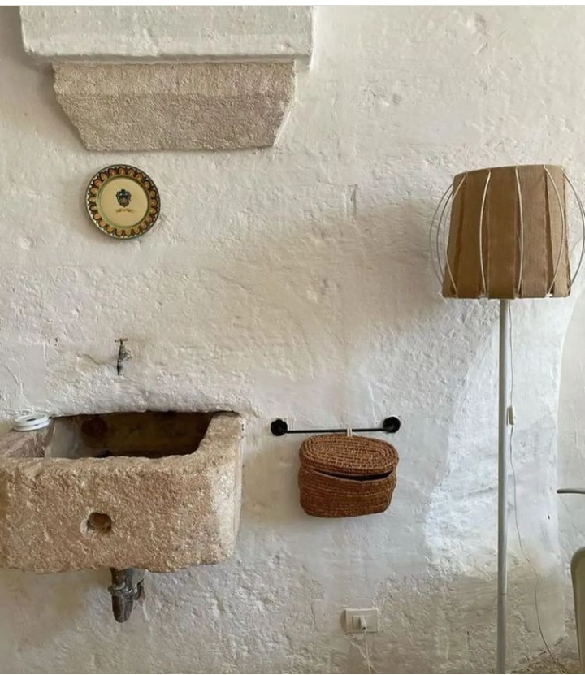

+++
date = 2022-08-12
title = "Ziua 213"
description = "Am o exaltare și o încântare și o mare intimitate a mea, cea de deasupra, cu mine, cea mai din adânc. Am căpătat un drag de toate stările mele, fie apocaliptice, fie de beatitudine, și realizez plin că fără balizajul ăsta care e demența, nu m-aș fi învrednicit să aduc esențialul în jurul meu, nu aș fi tăiat rahatul și balastul care-mi prisosea în jur, dar nu mai puțea și eu nu-l mai simțeam, nu m-aș fi întors la singura ființa care contează cel mai mult pentru mine. EU."
authors = ["Biannca Locatelli"]
[taxonomies]
tags = []
[extra]
math = false
diagram = false
image = "images/ziua-213.jpg"
+++
---

M-am trimis pe tărâmul viselor târziu și m-am adus înapoi devreme, fără supărări, fără tânguiri, s-a gătat bucata de vise și aia a fost. Dacă m-aș prinde care este ingredientul minune pe care mi-l strecor în carne și minte, în timpul nopții, de mă trezesc așa, simplu, dintr-o bucată, mi-aș face stocuri mari din el și mi l-aș turna în fiecare plecare în noapte. Mi se pare tare mișto și tare refreshing modul ăsta de trezire, total neutru și nepărtinitor, nici nu mă umple de entuziasm fără margini, dar nici nu mă mai dau cu fundul de ceasul morții.

Mi-am început depănarea mulțumirilor de pe la 3 noaptea, dar am tot adormit în mijlocul lor. În ceasul prea dimineții, mintea a preluat însă firul și am continuat cu restul, calm, ca și cum n-a existat timp și spațiu între ele. Cum, de fapt, nici nu există decât în mintea și realitatea liniară. Am împrumutat, fără să vreau, starea asta faină de neutralitate și trăirilor din mine, în ritualul meu intim cu Universul și mi s-a părut cel puțin interesant. Nu am crezut niciodată că atunci când vrei să mulțumești "din suflet", o poți face și calm, fără să chemi vreo emoție în sprijinirea mulțumirii. Uite că se poate și-mi dau seama că nu e nici ceva mecanic sau de bifat în acțiunea mea. Ca întotdeauna, e greu de pus în cuvintele astea mici o plenitudine de stare dar azi am simțit, visceral, cum e să fii neutru, cum e să nu-ți clocotească sângele într-o direcție și să nască o emoție fierbinte, aproape a rugă, dar nici să fii stană de piatră. Omul, cât trăiește, învață. Dacă-și deschide ochii și inima.

Corpul mi-e cooperant, nicio durere sfidătoare nu-mi dă târcoale pe vreundeva, Spiky nu e în pat, așa că mă întind cu putere și cu plăcere, cât sunt de lungă.

***

Pe lista mea persoanlă de to do-uri, stă, de multișor deja, yoga. De preferat, dimineața. Nu-mi iese nicicum. Poate că în zile ca asta, când mă trezesc scurt dar cert, aș putea strecura o yoga, în timpul meu liber. Dar zilele astea sunt răruțe, de obicei sunt cam grumpy, corpul mi-e butucănos și atunci ultima pe lista mea e yoga. N-ar strica nici un stretching, măcar scurt, dar nici la ăsta nu mă învrednicesc.

Spiky e jos, a făcut opinie separată de noi noaptea ce-a trecut și acum mă privește somnoroasă, cu jumătăți de ochi de jad. Nu se sinchisește să se dea jos din mijlocul fotoliul pe care și l-a revendicat într-o zi și se întinde să-l cuprindă parcă pe de-a-ntregul. Fătuca asta la fiecare trezire din somn, scurt sau lung, face neapărat întinderi, au animalele astea un știut instinctiv în ele de speriat, ar trebui s-o las să-mi fie învățătoare la lucrurile astea mai de bază. Și la ăla cu prezența, unde ele excelează clar înaintea umanilor.

Apa fierbinte mi-a mângâiat gâtul și i-am simțit tot traseul. Am încălzit-o cam tare dar uite că așa parcă știu pe unde a descărcat intențiile ce i le-am pus în cârcă, simt locurile unde ele au coborât în mine ca dintr-un autobuz în stația unde trebuia. E mișto vizualul ăsta și, cu ochii pe cerul meu drag, plin de tușe șterse și prelungi de roz, mă întreb care o fi motivul pentru care descarcă ea o anume intenție într-un anume loc. În acest mic moment, nu mă simt deloc ruptă de cer, de aer, de verde, de mama pământ, de tot ce există. Sunt o rotiță mică-mică în curgerea Universului.

***

Un strop Universală sau strop de Univers, mă duc la mama să descarc și la ea bunătățile cu care mă duc în fiecare dimineață, pentru fiecare locatară a camerei: smoothie bun și proaspăt pentru ea, pliculeț cu mâncare bună pentru sora mea blănoasă, Sassy. Ca de obicei, ea mă întâmpină miorlăind cu spor încă de când deschid ușa, iar ochii mamei mă privesc cu zâmbet în colțuri. Al meu zâmbet deschide mai cu aplomb ușa și mă-mbie la o conversație. A dormit bine, parcă se simte-n aerul din cameră odihna ei, iar asta mă bucură. Dau darurile cu care am venit și mă aplec să drăgălesc și-o grăsană, care mi se împleticește printre picioare, moment în care mama pune o întrebare "deplasată": ce fac celelalte pisicuțe? Ori mi-a văzut fața uimită, ori mintea ei este azi super prezentă la fața locului, că imediat s-a redresat și mi-a zis: stai, că visez, spun prostii, așa-i? Pfiu, da, dar ce bine că te prinzi! Aproape că nici nu mai contează ce-ai spus cu 2 secunde înainte, recunoașterea asta a făcut cât o mie de puncte. Dacă nu s-ar cufunda atât de rapid și atât de cu totul în tableta aia, azi am putea închega un dialog veridic, dar ea n-are chef de nimeni așa de dimineață probabil, cu atât mai mult să stea la palavre. O las în pacea și plăcerea ei, mai mângâi rotofeia dragă și plec și eu în pacea și plăcerea mea.

***

Mi-am bucurat ochii de dragul pe care l-am picurat în fiecare obiect care mi-a alcătuit designul intim și fain, mi-am luat și eu smoothieul și sunt gata să mă afund, cu voluptate, în timpul meu liber, cu intenția clară să-l fac timp magic.

Iar mi se bulucesc dorințele toate-n timpul ăsta prea mic să le cuprindă pe toate: aș citi, aș asculta, aș privi documentare, mă fură o țâră și social media, mă fură mai mult site-urile de antichități și reușesc să promit minute bune aproape fiecăreia dintre ele.

Cel mai mult m-a prins un interviu al unei tipe de 75 de ani, Karyn Calabrese, o femeie fascinantă de-a dreptul care de vreo 40 de ani este raw vegană și la 75 de ani arată ca la 50. Are femeia asta o vitalitate și-o poftă de viață și-o filozofie de viață, că n-ai cum să nu te oprești s-o asculți cu atenție, să-i furi din energie și să-ți bagi în sacul propriu. Well, când mă fac eu mare, așa aș vrea să fiu. Ăștia sunt oameni care au fost pionieri la viața lor, au creat cărări pentru alții, îmi dau seama cam cum era privită ea, acum 30-40 de ani când a deschis primul restaurant raw vegan! Și-acum se uită mulți cruciș, dar pentru ea a fost de două ori greu, o dată că era o noutate absolută raw veganismul în zonă și a doua că e femeie "de culoare". Și-a luat mult hate, dar credința ei a fost mai puternică și-a rămas înțepenită, cu coloana dreaptă, înfiptă-n infinitul Universului. Mi-a plăcut imens interviul și de ea și mi-a dat un vibe bun și un suflu de încredere în toată ființa mea. Mulțam!

***

Știu sigur că Universul o să-mi servească în feed-ul vieții oameni de același calibru ca și Karyn, cred în legea atracției așa că o să mă las purtată de val și de viață, cu curiozitate. Până atunci, trebe să mă ocup și de chestii mai triviale și pământești, cum ar fi adusul mamei la micul ei dejun. Mănâncă cu poftă, e vivace și vioaie, cât îi permite corpul evident și nu pot să n-o compar cu Karyn, că doar au aceeași vârstă. Mama de abia coboară și urcă un etaj iar Karyn tocmai își mai deschide un restaurant, se scoală la 5 dimineața, și până la 9, are ritualul de la care nu se abate: apă caldă, yoga, micul dejun raw, plimbare, cântat, natură. Nici eu nu mă țin de asta, care am avut acces la info și am fost capabilă să-i simt seva adevărului, d-apăi mama care de abia a ieșit din apartamentul ei în ultimii 15 ani.

Amândouă au în ele același drive, aceeași dorință de a trăi, mama mi-a demonstrat-o pe a ei când a avut cancerele, dar cât de diferit e modul în care au ales s-o facă, cât de antitetic. Una târâș, alta mai la înălțime. N-o judec pe mama, ar fi aberant, e doar un studiu de caz interesant care îmi scoate mereu și mereu noi fațete la analiză. Avem viața pe care vrei să ne-o asumăm. Dacă ne locuiește comoditatea, pesemne că ajungem la finalul vieții mai în gropiș, dacă vrem să ne smulgem din dulceața confortabilului și suntem perseverenți, indiferent câte recompense "dulci" pierdem de parcurs, s-ar putea să avem ceva zvâc în aripi, atunci când ne îndreptăm spre liniștirea lor totală, în viața asta.

Urc cu ea să-i cremuiesc bucățelele rămase din copitele astea încăpățânate și s-o anunț că mă apuc de curățenie în garaj și câteva ore, multe, nu mai trec pe la ea. Nu-i bai, ea e "cuminte". Paradoxal, azi îmi dau seama că n-aș vrea să fie cuminte, în sensul comun al cuvântului, aș vrea să iasă în curte, să muște din verdele ăsta care încă ne umple mișto de viață, să stea pe terasă macar să vadă și să audă pulsul vieții, să citească, să cânte, să face orice altceva decât să fie cuminte, așa cum vede ea cumințenia: stând în pat, cu tableta în brațe. Dar nu pot să doresc în locul ei iar entuziasmul meu n-o cuprinde și pe ea.

***

Mă apuc de organizarea garajului/atelierului meu pentru că azi ne vin lemnele pentru focul din șemineu și trebe să le fac loc. Mi-e drag tare locul ăsta, aici îmi eliberez "demonii" creativi, spațiul ăsta-mi îmbrățișează blând ideile și mă ajută să le nasc în realitatea palpabilă. Am îmbibat pereții atelierului cu podcasturi interesante, cu cântatul meu în zile de destrăbălare maximă, cu vorbe de duh atunci când nu-mi iese ceva sau nu-mi iese cum vreau, cu sângele meu la propriu când mă fură valul și pierd prezența. Starea asta de creativitate, de fapt de aducere în concret a unor idei care sunt acolo deja, în universalul colectiv, e absolut demențială și te fură fără să te prinzi, ducându-te în tărâmuri faine cu costul unor bucăți de timp. De fiecare dată când am intrat în garaj să creez ceva, parcă am pășit într-o altă realitate unde am petrecut doar puținel, când de fapt, în realitatea celor din jur, s-au scurs ore bune. Garajul ăsta sortit să-mi devină atelier este portalul meu spre o stare dincolo de bine, dincolo de așteptări, dincolo de o înțelegere liniară.

De când e mama aici, nu am mai creat mai nimic, l-am neglijat cu totul și acum simt că de fapt mi-am neglijat partea aia, mare, de suflet care vibra și pulsa nebunește de frumos în orele în care mă pierdeam cu totul acolo. Am tras ușa acolo, s-a făcut umbră, bucata de suflet nu comentează ieșirea din scenă și așteaptă cuminte "reînvierea|". Azi doar trec prin garaj ca să-l curăț un strop, poate o să fie o dată viitoare când o să mă așez din nou pe scaun și o să mă apuc de multe proiecte lăsate în aer. Am bucăți de mobilă, scaune, uși vechi, mic mobilier care stau claie peste grămadă, fără să mă certe, pline de praf, așteptând să le dau straie noi. Cândva, o să-mi fac timp. Cât mai curând.

***

În genere, în viața mea, chiar dacă n-am fost atentă și capabilă mereu să disting asta, de câte ori a ieșit ceva, altceva a venit să umple sau chiar să depășească golul. De câte ori am pierdut ceva sau pe cineva, altceva sau altcineva mi-a alinat golul și mi-a depășit așteptările. La mine chiar e valabilă zicerea aia că dacă pierzi ceva este pentru că de fapt faci loc pentru ceva mai bun.

Chiar dacă sună incredibil, mai ales pentru mine, de ceva timp viața mea are un farmec anume și o căldură tare plăcută. Poate demența mamei mi-a dat una peste ochi atât de tare că i-a forțat să vadă clar și limpede ce e de fapt cu adevărat important și plin în viața mea, m-a forțat să mă adun mai aproape de mine din împrăștierile constante pe care le fac, m-a forțat să mă strâng într-un loc mic de unde să radiez mare. De când mă apropii cu ochii ființei de clipă, și mă uit mai bine la ea și la mine, mi se pare, cu toată demența care e tot în casă și tot în viața mea prin mama, că am o exaltare și o încântare și o mare intimitate a mea, cea de deasupra, cu mine, cea mai din adânc. Iar astea sunt niște straturi care-mi stau, chiar dacă latente sau ignorate în unele zile, în toate zilele în care Universul mă lasă să experimentez aici. În lumea mea devenită brusc și mai mică, că mică deja era, e o prietenie caldă între stări, între mine și stări, sau o ceartă caldă între noi. Am căpătat un drag de toate stările mele, fie apocaliptice, fie de beatitudine, și realizez plin că fără balizajul ăsta care e demența, nu m-aș fi învrednicit să aduc esențialul în jurul meu, nu aș fi tăiat rahatul și balastul care-mi prisosea în jur, dar nu mai puțea și eu nu-l mai simțeam, nu m-aș fi întors la singura ființa care contează cel mai mult pentru mine. EU. Încep să mă iubesc cu noi nuanțe în fiecare zi și e total diferit de iubirea cu care îmi îmbrac oamenii dragi. Deși încep să fiu obiectivă și la ei, să mi se ia pânza de pe ochi, să-i iubesc și-n colțurile lor, chiar dacă cu ele mă-nțeapă adânc uneori, e ceva în iubirea mea pentru ei pe care nu pot pune degetul. E un știut adânc în ființa mea că nu voi reuși niciodată, că nu am cum, e imposibil pentru mine să îi cunosc cu adevărat, în toate susurile, dar mai ales josurile lor. Pe când cu mine, cunoașterea asta e posibilă și stă după colț, așteptând să-mi dau jos încordarea sau rușinea sau jena sau neputința și să pun lupa și lanterna acolo. Când în față mi se dezvăluie un ocean de explorat, pe care știu visceral că-l pot cerceta bucățică cu bucățică, că-i al meu, un altfel de iubire mi se așează pe pliuri, o altfel de căldură și curiozitate și drag mă locuiesc. Iar asta e cea mai frumoasă și cea mai mare descoperire pe care mi-a dăruit-o demența mamei.

***

M-am întrerupt din treaba și visarea mea din garaj pentru prânzul mamei, când dai din mâini a treabă și din minte a cuprindere, timpul, fata asta morgană, se risipește criminal de repede. De data asta, mama nu mai e nici flămândă, nici vivace, e molcomă și … cuminte. Nu vreau s-o agit, o las în apele mei pentru că, recunosc, nici eu nu vreau să mă agit, îmi plăceau apele mele.

***

Cred că atrag ca un magnet treabă de făcut, pe unde trec găsesc ceva de așezat, de spălat, de strâns, de aranjat. Am strâns în urma mamei și m-am regrupat în garaj, să termin și acolo că în puțin timp o să vină lemnele.

E o gâlcevăraie mare afară, se dă o luptă pe viață și pe moarte în vrăbiuțele care nu știu cum să prindă loc pe marginea cazanului cu apă, să bea sau să se scalde, și cum să se ferească de marea prădătoare, Spiky, care e pitulită la adăpostul roșiilor, gata mereu, pregătită să facă saltul mortal. De sus, de pe gard, a ochit-o o coțofană și a dat alarma iar tot clanul păsăricesc ce era la ștrand a devenit alert și extrem de zgomotos. Eu sunt oricum cu un ochi atentă și la coconetul-fiară, să nu cumva să facă rău vreunei vrăbiuțe și, când o văd încordată, gata să sară, sar eu din garaj și o sperii și pe ea dar și vrăbiuța. Știu, interferez cursul naturii, dar nu mă lasă inima să las să se petreacă o crimă sub ochii mei, doar de dragul jocului. Spiky are mâncare la discreție, nu vânează de foame dar nici nu face ca pescarii adevărați, ăia de pescuiesc și apoi, după ce au perforat cu acul un pește, îl eliberează, în marea lor mărinimie. Ea se joacă și cu vrăbiuțele, și cu șoricei, și cu gușterii, și cu șerpișorii până îi omoară și îi lasă așa iar asta, pentru mine, e o mare risipă de viață, inutilă. Dacă pot s-o preîntâmpin, mă doare-n cot că disturb mersul natural al lucrurilor, voi salva mereu o vrăbiuță, șoricel sau gușterel.

Mi-aduc aminte o dată, am salvat un șoricel, d-ăla mic, și l-am eliberat în câmp, să fugă. Cum s-a văzut pe pământ, s-a lipit cu burtica de el și aproape că nu mai respira. N-avea nici un gând de fugă, înțepenise acolo și, ca să-l hotărăsc, am luat un pai cu care l-am împins încetișor pe spate. În momentul în care l-am atins, s-a strâns și mai mult și s-a auzit un gemut mic, care mi-a rămas în inimă și care m-a impresionat imens. L-am luat din nou de jos, l-am mângâiat și l-am dus mai departe în câmp, unde s-a prelins apoi în mare viteză. Dacă-mi va sta în puteri, întotdeauna voi prețui viața dintr-o viață.

***

Îmi trag sufletul doar un strop, până vin lemnele, pe care le descarcă mașina în poartă, de unde trebe cărate și stivuite în garaj. Noroc că avem două roabe, noroc că suntem doi și, chiar și așa, tot ne-a prins întunericul. Mr. H, mai practic, a avut geniala idee să renunțăm la stivuit și doar să aducem lemnele în interior iar mâine, pe zi, să le punem la locul lor. E cea mai corectă abordare și simt că o dată cu închisul ușii de la garaj, mi s-a scurs și ultima fâlfâire de energie pe care o mai am în vene.

***

Apa asta bestială îmi mai dă o ultimă bucurie pe ziua de azi și cred că adorm în drum spre pat, în timp ce-mi numesc recunoștința pentru:
1. Senzația asta mișto de neimportanță, de apartenență intrinsecă la ceva mai mare, în care nu sunt nici indispensabilă, nici dispensabilă, sunt și atât!
2. Inspirația venită de la Karyn Calabrese!
3. Atenția din ce în ce mai mare pe care mi-o acord în propria-mi descifrare!

Clipa mea de fain este:

  

simplu și organic

 

 

  

    <a href="/blog/ziua-212/">Postarea anterioară</a>
  

  

    <a href="/blog/ziua-214/">Postarea următoare</a>
  

