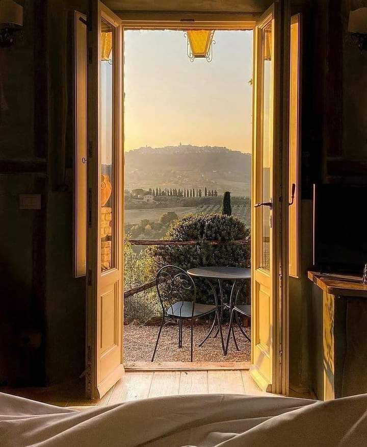

+++
date = 2022-08-15
title = "Ziua 216"
description = "Drama e prima noastră piele, e prima care se înfoaie când ceva sau cineva nu face cum așteptăm noi, tacit, fără să deschidem gura să cerem. Așteptarea mea, ca a milioane de femei de altfel, este că atunci când avem o greutate și e vreun bărbat prin zonă, să ne ajute. Și la propriu, și la figurat. Doar că nu și spunem asta și feri-l-ar pe ăla care nu face ce noi n-am cerut să facă, dar am așteptat."
authors = ["Biannca Locatelli"]
[taxonomies]
tags = []
[extra]
math = false
diagram = false
image = "images/ziua-215-1.jpg"
+++
---

Zorii mi-au adus în concret, în realitate, senzația pe care am avut-o cred că toată noaptea, de "pe repede-nainte". Zici că cineva m-a tăiat la o venă, a aruncat înăuntru o capsulă de neastâmpăr cu telecomandă, pe care mi-o plimbă insistent prin sânge, când sus, când jos, de mă zgândăre și nu-mi vine să stau locului. Am avut vise agitate, tot de nestare, în care trebuia să ajung undeva și nu reușeam iar primul gând-întrebare la mugurele trezirii a fost: hai, sus, ce mai stai?! E adevărat că mă așteaptă niște zile de foc, onomastici de oameni iubiți, dar asta nu înseamnă că nu trebe să mai am somn. Sau asta înseamnă?

Abia am mulțumit, scurt și cuprinzător, pentru minunea de a mă trezi la o nouă viață, că zăpăuca din mine, personalitatea efervescentă și zăpăcită, m-a aruncat în papuci, n-a mai luat niciun puls la niciun corp, și m-am trezit deja în bucătărie. Spiky, cu al nșpelea simț al ei, s-a prins că umana de azi nu prea seamănă cu aia de ieri și a rămas cumincioară în pat. Treaba ei, la cât de în priză m-am băgat în prea dimineața asta, sigur îți lua prima porția.

***

Singurul care are o putere hipnotică deja asupra ochilor și implicit asupra stării mele sufletești, este cerul care azi mi-e super senin, privirea-mi alunecă lin și mângâietor peste el, în toate marginile pe care le pot cuprinde cu ochii de carne, iar linul ăsta parcă mă unge pe interior mai abitir decât o face apa, azi. Deși de obicei le fac pachet, azi a fost un duel câștigat clar de celest, apa nu a putut să-mi capteze atenția și dragul la fel de mult ca liniștitul ăsta, atât de antitetic cu focul care mă circulă prin vene. Stropul ăsta de liniște n-a durat mult, m-am apucat de smoothieuri, de ceai, de strâns prin bucătărie, un fel de avanpremieră la ce mă așteaptă la mama în cameră. Sau ce cred eu că mă așteaptă.

***

Dacă există pe lumea asta o fobie la aer, sigur mama o are. Altfel nu–mi explic cum poate să se ferească atât de mult de o fereastră larg deschisă, mai ales acum vara, mai ales dimineața, când e atât de răcoare și de mișto. Mă bușeșc din ușă aerul închis, parcă clocotitor, îmbibat irespirabil de mirosuri și vocea mamei, care nici n-așteaptă să-nchid ușa și-ncepe tânguiala: că transpiră îngrozitor de mult, că nu mai suportă, că să-i dau ceva, să scape naibii de transpirațiile astea care "au tâmpit-o de cap". În condițiile în care este cu un pulover pe ea și băgată în păturică, cu geamurile închise. În cameră, ca și-n baie, haine întinse la uscat, semn că da, transpiră mult, așa cum a făcut-o dintotdeauna, mai cu spor îndeosebi după cancere. Deschid larg geamurile, iubesc aerul ăsta care mă ajută să-mi dezlipesc nările, închise în șocul mirositor, o pun să se schimbe în cămășuta de bumbac cumpărată de mine, îi iau pătura, o împachetez și o pun deoparte, îi dau smoothieul și-i spun că nu există pastile antiperspirante și că, și de-ar exista, eu alte pastile nu-i mai adaug la cele pe care le ia deja.

S-a mai răcorit și în cameră, și ea se simte mai bine, încep să-i simt relaxarea prin aer. așa că-mi mut fizicul și atenția în baie, la dereticat. Cu zvâcul dimineții în vene dar și motivată de dorința de a pleca de acolo, termin rapid și las în urmă parfum de domestos, noua modă a mea din sezoanele de anul ăsta. Sassy s-a liniștit și ea, că mi se tot freca de picioare și mă miorlăia țigănește, astea două au fie personalități similare, fie și-au împrumutat una de la alta trăsături de la atâta stat împreună. Am intrat în aoleală, ies în liniște, și nu pot să nu mă mândresc în sinea mea cu mine: pe unde trec, las ceva bun în urmă. Ptiu, drac de ego!

***

Nu-mi pot consuma timpul liber pe altceva decât pe planificare: azi e Sf. Maria și trebe să îndeplinesc cerințele coanei mari și-mi listez acțiunile și cumpărăturile, ca să acopăr cât mai multe dintr-un drum. Poimâine e ziua domnului meu și următoare zi după, e ziua de naștere a mamei. Sunt multe iar eu, doar una. Vorba lui Mr. H "cu cine vorbesc să te clonez?". Nu știu dacă a aflat între timp cu cine, dar acum mi-ar prinde bine să mai fiu încă una sau să mai am un ajutor. Limitată de împrejurări, mă descurc doar cu mine dar am liste peste liste, to do-uri peste to do-uri și timp, pe sponci. Voi vedea, sper eu să le cuprind pe toate și să nu pic lată.

***

În speranța acelui prânz și a tortului, mama abia înghite oul fiert și-mi cere o cafeluță iar eu, taman de ziua ei, nu pot să-i zic nu. Îmi mai repetă ce vrea, n-a uitat, știe clar ce mi-a cerut, mai oftează de dorul fratelui ei, e extaziată că la prima oră a sunat-o prietena ei veche și-mi repetă conversația, pe repeat, cu fiecare dumicat pe care-l mestecă de o mie de ori, cât să aibă timp să-mi povestească toată conversația. Cu cadența din doi în doi, la fiecare al doilea dumicat o ia de început, de parcă dumicatul ăsta pe care l-a mestecat în liniște a șters brusc și total cuvintele și ecoul lor din memoria ei. La fiecare repetiție, egoul ei răzbate strălucitor și triumfător: prietena ei îi spune că toată lumea din Moreni o întreabă: Unde e Lia? Ce face Lia? De ce nu mai vine Lia? Grija tuturor e unde e Lia, în orașul ăla mic. După o serie de astfel de repetiții, ca să opresc acul ăsta deraiat de pickup, o întreb încet, pe un ton blând, de ce contează pentru ea că lumea întreabă. Neașteptat pentru mine, mama a prins nuanța aia ironică și de judecată din dedesubtul întrebării, deși eu nici măcar nu mi-am dat seama că le-am pus acolo, și-mi răspunde dojenitor: "Măi Bi, nu sunt închipuită! Chiar întreabă lumea! Și da, contează, că înseamnă că am fost cineva bun!" Off, ego all the way. I-am cântat în strună, n-are niciun sens să-i dărâm speranțele astea aiurea și-am lăsat-o pentru restul dumicaților să mă "încânte" cu aceeași poveste. Mi-am închis parțial frecvența cu ea, îi mai privesc buzele din când în când și mai aud frânturi deja binecunoscute. Am plecat deja de lângă ea, pentru că nu știu cum aș putea să stau și să fiu prezentă, cu atenție maximă în moment, la aceeași poveste reluată fără număr. O fi existând o cale, eu am găsit-o p-asta și nu mă simt nici prost, nici vinovată. Câteodată nu am răbdare și nici nu cred că ar trebui neapărat să am. Îmi trăiesc momentul meu în prezență iar el mă duce departe cu mintea și cu gândul. E și asta un fel de prezență, zic eu.

***

Am plecat la cumpărături și-mi dau seama că zvâcul ăla cu care-am cochetat toată noaptea și dimineața, chiar mă ajută. Trebe să trec prin 6 locuri diferite, să iau din fiecare câte ceva și să ajung acasă fresh, aptă să pun la pregătit prânzul pe care și-l dorește coana mare.

Primul pe listă este Hornbach, ni s-a terminat sarea de la stația de dedurizare și trebe să cumpăr. Hornbach e a doua mea casă, știu unde sunt lucrurile cu ochii închiși și îi cunosc pe cei mai mulți și mai vechi vânzători de acolo. Sarea e întotdeauna depozitată afară, așa că intru cu mașina în drive in. Un sac de sare, care s-a scumpit cu 20% în două luni (!), are 25 de kg iar și chiar și pentru mine, obișnuită cu căratul greutăților, e mult și am impresia că-mi pică rinichii. Tot afară, la câțiva pași de mine, un tânăr cu uniforma magazinului, mă vede cum mă coțopenesc cu sacul și decide să se tireze rapid din zonă. Cu toată prezența mea în moment, dar și cu rinichii pe la genunchi, începe dialogul în capul meu, cășunându-mi pe om: nu puteai, frate, să faci o faptă bună și să vii să mă ajuți? Nu vezi că mi-e greu, că m-am umplut toată de sare în încercarea mea de a ridica sacul să-l pun în portbagajul înălțat, peste putirința mea de a ridica? Nu vezi, frate, că-s femeie?!

Drama e prima noastră piele, e prima care se înfoaie când ceva sau cineva nu face cum așteptăm noi, tacit, fără să deschidem gura să cerem. Așteptarea mea, ca a milioane de femei de altfel, este că atunci când avem o greutate și e vreun bărbat prin zonă, să ne ajute. Și la propriu, și la figurat. Doar că nu și spunem asta și feri-l-ar pe ăla care nu face ce noi n-am cerut să facă, dar am așteptat.

Partea mișto care mi se revelează în bucata asta de viață este că dacă avem răbdare, pielea asta năpârlește fain, în timp, și sub ea e una nouă, roz, ca de bebeluș, primenită, fără așteptări și fără dialoguri. Azi n-am avut răbdare.

Intru să plătesc sarea și ies la mașină, încheind dialogul steril și neproductiv din mine. Ei, aș! Afară, la standul de tubulatură, același tânăr ajuta un bărbat să încarce în Mercedesul lui ultimul răcnet (cred) niște flinticuri de țeavă scurtă, de 200 de grame bucata. Wow, păi mi s-au prăvălit toate vorbele de duh pe băiet, instant! Adicătelea, eu femeie, cu mașina sarcofag mergător, n-am prezentat atâta interes ca el bărbat, gen business man, cu Mercedes. Mi s-a urcat revolta din stomac în gât și mi se punea de lacrimi. Băi, dar nu e corect! Îmi venea să mă duc la ăla să-l fac cu ou și cu oțet, să-l bălăcăresc, să-l porcesc, să-l orice, numa' să mă răcoresc și să scap de clapeta asta care mă strângea în gât.

Da, nu e corect, din perspectiva mea. N-o cunosc pe-a lui și nu pot să mă pronunț. Dar fraiera momentului sunt eu, și nu pentru că-s femeie devalorizată de un puștan în fața unui business man, ci pentru că încă mă revoltă astfel de situații. Doar am avut parte de ele mii de-a lungul a juma' de viață, ce mă împotmolesc acum în ele?! Ar trebui să las să curgă. Uite că m-am atașat de situație și fac pariu că data viitoare, o să recreez fix la fel momentul, pentru că am deja în sistem așteptarea ca așa o să se întâmple.

***

Mi-am stricat singură starea. Deși la DM voiam să investigez ce noutăți vegane au mai apărut, mi-am luat pasta de dinți vegană, fără flor, și-am ieșit rapid. Ba m-am mai și beștelit singură în gând: degeaba te speli cu pastă de dinți fără flor, ca să nu se calcifieze glanda pineală, că tot te iriți de la prostii! Bun așa, am început rostogolirea rahatului, din starea proastă creată adineauri, trec la următoarea, să mă cert pe mine, pentru fleacuri. Hai că dac-o țin așa, până ajung la cumpărături, mă iau și la bătaie!

Intru și la Pepco să-i iau mamei o păturică mai groasă, că pilota e prea groasă și prea grea pentru serile în care ei îi tremură dinți-n gură de frig (!). Pentru că vreau numai bumbac, fără sintetice, ies cum am intrat, cu mâna goală. Starea mea de iritare îi împroașcă o țâră și pe ăștia de la Pepco, care au numai prostii, nimic de calitate. Culmea e că mă prind că scuip venin, și-n cei din afara mea dar și-n mine și tot nu mă opresc.

La Carrefour cred că n-am mai putut să gândesc sau mi s-a rupt brusc filmul. Atât de mulți oameni, fiecare tranzitând să cumpere ceva, o agitație și-o zumzăială cumplite, care m-au anesteziat brusc. Dacă n-aș avea lista de cumpărături, aș zice că mi-a făcut cineva o lobotomie scurtă și rapidă. Ce naiba caut eu la cumpărături în zi de sărbătoare?! Așa-mi trebe!

De la Carrefour, fuga la brutăria din sat, să iau tortulețul comandat pentru mama, apoi fuga la Lidl și după aproape trei ore, am ajuns din nou acasă, sleită de puteri și lipsită de orice chef. Dar nu contează dacă mai am sau nu putere, dacă mai am sau nu chef, trebe să-i pregătesc mamei friptura și garnitura și tot tacâmul, că doar e Sf. Maria.

E ultima oară când mai tai carne, să fac friptură în casă. Cine vrea, să-și facă. După ce că oricum am o stare de cacao, statul cu mâinile în carnea rece a unei alte ființe îmi face rău la stomac, la propriu. Dar n-am timp să mă bag prea mult în seamă pentru că mai am de făcut și garnitura, de pregătit prânzul și pentru noi, de aranjat festiv masa și de adus pe toată lumea la savurat. De abia mi-a intrat mâncarea, de oboseală, de agitație, de încărcare. Dar mamei i-a plăcut totul, s-a simțit bine și nota de plată s-a compensat cu asta. Să zicem.

***

Nu știu când s-a făcut ora 16! Acum o secundă m-am trezit, ca o nălucă am alergat pe la cumpărături, m-am înfoiat ca o curcăneasă șefă pe parcurs, n-am reușit să mă decuplez de la dramă cât să mă bucur de un prânz cu ai mei și mai am doar un strop din zi! Oare cei din jurul meu cum le-or face pe toate?! Că mie nu-mi iese, cu toată eficiența cu care mă împăunez eu și cu tot managementul de timp, pe care mi-l fac cunună.

Timpul până la următoarea bifă a zilei, unghiile mamei, se risipește pe așezatul pastilelor mamei pe căprării și pe zile, pe strânsul și așezatul lucrurilor în dressing, unde coana mare duce și aruncă tot ce nu-i convine peste zi: pături, pilote, perne, haine. E un talmeș-balmeș acolo și azi nu mai suport văzul lor așa.

Cu cât mama e mai neglijentă, cu atât mă duc la polul opus eu. Am devenit mama lui OCD, sunt obsedată la puterea n de curățenie, cred că până și părul din nas mi s-a specializat pe detectarea mirosurilor și a surselor, mă zgârie pe retină să văd lucrurile aruncate sau nisipul pentru pisică din baia și camera și patul mamei, pentru că merg din ce în ce mai mult desculță, în tălpile goale, simt orice fir de nisip sau praf sau mizerie și aspir, spăl, curăț. Îmi dau seama că exagerez dar e ceva care mă ține acolo, nu cred că doar una, sunt mai multe credințe limitative care mă țin într-o priză și-un frecat continuu. Casa asta a fost și este visul meu și nu vreau, cu tot riscul și toată munca, să simt vreun miros aiurea în ea, altul decât cel de lemn și de curat, nu vreau s-o întinez cu nimic. Știu, e o prostie, m-am atașat poate de ea, dar nici n-aveam cum altfel, după ce am născut și îngrijit și bibilit fiecare centimentru din ea. Taman când să mă bucur, m-a "limitat" demența. Moment repetitiv, egal cu cel al burnoutului urmat la trei luni de cancerele mamei, dacă nu găsesc cheia care să dezlege ce-am legat tâmpit în mine, o să tot ajung în puncte d-astea cheie, de genul "când să mă bucur, a venit aia sau ailaltă și s-a dus dracu totul". Eu le creez, eu trebe să le decreez.

***

Ultimele rămășite de zvâc le-am pus în ruga mea către apa călâie ce-mi închide ziua, să-mi spele toată negreala care m-a acoperit azi, în gând și-n simțire, să mă scuture de pornirile astea vitrege care mă sug de energie vitală și de bucurie de viață, să prelingă pe lângă mine judecățile astea dure și să lase-n loc toleranță și înțelegere. Dușul conștient este un instrument atât de la dispoziția tuturor, atât de simplu dar atât de curățitor că dac-aș putea, aș face vreo 3-4 pe zi, doar-doar m-oi spăla de "păcate". Nevoia mea de panaceu se răsfrânge asupra apei, ca și cum draga de ea ar avea o putere fermecată și m-ar face ca nouă, după fiecare duș. Fac și eu ce fac și ceilalți: pun pe umerii unui exterior o rezolvare ce ține de o voință interioară. Nu apa o să mă spele, ci eu ar trebui să nu mă mai murdăresc, nu ea o să mă scuture, ci eu ar trebui să nu mă mai încarc, dar e mai lejer să pui pe o cârcă de acolo, din afara mea, ce eu nu-mi încordez voința și dorința să fac.

***

Îmi petrec clipele de final de zi, străbătând drumul înapoi spre dimineață, căutând să schimb modurile mele de acțiune, punând în locul a ceea ce am făcut, ce aș fi putut face astfel încât la final de zi, să pun de-o mare bilă albă. În loc de asta, pun o bilă amalgam, cu numărat totuși de recunoștință pentru:
1. Mica liniște albastră!
2. Celebrarea mamei și bucuria ei!
3. Apus superb de soare!

Clipa mea de frumos este:

  

Toscana
