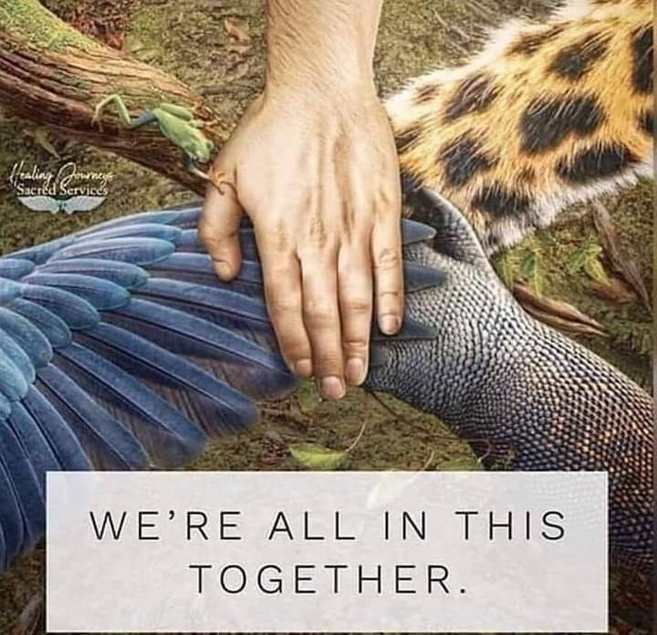

+++
date = 2022-02-02
title = "Ziua 22"
description = "Motivul pentru care am fost azi recunoscătoare este că m-am trezit. Nu m-am bucurat de ziua de azi dar am făcut tranziția către ziua de mâine, unde, sper eu, să mai bag o fisă în vendomatul Universului și să-mi cadă \"jucăria\" dorită: o mâine mai blândă cu mine."
authors = ["Biannca Locatelli"]
[taxonomies]
tags = []
[extra]
math = false
diagram = false
image = "images/ziua-22-final.jpg"
+++

La 5.30 când m-am trezit era deja lumina la mama în cameră. Era în pat, se juca pe tabletă, semn că nu e nimic aiurea, ci doar nu a avut somn.

M-am strecurat încet din cameră și am coborât la bucătărie.

Știu că ar fi frumos să îmi încep ziua cu o întindere, cu un zâmbet și pe dinăuntru și pe dinafară, cu avânt de zi proaspătă, dar nu-mi iese. Mă observ că devin din ce în ce mai acră dimineața și mă cert cu situația din ce în ce mai des. În loc să îi fac spațiu în mine să se așeze odată și să integrez, eu mă ciondănesc cu ea de la prima oră. Pentru că sunt obosită și rutina asta zilnică mă omoară încet.

***

Am ajuns să-mi trăiesc viața alergând ca o nebună prin momentele când fac curat, mâncare, spălat, table către momentele în care am timp pentru mine. Și ăla devine din ce în ce mai puțin.

***

Nici ea nu e prea bine. Confuzia de ieri îi cuprinde mintea și azi că nu e prea volubilă. Asta e, o să treacă și ziua asta.

La micul dejun i-am pus în față, la alegere, mai multe variante de mâncare: și-a pus din fiecare câte ceva cu aceeași disperare că poate mai târziu nu mai apucă și a mâncat extrem de puțin. O las în pace, nu o cert, nu îi zic nimic pentru că nu vreau să o agit. Îi fac cafeaua pe care vrea să o bea sus, la ea.

***

Am anunțat-o că fug la farmacie să îi iau tratamentul pentru infecția urinară și am rugat-o să stea cuminte la ea sus că vin imediat. Pare că înțelege așa că fug. La propriu. Intru și la Mega de lângă farmacie să iau ficat de pui că știu că îi place. Ghinion, nu au. Așa e când te grăbești! Trec strada la Ferma din sat și, când intru, iau direct în piept mirosul de carne afumată! Nu vreau să fiu ipocrită, am mâncat și eu carne, și mezelăraie, și grătare și știu cât de ademenitor e gustul. La mine renunțarea la carne s-a făcut din cauza unui blocaj mental de care e "vinovată" Maya, bulldogița noastră. Când iubești o ființă necuvântătoare e ipocrizie să faci diferențe: îmi iubesc cățeaua dar mănânc puiul de găină sau purcelușul sau vițelul. La mine, n-a mai făcut click și aia a fost. Că acum mi se pare incredibil cum de nu am văzut dintotdeauna cum văd și simt acum, e o altă Mărie cu altă pălărie.

La Ferma din sat dacă ești vegan, e grotesc! Atârnă bucăți de animal mort și procesat peste tot și, ca să fie tot tacâmul, pe lângă parfumul de afumătură, din boxe răsună …. Jazz! Aveau ficat de pui, l-am luat și am fugit. Oricum eram pe fugă așa că am zis să nu-mi pierd antrenamentul.

  

***

Acasă, intru în altă cursă contra cronometru. Trebe făcută curățenie. Eu sunt nițel obsedată cu asta, mi se părea că simt țărâna sub papuci când calc iar la mama, de la pisica ei, sunt floace peste tot, bobițe de nisip și … nu mai intru în detalii pentru restul. M-am apucat de șmotruială dar am pus și oalele de mâncare pe foc. Am bifat și azi sala: la cât am urcat și coborât și iar urcat, iar coborât, scuturat, aspirat, spălat, eu zic că am făcut mai multă mișcare decât aș fi făcut la sală. Plus că a trebuit să mă încadrez în timpi pentru că la noi nu poți da oricând cu aspiratorul. Domnul meu lucrează de acasă și mai tot timpul e în ședințe. Iar astea nu cadrează foarte bine cu o obsedată care dă cu aspiratorul. Că nici măcar nu e d-ăla silențios. Așa că mă perfecționez în organizare și eficiență să așez planetele fix cum trebe când dau cu aspiratorul.

La 2 aproape că eram gata cu toate, am făcut și o mămăligă și o bougatsa vegană la cuptor și am adus-o pe coana mare la masă. A mâncat un polonic de ciorbă și 3 guri din tocănița de ficat. Plus o bucată mare de bougatsa. Totuși, mănâncă puțin. Dar nu vrea mai mult și nu o pot obliga.

***

Repetările ei încep să mă agaseze. Întruna, întruna, întruna aceleași lucruri. Sper ca la un moment dat să devin imună sau insensibilă dar acum recunosc că atunci când o aud că începe, mă fac fie că spăl un vas, fie iau ceva din cămară, fac ceva să plec din zonă că mă irit. Și îmi pare rău de ea dar mai ales pentru ea. Cum, măi, cineva, care desface rebus d-ăla de-ți pune mintea pe bigudiuri, careuri grele, de când era copilă, să nu mai fie capabilă să țină minte ce a zis acum 1 minut?!Un organ care nu e folosit se atrofiază dar ea și-a folosit creierul every fucking day cu rebus, zeci de ani!!

***

Am pregătit-o de ieri că azi îi fac baie, în cadă și că o spăl și pe păr. La 4 era instalată în cadă, în care am pus eu, fără să știe, sare și puțin gel de duș să facă spumă. S-a bucurat ca un copil, a stat relaxată, am lăsat-o să-și bucure fiecare fibră, am săpunit-o bine, i-am făcut masaj, a fost o încântare pentru ea. Mă bucur când se bucură așa că restul nu mai contează.

Dar observ, cu tristețe căteodată, că nu-mi zice niciodată mulțumesc. Mi-a zis o dată că să-mi dea Dumnezeu sănătate, zice că îi e bine dar niciodată parcă nu-mi dă credit pentru asta, ca și cum sunt obligată să fac ce fac, ca și cum i se cuvine. Știu că poate sunt tendențioasă dar câteodată, când îi cumpăr ceva ce îi place sau îi fac câteo surpriză, aș vrea și eu o reacție de răspuns. Ea primește ce îi dau, ia și vorbește despre altceva ca și cum nimic nu s-a întâmplat.

***

Deși, în afară de o oră azi dimineață, nu am stat niciun pic (inclusiv salata mea de crudități am mâncat-o în picioare și în reprize), după cadă vrea să jucăm table. Dacă nu ar forța-o să folosească creierul, aș renunța la această rutină deja instalată. Dar, dintr-un motiv lense de înțeles, mă înarmez cu răbdare pentru 2 ore de joc. 2 ore!!

Astăzi, am fost prezentă la două gânduri ce zburătăceau prin minte: că va trebui să mă bucur de joc că plătesc cu 2 ore din viața mea și al doilea a fost mai mult ca o senzație, ca o presimțire că la un moment dat se va sparge încăpățânarea asta a mea de a vedea tragedia din situația asta cu demența și atunci lucrurile se vor înmuia, vor îmbrățisa schimbarea.

Până atunci, mi-e dor imens de copilele mele. Mi-e inima așa de grea în zona aia destinată lor că dacă cineva ar cântări-o acum ar avea o tonă.

***

Și apropo de inimă și de recunoștință, ieri ziceam că nu-mi vine în minte nicio recunoștință. Azi mi-am răspuns singură: recunoștința nu vine niciodată din minte, ci din inimă!

Motivul pentru care am fost azi recunoscătoare este că m-am trezit. Nu m-am bucurat de ziua de azi dar am făcut tranziția către ziua de mâine, unde, sper eu, să mai bag o fisă în vendomatul Universului și să-mi cadă "jucăria" dorită: o mâine mai blândă cu mine.

 

 

  

    <a href="/blog/ziua-21/">Postarea anterioară</a>
  

  

    <a href="/blog/ziua-23/">Postarea următoare</a>
  

