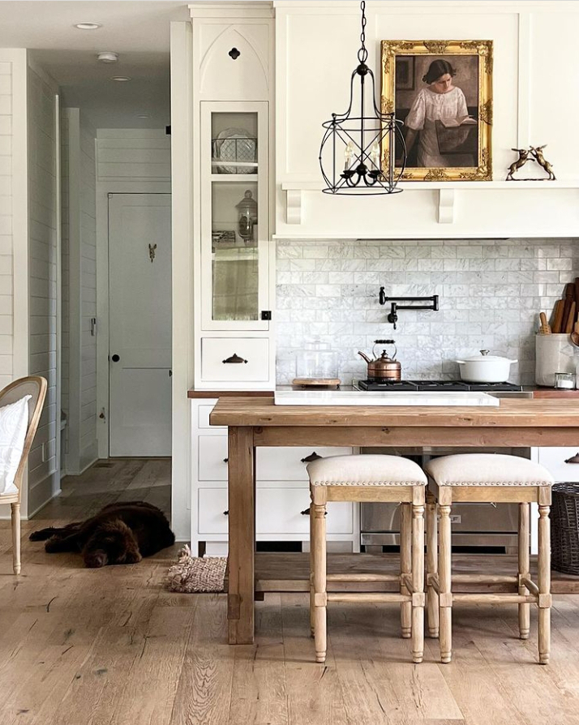

+++
date = 2022-08-20
title = "Ziua 221"
description = "Sfârșitul dumicaților de pe farfurie a acționat ca o aducere dramatică în prezent, de parcă la ea amintirea rula cu magie atâta timp când avea dumicatul în gură. Mi s-a părut absolut fantastică schimbarea bruscă de stare: de la sclipici în ochi și efervescență-n vorbe, la o absență cruntă. În doar câteva secunde. Oricât m-aș da cu fundul de abisul frustrării, asemenea 'perle' fascinante ale complexității umane mă lasă mască, întotdeauna. E un spectacol uluitor, fără seamăn și care nu poate fi cuprins, ca trăire, în vorbe."
authors = ["Biannca Locatelli"]
[taxonomies]
tags = []
[extra]
math = false
diagram = false
image = "images/ziua-221.jpg"
+++
---

În "activitatea" asta de oboseală nu se aplică principiul ăla mișto care, în sport, aduce infuzie maximă de endorfine când faci pasul ăla peste pasul la care zici că nu mai poți. Când îți depășești limita aia pe care o știi, cu doar o juma' de pas, creierul te inundă cu o stare euforică, motivantă să mergi mai departe, fie și cu jumătăți de pas. Nu, la oboseală, sau așa percep eu, juma' de pas mă duce mai rău în fundătură, mă afundă mai rău în nervi și-n neplăcere, mă face să uit că întotdeauna, invariabil, după furtună iese soarele, când îmi-e rău, sigur e și binele acolo, atât de mascat că mă păcălește peisajul pe care-l văd doar gri. Azi mi se pare adânc și profund, în toată ce sunt, corp și minte și suflet, că vreau odihnă, vreau să fiu lăsată să mă odihnesc, vreau o pauză, vreau liniște și timp mult pentru mine, vreau libertate, vreau, vreau, vreau. Universul nu-mi neagă astea, evident, mi le întoarce-n ecou însă claritatea mentală nu vrea să-mi dea odată răspunsul-cheie care să deblocheze din mine încrâncenarea.

Nici măcar n-am ridicat o pleoapă, că-n mine s-a declanșat jihadul gândurilor. Cum pot eu, în furtuna asta imensă pe care-o simt în stomac, la propriu, să mă adun mică și curată și liniștită în inimă și să-mi recit mulțumirile, când acum am în față numa' lipsurile?! Nu pot. Și deși sunt și actor și spectator, se pare că primul e mai pasional și conduce jocul. Știu că totul e o alegere și totuși aleg furtuna. Și ce? Am dreptul să aleg ce pot să duc. Poate am nevoie de furtuna asta, poate am tot încercat să liniștesc niște ape dar ele-s încă tulburi și nu vor să se așeze-ntr-o matcă.

Corpul mi-e obosit, dragul de el, cred că-i și resemnat și mă rostogolesc din pat fără niciun chef și nicio plăcere. O fi o nouă zi, sunt sigură că aduce numa' noutăți, dar eu sunt un munte de nepăsare, am întors spatele zilei cu toate micile ei moment ce pot fi mari, mă țin cu dinții de o stare aiurea și resimt peste tot oboseala.

***

Am o jenă în tălpi și-o simt cu toată forța când cobor treptele. Mă înțeapă pe mijlocul tălpilor scurt dar mi se duce până-n miez de creier, alimentând starea de rahat cu care m-am însoțit din prima clipă a trezirii mele în zi. Deschid toate ferestrele din automatism, iau notă că în curte e întreaga familie de fazani, mai puțin "seful de trib", fazanul-tată, și mă surprind cum o urmăresc pe Spiky, care s-a avântat la fereastra deschisă din living și-i privește pe cei 7 făzănei, cu o atenție pură și extrem de focusată. Am senzația acută că nu sunt în viața mea, că e altcineva care o privește pe Spiky, pe fazani, toată scena și acel altcineva nu e traversat de nicio emoție. Am început să mă disociez de mine și o fac fără să vreau. Giiiz!

Nici apa caldă și nici cerul nu mi-au adus bucuria de viață sau măcar o trăire, ceva, o senzație, orice numa' să știu că încă simt, că încă sunt acolo. E o absență de mine în mine pe care o văd dar nu pot, nu știu cum s-o risipesc. Deși e prea dimineață, și-n genere acum am cea mai mare claritate și acuitate mentală și emoțională, habar n-am cum să opresc neprezența asta.

***

Cred c-am făcut schimb de plecări cu mama: azi e extrem de aici, iar eu extrem de departe. Nu pot să mă implic în conversația pe care mama, gureșă de la prima oră, o inițiază. Nici nu mă bucur, nici nu mă irită, mă lasă rece. Din păcate, nu și nemuritoare. Îi răspund sec, poate că și arăt așa că mama, după vreo câteva fraze, pare că prinde vibeul meu și mă lasă în pace. Din nou, lăsatul în pace mă lasă rece. Fac mașinal curat în baie, le las ce am de lăsat și plec, scormonind în creier lista de to do-uri aferentă zilei. Sunt atât de obosită de analizat și de simțit, încât azi vreau să fac non-stop chestii, să pic lată și să sper că mâine voi fi mai bine.

***

Mă apuc de scris pentru blog, mă întrerup de un milion de ori pentru diverse, vreau să scriu dar îmi găsesc scuze să n-o fac. Cu toată lipsa mea de chef, un singur lucru mi-e clar, e scris cu bold în mine: vreau să ajung la zi cu postările și vreau să revin la postatul zilnic. Vreau să mă ridic și să mă adun, măcar la capitolul ăsta. Și poate că de la ăsta, o să mai ridic și un alt capitol și tot așa, până mi s-or alinia planetele și-oi scăpa în vreun fel de putregaiul ăsta care mă roade pe dinăuntru.

***

Micul dejun al mamei a fost spumos, cu o mamă care s-a transformat într-un copil curios: și cum le-ai adus tu pe fete aici, pentru ziua mea? Cum ai știut de unde să le iei? Cum ai dat de ele? Hai, povestește-mi tot! A impactat-o puternic surpriza și-n fața acestui puseu candid de entuziasm, în fața unei mame-copil pur și inocent, n-am putut să rămân seacă. Emoționalul ăla al meu adânc, și el tot de copil, a preluat hățurile și i-am povestit de la început până la sfârșit cum s-a desfășurat operațiunea petrecerii surpriză. Ochii îi luceau, îmi sorbea vorbele și, când mă opream, punea din nou întrebări, fie aceleași, fie altele, numa' să nu mă opresc din povestit. O unge pe suflet și o face să retrăiască ceva ce probabil i-a făcut sufletul viu în ziua aia și-l vrea, mereu și mereu. M-a impresionat puternic copiluțul din ea și i-am povestit de câte ori a vrut, până a terminat de mâncat. Sfârșitul dumicaților de pe farfurie a acționat ca o aducere dramatică în prezent, de parcă la ea amintirea rula cu magie atâta timp când avea dumicatul în gură. Mi s-a părut absolut fantastică schimbarea bruscă de stare: de la sclipici în ochi și efervescență-n vorbe, la o absență cruntă. În doar câteva secunde. Oricât m-aș da cu fundul de abisul frustrării, asemenea "perle" fascinante ale complexității umane mă lasă mască, întotdeauna. E un spectacol uluitor, fără seamăn și care nu poate fi cuprins, ca trăire, în vorbe. O soră, mai vitregă așa, a beatitudinii. Chiar dacă e dureros momentul, nu pot, cu toată starea mea de rahat, să nu mă plec, cu respect, în fața minunii care este omul. Iar mama, pe cheltuiala sănătății ei mentale, mi-arată plinătatea acestei minuni.

***

Colica biliară sau doar voma sau ce-o fi fost, și-a făcut de cap doar ieri, azi sunt într-o stare de nesimțire totală a corpului. La propriu. Profit de "liniștea" asta din celulele mele și pregătesc mâncarea pentru prânz, să fie gata și mă reîntorc la scris.

Nu știu cum, nu știu de unde, reușesc să mă mufez la un canal de inspirație prin care curg ideile ce-mi colorează și îmbracă schițele despre zilele trecute. Nu doar că sunt mufată la cuvinte, dar am un crac și-n ziua și clipa respectivă, de unde sug seva trăirii și stării. Mi-a fost clar că, dacă am avut un gând mic să renunț la a scrie zilnic, voi merge până la capăt. Extremista din mine și-a dat mâna cu curioasa din mine și numa' de-a naibii și tot nu o să renunț. Să am consecvența și perseverența de a scrie 365 de zile echivalează cu urcatul Everestului pentru cineva care și-a propus asta. Mai cad, mai lâncezesc, dar o să revin și o să scriu și voi ajunge acolo.

***

Am terminat de "umplut și colorat" o zi și simt acut nevoia să mă duc în atelier/garaj să fac ceva, orice, să bricolez sau creez puțin. Mi-e dor imens de asta, mereu am pus altele înainte dar acum am un arc care mă catapultează fix acolo. Scrisul ăsta mi-arată, când sunt deschisă să văd, unde greșesc și câteodată, încă nu m-am prins care-i mecanismul din spate, îmi livrează și soluția. Azi am simțit nevoia să fac ceva să-mi cresc aripi pentru suflet.

O oră și ceva a trecut condensată într-o clipită. Deși în clipita asta am trăit intens și mult, am gândit intens și mult, m-am întors cu atâta forță-n mine și am presărat atâta gălăgie acolo unde de dimineață era nepăsare, încât m-am simțit vie în toate cotloanele mele. Când faci ceva ce-ți pune sufletul pe-un cântec, ești viu.

În clipita asta, am ars în mine conștientizarea clară că nimeni, niciodată, nu poate participa  la nașterea și simțirea unui sentiment în interiorul meu, despre orice sau oricine, nimeni nu va putea ever să înțeleagă deplinul a ceea ce e în sufletul meu. Am înțeles profund că trecerea asta prin viață, deși e plină de oameni, la nivel de simțire, e singură, singulară și solitară. Am înțeles că oricât aș vrea eu să găsesc cuvintele care să cuprindă plin, simțirea n-are nicio legătură cu ele. Și că chiar de le-aș găsi, printr-o minune, ele sunt cărăuși muți care se lovesc de-un zid de ne-simțire al celor din jur. Că așa e firesc. Iar înțelegerea asta a mea, nouă, dintr-o altă perspectivă, a crăpat muntele de așteptări pe care l-am crescut în jumătatea mea de viață. De la alții și de la mine, pentru că sunt dăți, și nu puține, când nici măcar eu nu am cheia descifrării propriilor mele simțiri. Mda, ora asta și-un pic mi-a dat peste nas atât de finuț, că nici nu am simțit când am făcut trecerea de la nepăsare la trăire.

***

În prânzul ei întârziat, mama a rămas în starea de nefiire în care a plecat de la micul dejun. Poate că trăirea și retrăirea petrecerii surpriză au secătuit-o de energie, poate că a plecat cu totul în trecut, în ziua aia și a rămas cu spiritul acolo, doar corpul e prezent aici, în realitatea mea, nu știu și nici nu mai vreau să știu. E absentă, o las așa și mă las și pe mine să fac cum simt. În timpul prânzului ei, am avut un moment de-o claritate extraordinară, ca și cum aș fi văzut o secvență dintr-un film cum rulează în fața ochilor mei și eu aș fi citit titrarea: lasă-te inspirată de moment! Dacă simt să vorbesc, s-o fac, indiferent că e sau nu cu mine. La fel, și dacă nu simt. Ce tot atâtea presupuneri și analize și gânduri, care nu fac decât să mă sugă de energie. Iar la capitolul ăsta stau extrem de prost.

***

Împletesc facerea unui nou tiramisu de fructe, la cererea publicului, cu conversația cu prietena mea dragă. Există oameni pe lumea asta, iar pentru mine ea este un exemplu tare mișto, cu care poți să vorbești ore întregi și să nu te plictisești. Dau din mâini cu spor și-mi face plăcere s-o aud pe femeia asta faină cum îmi vorbește. La un moment dat îmi dau seama că sunt atrasă de vibeul ei bun și, chiar de mi-ar spune prostioare, tot cu aceeași plăcere aș asculta-o. Or fi cuvintele importante, cel mai probabil mai mult în scris, dar în vorbire, uite că tonul face muzica. Pe lângă că-i faină ea, îi ies niște buchete din mâinile-i pricepute, de mă încântă de fiecare dată și mă surprinde prin asocieri neașteptate. Ăsta e harul ei pe care-l exersează doar ocazional, când îi cere vreun prieten, iar mie mi se pare o irosire fără margini. Nu reușesc s-o cârmesc spre pasiunea asta, orice aș zice sau face și nici nu mai încerc. Cândva, și eu aveam nevoie de o plasă de siguranță, cândva și eu credeam că fără bani, e moarte. Toate vin la timpul lor, în dreptul fiecăruia.

***

Momentul pilirii unghiilor nu mai e atât de grotesc și nu mai e nici bornă a serii, a fost înlocuit, în partea aia bună, de fiire, cu dușul conștient și călâi spre rece. Am adus în momentul ăsta recapitularea zilei și cele trei recunoștințe ale mele:
1. Entuziasmul copilăresc al mamei, semn extraordinar de viață vie a ei, în ea!
2. Mirosul superb de lemn șlefuit!
3. Prietena mea dragă!

Iar frumosul din clipă este:

  

