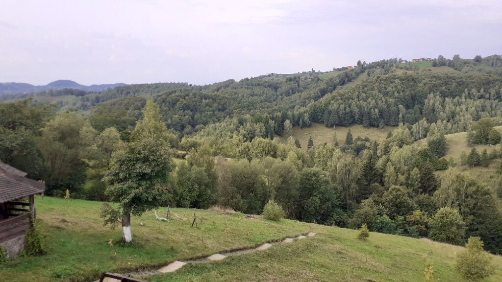
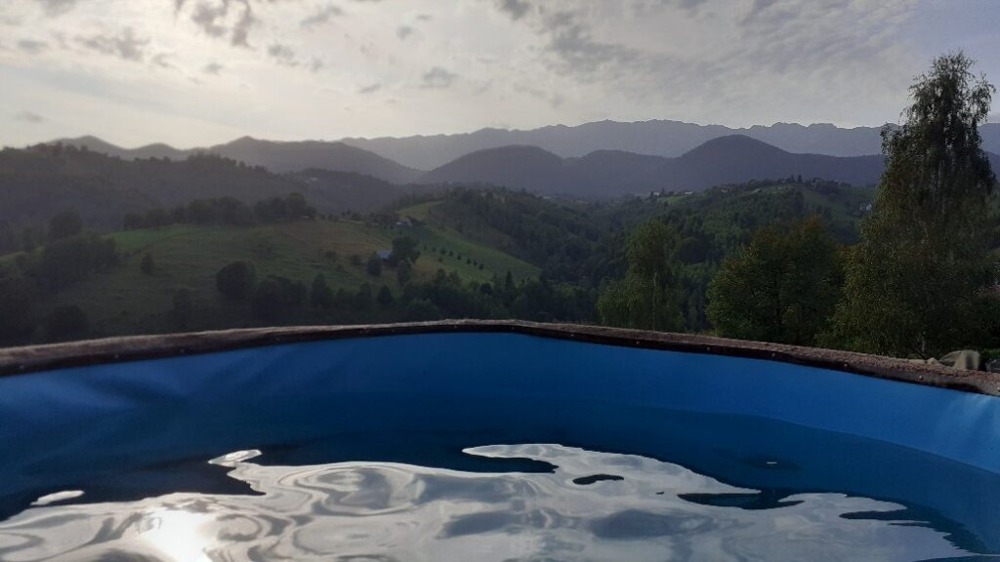

+++
date = 2022-08-23
title = "Ziua 224"
description = "În partea stângă cerul e luminat, în partea dreaptă e gri închis. Din partea stângă vine un strat de nori albi, pufoși, dar aerați, din partea stângă vine un alt strat, mai jos, de nori supărați. Noi doi, în ciubărul cu apa caldă, cu ochii pe cer, la spectacolul întâlnirii celor două straturi de nori, care s-au îmbrățișat liniștit, fără scrâșnete. E ceva ce ieri, nu mai departe de ieri, nici nu puteam cuprinde cu mintea că există! Trăiesc un extaz imens și dacă aș muri acum, aș face marea trecere cu un zâmbet uriaș în mine. De fapt, aș fi eu însămi un zâmbet uriaș."
authors = ["Biannca Locatelli"]
[taxonomies]
tags = []
[extra]
math = false
diagram = false
image = "images/ziua-224.jpg"
+++
---

Adevărul e că nu m-am gândit nicio clipă, nici nu mi-am dorit, să găsesc o cale mai rapidă de a mă trezi. Din contră, o caut, cu disperare pe alocuri, p-aia în care să lenevesc cât mai mult, fără vini sau grabe sau stresuri. Uite că Universul, care dacă tot îmi dă șansa zilnică de a mă trezi, s-a hotărât să-mi vâre în viață cât mai multe nuanțe de experiență, mi-a adus la interval coșmarurile. Sunt convinsă că nu e chiar așa, dar mi se pare că toată noaptea mea a fost acaparată, pe repeat, de același coșmar greu. Am visat-o pe sora mamei, care a murit când eu eram copilă, iar toată noaptea mea a fost o fugă și o groază de capul mătușii mele, care pe jumătate părea fericit, pe jumătate trist. M-am trezit din somn, în speranța că adorm și trec în alt vis, dar coșmarul ăsta a fost ca un scaiete de somnul meu. Știu că în ultima secvență, obosită și transpirată, am încetat să mai fug, m-am priponit în fața acelui cap care radia o aură alb-lăptoasă în jur și l-am întrebat: spune-mi, cum să fac cu situația mamei? ce să fac să trăiesc? Well, dacă eram inspirată mai de pe la miezul nopții să fi pus întrebarea asta, poate treceam într-un vis mișto: din momentul în care am pus întrebările, s-a terminat și coșmarul. Fără răspunsuri, evident. Și s-a terminat și noaptea mea.

***

Azi nu mi-am acordat timp pentru ceremonial și pentru că am multe de făcut pe lista scurtă a dimineții și, e drept, și pentru că am încă o trăire tare stranie după coșmarul ăsta. Nu am visat-o niciodată pe mătușa mea, mă intrigă de ce acum și, dacă tot a venit, de ce nu mi-a dat o mână de ajutor, să elucidez puțin modul cum să mă adaptez și să integrez situația asta prin care tot trec zilnic de nouă luni. Nu că ar fi cineva obligat să mă ajute dar, dacă tot s-a ostenit să mă viziteze după atâția amar de ani, putea să mă și scoată din bezna asta în care nu știu încotro s-o apuc cu simțirea. Zic și eu.

***

Am ajuns la bucătărie unde mi-am băut apa în chi-chi-urile lui Spiky. Eu zic că fătuca asta mică simte că plecăm azi, că nu vrea afară, mâncare abia a gustat, vrea să o drăgălesc și să o mângâi întruna. O iau în brațe, stă ca un bebeluș, strânsă toată la pieptul meu. Incredibil, ce senzori au ființele astea "necuvântătoare". Cred că dacă ar vorbi, ne-ar face praf la multe capitole.

Mă apuc să fac șnițele pentru mama și pentru copila mea, care vine să stea cu mama trei zile, să fie proaspete. Între întorsul de pe o parte pe alta, mai dau o fugă și afară să ud roșiile și mai strâng și rufele. Cred că aș putea să zbârnâi așa mult și bine când știu că în câteva ore plec spre libertate. Am artificii în vene, mici explozii de energie care mă alimentează să bifez tot ce mi-am propus, să nu-i las copilei nimic de făcut, decât de a fi în zonă și de a-i da mâncarea și medicamentele. Simt la ea că nu-i ușoară pătura asta de responsabilitate pe care i-am pus-o pe umeri, simt că o acceptă mai mult de jenă, dar dacă nu fac ceva și pentru mine, mă curăț eu înaintea tuturor.

A fost o decizie de last minute, ne ducem într-un loc unde am mai fost și unde am avut noroc să găsim o cameră așa din scurt și poate să fie și un cort în mijlocul pustiului, dacă pot să n-am nicio grijă, e perfect. Îmi adorm vociferarea din mine și vina de a-mi lăsa copila cu așa o povară resimțită de ea, cu știutul că trebe să trec peste orice, să mă opresc din nebunia asta care-mi macină nervii și sănătatea. Sunt doar trei zile…

***

Am foc în tălpi și nerăbdarea mă înghesuie din toate părțile dar o aduc pe mama la micul ei dejun. Îi aduc aminte că plecăm, n-a uitat, dar se uită cu ochi mari că nu crede că se va descurca singură. Îi aduc aminte și că vine copila mea să stea aici și văd că, deși nu e pe deplin mulțumită, se mai liniștește. Îi explic că și eu și domnul meu avem nevoie de timpul nostru, în doi, e de acord verbal dar limbajul corporal nu minte: nu-i convine deloc că plec. Asta-mi mai trebuie acum, când deja am pe mine scama vinii de a-mi lăsa copila singură cu mama! Măi, dar pot și eu să plec fără să mă simt că fac ceva necuvenit?! Hai că, pe nesimțitelea, încep să mă aricesc. Egoismul celor din jur mereu mă atinge în niște coarde extrem de sensibile. Bine că am și plătit la pensiune, că altfel începeam să am dubii cu plecarea. Sunt incredibilă și, deși credeam că încep să mă pun pe prim plan, deși văd manipularea emoțională la care sunt supusă subtil, uite că nu calc pe tot și toate și iar cad pe locul doi.

I-am făcut cafeaua cerută dar, din spumoasa care eram când a venit, m-am răsuflat și dezumflat. O duc la ea și, încă cu incertitudine, fac bagajul.

***

Plecare spre libertate!

Am tras în mașină un chiot de aproape că mi-am autospart timpanele, a fost ceva atat de visceral trăit si eliberat, cum n-am mai simtit de mult. Doamne, acum aș putea fugi în lume, cu omul meu! Se întinde în fața mea o lume imensă de posibilități, că mi se pare că pot cuceri toată lumea, cu puterea asta pe care mi-o dă libertatea. În acest moment, sunt invincibilă, sunt un vulcan de bine care arde în adâncuri numai bucurie și asta va împrăștia pe oriunde va trece. E o senzație ce nu se lasă prinsă-n niciun cuvânt palpabil, omenesc.

Am sorbit drumul cu atâta aviditate că n-am simțit nevoia să spun o vorbă. Mi-am băgat imagini și trăiri în punga sufletului cu atâta ardoare, că nici nu știu cum și când am ajuns la Bran, de unde cumpărăm de obicei bunătățuri de la Mama cozonacilor. Am mâncat cu toată gura și m-am umplut de nucă și de plăcere, ca un copiluț, cu zâmbete imense-n ochi și nu mi-am mai încăput în corpul ăsta prea mic pentru ce trăire am eu. Libertatea mea are gust superb de nucă!

Am ajuns la Akasha Healing Retreat la Peștera - my ultimate heaven, unde doar ne-am descărcat bagajul, am salutat lumea și pe proprietarii cu care ne-am împrietenit acum doi ani și am plecat in plimbare si-n croire de vise: cum ar fi să ne mutăm la munte? Cum ar fi să luam un petic de imaș c-un strop de pădure și să ne trăim liniștile aici?

  

priveliște de pe terasa Akasha

***

E liniștea asta de munte atât de frumoasă, că nici nu-mi vine ideea să deschid gura, d-apăi să am și cuvinte și să le mai și articulez cu domnul meu. Suntem amândoi într-un respect profund față de ce e sub tălpi, în jur și deasupra noastră că n-avem nevoie de niciun cuvânt, oricum infim față de măreția asta. Oricât aș fi de obosită, muntele ăsta care ne îmbrățișează șterge orice umbre aș mai avea în mine, ca un mop mizeria. Ne lăsăm să fim și, pe amândoi, fiecare în intimitatea lui, ne inundă recunoștința. Mii de mulțam realității ăsteia în care ne-am parașutat și vieții ăsteia pe care am primit-o aici, pe planeta asta superbă! Nu știu când au trecut șase ore de umblat pe coline și păduri.

***

În retreatul ăsta pe care l-am iubit din prima clipă în care am pășit în el, acum 2 ani, există două atracții care pentru noi sunt irezistibile: saună și ciubăr. Azi am ales ciubărul, pentru că sunt atât de însetată ca apa să-mi mângâie corpul și să-mi dea în suflet senzația asta de libertate pe care numai apa și zborul mi-o dau atât de plenar, încât nu e loc de saună în peisajul zilei.

Nu-mi vine să cred că Universul a orchestrat atât de magistral și de magic momentul "ciubăr" în existența noastră minusculă. Apa caldă e o binecuvântare pe care o primesc cu toate celulele mele, iar priveliștea care se deschide în fața ciubărului și a ochilor e sora ei geamănă-n senzație. În toată clipa asta, minunată chiar și atât, cerul a ales să nu se lase mai prejos și să participe cu stropi la sărbătoarea noastră. În partea stângă cerul e luminat, în partea dreaptă e gri închis. Din partea stângă vine un strat de nori albi, pufoși dar aerați, din partea stângă vine un alt strat, mai jos, de nori supărați. Noi doi, în ciubărul cu apa caldă, cu ochii pe cer, la spectacolul întâlnirii celor două straturi de nori, care s-au îmbrățișat liniștit, fără scrâșnete. E ceva ce ieri, nu mai departe de ieri, nici nu puteam cuprinde cu mintea că există! Trăiesc un extaz imens și dacă aș muri acum, aș face marea trecere cu un zâmbet uriaș în mine. De fapt, aș fi eu însămi un zâmbet uriaș. I'm lost for words! Sunt doar trăire, sunt doar șuvoi de recunoștință!

***

Alegerea acestui retreat, acum doi ani, s-a făcut pe baza unui criteriu extrem de trivial: mâncarea vegană. Sătulă de zacuști și pâine cu gem, am primit această sugestie de pensiune "și" cu mâncare vegană și așa am dat de Akasha. Că s-a dovedit nu numai că știu ce înseamnă mâncarea vegană, ci au dus-o la nivel de artă, că au yoga zilnic, că peste tot sunt bețișoare parfumate de la mama lor, din India, că muzica e liniștită și priveliștea e fără egal, a fost pentru că, probabil, aveam nevoie și meritam asta.

În seara asta avem o nebunie de mâncăruri, și pentru vegani dar și pentru non-vegani, iar eu mă simt în al nouălea cer. Cât de mult îmi place să mă așez la masă și să fiu și eu servită! Să mă duc să-mi aleg din multe feluri de mâncare, toate numa' bunătățuri și să nu fi fost nevoită să le gătesc eu și nici să strâng și să spăl după. M-am ghiftuit ca un porcușor, am burta ca un cimpoiaș, dar mi-e sufletul ușor ca fulgul.

Livingul, unde se servește masa, s-a animat, muzica e un jazz fain, suntem ca o mare familie cu toții iar afară s-a pornit furtuna. Seara se închide magistral, cu concursul de neegalat al naturii.

S-a creat între noi, cei prezenți aici, în această seară, în acest living, în momente de furtună, o comuniune electrizantă, ne simțim aproape unii de alții, deși nici nu ne cunoaștem, e în aer o blândețe și o dorință de a-i fi bine și celui din jur cum numai la festivalul vegan am mai întâlnit-o. Nu înseamnă că nu există și în altă parte, asta clar, dar în acest retreat s-au adunat oameni cu același respect față de viață și de natură, cu aceeași dorință de a-și spăla zoaiele de pe ochi și a-și dezpietri inima, că energia asta ne trece tuturor prin carne și ne deschide către o și mai mare recunoștință. Nu mă pot abține să nu gândesc: Doamne, aș putea trăi așa dacă demența nu m-ar înțâna într-o casă, undeva departe de muntele ăsta verde și plin de pace și beatitudine. Cândva.

***

Am venit la odihnă și trebe să și dormim, altfel eu mi-aș pune scobitori în ochi numa' să sorb și să trăiesc fiecare clipă aici, nu să dorm. De altfel, m-am încărcat atât de fain în jumătatea asta de zi, că nici nu mă trece vreun somn. Mă scurg în pat și-ntr-o meditație, e o liniște perfectă, nu-mi trebe căști, nu-mi trebe muzică, doar îmi închid ochii și-mi aud respirația. Plâng de fericire.

Și sunt adânc recunoscătoare:
1. Domnului meu, care a făcut posibilă această ieșire scurtă, din toate punctele de vedere!
2. Familiei mișto care a creat Akasha Healing retreat, un loc atât de fain, de neplecat din el!
3. Muntelui, pentru care nu s-au inventat cuvintele suficiente!

Frumosul zilei e momentul inegalabil al ciubărului:

  

 

 

  

    <a href="/blog/ziua-223/">Postarea anterioară</a>
  

  

    <a href="/blog/ziua-225/">Postarea următoare</a>
  

