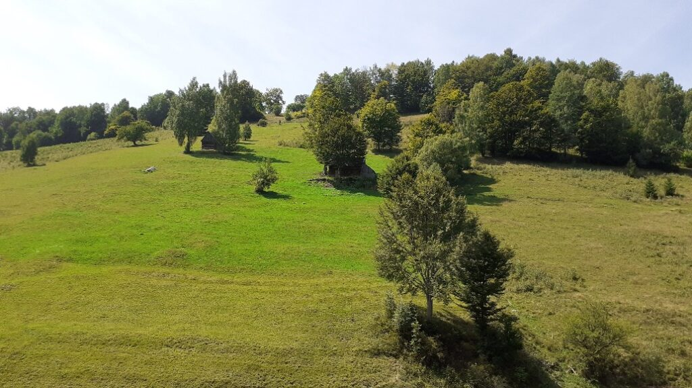
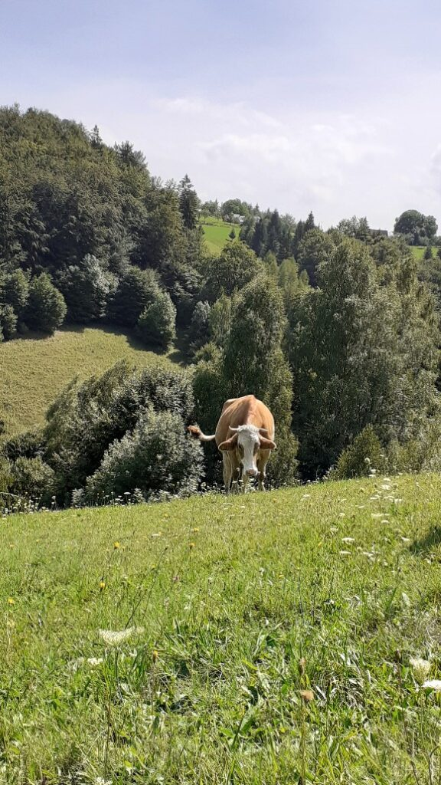
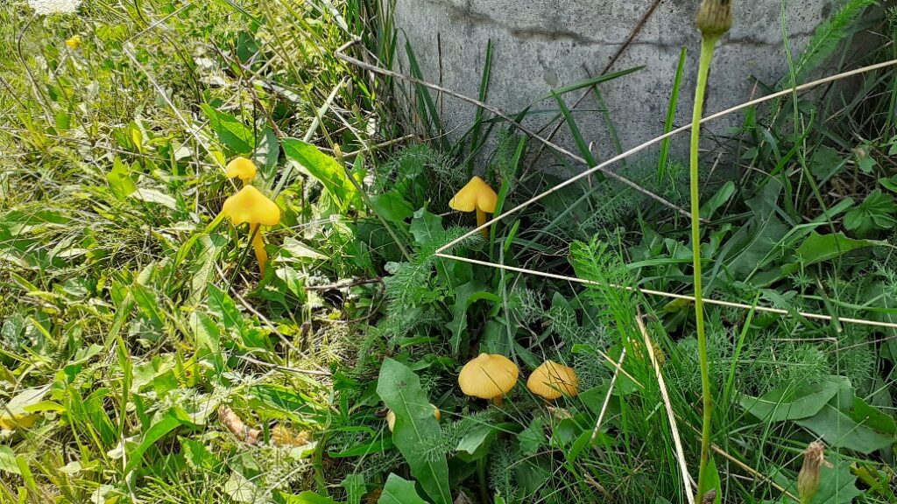
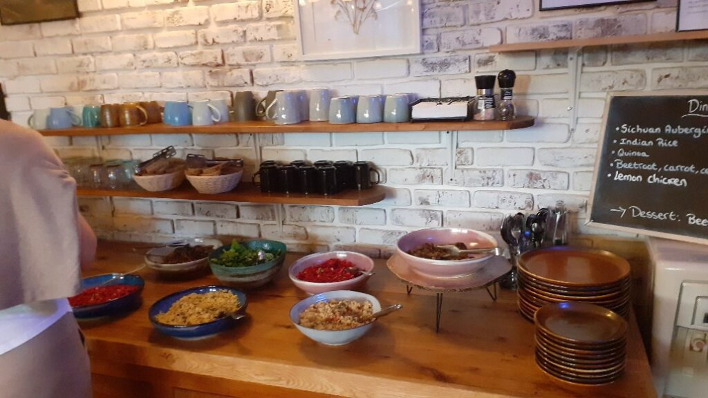

+++
date = 2022-08-24
title = "Ziua 225"
description = "Cred că ne-am impresionat reciproc, și noi pe ea, dar și ea pe noi, că unii am plecat plini de drag, alții au rămas plini de mulțumire. Forma absolută de ajutor pe care poți să-l dai este către cineva de la care nu poți obține nimic înapoi dar, mai mult decât atât, nici mulțumirea ta de sine să nu-ți înfoaie egoul. Să te bucuri că ai fost un pion al Universului la locul și la momentul potrivit și atât. Așa am simțit noi."
authors = ["Biannca Locatelli"]
[taxonomies]
tags = []
[extra]
math = false
diagram = false
image = "images/ziua-225.jpg"
+++
---

M-am trezit la 7 și 20.

Wow! Ochii încă nu se vor deschiși și primul impuls este să-i forțez. Apoi mi-aduc aminte că nu sunt acasă, că nu trebe să fac aia sau ailaltă și că dacă vreau să mai dorm, acum e și momentul și locul potrivit să o fac. O, cât de reconfortantă este conștientizarea asta! Am simțit visceral cum mi se relaxează tot corpul, cum mă împrăștii în partea mea de pat, cum iubesc moliciunea saltelei și satinul așternutului care-mi mângâie pielea, cum nimic nu-mi zgârâie nimic. În realitatea asta calmă și caldă și perfectă, mi se bulucesc recunoștințele fără să le chem eu. Liniștea asta din jurul meu, cu miros de bețișor parfumat, invită din Univers doar liniște cu miros de bețișor parfumat și iubire. În momentul ăsta mă simt plină de iubire, pentru mine în primul rând. Aveam atâta nevoie de o pauză! Oboseala și frustrările îmi întunecă privirea aia cu care aș putea să văd că am voie să fiu oricum dar am și nevoie să mă iubesc. Să-mi dau voie să am draci și frustrări și nepăsări dar să nu uit că dacă mă golesc, doar eu, cu atenția și către mine, mă pot reumple. Mi-e bine cu mine, mi-e bine cu ce e în jur pentru că accept cu mare plăcere ce e în jur. Oare deplasarea aici asta vrea să mă învețe?

M-am prins că atunci când fie nu pricep tâlcul, fie sunt încăpățânată și nu vreau sau nu pot să aplic ce știu, Universul îmi creează contexte, cu arome diferite dar cu aceeași textură la bază, ca să pot depăși lecția și trece la "nivelul următor", la nuanța de viața și mai mișto. Eu m-am prins, încă de acum câteva luni, că poarta de ieșire din haosul demenței este acceptarea, dar încă, nici acum, n-am acceptat nimic. Sau poate doar frânturi, insuficiente să mă calific pentru treapta aia de mai sus care m-ar ajuta să văd că ce credeam eu că-i șarpe, de pe treapta de mai sus văd mai bine că-i furtun și m-am speriat degeaba. Încă nu-mi iese dar nu disper. Dragul de el, Universul, o să aibă grijă să mă ducă-n situații gemene până oi da atât de tare cu capul de berbec c-oi sparge-n țândări răsunătoare ne-priceperea, ne-vrutul sau ne-pututul. Cred că o să îmbăt mangă când mi-o ieși faza. E un fel de a spune, că eu nu beau și dacă-mi dai o bere, iți cânt pe niște voci după ea.

***

La 8 (!) ne-am rostogolit din pat, spălat, îmbrăcat și ne-am înfipt pe terasa imensă, să tragem pe nări și direct în vene, verde crud de munte și ceai mișto de scorțișoară, ghimbir, cuișoare, piper negru și cardamom. E liniște, e soare de zici că furtuna de aseară a fost doar în închipuirea noastră și doar cât să ne adune pe toți laolaltă într-o simțire electrizantă, iar din depărtări se aud tălăngi și cântat de cocoș. Din nou, amândoi avem tendința de a vorbi în șoaptă, parcă simțim înăuntrul nostru o interdicție de a deranja puternicul munte și veșnicia lui. După ceva timp, ne-am privit, uimiți, unul pe celălalt și ne-am dat seama că am amuțit, pierduți în prezența clipelor și-n trăirile noastre intime generate de clipe. Cât de mișto!

***

Sunt răsfățata zeilor zilele astea, asta e clar. Cum mă pot numi altfel decât așa când intru în living și ne așteaptă o minunăție de bufet suedez?! Porridge moale și cald cu lapte de migdale, homemade granola cu turmeric, 4 feluri de semințe, curmale, merișoare, smochine, ghimbir confiat, condimente, fructe proaspete, peanut butter făcut azi dimineață, gem de afine, banana bread, compoturi, e o nebunie și cred că sunt în rai. Mănânc din toate câte puțin, noroc că mi-am băut jumătatea de litru de apă în cameră că altfel ar fi căzut toate ca niște cărămizi în burtica mea. Aș mânca cu 10 guri, le savurez din ochi pe toate și nu mă îmbuib pentru că plecăm la drumeție. Nu pot să nu beau însă din sucul de castravete, ghimbir și măr verde făcut în casă, iau și o cafea și sunt rotundă deja. Ce dacă, pot să fiu și pătrată, zilele astea îmi dau voie să mă răsfăț și să mă las răsfățată. Ce bine e!

***

Am plecat la pas și lăsăm destul de repede drumul bătătorit în favoarea potecilor mai neumblate. Soarele arde și pământul aruncă la suprafață, cam până pe la 1 metru maxim, o ceață aburindă, apa de la furtuna de aseară iese la evaporare. Se aud păsările, ceva greieri și liniștea. Din când în când, mai șuieră vântul, e o plăcere absolută să faci drumeție pe vremea asta. Chiar dacă arde, soarele de munte e mult mai blând decât ăla de acasă, aici tăria aerului curat atenuează cu mult dogoarea și noi oricum suntem cu totul absorbiți de ce e în jur ca să mai simțim vreun disconfort. Cu cât ne afundăm mai mult în locuri neumblate, pline până-n măduva firului de iarbă de pace totală, cu atât mai mult ne dăm seama că preferăm locurile mai retrase, mai fără oameni.

În drumul nostru am trecut pe lângă peștera liliecilor și vocile altor umani ne-au grăbit instinctiv pasul amândurora, fără să ne spunem o vorbă unul celuilalt. Ne-au zgâriat timpanele discuțiile lor și am simțit nevoia să ne îndepărtăm rapid, să ne protejăm mica comoară ce-am adunat în inimă, pacea asta inconfundabilă de munte.

Ne-am pierdut repede printre coline și-am cutreierat vreo 4 ore fără prea multe cuvinte în noi și între noi. Am ajuns la o colină ce găzduiește vreo 4 case, izolate, cu dulăi mari legați în lanț care doar dintr-o lătrătură-ți îngheață sângele în vene. Colinele sunt preferatele pentru construcții, poate și pentru că sunt singurele zone unde peisajul permite o fundație. Altfel, totul e super înclinat, în râpe în care dacă ți-alunecă piciorul, te duci de-a rostogolul mult și nu tocmai bine.

La colină dăm peste o femeie, în vârstă, care încearcă să facă legături mici cu iarbă cosită și s-o urce mai sus, la casa ei. Ne-am oprit, i-am dat binețe, mai cu forță că nu stă tare bine cu auzul și ne-am oprit la o vorbă. Are 80 de ani și cară singură fânul pentru căpiță. Moșul ei e în casă, are aproape 90 de ani dar nu mai e cu mintea unde trebe, așa că tot greul e pe ea. Are femeia asta la 80 de ani un ten de femeie de 60 de ani. E muncită, dar tocmai faptul că a trebuit să facă față, adunat cu aerul ăsta tare și curat și cu mâncarea din propria bătătură, au ținut-o într-o formă de invidiat. I-am cărat noi tot fânul până sus la casa ei și nu știa cu ce să ne omenească, nu ne lăsa să plecăm. Cred că ne-am impresionat reciproc, și noi pe ea dar și ea pe noi, că unii am plecat plini de drag, alții, că apăruse și moșul între timp, au rămas plini de mulțumire. Forma absolută de ajutor pe care poți să-l dai este către cineva de la care nu poți obține nimic înapoi dar, mai mult decât atât, nici mulțumirea ta de sine să nu-ți înfoaie egoul. Să te bucuri că ai fost un pion al Universului la locul și la momentul potrivit și atât. Așa am simțit noi.

***

Ne-am reluat drumul și mai sprintenei și am ajuns la un gard, empiric delimitat de niște sârme. Electrificate, cum am simțit eu pe propria piele. M-am tras atât de repede înapoi că era să mă duc de-a berbeleacul. Oamenii își protejează fâneața de pe terenuri cu garduri electrificate, plus că se feresc așa și de atacurile urșilor. Înțeleg raționamentul și utilitatea pentru umani dar mi se pare odios pentru celelalte vietăți ale muntelui, cele care au fost aici înaintea noastră și vor rămâne aici și după noi, dacă nu le exterminăm noi între timp.

Am mers mai departe mai cu băgare de seamă la sârmele de pe traseu și-am ajuns la un mic pârâiaș în care nu m-am putut abține să nu-mi bag picioarele încinse. O minunăție de senzație! Pe ambele laturi ale pârâiașului e mentă sălbatică iar mirosul ce plutește în aer e demențial. Deasupra noastră ulii fac rotocoale pe cer, totul e cum trebe să fie.

Am ajuns la o casă, de unde se aude o voce de bărbat. Strigăm, apare omul și întrebăm pe unde s-o apucăm să ne îndreptăm către civilizație. Vine la gardul electrificat, ne măsoară din cap până în picioare, pesemne că i-am dat cu plus că ne aduce o punguță cu zarzăre galbene coapte, de pomană pentru "ăi bătrâni". Stăm la o bârfă și cu el, ne spune că fata, plecată în State la doctorat, îl ceartă mereu când e plecat "pe munte" dar că el nu poate sta departe prea mult. Doamne, cât îl înțeleg! Întrebăm de terenuri sau case de vânzare, ne dă ceva ponturi, ne lasă să scurtăm drumul prin colina lui, ne învață drumul mai scurt și ne spune că la casa de mai sus, a prietenului lui, e o cișmea cu apă de băut, un măr cu mere bune și o priveliște de nota 2000.

  

Să bem apă, să luăm câte mere vrem, dar să tragem poarta după noi când plecăm. Oamenii de la munte, indiferent că-s născuți aici sau adoptați de munte, sunt o altă specie: mai calzi, mai umani, mai aproape. Iar ăștia care stau mai în sihăstrie, sunt și mai aparte.

Colina a fost de vis, presărată și cu două vaci blânde, cu ciupercuțe interesante, cu peisaje cât să-ți umple retina și spațiul din memoria alocată zilei de azi. Nu aș pune nicio tușă în plus dacă aș fi pictor și cineva m-ar pune să zugrăvesc tabloul viu ce-mi stă la picioare și peste cap. Totul e cum trebe să fie.

     &nbsp; &nbsp; &nbsp;
    

***

Din nou șase ore de drumeție și eu nu resimt picătură de oboseală. M-a umplut atât de lin și de cuprinzător drumul ăsta, că n-am niciun cotlonaș care să scârțâie a vreo lipsă. Mâncăm frugal la o locație recomandată pe grupul de vegani, și ne întoarcem la Akasha, în cuibul ăsta cu vibe mișto. În living soarele se joacă super fain cu razele prin pufurile de șezut, se aude o muzică blândă în surdină, iar ceaiul verde Sencha Cinnamon cu bucăți de scorțișoară, migdale, mere și vanilie e încununarea parfumată a unei drumeții la fel de parfumată, din toate punctele de vedere.

***

Mă apuc să scriu, dar nu mult, ci doar până se eliberează ciubărul. Vreau să-mi înmoi corpul și-n libertatea apei, vreau să sorb the best din fiecare clipă care mi-e îngăduită și posibilă în aceste puține zile de rai.

Marele galben se pregătește de închidere, iar noi doi suntem în libertatea udă și faină din ciubăr. E momentul fiecăruia de decartare, de discuție a lui cu Universul și, fără să ne spunem asta, ne priponim în câte-o parte de ciubăr și picăm într-o intimitate și-o recunoștință. La mine, ea vine, dintr-un preaplin de fericire, cu lacrimi mari și multe, cu gemete mici, dar nu de animal rănit, ci de uman preafericit. Sunt clipe perfecte.

***

Jose, simpaticul spaniol sezonier la Akasha, ne anunță că cina e gata și intrăm tocmai când Teodora, chef vegan venită de la Cluj special pentru a găti săptămâna asta la retreat, ne prezintă meniul: vinete sichuan, salată caldă de quinoa, orez indian, salată de sfeclă roșie, morcov și ghimbir. Eu așa bunătate n-am mai mâncat ever! Vinetele alea au fost explozie pentru papile iar salata caldă de quinoa a fost o surpriză totală. Nu m-am omorât după quinoa până acum dar salata asta a fost atât de bine asezonată, că se băteau turcii la gura mea. Salata de sfeclă a mers la fix cu orezul indian și din nou, mă simt rubicondă. Nici că-mi pasă. Am în plan o serie de posturi intermitente, dacă mă îngraș aici, o să dau jos rapid atunci. Life is short, eat the damn cookies!

  

***

Am mai scris un strop, dar sunt atât de înfoiată de bine în mine, că parcă nicio articulare nu mai intră. Sunt obosită, dar e o oboseală dulce, mi-a contribuit ziua de azi imens la containerul de bine. Și îi sunt recunoscătoare masiv pentru:
1. Leneveală!
2. Ceaiurile de la TeaHugs!
3. Ciubăr!
4. Teodorei!

Frumosul zilei:

  

