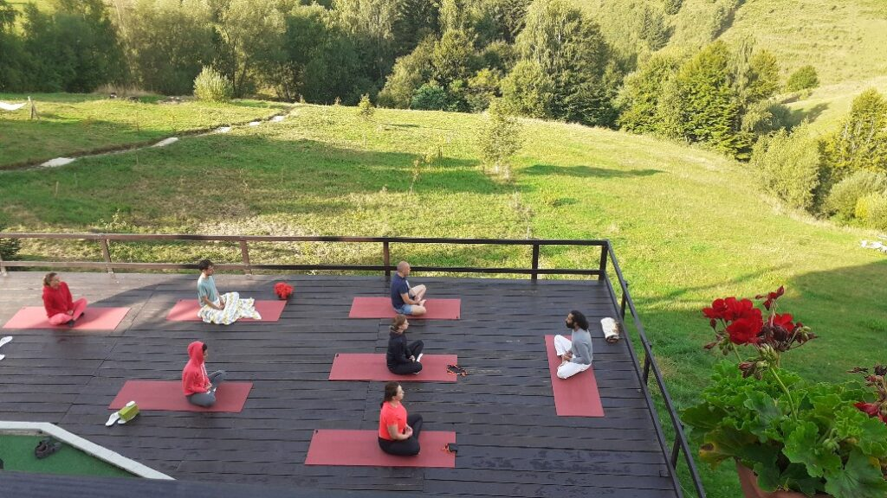
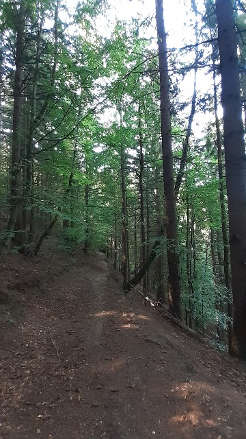

+++
date = 2022-08-25
title = "Ziua 226"
description = "Am trăit o stare de extaz și o mulțumire și o iubire de oameni frumoși și de viață bună pe care am udat-o din belșug cu lacrimi de recunoștință acolo, pe terasă, de m-am curățat bine de tot jegul pe care l-am strâns în zilele în care am bodogănit viața mea ce mă punea să spăl și să strâng rahați. Aceeași viață îmi dă acum șansa extazului simplu, cauzat de percepția mea, aceeași care mi-a tot dat șah, până de curând."
authors = ["Biannca Locatelli"]
[taxonomies]
tags = []
[extra]
math = false
diagram = false
image = "images/ziua-225-1.jpg"
+++
---

Convingerea mea că absolut nimic pe această planetă nu e întâmplător sau de umplutură sau risipă, mi se întărește iremediabil în fiecare zi. Acum câteva zile mă întrebam cum pot unii să se trezească direct pe salteaua de yoga. Ei bine, în astă dimineață am și răspunsul: cu voință.

Ginerele proprietarului este un indian fermecător și autentic și, ca orice indian fermecător și autentic, are yoga tradițională în sânge. El este responsabilul cu starea de spirit a clienților pensiunii și o face cu sârguință în fiecare dimineață, de la 7:30!

După o zi atât de plină cum a fost cea de ieri, am avut o noapte dintr-o bucată, adâncă, pe care nu vreau s-o bruschez cu nimic, nici măcar cu yoga. La alarma telefonului lui Mr. H, am deschis un ochi mic și bleg, am luat pulsul locului, m-am dumirit din nou de minunea de a nu fi acasă la mine ci la Akasha, l-am închis la loc și nu m-am dat dusă din binele care sălășluia în patul bestial al pensiunii. Eu de aici nu mă duc nicăieri acum! Dar domnul meu e hotărât, așa că se prelinge încetișor și se scurge către terasa pensiunii, acolo unde se întâmplă minunea asta atât de matinală, ca să salute mărețul galben și ziua care se naște nouă și primenită.

  

***

Am mai ațipit o țâră, nu mult, pentru că m-a prins din urmă alergia la ambrozie, care și la munte invadează lateralele drumului iar acum eliberează polenul în aer și nasul meu îl prinde, oriunde ar fi. De altfel, și ambrozia face parte din răspunsul pentru care, neștiut la acel moment, nu m-am dus către yoga: cum ar fi fost să fiu pe salteluță cu ochii curgând și cu mucii plecați la vale, eu încercând să fac asane?! Cred că groaznic, mai ales că din când în când, mă mai scutură și câte-un strănut din rărunchi, de mă zgâlțâi cu totul. Asta e, nu o să mă oprească ambrozia să mă bucur de restul statului la munte, chiar de-ar fi să car după mine un bax de hârtie igienică. E o nebunie când se pornesc fluidele să iasă pe la ochi și prin nas.

Mă lăbărțez în patul rămas doar al meu și-mi iau pulsul: mă simt vinovată că nu m-am dus la yoga, că n-am supt din tot nectarul pe care poate să-l ofere, veritabil și mișto, Akasha? Nope, nu mă simt nici picătură.

***

La 8 și-un pic mă pornesc spre living, să-mi fac un ceai și să mă hrănesc puternic cu priveliștea mirifică pe care o are pensiunea asta faină.

De la terasa etajului, îi privesc cu plăcere pe practicanții de yoga și pe "profesorul" lor. Rar mi s-a întâmplat în viață, poate și pentru că n-am fost deschisă sau încrezătoare îndeajuns, să simt iubire pură, fără nicio altă conotație, față de o altă persoană, din prima clipă. Așa am simțit față de indianul subțirel, cu cercei în urechi și inele uriașe pe degete, cu părul făcut cu dreadlocksuri, stil afro. Emană această ființă umană o plăcere în orice face, de la o simplă respirație până la o conversație, ai impresia că aruncă stropi de bucurie de viață la fiecare pas pe care-l face, că m-a cucerit, deși era la 20 de metri distanță și nu-l mai văzusem în viața mea. M-am așezat pe terasă, cu ceaiul bun-bun și am ascultat explicațiile date, atât de mișto, la fiecare asană făcută de cei prezenți. Printre suflat de nas și șters de ochi, am făcut și eu yoga, chiar și așa, empiric, prin ascultare. Am trăit o stare de extaz și o mulțumire și o iubire de oameni frumoși și de viață bună pe care am udat-o din belșug cu lacrimi de recunoștință acolo, pe terasă, de m-am curățat bine de tot jegul pe care l-am strâns în zilele în care am bodogănit viața mea ce mă punea să spăl și să strâng rahați. Aceeași viață îmi dă acum șansa extazului simplu, cauzat de percepția mea, aceeași care mi-a tot dat șah, până de curând.

***

Mi-am așteptat domnul să ne înfruptăm din micul dejun delicios, iarăși m-am umflat ca un bondărel.

La cafea ne-a însoțit și proprietarul, cu care ne face mereu plăcere să stăm de povești, că are multe și e un personaj interesant, pe puțin. E clujean, are accentul ăla moale, de te unde pe suflet, e umblat prin toată lumea și trecut prin multe situații de viață, unele chiar la limită.

Din vorbă-n vorbă, împărtășindu-i interesul nostru în zonă, ne întinde o mână de ajutor și-și sună un prieten, cu multe relații și cunoștințe despre terenuri și case. Nu degeaba-i vorba "cine se aseamănă, se adună", am stat la discuții cu prietenul proprietarului vreo trei ore și cred că puteam să stăm trei zile că nu ne-am fi plictisit o clipă. Un domn fascinant, bogat din toate punctele de vedere, care mie mi-a contribuit enorm, de la care am luat nuanțe superbe la lucruri pe care le vedeam în alb și negru, care m-a învățat că important e ce "ai în traistă", ce "tracțiune ai" și irelevant ce n-ai în traistă, că cu ce n-ai, nu poți construi. E un om influent atât în viața zonei dar și mai sus de atât, cu care am putut să fiu simplă și autentică și cum sunt eu, nestingherită și neintimidată nici de bogația lui materială, dar mai ales de cea spirituală. Și la fel și Mr. H. Ăștia sunt oameni mari, a căror apropiere te face și pe tine mare prin proximitate. Nu cred că aș fi putut cere mai multă abundență de frumos Universului de cât am primit.

Și-au dat mâna, în zilele astea, frumusețea naturii cu frumusețea umană și-au scos la suprafață diamante pe care mi le-au pus în ochi și-n inimă și-n minte, să le duc cu mine de acum înainte tot mosorelul. Mă simt și mică și imensă, inima nu-mi poate cuprinde starea asta de sublim, dau peste margini de cât de multă e în mine și de abia am început ziua. Mulțam e infim.

***

Am plecat din nou pe coclauri, de data asta cu imboldul inițial de a găsi terenurile de care am tot vorbit în astă dimineață. Îmi place acest sătuc, îmi place ideea de a crea o comunitate de oameni faini aici, interesați și de binele altora iar asta ne dă, și mie și lui Mr. H, aripi de a construi. Idei, proiecte, poate realități. Adânciți fiecare în gândurile și visele lui, ne-am prins, destul de repejor, că am început să mergem iute, parcă ne gonește cineva să ajungem undeva. Respiratul meu greu m-a făcut atentă că-n visarea asta, am uitat esențialul: să ne bucurăm de traseu, de parcurs iar ajungerea la terenurile vizate să fie încununarea itinerariului. Noi am uitat de bucuria drumului și ne-am reîntors la încrâncenarea clasică, aia înscrisă-n carne, de a ajunge la destinație cât mai repede. De la momentul la care ne-am făcut atenți, totul s-a relaxat și a curs lin toată ziulica.

***

Am bătut cu pasul colină după colină, mi-au bucurat sufletul fluturii, lăcustele, păsările, sunătoare și cicoarea, pe alocuri menta sălbatică, mestecenii, brazii, ulmii, firul de iarbă sau stâncile. Le-am cuprins pe toate cu privirea și mi le-am cuibărit în interior, nealterate de nicio percepție a mea, le-am cules și le-am înghețat fix așa cum mi-au venit.

  

Cu foamea-n gât, ne-am "împiedicat" la fix de magazinul satului, de unde am luat alune, că fructe nu aveau, și am plecat din nou în hălăduială, nu înainte de a-l întreba de vânzător dacă știe ceva despre intenții de vânzare. Localnicii sunt ermetici, își apără sătucul de invazia străinilor și, chiar dacă nu mă coafează, îi înțeleg și apreciez pentru asta.

Ne-am afundat, ronțăind cu mare plăcere, în pădure și-am trăit clipe totale.

Pentru cine nu iubește natura, muntele în special, o rază de soare care pică anume pe o buturugă poate să nu însemne nimic. Sau o lumină rozalie într-o pădure doar de brazi, mai spre apus de soare. Sau mirosul de pământ reavăn, de frunze în putrefacție, de ciuperci. Pentru mine toate astea sunt delicii ale simțurilor, pe care le absorb cu toți porii, într-o prezență maximă și știu că nu le voi uita în viața asta. Pentru că fac parte din ea dar mai ales, pentru că vin să pună balsam peste un suflet hărtănit și uzat în lipirea asta aiurea de o casă. Trag în plămâni toată libertatea asta cu miros de pădure, la fel cum am tras libertatea cu miros de ciubăr. Mă îmbib bine, să mă țină.

  

***

Azi ne-am întrecut cu gluma, am umblat șapte ore și am ajuns fix cât să mai întrebăm câțiva localnici din preajma pensiunii, despre posibile terenuri sau case de vânzare. Cu un vecin am avut așa de repede chimie, că ne-a invitat în casa lui, să ne-o arate și să stăm "tihniți la o vorbă". Altul ne-a dat informații valoroase și numere de telefon.

Peste tot azi, contactele cu umanii au fost miraculoase. Poate așa or fi oamenii locului, calzi, dar am simțit că fiind deschiși, simpli, cu întrebări oneste și cu ochii în ochii lor, am creat o punte pe care am inaintat și unii și alții cu încredere. A fost pentru mine o lecție de umanitate și de comuniune, mai ales când vânzătorul de la magazinul satului, de unde am luat alune, în curtea căruia am ajuns trimiși de alt localnic, ne-a zâmbit recunoscându-ne și ne-a întins pe-un bilețel un număr de telefon. In the end, ne-a acceptat în mica lui lume. Iar eu m-am simțit mai importantă ca oricând, dar nu ca individ, ci ca ființă umană. Aveam nevoie să văd puterea lui "unde-s mulți" că prea m-am simțit singură.

***

Nu mai apucăm nici ciubăr și nici măcar un duș, că cina e gata și eu nu vreau să ratez bucatele calde: hummus cu cartof dulce, baba ganoush, salată verde cu susan negru, vinete cu sos de soia și roșii din grădina pensiunii, cartof zdrobit la cuptor și-un desert de mi s-a topit pe limbă, cremă de caju cu mango pasat, felii de migdale și smochine. Mâine mă dau bine pe lângă proprietari, poate mă înfiază.

***

Mi se închideau ochii încă de la duș, cred că am adormit în drum spre pat. Dar mă înclin cu venerație pentru:

1. Diversitatea vieții!
2. Acel ceva care se activează în fiecare ființă umană care simte în altă ființă umană onestitatea!
3. Mâncarea vegană gătită de cei de la Akasha, curcubeu pe cerul gurii, care n-a făcut rău niciunei ființe să ajungă în farfuriile noastre, hrană vie!

Iar frumosul zilei mele sunt oamenii, în toate splendoarea lor curată!

 

 

  

    <a href="/blog/ziua-225/">Postarea anterioară</a>
  

  

    <a href="/blog/ziua-227/">Postarea următoare</a>
  

