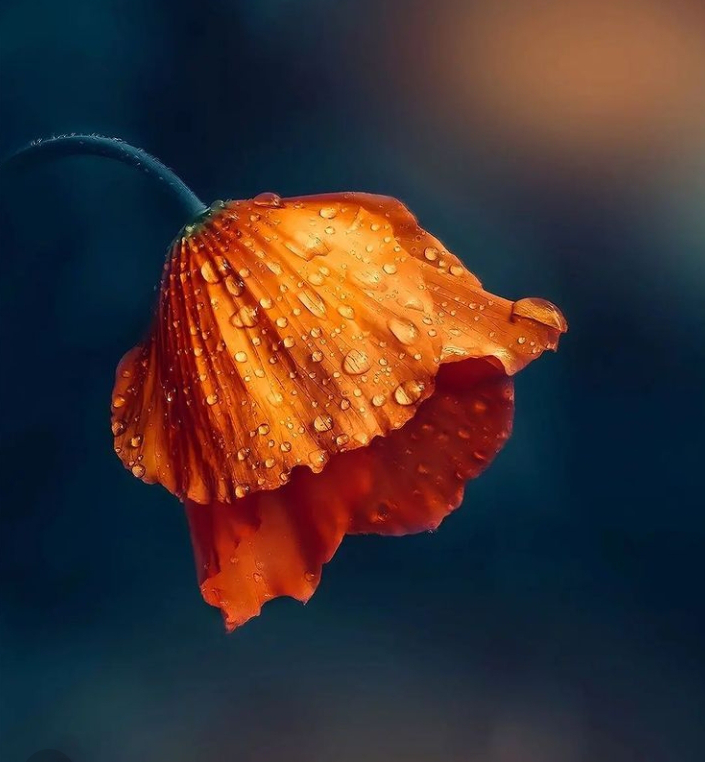

+++
date = 2022-08-27
title = "Ziua 228"
description = "E curioasă să știe cum a fost, eu, naivă, iau curiozitatea ei și încep să prăvălesc cuvinte atât de înțesate de stări pentru mine încât, pentru clipele alea, am plecat cu totul în zilele mele mai mult decât magice. Mă uit la ea și mă prind că amândouă suntem plecate departe, cuvintele mele lovesc zgomotos o liniște în care ea s-a izolat, nu cred că mă aude pentru că nu are nicio reacție. Oare curiozitatea n-a ținut decât un licăr, cât să-mi trag eu suflul și să mă pornesc?"
authors = ["Biannca Locatelli"]
[taxonomies]
tags = []
[extra]
math = false
diagram = false
image = "images/ziua-228.jpg"
+++
---

Fie m-a marcat puternic revenirea acasă și a lăsat un semn în mintea mea din timpul nopții, fie am reintrat rapid în matca pe care am părăsit-o atât de ușor pentru câteva zile, în prea dimineața asta m-am trezit brusc și pe deplin conștientă unde sunt. E drept că și sunetul de trompetă înfundată, ce se auzea din partea domnului meu, a contribuit din plin la deșteptare și un stropșor și la resemnare. It is what it is.

Pentru că am învățat eu acum câteva zile că-i mult mai sănătos și profitabil să vezi ce ai în traistă decât să te plângi de ce n-ai, nu mi-am deschis ochii și am tras de-un colț de timp cât să mă hotărăsc la ce direcție imprim dimineții sau chiar întregii zile. Deși nu-i chiar sigur că mă ține atât de mult.

Ok, hai să vedem ce am: am un pat mai bun ca cel de la pensiune? Am, unu: că-i patul meu în care m-am obișnuit și doi: că chiar avem o saltea bună-bună. Îl am pe domnul meu, chiar și trompetist, lângă mine? Îl am și am și-o pisică care mai are puțin și mi se urcă pe față, numa' să-mi fie aproape. Le am pe mama cu a ei pisică în viață? Le am. E pace și liniște în jurul meu? Este. Hai că s-a făcut greuță desaga, dac-oi fi cu băgare de seamă poate-oi mai burduși-o nițel și pe parcursul zilei.

La fiecare plus adunat în traistă am și mulțumit pentru existența lui în viața mea, așa că, incredibil de subtil, memoria imprimată în materia dormitorului nostru, cea care mi-a știut toate diminețile, cele mai multe cu ritualul de recunoștință, a preluat frâiele din mintea mea și mi-a condus-o ușurel către vechea orânduire: ceremonialul de mulțumiri, scanarea de corp și ridicarea la verticală. Pentru că am cam zăpăcit materia asta în ceea ce privește stările care-mi acompaniază acțiunile, nu știe ce să-mi livreze și am toată paleta la alegere. It's up to me. Ok, o să gust liniaritatea azi, pentru că știu că-mi va fi nu tocmai ușor să mă reacomodez la legatul aripilor pe care-l simt aici, din ce în ce mai intens în ultima perioadă. Măcar să rămân pe-un centru, să nu mă duc la fundul butoiul cu melancolie și tristețe.

***

Mi-am sorbit apa cu ochii la vechiul meu iubit albastru, înlocuit pentru puțin de magistralul verde al colinelor. Am și eu verde în curte, și în trifoi dar și-n copăceii mai mici sau mai mari. Mă leg de el ca să mă aduc cu totul înapoi acasă, la mine, în prezentul meu, pentru că invariabil mintea mi-a fugit la micul dejun pus la "botul calului" și la bătutul colinelor la pas. Cu un oftat mic, scăpat de sub presiunea pe care mi-o pun pe minte să nu uit ce am în traistă, mă apuc să strâng, deocamdată superficial, în bucătărie.

Mama în continuare refuză smoothieul așa că mi-l fac pe al meu în care, ca notă de noutate, pun o lingură de unt de arahide, de data asta cumpărat. Sunt cu un ochi pe cameră și văd o mamă trezită dar în leneveală. Îmi iau privirea de acolo și alung, și fizic cu mâna, gândul de judecată. Nu lenevește ca să-mi facă mie în ciudă! M-am reîntors la analizele pe text și gânduri. Nu cred că le-am dus dorul.

***

Mă duc la fete să le dau binețe și pliculețul de hrană soră-mii blănoase, dar și să cuprind mai bine ce mă așteaptă astăzi.

Nu s-a schimbat nimic la ea, deși eu am trăit miracole zilele astea, e la fel de saună, poate nu la fel de cocină la baie unde probabil s-a străduit să mențină ordinea, știind că e doar cu copila mea. Gândul ăsta, care este o presupunerea bazată pe o imagine, m-a pus pe gânduri. Oare mama e nepăsătoare doar cu mine, pentru că știe că eu oricum strâng sau zilele astea cât am fost departe de ea, ea a fost mai aproape de ea decât e când sunt în jur? Nu cunosc răspunsul dar mi-ar plăcea tare mult să-l aflu pentru că realitatea din baia ei arată că, dacă vrea, poate.

Deși-mi propun constant să fiu autentică cât mai mult, să-mi aliniez spusul cu făcutul și cu gânditul, în fața mamei sau în jurul ei, am de cele mai multe ori, și așa a fost mereu, o reținere. Acum ea vine din delicatețe iar înainte venea din stângăcia mea. Cu atât mai mult acum, când mintea ei se joacă de-a v-ați ascunselea, nu pot s-o întreb pe șleau, când am vreo nelămurire, ca să nu o pun în corzi sau să primesc un răspuns flamboaiant fără nicio legătură cu realitatea.

***

M-am delectat cu smoothieul cu un twist sărat urmărind un episod interesant despre viața lui Bunny Williams, o creatoare de mobilă și lumini americană, cu care am o afinitate aparte și mă leagă aceeași pasiune pentru vechituri. Mi-au plăcut tare mult interioarele casei ei, alăturări total neașteptate de țesături sau obiecte de decor astfel încât la final să transmită o emoție sau să te ducă la o visare.

De multe ori m-am întrebat de ce sunt atât de avidă de a consuma și avea frumos, sub orice formă și înțeles ar căpăta frumosul ăsta pentru mine, în condițiile în care am și o latură tare pragmatică, ce nu consideră că e nevoie de ceva mai mult decât strictul necesar. Acum știu că în mine sălășluiesc multe fațete, că am în mine lumi întregi de potențialuri, dar se activează doar cele care au sens pentru experiența acestei vieți și nu mă mai judec pentru frivolitate. Dacă celei care apreciază frumosul îi crește considerabil suflet fain în momentele de creație frumos, ce sens ar avea să-i dau în cap și să mă arunc într-un off grid convențional, în care mă pot lipsi de tot confortul modern?

***

Mama nu are niciun gând și nicio dorință de a coborî așa că mă duc să o aduc la micul dejun.

E curioasă să știe cum a fost, eu, naivă, iau curiozitatea ei și încep să prăvălesc cuvinte atât de înțesate de stări pentru mine încât, pentru clipele alea, am plecat cu totul în zilele mele mai mult decât magice. Mă uit la ea și mă prind că amândouă suntem plecate departe, cuvintele mele lovesc zgomotos o liniște în care ea s-a izolat, nu cred că mă aude pentru că nu are nicio reacție. Oare curiozitatea n-a ținut decât un licăr, cât să-mi trag eu suflul și să mă pornesc sau entuziasmul meu, buluceala mea de povești de drag au speriat-o și s-a retras brusc, atât de brusc că nici n-am sesizat? M-am oprit, ea a revenit, m-a întrebat din nou cum a fost doar că de data asta am fost mult mai cumpătată și cu mai puține vorbe în prezentare. Nu știu cât o ține fitilul atenției dar nici nu vreau să aflu. Spun scurt, concis și la subiect.

Chiar dacă sunt tristă că nu se poate bucura cu și pentru mine, chiar dacă-mi doresc și eu să fiu în altă parte și nu-s, nu pot să nu observ cât de puțin a mâncat și cât de puțină devine pe zi ce trece. Nu mi-a plăcut niciodată asocierea "s-a topit pe picioare", mie mi se pare scabroasă, dar asta descrie cel mai elocvent situația ei. Deși am auzit-o cum îi spunea prietenei ei la telefon, după petrecerea surpriză de ziua ei, că asta i-a dat puterea să vrea să meargă mai departe, momentele în care vrerea asta se manifestă conștient sunt din ce în ce mai rare.

Iar m-am adâncit în analize, ce-ar fi să revin la clipă? Nope, nu-mi place și d-aia găsesc brizbrizuri colaterale care să mă țină interesată. Bine c-am pus lupa și pe mecanismul ăsta, măcar nu e o dimineață irosită.

***

Mereu mi-a plăcut priveliștea oferită de domnul meu dar în dimineața asta, e ceva aparte și nu mă prind ce e diferit. El mănâncă, eu vorbesc și la un moment dat, după priviri furișe, îi spun că ceva nu e în regulă cu fața lui. Am dreptate, are fruntea umflată în partea de sus, imediat sub păr, cu precădere mai mult în partea stângă. Să te trezești cu capul umflat fără nicio lovitură, ciupitură sau orice altceva, nu e un lucru ușor de dus. Nu e nici pentru el, dar clar nici pentru mine, care mi-am antrenat mintea juma' de viață să găsească scenariile cele mai nașpa posibil. În câteva clipe mi-au trecut multe prin cap dar, ca să nu-mi prelungesc febrilitatea căutărilor și mai mult, pun mâna pe telefon și-l întreb pe fratele google. Singura variantă care pare verosimilă este să fi făcut insolație iar umflătura să fie o consecință a faptului că a umblat cu capul ras neacoperit pe coline și prin păduri. E drept că suntem grena amândoi la față, că mie mi se cojește fața, dar de la asta până la umflăturile astea odioase, e cale lungă. Fratele Google, varianta lui de doctor empiric, zice că poate fi un rezultat direct al insolației. Mi-am mai tras sufletul cât să gândesc varianta cea mai bună în aceste momente: accesarea medicului de familie.

Antiinflamator și gel antiedematos sunt prietenele lui Mr. H, din 8 în 8 ore, până s-o recupera complet. Habar n-aveam că nepurtatul de ceva pe cap se poate solda cu așa ceva dar am învățat the hard way.

***

Fuga la farmacie, fuga și la câteva cumpărături, am și uitat cum e să n-ai to do-uri, deși tocmai ieri, la ora asta, eram într-o relaxare totală.

Ajunsă acasă mă apuc de mâncare, bag repede de-un gazpacho cu roșii bune din producție proprie, fac și salate cu de toate și gata, e momentul ăla pe care l-am tot amânat dar m-a prins din urmă: curățenia la mama.

Mi-a luat o oră în timp fizic și mi-a șters 3 zile în timp magic. Domestosul ăsta mi-a ars nările și-a alungat de acolo orice urmă aș mai fi avut de bețigaș indian parfumat. M-am umplut de părul lui Sassy și  m-am scuturat de verdele crud de munte. Mi-am aglomerat mintea de gânduri aiurea și inima de trăiri mici în defavoarea liniștii atât de pline pe care mi-o adunasem cu drag zilele trecute. Și tocmai ce mi-am mai agățat o dilemă în existență: cum fac să n-am regrete?

***

Cobor cu ea, îmbăiată și bibilită, să-i dau prânzul. Fac eforturi să spoiesc resemnarea care mă cuprinde ușor-ușor, pentru că știu teoria conform căreia alegerea îmi aparține. Pot întoarce totul în favoarea mea într-o fracțiune de secundă, prin voință și totuși fracțiunea aia se lasă mult dorită.

Mama mănâncă absentă iar eu sunt prezentă deși parcă n-aș vrea să fiu: în acest moment, hrănesc un corp și atât. Undeva, în spate, e și un suflet închis și, și mai în spate, e și spiritul, însă niciunul nu mai răzbate densitatea.

***

Îmi petrec restul zilei scriind, fugind de o realitate prezentă într-una trecută, în care mi-a fost bine și nu pot să mă abțin să nu văd similaritățile cu mama. Și mintea ei face la fel. Ce fac eu diferit să-mi țin mintea pe șină?

A fost o zi cu regrete, mai acute sau mai voalate, cu panică în suflet și ușurări momentane, dar am și recunoștință pentru:
1. Smoothieul meu, în varianta nouă!
2. Google!
3. Dorința mea neabătută de a învăța!

Clipa mea de frumos este:

  

 

 

  

    <a href="/blog/ziua-227/">Postarea anterioară</a>
  

  

    <a href="/blog/ziua-229/">Postarea următoare</a>
  

