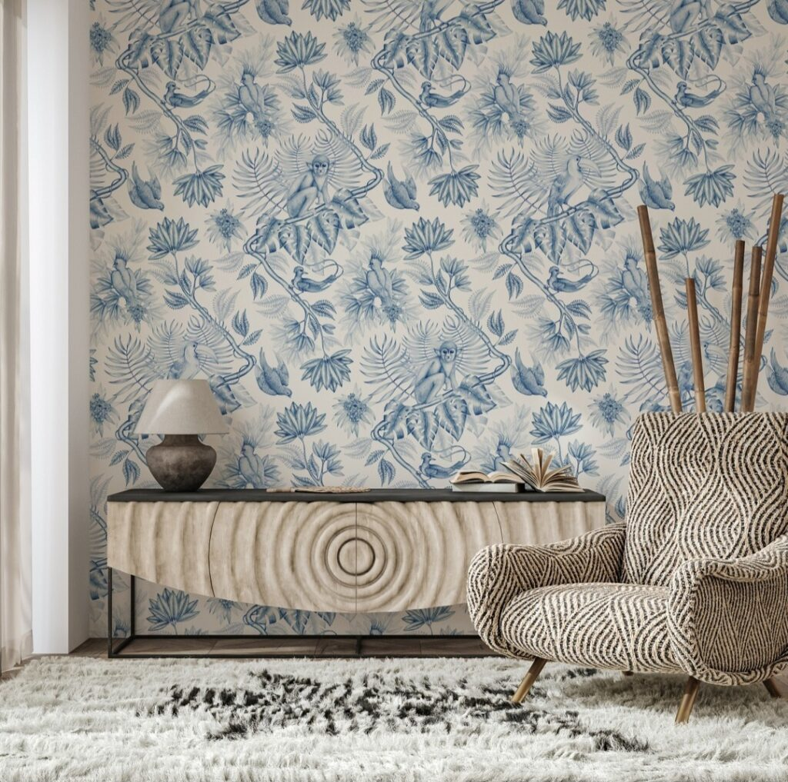

+++
date = 2022-09-07
title = "Ziua 239"
description = "Extrem de cerebrală, văd limpede, albastru egeic, că nicio furtună nu ține o veșnicie albă. Extrem de emoțională, îmi dau peste gura cerebrală cu nerăbdarea, cu dorința mea de libertate curată, fără vini și reproșuri ulterioare și mă prind, again, că oricare ar fi finalul acestei povești, oricum voi pierde. Dar voi fi și câștigat."
authors = ["Biannca Locatelli"]
[taxonomies]
tags = []
[extra]
math = false
diagram = false
image = "images/ziua-239.jpg"
+++
---

Cred că dacă aș fi fost atentă la apăsătoarele vise ce-au venit grămadă bulucită peste mine în noaptea ce-a trecut și aș fi extras esența din fiecare, la final aș fi întregit și cuvântul, dar și trăirea ce-mi definește, deloc nobil, viața acum: resemnare. În prea dimineața asta, tocmai pentru că au fost intense, sunt capabilă să-mi aduc aminte câteva din visele avute și să le văd firul comun.

Nu am găsit nicăieri vreo explicație care să rezonene în interiorul meu 100% ca fiind adevăr pur despre ce sunt cu adevărat visele, dar, indiferent de natura lor, e clar că sunt o supapă a unui preaplin care dacă nu s-ar răsturna astfel, poate ar ucide. Cred. În dimineața asta mi-am pus ochii într-o dronă, mi i-am ridicat în înalt și-am cercetat curioasă măruntaiele fierbinți ale unor vise pe care încă le simt atârgățătoare în fibre. Cum a ieșit ea, draga de ea, la suprafață, cum am expulzat în smoala caldă a nopții, resemnarea pe care am luat-o de bună, să-mi servească drept punte din vremurile pe care (nu) le trec acum către vremuri portocalii mișto. În clipă mică și caldă și cu ecou de torcăceală blândă ce vine din partea stângă a capului meu, unde s-a cocoțat Spikylina să doarmă, simt falsitatea stării de care m-am agățat ca de-un colac de salvare, dar și falsitatea apocalipsei care mă încearcă. Extrem de cerebrală, văd limpede, albastru egeic, că nicio furtună nu ține o veșnicie albă. Extrem de emoțională, îmi dau peste gura cerebrală cu nerăbdarea, cu dorința mea de libertate curată, fără vini și reproșuri ulterioare și mă prind, again, că oricare ar fi finalul acestei povești, oricum voi pierde. Dar voi fi și câștigat. În duelul ăsta de argumente pe care și le azvârl cele două Biennci, câștigă o a treia, care ȘTIE că totul, aici, e o iluzie. Dar ce ne mai place să ne dedulcim…

N-am încă chemarea să-mi număr motive de recunoștință astăzi, parcă deja m-a epuizat debate-ul ăsta ce l-am avut atât de matinal în mine, dar întind mâna spre coconetul mic și blănos, care se întinde peste ochii mei, caldă și vibrândă. E un moment mic atât de frumos că zău aș sta așa, să mă adap din plăcerea asta simplă a unui trup mic peste ochii mei, cât mai mult. Un gând șugubăț îmi trece razant prin creier: o fi capabilă tomberoneza mea frumoasă să absoarbă, doar prin prezența ei mică, energiile astea negative care-mi împresoară mintea? Evident că n-am răspuns clar, orice e posibil, cert este că mă bucur că a existat ea, în aceste momente, lângă și pe mine.

***

Deschid larg geamul să intre grădina în living și privirea mi-e ațâțată de mișcări bruște.

În curte sunt mulți făzănei, un singur fazan și cred că sunt vreo două-trei făzănițe care s-au aciuat rapid la adăpostul zonei unde strâng eu compostul. Nu știu dacă zgomotul brusc, făcut probabil de fereastra deschisă, i-a alertat pe toți sau una din făzănițe, care scoate niște sunete ascuțite, le-a dat alarma, cert este că toți ascultă de ea, s-au adunat unul într-altul și se aude un zgomot central care în spate e construit de sunete mici, de tonalitate diferită, strigăte de puiuți speriați. Ei cică s-au adăpostit, nu-i mai vede nimeni, dar fac o hărmălaie de i-ai depista și cu ochii închiși. Toți copiii, indiferent de specie, sunt la fel. Mă zâmbesc și-mi încălzesc un strop înăuntrul.

Beau apa aproape fierbinte, cu multă, multă lămâie, vreau să mă și strepezesc, dar să mă și alcalinizez. Atâtea gânduri acide am băgat în emoțiile mele încât trebe neapărat să fac cumva să mi le spăl.

Cu smochine și piersici proprii, alături de banana bio, caisele și semințele înmuiate, plus un strop de ulei de cocos, care să activeze beta carotenul și să-mi livreze vitamina A, retinolul, dau drumul și la smoothieul dimineții, apa de ceai deja fierbe, pe nesimțitelea, m-am pornit fără mare tam-tam într-o nouă zi. Mi-e și frică să zic "doamne ajută să fie o zi bună!", am reținut eu cum că dacă cer ceva, mai abitir faci Universul atent că-ți lipsește acel ceva. Iar cum Universul doar oglindește, parcă nu vreau să fac lipsa la pătrat. Încerc să mă mențin neutră, să mă deschid pentru orice va fi să fie. Ușor de zis, tare greu de făcut, știu din experiența zilelor ce tocmai m-au tăiat prin trecerea lor zgrunțuroasă.

***

Mă adun și aduc cu prezența la micul dejun al domnului meu, care e vioi și cu chef de vorbă la prima oră, culmea, el care rareori e așa. Cum nu e un moment de ratat, mă așez calmă și caldă pe poveștile lui de la birou, pe gândurile lui pe care mi le așterne, pe trăirile pe care mi le împărtășește, și-mi dau seama că toate astea sunt comori. În genere, oamenii, fie că-s ei introvertiți sau extrovertiți, sunt ermetici, nu lasă așa ușor și oricui la vedere cămăruțele inimii. Primesc cu prețuire momentele astea și le pun în mine, în desaga de bun și de bine, unde am mare nevoie.

Nu e prea mare ceremonie la micul dejun al mamei, cred că a fost ceva în aer zilele astea, de ne-a zguduit așa pe amândouă, cert este că e o țâră mai sus cu starea de spirit, dar și cu atitudinea, are un licăr zâmbăreț în privire, e o pală de blajin și de matern pe chipul ei, iar eu mă agăț, instantaneu, ca o sugativă, de asta. Doamne, oricât de bine am înțeles și oricât de conștientă ar fi conștientizarea (!) traumei abandonului, de câte ori văd în mama bucăți de mamă, așa cum îmi imaginez eu că ar fi trebuit să fie mama, sau cum știu că sunt eu mamă, mă mufez inconștient, mă lipesc instant, fără niciun drept de apel, la clipa aia. Oare o să depășesc vreodată faza asta de bebeluș atras instinctiv de sânul mamei?! Sau măcar să nu-i mai atașez încărcătura asta teribilă?!

***

Plec la Hornbach că am câte ceva de cumpărat și aici mă plesnește peste ochi mundanul vremurilor noastre, a lumii ăsteia în care femeia vrea să fie egalul bărbatului, tocmai pentru că el i-a stat cu piciorul pe gât atâta amar de secole. Mi se pare aiurea această dorință acum dar, deși cred cu tărie în feminitatea și gingășia femeii și în puterea și protecția bărbatului, adevărul este că am activat, în mai toată viața mea, din partea mea masculină, mereu am vrut să nu fiu mai prejos.

Uite însă că azi tare mult mi-ar fi plăcut ca bărbații pe care i-am întâlnit în Hornbach să fie bărbați, să mă ajute la cărat, să mă protejeze, să nu fie tot femeie cea care să-mi sară-n ajutor. Sau, poate, nu am eu ce căuta în acest tip de magazin, in the first place…

Trec și prin Carrefour să las la reciclat niște baterii, să schimb 4 litri de ulei folosit cu 1 l de ulei nou, să bifez și cumpărăturile, ca o femeie ce mi(-)s și nu uit să-i iau mamei o savarină, așa, de bucurie dulce.

Nu mi-am lăsat acasă ochii cu care observ, sau poate judec, lumea și nu pot să mă fac că nu văd diferența pe care o face educația.

Pe-un rând de Carrefour, un el și o ea se ceartă, se hingheresc unul pe altul și pentru că dau pe dinafară de nefericire și necaz, se mai varsă și pe-o angajată nimerită pe raionul respectiv. N-a știut draga de ea ce-a lovit-o când, cu voci de butoaie, s-au pornit ăștia doi s-o ia la rost, că ei nu găsesc oțetul ăla de 9 grade, că ar trebui să fie în văzul tuturor, că ăla se caută. Femeia se execută, stă drepți și-i duce la capătul rândului unde tronează, pe raftul de jos, în față, oțetul de 9 grade. Cu toate astea, nu s-a calificat la niciun mulțumesc, ei tot bodogănind au plecat.

În zona de fructe, un domn îl întreabă pe angajatul ce descarcă o ladă de avocado, dacă știe cât costă rodiile, că nu scrie nici pe ele, nici nu vede vreo etichetă cu preț. Omul întreabă liniar, fără nicio inflexiune a reproș în voce, tonalitatea nu îi e în niciun fel stridentă, iar angajatul, din dorința de a-l ajuta, se duce și caută, dă telefoane și până la urmă îi livrează informația necesară.

Acum, nu vreau să judec tonalități, ci energii. Oare cu ce gând i-o fi petrecut angajata de la raionul cu oțet pe cei doi și cu ce gând l-a petrecut acum, zâmbind, angajatul de la rodii pe domnul drăguț? Ideea este că ambele se duc, fix amândouă, în câmpul nostru colectiv de energie și ne impactează pe toți, că suntem, vrem, nu vrem, un întreg. Nu poți fi bine și sănătos dacă degetul mic ți-e cangrenat.

Yep, educația e ca erecția: dac-o ai, se vede.

***

Pregătesc prânzul pentru toți, fiecare cu mâncarea lui: mamei îi fac grătar cu un pic de usturoi lângă, că-i place, lui Mr. H o mâncare de linte cu mult curry, iar mie o salată mare. După ora 14 nu vreau să mai mănânc nimic, țin postul intermitent, dar până atunci se bat turcii la gura mea, așa-s de pofticioasă și de aș mânca din de toate. Cred că-s răspunsuri multiple la "oare de ce-ul?" meu: fie premenopauza, fie pe sistem nervos, clasica scuză, fie e doar comfort food. Nu am nevoie de explicații detaliate, mă știu că dintotdeauna am fost o gurmandă așa că asta cu postul, câteodată, de cele mai multe ori, nu-mi vine chiar așa de natural cum le-ar fi venit înaintașilor mei, în vremuri de peșteră și de vânat.

Până la prânzul mamei, îmi revigorez, minimal, suportul de lemn brodat pe care l-am denumit Alice în Țara minunilor și care mi se pare o operă de artă. Cineva a stat și-a sculptat, și-a ondulat, și-a îmbinat atât de magistral această piesă, care e în întregime din lemn, încât nu ai cum, nu se poate să nu se miște ceva în interiorul tău care să-și scoată pălăria în semn de mare respect pentru asta. Iar culorile alese sunt culorile mele preferate.

Îl curăț, îi șlefuiesc partea de sus care a cunoscut niște vremuri de nepăsare ghiolbană, și-l pregătesc pentru o lăcuire simplă. Nu vreau să alterez cu nimic mai mult frumusețea, pentru că i-aș face o mare nedreptate.

  

Mama a pecetluit prin prânz că într-adevăr e mult mai bine, a mâncat relativ bine, dar cu siguranță s-a bucurat la noua ei fericire, savarina. De multe ori cred că mama, taman ca mine copiluță fiind, mănâncă mâncarea doar pentru a ajunge la recompensa dulce.

***

Îmi petrec după amiază defilându-mă prin curte, unde mă așez în diferite puncte și privesc casa, doar ca să-mi aduc aminte, prin practica exercițiului, că același lucru poate să arate diferit în funcție de cum te uiți la el.

În defilarea asta spălătoare de creier, îmi dau seama că mereu uit de moneda asta epuizabilă care e timpul, relativ și el, uit că timpul meu e rezultatul unei simple scăderi matematice: momentul morții minus momentul nașterii, iar ce fac în bucățica asta, că-i așa o bucățică mică, e fix treaba mea. Și la propriu, și la figurat. Mi se pare fabulos cum suntem o împletire între carnal și eter, cum putem crea cu mâinile dar și cu gândul, cum între timp ne-am corcit percepțiile și-am ajuns să considerăm iluzia, realitate și realitatea, himeră.

Mă împac și cu mine și cu ziua și cu toate. Atât S-a putut, reflexivul ăsta care ne scoate din culpă mereu.

Nu forțez norocul să articulez niște recunoștințe dar m-a traversat un frumos:

  

Lyrics paper
