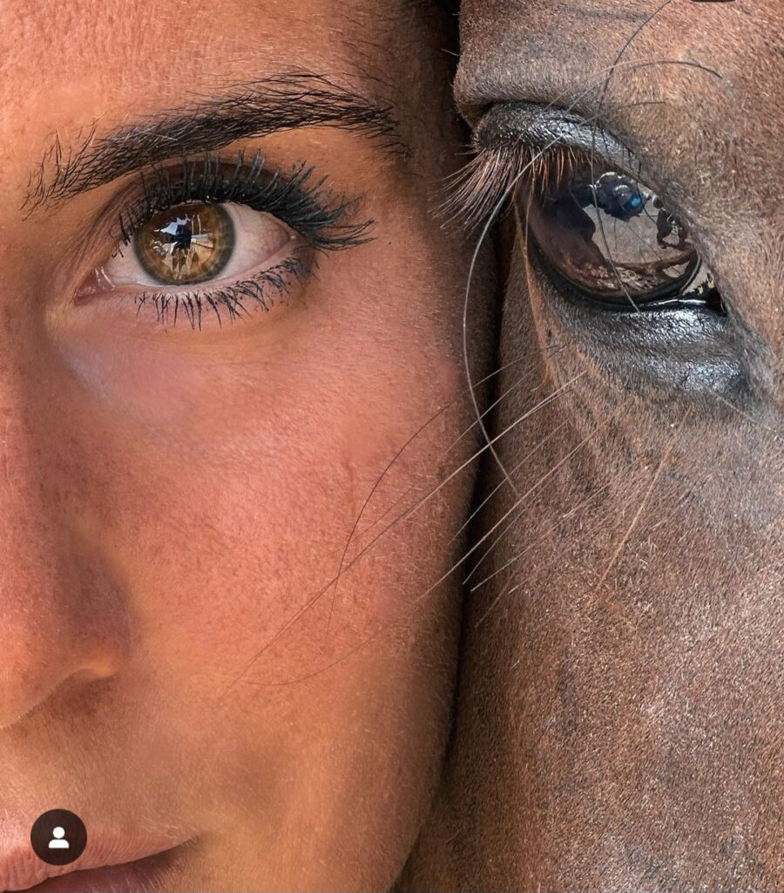

+++
date = 2022-09-10
title = "Ziua 242"
description = "Mi-am trimis pentru o fracțiune de secundă privirea în spatele nostru, al amândurora, și priveliștea mi-a desenat un zâmbet mare în carnea inimii: văd două ființe, una mare și-una mică, cum merg cu pas îngemănat și legănat și vesel spre o nouă zi, spre o nouă viață. Pentru aceeași fracțiune de secundă, ochii văd și înăuntrul meu înțelege imensa încredere pe care o acordăm involuntar și inconștient clipei și vieții. Încrederea că este și, mai ales, că va fi."
authors = ["Biannca Locatelli"]
[taxonomies]
tags = []
[extra]
math = false
diagram = false
image = "images/ziua-242.jpg"
+++
---

Ooo, dar ce muguri de sprințară au răsărit în mine în dimineața asta! Trezirea mi s-a întâmplat scurt și mic, dar nu mi-a fost bruscă și nici nu m-a supărat. A venit natural și naturală ca și cum bucata de vreme în care m-am adăpat cu energie de pe alte tărâmuri atâta a fost, s-a gătat și-s gata s-o consum pe aste meleaguri materiale.

Chiar de sunt sprintenică, încă nu mă umplu de imagini, mă las cu ochii închiși și-mi cercetez simplu, dar profund, celelalte simțuri. Am senzația aia mișto de sclipici prin vene, ca și cum ceva neașteptat și neobișnuit e pe vine, gata să mi se întâmple, respirația mi-e lină, așa cum pare și dormitorul nostru, la pipăitul empiric pe care-l fac asupra energiei camerei. A venit să mă îmbibe culoarea portocalie, o simt cum îmi inundă fascia și-mi dă o senzația tare rotundă de bun. Ce bine mi-e!

Realizez că-n scanarea asta doar de simțuri m-am concentrat atât de intens doar pe senzații că parcă n-a mai încăput în radar niciun gând, mintea, deși știu sigur că-i trează, vigilentă și alertă să-mi servească scenariile ei, nu a avut loc să se îngrămădească pe rândul din față și să-mi arunce lături închipuite. Oare noi, ca ființe venite să experimentăm umanul pe planeta asta, ar trebui să se focusăm mai mult pe senzații, să îndoim și arcuim și să desenăm cu mintea, folosită strict ca instrument, realitatea asta, să sugem din ea totul, până la maxim și să ne bucurăm la fel? Dacă da, ce diferență ar fi între noi și animale? Dacă nu, de ce am venit să experimentăm un corp?

Uite așa, pe nesimțitelea, am plecat din portocaliu pe-o rigidă analiză și ca să nu mă afund și mai mult în ea, mă adun în micul meu ritual și-mi spun eu mie ce sunt, ce merit și ce merit să simt. Îmi fac curaj să mă arăt lumii azi cât mai curată, să fac o diferență în mine, în alții, în lume, pentru mine, pentru alții, pentru lume.

În timp ce mă scurg către parter, cu mica mea parteneră de viață, Spikylina mea scumpă, parcă mi-am trimis pentru o fracțiune de secundă privirea în spatele nostru, al amândurora, și priveliștea mi-a desenat un zâmbet mare în carnea inimii: văd două ființe, una mare și-una mică, cum merg cu pas îngemănat și legănat și vesel spre o nouă zi, spre o nouă viață. Pentru aceeași fracțiune de secundă, ochii văd și înăuntrul meu înțelege imensa încredere pe care o acordăm involuntar și inconștient clipei și vieții. Încrederea că este și, mai ales, că va fi. Privesc ființele astea două cum merg ele liniștite, fără nicio suspiciune că totul s-ar putea termina fix în această miime de secundă. Și, de nicăieri și de peste tot în același timp, mă cuprinde total recunoștința și pentru inconștiența umană, care nu are tot timpul ochiul și gândul pe moarte, pe trecere, pe efemer. În dimineața asta, iubesc încrederea din pasul meu și din pașii mici și mărunți ai Chichiricăi.

***

Tot ritualul meu matinal a fost o cireașă de pe tort pe starea mea faină și chiar de sunt în partea roz azi, trimit gând de mulțumire și pentru zilele alea gri, care au fost intermediare pentru astfel de zile moi și blânde cu o mine destul de zdruncinată de demența asta afurisită.

Nu știu de are vreo legătură, atât de subtilă și atât de încrustată-n mine că nici nu mă prind, cu faptul că azi e sâmbătă, dar starea mea parcă e făcută din confetti de weekend și mă bucur că e așa.

Mă afund cu voluptate în youtube și mă delectez cu grădinărit bio și cu permacultură și cu oameni faini, căutători, inventivi, curați. În timp ce sorb cu nesaț informațiile și mă bucură imaginile, simt cum în mine se desface, ca o boboc, înțelegerea că timpul ăsta în care-am fost arestată la domiciliu de Alzheimerul mamei, a fost un timp extrem de bogat. Cred că de fapt a fost cel mai bogat timp din viața mea de până acum. Dintr-odată mi se pare că am jucat la pitici 40 și ceva de ani, că de abia acum încep să înțeleg sensuri, să prind gusturi, să pricep rosturi. Oare așa s-o simți înțelepciunea ce ți se așează în oase și-n părul alb pe la tâmple sau trăitul ăsta forțat, sub tir dement, a scos presionat din mine tot balastul și-a lăsat loc primenit pentru altceva, mai bun, mai frumos, mai pentru mine. Un șuvoi cald de recunoștință mă trece și-mi dau lacrimile. E un catarsis ce se vrea trăit în mine, de mine, prin mine. Să fie, deci!

***

E o distanță de la cer la pământ între ce tocmai m-a traversat, de când am făcut ochi, și ce mă așteaptă, și azi în camera mamei și a lui Sassy. Îmi țin bine în frâu mintea, să nu dea iama cu judecata și-mi închid și nările, să nu ia ele, dragele de ele, în plin toate mirosurile care s-au încălecat în aceeași cameră. Deschid larg geamul, o observ pe mama cum îmi observă mișcările și încerc să nu-mi trădez repulsia nici prin vreun gest, nici prin vreo vorbă, scăpată o țâră mai apăsat. Ar fi păcat să fușteresc minunea de stare ce am născut-o-n mine.

Curăț, arunc, șterg, dezinfectez, schimb litieră, îi dau lui Sassy să pape, mă întrețin cu ea până mama va catadicsi să participe, înțeleg că e molcomă, las curat la ele și plec să pregătesc mic dejunuri.

Am o respirație mult mai ușoară o dată ieșită din camera lor, și de la aer, dar și de la energia care se află acolo și la care eu am devenit extrem de sensibilă. Percep, de cele mai multe ori, din primele clipe cam în ce ape se scaldă mama, doar din "citirea" energiei care plutește la ele în cameră. Uneori, pot să simt ca un fascicul de sine stătător, energia transmisă de Sassy, ca un ghem de curiozitate, de bucurie că mă vede, de plăcere de viață, ce face notă contrastantă cu cea a stăpânei ei.

***

Eu nu cred să fi fost, până acum, conștientă de cât de mofturoasă cu mâncarea a fost mama la viața ei. Am plecat destul de devreme de acasă și n-am fost acolo să văd cum mama și-a făcut doar poftele ei, nemaiavând o altă ființă lângă ea căreia să-i pună mâncare pe masă. Deși mă strădui să aibă mic dejun variat, sunt dimineți în care parcă are tava de rahat sub nas, îi pute cam tot, aia nu vrea, ailaltă nu-i place iar eu, azi, am impresia că Universul îmi dă o lucrare de control scurtă, să vadă cât de pregătită sunt să-i fac față. Parcă o și văd pe doamna Dima, profa noastră de fizică din liceu, care venea și, la 9 ore din 10, zicea scurt, urcată cu fundul pe catedră "_Scoateți o foaie de hârtie!_" iar pe mine mă lua cu leșin tot la 9 ore din 10. Inutil să mai spun că nu mi-a plăcut fizica…

Rămân impasibilă la mofturile mamei și plec departe, cu mintea și cu gândurile.

Lipsa reacțiilor din partea mamei pot fi și chiar sunt devastatoare pentru pui. Evident că nu-mi aduc aminte coerent, de altfel am extrem de puține amintiri de mine pui, dar pot să desfac acum, când merg pe firul stricăciunilor pe care mi le-am făcut în mine, că dacă ea nu a încuviințat un anumit comportament sau fel de-al meu de a fi, eu am crezut că de fapt el nu e bun și am căutat un altul. Și un altul. Și un altul. Nu m-am prins că nu eram a ei să mă editeze, să mă schimbe sau să mă șteargă. Mult timp din mica mea existență m-am tăiat, pe ici, pe colo, prin părțile esențiale, ca să mă strecor, ca și cum eu așa aș fi venit de la mama natură, în grupuri de oameni ce mi se păreau interesanți sau cărora voiam să le plac. Ca o impostoare, mi-am mlădiat părerile după cum mi-au suflat alții, doar ca să mă așez și eu acolo, la ei pe trepte, să-mi trag sufletul încercat sub umbrela părerilor lor de bine despre mine, să mă odihnesc o țâră, să prind puteri, să mă arunc și mai sus, tot mai sus, mereu mai sus, pe culmi care nu erau ale mele. Atâta am șters cu radiera din ale mele, atâta am îndesat ascuns în mine părțile mele autentice, care mi se părea că nu cadrează cu restul, și nici n-avea cum, încât nu e nicio mirare că la 40 de ani m-am trezit frânturi, a trebuit să mă duc după dârele lăsate adânc, în mine, de tușele cu care eu m-am născut, să mi le refac, să mi le reconstruiesc, să mi le desenez înapoi ca să fiu naturala eu, așa cum am venit și cum trebe să rămân.

Nici nu știu când a urcat la ea…. Știu că trebe să mă scutur bine, dacă vreau să rămân roz.

***

Curtea mea și mamea mea adoptivă sau prima mea mamă, natura, mă primesc cu brațele deschise iar eu mă las să curg toată în verdele ce se pregătește de toamnă. Mă duc în fundul grădinii, în tălpile goale și mă așez să privesc. Cerul, aerul, pământul, păsările, gâzele, furnicile care și-au făcut autostradă pe-un stâlp de gard, simplitatea asta imensă care e în jurul meu, din care mă hrănesc și în care o să mă întorc cândva, să hrănesc și eu la rândul meu. Sunt tot roz, dar mi-am pus pe mine și o haină de împăcare, de pace cu clipa. Ce dacă am avut căzături cu zdrelituri, iaca, de partea cealaltă, am ajuns bine. Sau binișor. Am deschis ochii, am permis, am înțeles, iar asta e mult.

Cam aici mi s-a terminat firul gândurilor că nici nu știu unde-au trecut orele, buruienind și grădinărind. Yep, e terapie. Dacă mai aveam vreun gând plângăcios de arest la domiciliu, conștientizarea că "ce frumos domiciliu am!" a spălat tot zoiul ăla împuțit ce atârna nesimțit în câmpul energiei mele.

***

Poate unde am făcut pace cu ea în curte, și mama și-a schimbat nuanța energiei și și-a mâncat cu plăcere prânzul. Am făcut și conversație, nu grea, dar nici nu am pretenții să ne dăm acum doctorate, vreau doar s-o mai simt pe mama așa cum era ea, nimic mai mult. Într-adevăr, apreciem oamenii și lucrurile atunci când nu îi și le mai avem. Mă trage de mânecă o mică tristețe ce miroase a ciorba de duminica din familia noastră, apoi a sarmale, de Crăciunul doar cu ea, apoi a cozonac cu rahat pentru copila mea, când a venit în peisaj, apoi doar cu rebus, apoi numa' cu tabletă. Dacă e să-mi mai doresc ceva de la mine în această viață este să privesc traseul, de la început, cu evoluție, până la final, cu involuție, fără să mă doară și fără să vreau să aduc înapoi bucățile când viața era bună. Bună cu mama, în primul rând.

***

Arunc calmul și peste prânzul cu domnul meu, și peste frezatul și pilitul unghiilor-copită ale mamei, mă hrănesc puțin și cu o carte, dar e clar că azi a fost o zi meditativă, de introspecție fină, cât mai detașată unde s-a putut.

Concluzia zilei mele este că demența mamei a venit în viața mea la momentul potrivit. Știut doar de Univers, care a văzut acolo jos, în mine, capacitatea de a-i face față, de a scoate la spălat rahaturile îndesate amar de vreme, și care mi-a adus să beau un pahar de care mi-era sete și nici nu știam. Toate la timpul lor. Cine crede că el decide timpul pentru ceva, se înșală amarnic. Nu el, omul, ci vibrația sau nivelul pe care se află ființa, sunt cele care-ți aduc provocările din nivelul de joc.

Nu-ți dă Dumnezeu mai mult decât poți duce, they say. Iar eu, azi, sunt tare recunoscătoare că mi-a dat și că duc. Cu toate reseturile pe care a trebuit să le fac.

N-are sens să-mi listez recunoștințele că toată ziua a fost o recunoștință. Mulțam și e primit, să știi, Universule!

Clipa mea de fain:

  

