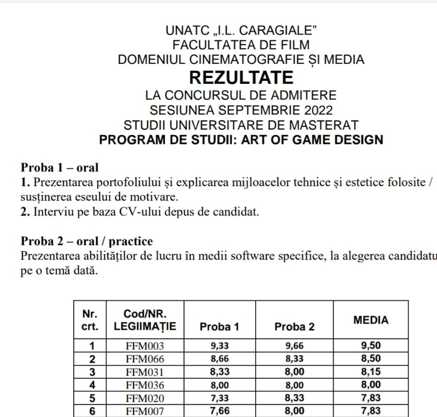
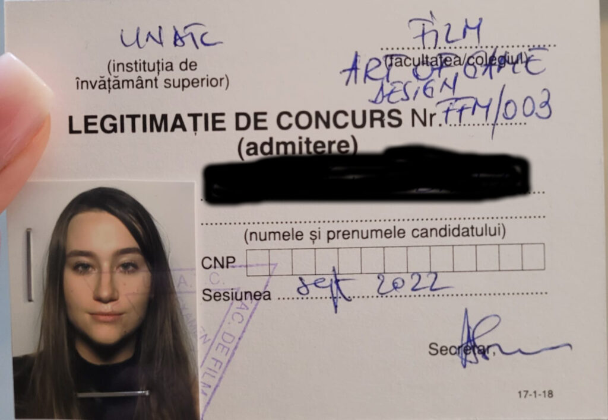

+++
date = 2022-09-15
title = "Ziua 247"
description = "Nu mai consider corect să mă atârn de altă ființă umană care să-mi țină spațiul și timpul să pot să-mi trag o țâră sufletul, am ajuns la înțelepciunea, poate, dar în mod clar la certitudinea că nimeni din afara mea nu poate să-mi rezolve interiorul. E pur și simplu o excludere naturală atât de simplă, că din nou sunt uimită de câtă mizerie aveam pe ochii care scrutau împrejurimi în căutare de liman."
authors = ["Biannca Locatelli"]
[taxonomies]
tags = []
[extra]
math = false
diagram = false
image = "images/ziua-247.jpg"
+++
---

Cred că am intrat într-o buclă temporală nefastă mie, că coșmarurile prin care trec în timpul zilei se înnoadă "confortabil" cu cele din timpul nopții și nu reușesc să mă adun un pic și să respir a viață. Mă afund mai rău în rău și-n căderea asta liberă nu găsesc ceva de care să mă agăț, că la capitolul "cineva" am renunțat de ceva timp. Nu mai consider corect să mă atârn de altă ființă umană care să-mi țină spațiul și timpul să pot să-mi trag o țâră sufletul, am ajuns la înțelepciunea, poate, dar în mod clar la certitudinea că nimeni din afara mea nu poate să-mi rezolve interiorul. E pur și simplu o excludere naturală atât de simplă că din nou sunt uimită de câtă mizerie aveam pe ochii care scrutau împrejurimi în căutare de liman.

Ceva-ul ăsta, care să-mi atenueze căderea sau să mi-o încetinească până găsesc soluția, refuză să mi se arate. În schimb, realitatea nopții mă biciuie cu niște vise aiurea, grele de dus, o alambicare atât de ciudată de situații și oameni, că nici măcar nu știu ce și cum am gândit de mi s-a dus în mintea non-conștientă atâta urâțenie.

Pesemne pentru că m-am gândit colateral la el, l-am visat pe tata cum o bătea pe soră-mea atât de rău și eu nu puteam face nimic, că m-am trezit cu urletul pe buze. Aproape că am șoptit cu voce tare, ca să mă aud și să-mi liniștesc trăirea, că a fost un vis, gata, a fost un vis, nu e așa în realitate. Mi-a luat cam o oră de gânduri și de noapte să adorm la loc și să mă duc într-o cu totul altă zonă din viața mea, scăldată și ea tot în scabros. N-am mai așteptat lumina zorilor, pentru că cearșaful de sub mine se făcuse ca ziarul mototolit de la atâta alergat și mișcat în somn. Dacă e să fie cu coșmaruri, nu mersi, mai bine mă trezesc de tot. Oricum nu mai e mult și gata, se naște și dimineața.

***

Fix ca babele la o belea, mi-am luat timp, și pentru că am dar și împinsă de mocirla asta de vise, să mă rog în mine. Nu unui bărbos care stă în ceruri cu sceptrul dreptății în mână, nici unui Univers care pare că dă cu mine de toți pereții câteodată, ci așa, să-mi liniștesc un tumult, să-mi închid niște voci sonore din mine. Nu mă rog pentru că vreau ceva ci mă rog ca să las să curgă ce e adunat în mine, să se desfacă și să se spele, în orice fel mi-e posibil acum.

Mi s-a strecurat printre cuvintele nerostite dar spuse în mine și ritualul de recunoștințe, nu a fost nimic voit, a venit el pur și simplu, natural, că a găsit un timp cuminte și probabil că era spațiu. L-am lăsat și pe el să curgă și abia apoi m-am adunat în corp să plec din patul ăsta care nu-mi mai dă odihnă peste noapte.

***

E încă acolo senzația de "lume de umerii mei" doar că, fie m-am adaptat eu ei, fie ea mie și s-a mai atenuat, parcă nu mă mai îngroapă cu plumbul ei nașpa.

În coborâre spre parter, văd că mama încă doarme, la fel ca tot restul ființelor din casă. Măcar atât, că deși mai lină azi, tot nu am chef de situația demenței în prezentul meu.

Cât îmi încălzesc apa pe spinarea căreia-mi pun speranțe de limpezire, dau sonor notificărilor venite peste noapte. Printre ele, una pe care-o așteptam cu nerăbdare și cu emoție.

***

Ca mulți alți părinți, bineînțeles intenționați numai de bine, și eu mi-am ghidonat copila spre ceea ce credeam eu că-i va face bine în viață, că-i va asigura un drum bun în viață. Așa că împreună cu tatăl ei, am făcut eforturi să meargă la o școală privată care a scos untul din ea. Iar ea, cruzișoară și, la fel ca și mine cândva, privind cu încredere și dorință să nu ne dezamăgească pe niciunul dintre noi, a tras și a muncit și, pe cheltuiala sufletului ei, a terminat cu brio un liceu și un bacalaureat internațional. Dar nu s-a bucurat deloc de anii ăștia, au stresat-o mult și inutil iar noi, orbi, am fost satisfăcuți că n-am "sacrificat" și n-am dat banii degeaba. Apoi a urmat o facultate pe care a făcut-o doar de dragul de a o face, să intre în rândul lumii și al colegilor ei care au plecat care încotro, prin țări străine. A terminat anul ăsta ASE-ul, relații internaționale în engleză dar, adăugat la contextul covidului care i-a răpit până și părerea aia de viață de student, când a tras linie, a considerat că a pierdut ani din viață.

Cam prin anul întâi de facultate al ei am înțeles și eu ce prostie am făcut când i-am jalonat o viață așa cum credeam noi că e bine, nu cum simțea ea. Deși eu o eliberasem de jugul "trebe să ai o facultate", copila mea, căreia deja îi inoculasem virusul în viață, a avut maturitatea sau voința sau ambele să termine ce a început, să aibă patalama la mână într-o societate în care nu contează ce știi, contează ce scrie pe o hârtie că știi.

Well, după ce a mers pe cărările pe care noi, bineînțeles intenționați numai de bine, am forțat-o să meargă, anul ăsta copila mea a ales a facă ceva pentru sufletul ei și s-a înscris la masterat la UNATC - art of game design. Și-a plătit singură, din banii munciți de ea, taxa de înscriere și s-a pus pe studiat, făcut portofoliu, citit, văzut, muncit. A tras cât a putut de tare, din tot sufletul ei care până acum a fost ocupat cu ce trebuia să facă, nu cu ce voia să facă, și a reușit.

Este o lecție de viață, pentru mine extraordinară. Pentru că nu doar că a reușit, ci a intrat prima. Ca să-mi arate, dacă mai era cazul, că atunci când te mână pasiunea, nu contează nici nopțile nedormite, nici neluatul în seamă, nici părerologia că nu se trăiește din asta, nici impresiile altora, ci doar tu cu ce vrei să faci.

Mesajul din această dimineață, în care-mi atașa o poză cu rezultatele și un comentariu simplu "eu sunt FFM003!" a cuprins în el o copilărie trăită după regulile altora, urmată de-o adolescență pe drumuri trasate tot de alții și-o facultate la fel, toate bineînțeles intenționate numai de bine. Nu înseamnă că nu i-or fi prins bine pe vreundeva, că nu i-au ascuțit mintea, că nu i-au format niște deprinderi bune, dar cantitatea de stres pe care a adunat-o copila mea în toate fibrele ființei ei, la foc continuu, să nu dezamăgească pe nimeni, chiar dacă pe ea se dezamăgea mereu, nu va fi egalat de niciun plus potențial.

Mesajul ăsta scurt și simplu e imens și amplu. Iar eu n-am fost niciodată mai "mândră" de ea ca acum.

***

Am făcut smoothieul cu pielea de găină pe mine. Mi se părea că Universul s-a apucat să-mi vorbească prin faptele altora iar rezultatul copilei mele e un semnal pentru mine. Doar că eu nu-i prind sensul, habar n-am ce trebe să înțeleg din el altceva decât ce am înțeles deja și care o privește doar pe ea. Eu nu pot să fac ce-mi doresc acum, pentru mine nu e-n cărți asta acum, pur și simplu nu văd cum aș putea să plec să călătoresc când nu am cu cine s-o las pe mama. Așa că îmi netezesc părul ridicat de pe mâini și nu mai caut sensuri ascunse acolo unde probabil nici nu sunt. Acum și aici nu e ceva despre mine ci este o reușită mișto tare pe care sper eu că a mea copilă s-o integreze adânc în ființa ei, să inoculeze o țâră stresul ăla înghițit și să nu uite asta când și-o crește ea la rândul ei pruncii. Că partea asta cu buna intenție se pare că e moștenire genetică, cu toții ne îmbolnăvim brusc de ea când devenim părinți. Cu toții, mai puțin ai mei părinți.

***

Cu vestea bună pe buze, intru fără tragere de inimă la mama, cu pliculețul de mâncare a lui Sassy drept scuză pentru verificarea stării ei și stării camerei. Începe să fie liniară în comportament și de la o zi la alta și la stări, nu e nici prea încântată, nici prea mohorâtă. E ca un om care pare că nu mai are nicio bucurie de viață, din care a fugit entuziasmul și așteptările. În timp ce-o etichetam mental, mi-am dat seama brusc că fix așa mă simt și eu. Mai am câte-o deviere adusă de-o veste bună dar apoi, fac cum fac, și mă alunec înapoi într-o ceva ce cred eu că seamănă a depresie. Sau a lipsă aproape totală de chef, bucurie, plăcere.

Mă scutur de impresia asta, pentru că nu-mi place, și mă apuc să și fac ceva ce nu-mi place, curățenie, aerisire, conversație. Îi spun de reușita copilei, nu înțelege ea prea bine despre ce e vorba, nici eu nu mă strofoc s-o luminez că nu cred că e posibil, și mă cufund și mai mult în muțenia mea și dau mai cu spor din mâini, să plec de acolo cât mai repede.

***

Dau o fugă cu Mr. H să-l duc la stație, azi pleacă la birou și mă lipsește de bucuria prezenței lui, una din puținele pe care le mai am these days. Universul nu ratează nicio ocazie să-mi arate că încă există frumusețe out there și la întoarcere-mi zugrăvește un cer și-un răsărit superbe. Da, știu că e, doar că acum nu mi-s ochii curați să văd.

  

***

Eu cred că dacă povestea cu "timpul nu există", cu faptul că liniaritatea e dată doar de realitatea asta dar de fapt toate realitățile există în același timp, e adevărată, atunci eu cred că am călcat greșit și am alunecat din realitatea aia cu castele și păduri, în care eram fericită, în asta cu tehnologie avansată și lipsă de umanitate, în care nu sunt tocmai la fel. Cred că, din greșeală, am accesat o linie temporală în care m-am îmbârligat și nu mai găsesc drumul înapoi în aia în care-mi plăcea să exist. Așa-mi explic eu de ce sunt efectiv fascinată până și de pietrele unui castel. D-aia sorb cu nesaț filmele de epocă, d-aia încet, fără să mă prind de la bun început, dar sigur, casa mea are elemente de epocă în ea.

Mi-am spălat trăirile mizere cu un nou episod din Bridgerton, pe care mi l-a sugerat domnul meu și tare bine mi-a făcut. Mai puțin atentă la intrigi și mai mult la trăirile romantice, la peisaje, la costume, la atmosferă, m-a captivat serialul ăsta și, dacă aș putea, m-aș uita numai la Netflix, să sorb dintr-o privire toate episoadele. Nu pot, n-am luxul ăsta, dar strecor câte-un episod și plec tare departe, într-o lume pe care ceilalți nu o apreciază sau place, dar pe care eu o înțeleg și simt atât de intens.

***
 

E tare mișto evadarea din lumea asta, mai ales atunci când te strâng lucrurile din ea pe care nu le vrei în prezentul tău. Cum ar fi chinul micului dejun, care iar se lasă cu refuzuri, cu iritare, cu muguri de disperare. Doamne, te rog eu mult, acum chiar te implor, dă-mi ceva răbdare în sac, că mă lasă țâțânile!

Cu chiu, cu vai, a mâncat și recunosc că am respirat ușurată când a plecat. Am deschis larg și geamul și ușa spre terasă, am simțit nevoia să las să iasă toată vibrația aia nașpa pe care am trăit-o eu, să vântur un strop locul de îmbibarea aia cu neputință, și a mea de a accepta, și a ei de a fi.

***

Dau play la primul video venit în feed-ul youtube, e cu Connie și am impresia acută că azi îmi vorbește fix mie din lumea aia imaterială în care a plecat. Conversația pe care o are este despre integritate și mă "lovește" adânc când enumeră cele trei niveluri ale acestei valori fără de care o ființă umană nu se poate întoarce la puritatea ființei:

1. Să faci ce zici că faci când zici că faci
2. Să-ți onorezi cuvântul dat
3. Să-ți trăiești viața dintr-un context de putere

Dacă parcă deja am făcut o obsesie pentru primele două, am ajuns până la faza de a-mi ține cuvântul și față de o necuvântătoare (!), ei bine, la 3. sunt preș. În acest moment al vieții mele, fix dintr-un context de putere nu pot să spun că trăiesc. Iar asta se simte al dracu' de dureros, câteodată atât de intens că-l resimt și fizic. Mulțam, Connie a mea dragă, pentru mesaj, o să încerc, când s-o putea, să integrez asta, acum nu mă țin balamalele s-o fac, acum mi-e mai ușor să respir mai pe jos, încă nu-mi pot îndrepta coloana. Mai ales de câteva zile, zici că am intrat într-un ochi de furtună de mă învârte pe toate părțile și am numa' praf în ochi și-n inimă.

***

Mai adâncită-n tristețe decât înainte, ies în curte, unde știu că tot am deșertat în trecut trăiri aiurea și mi-am luat înapoi curățenie în suflet. Experimentul roșii s-a încheiat, încep să scot roșiile ce și-au terminat rostul pe măsură ce se coc cele de la ultimul etaj al fiecărui fir, de curățat locul, de nivelat, de scos pari, desfăcut sfori, desființat parțial gărduțul ce delimita "zona roșie". Habar n-am când a trecut timpul și de ce a trecut atât de repede că s-a făcut de prânzul mamei, mie oricum nu-mi arde de mâncare.

***

O aduc la masă cu veșnicul chef lipsă și nu o întreb ce vrea să mănânce. Nu mai cad în capcana asta, îi pun direct mâncărică proaspătă de cartofi cu salată de varză acră și i-am pus și-un cârnăcior alături. Nu mă uit la ea pentru că încă nu mi s-a întors toleranța de pe unde a plecat și o anunț că o să mă apuc de tuns trifoiul și o să fie zgomot, să știe că-s eu, să nu se sperie.

Nesperat pentru mine, mănâncă fără vociferări, chiar tot și pleacă mulțumită la ea în cameră. Cam la fel plec și eu să mă apuc de curte.

***

În nicio dată de până acum nu mi-a fost atât de greu să tund trifoiul. Pentru că, din viteză și neatenție, domnul meu a băgat motorină în mașina de tuns iarbă pe benzină, pornirea motorului este un chin și-o tortură. Plus că trifoiul a crescut mult și la două ture, umple la refuz sacul de tocătură.

Dacă data trecută am tuns-o record pozitiv, de data asta a fost invers. La fiecare oprire de motor pentru scoatere tocătură din sac, îmi ia minute bune să repornesc. Totul pe un fundal de nesomn și de post intermitent.

Pe la a șasea oprire, când n-am făcut  nici măcar o treime de curte, mi s-a făcut rău. Dar pe mine nu mă oprește un rău, după ce m-am adunat de pe terasa unde mă împrăștiasem, am continuat alte ture. Alte împrăștieri, alte ture și tot așa până am terminat și m-am terminat. Dacă tot vrea să fie apoteotic, apăi să fie.

Și a fost. Am urcat să-i dau mamei pastilele de seară și ea-mi spune, suavă ca o floare, că l-a văzut pe Mr. H cum tunde iarba. Mda, nu știu în ce film e ea, dar clar nu e în ăla în care joc eu. Cred eu că niciodată n-a fost.

***

O zi gri, cu o mare dungă albă marcată de reușita copilei mele, în rest nu mă pot scoate dintr-o mâhnire în care pare că mă adâncesc pe zi ce trece, ca-n niște nisipuri mișcătoare. Doar de amorul artei și-al obișnuiței, leg 3 recunoștințe pentru:

1. FFM003!
2. Bridgerton!
3. Connie!

Frumosul zilei peste ochii care au vegheat cu bune intenții asupra unui traseu:

    &nbsp; &nbsp; &nbsp;
    &nbsp; &nbsp; &nbsp;

