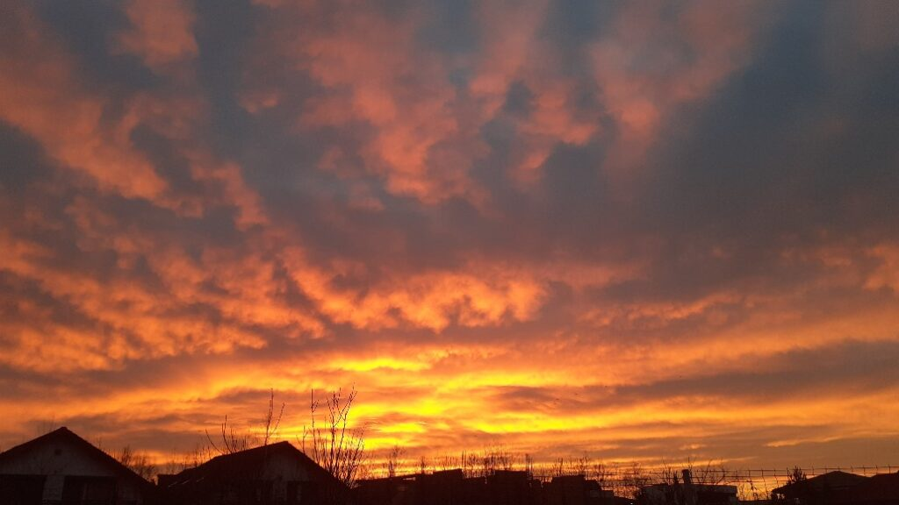

+++
date = 2022-02-07
title = "Ziua 27"
description = "Plutea în aer o neputință iar eu o simțeam visceral. Habar n-am ce mă ținea acolo, în cameră cu ea. Aș fi plecat, aș fi fugit de starea aia ca o mâzgă, lipicioasă, urâtă și grea și totuși dorința mea de a o salva pe mama, de a nu o lăsa pradă acelei stări, mă ținea neclintită acolo."
authors = ["Biannca Locatelli"]
[taxonomies]
tags = []
[extra]
math = false
diagram = false
image = "images/ziua-27-final.jpg"
+++
---

Mă doare tot corpul, surd. Junghiul dintre omoplați cred că se află la apogeu că radiază spre tot spatele. Din nou, am o stare de leșin. Îmi doresc să mă odihnesc, să mă pun jos și să dorm un somn adânc și lung și fără vise și odihnitor. Dar nu e timp pentru asta.

***

Coana mare e bine, are o stare de spirit și de prezență bună, e comunicativă și asta îmi ridică și mie moralul puțin. Corpul e mai greoi azi dar își va reveni. O să-l susțin mai încolo cu o salată mare de crudități bune bune și va fi bine.

***

Mi-am terminat treaba la mama fix la țanc să văd un răsărit, din nou, demențial. Are Creația asta cele mai mișto acuarele și cele mai bune pensule! Sunt niște nori văluriți, în degrade, pufoși și un colorit în orizont de pus pe rană. Chapeau, Univers!

  

***

Am dat drumul la TV. Nu am știut de ce dar după ce am ajuns pe Digi Life, am înțeles.

Era un documentar al unui tip care se plimbă prin toată lumea și o vede printr-o altă lentilă decât aia de turist. Îmi plac astfel de perspective. De fapt, de când sunt mai atentă la viața mea, absorb cu plăcere și curiozitate orice perspectivă. Câteodată, după ce o rumeg, face click în puzzleul meu, alteori, o rumeg și o scuip, dar nu resping nimic.

Noua spiritualitate spune că în funcție de vibrația ta, la orice moment, îți sunt servite lucruri care se potrivesc acelei vibrații. Așa înțeleg eu cum de fiecare dată când pornesc TV, sau mă uit pe net, văd lucruri care se mulează pe gândul meu de moment sau pe concepția mea de viață.

În documentarul de azi tipul a descoperit în Bali o minune atât naturală cât și umană. Plin de oameni veniți din toate colțurile lumii, Bali e un canvas pe care fiecare își pictează visul vieții. Mi-a dat așa un vibe bun acest documentar, care să se adune la starea mamei și la răsăritul fain. Cum spuneam, când ești mai sus cu inima, Universul oglindește și vin lucruri care să te susțină sus. Și reversul, pe care îl cunosc așa de bine, e valabil: când ești jos, atragi lucruri și situații și oameni care te țin jos. In the end, totul e o alegere. Personală. O promisiune pe  care ți-o faci tu vieții tale.

Documentarul ăsta m-a aruncat nițel într-o visare. Eu și domnul meu, cu care mi-ar plăcea să plec până la capătul lumii, am putea să fim nomazi digitali. Să cotrobăim prin țările lumii după experiențe faine, să vedem, simțim, trăim culturi noi până ne hotărâm care ne e locul. Nu zic că nu e ăsta în care suntem acum. Dar dacă nici nu știi temeinic altceva, poți spune că alegi în cunoștință de cauză?!

Deocamdată, clasez visarea la categoria Vise. Dar e un vis ce va deveni realitatea cândva. That's a promise!

***

Până atunci, trebe să revin în prezent, să mă duc să văd dacă mamei îi e foame și să o poftesc la masă. Mănâncă puțin și cere cafeluța. Degeaba încerc să o conving să facem cafeaua mai slabă, când e hotărâtă pe ceva, devine aproape vehementă.

Nu vreau agitație, schimb subiectul, îi spun că o să vin mai rar la ea sus să văd ce face pentru că trebe să fac ordine în cămară. Zboară niște molii p-acolo și e clar ceva ce s-a stricat. A înțeles. Mă întreabă, iar, ce e în beciul ăla de lângă cămară. Eu nu am beci lângă cămară. Am garajul. O duc să vadă și scutură din cap, că ea a văzut acolo o groapă, ca un beci, când a venit… Nu comentez și schimb delicat subiectul.

***

Pleacă la ea și mă lasă cufundată în gânduri și treabă. Halucinațiile fac și ele parte din această boală. În fiecare zi mama îmi spune că ce vede la televizor a văzut și ieri. Sau dacă mergem într-un loc nou, unde nu a mai fost niciodată, îmi spune că a mai fost acolo. E un capitol interesant pe care îl vom deschide amândouă. Trebe să mă înarmez cu ușurință de înțelegere ca ea să nu se simtă jenată de balaurii pe care îi scoate pe gură.

***

Absorbită de analizele mentale și de munca fizică, nici nu știu când au trecut orele. Am făcut repede o mămăligă, fix la timp pentru că a coborât coana mare la masă. Avem sarmale așa că îi încălzesc rapid 3 bucăți, cum a cerut. Din nou, naivitatea mea câștigă. Sau dorința mea, absurdă, ca ea să mănânce mai mult. Evident că nu poate mânca 3 sarmale! De abia a terminat una. Se simte prost dar o asigur că nu e niciun bai.

Mă apuc să spăl vasele și cu coada ochiului o observ. Stă. Absentă. Privește în gol, fără nicio expresie pe față. Ca și cum nu mai e în ea. Daca nu ar fi puțin creepy, această plecare a ei din ea ar fi fascinantă. Dar eu încă nu știu cum să abordez această nouă situație, așa că mă pun pe sporovăit ca să o aduc înapoi. O văd cum mă privește năucă, ca și cum am apărut brusc în vizorul ei, se redresează puțin, schițează un zâmbet minuscul și concluzionează că pleacă la ea în apartament.

Ok, o să vin și eu mai încolo, să termin treaba. Vin să jucăm table. Am văzut că asta cu tablele mereu o încântă. Azi nu. Nu-i nimic, o să mă duc.

***

Cine s-ar fi gândit că "să privești în fiecare zi viața cu ochi noi" ar putea să fie atât de dur, la propriu? Eu nu vreau ad-literam! Era o parabolă! Măi Universule, tu chiar nu pricepi nuanțe?!

***

Nu mi-a mai ars de nimic. Iar îmi vine să fac muncă fizică brută multă și grea, ca să evadez din mintea care macină întruna. Sunt hotărâtă să studiez Noua medicină germanică. Mă interesează și rezonez cu modul cum abordează această medicină disconfortul fizic uman pornind de la creier și emoție. O să-mi fac un plan, o să caut resurse și e pe lista mea de to do-uri. Printre primele to do-uri.

***

S-a făcut timpul pentru table.

Vine un moment în viață în care parcă plătești pentru tot ce nu ai prețuit. Nu-mi plac tablele, nu-mi place că “pierd” zilnic 2 ore făcând asta dar azi aș fi dat orice să o văd pe mama încântată de ele. Aș fi jucat 10 ore dacă asta mi-o aducea înapoi, în fire. A jucat, a greșit de multe ori iar eu am tăcut, abia a vorbit, era totul trist și mecanic. Plutea în aer o neputință iar eu o simțeam visceral. Habar n-am ce mă ținea acolo, în cameră cu ea. Aș fi plecat, aș fi fugit de starea aia ca o mâzgă, lipicioasă, urâtă și grea și totuși dorința mea de a o salva pe mama, de a nu o lăsa pradă acelei stări, mă ținea neclintită acolo. După table, am schimbat-o în pijamale și am stat cu ea. Tăcute amândouă. Una prezentă și cealaltă nu. Dar în spirit împletite. După un timp, vocea ei a spart liniștea și aproape că m-a speriat. M-a întrebat ce fac. Se întorsese.

Am plecat de la ea cu promisiunea că ne vedem mâine dimineață. “Da, puiule.”

Nu mai vedeam scările de lacrimi.

***

Azi sunt recunoscătoare doar clipei în care ea s-a întors. Restul parcă a fost de umplutură.
