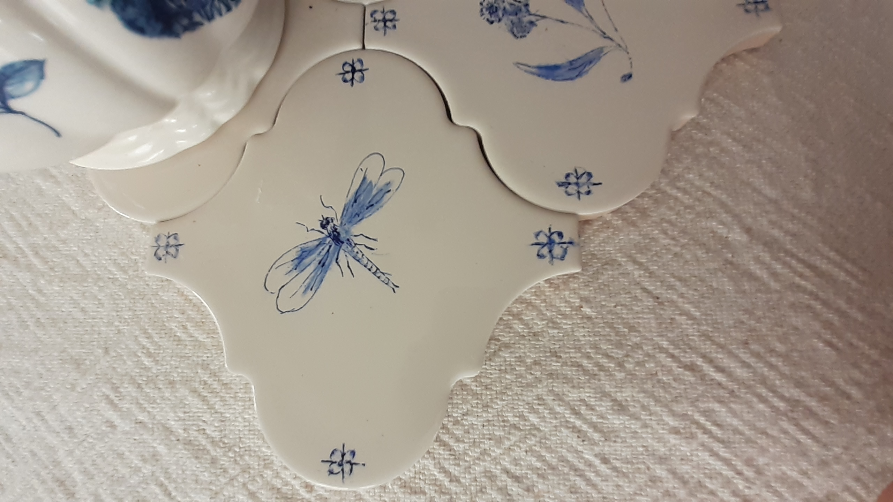
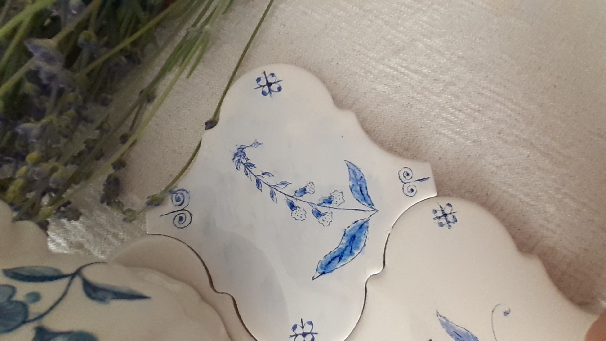
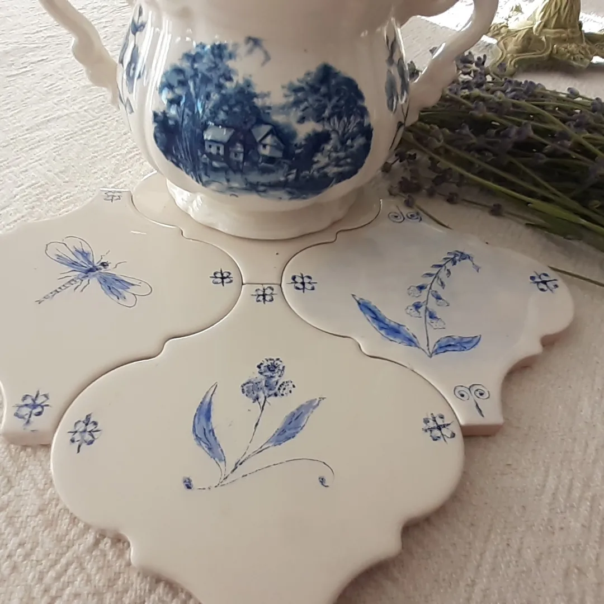

+++
date = 2022-10-17
title = "Ziua 279"
description = "Ideea e că de fapt nu termini niciodată nimic. E o minciună liniară. Nu bifezi un tipar distructiv și gata. Mâine își scoate alt cap fix același balaur și o iei de la început. Așa că trebe să integrez undeva, într-un izvor de-al meu interior, nesecat se pare, că dacă alerg prin viață căutând să ajung zen, it's never gonna happen."
authors = ["Biannca Locatelli"]
[taxonomies]
tags = []
[extra]
math = false
diagram = false
image = "images/ziua-279.jpg"
+++
---

Revenirea în simțurile prea dimineții se întâmplă scurt, fără nici un du-te-vino între somn, pat și verticală, ordonate de un gând ferm: cum îți așterni, așa dormi. Vorba vine, că de fapt setarea este să-mi stabilesc singură traseul zilei și să nu mă mai las deturnată de situații, persoane, cauze.

Deși sunt în modulul rece, de chirurg, cu calcule la rece asupra unei zile care nici nu mi s-a desfăcut încă, dau drumul la câteva mulțumiri, mai mult de jenă. Chiar și judecând strâmb, sau mai ales judecând strâmb, nu pot să nu văd în jurul meu multele motive pentru care ar trebui să fiu recunoscătoare până în străfundul sufletului. Dar nemulțumitului i se ia darul, așa că mi s-a strecurat în sistem teama asta și bifez. O prostie, dar o prefer și așa, decât deloc. Dacă e ceva ce-mi dă o țâră de ajutor este faptul că întotdeauna perseverența și consecvența dau roade. So, I keep walking. De fapt, thanking.

***

Cred că singura mulțumire pentru care am în acest moment căldură interioară este dată de o căldură exterioară care mi-e lipită de coapsă, pe toată lungimea ei de pisică zveltă, dar și parșivă, ce știe să-mi intre sub piele chiar și când nici eu nu sunt sub propria-mi piele. Stau în cumpănă dacă să mă mișc sau nu, să nu-i deranjez vreun vis pisicesc vânătoresc, dar Spikylina cred că mi-a auzit gândul și e deja up&running.

Are încă cordelina emoțională cu care s-a atașat singură de mine, că până la parter mi s-a frecat continuu de picioare iar asta m-a trezit total, să nu mă prăvălesc grămadă în bezna asta și de pe scări și din living. S-a mai diluat din lipiciul ăsta odată ce am drăgălit-o ca preambul pentru pliculețul din bol iar eu m-am apucat de ale mele.

***

Deși de multe ori, dintr-o absență nejustificată din propria viață, pare că zilele nu au neapărat legătură între ele, dar mintea, coțofana asta care a început ca ucenic, ca unealtă și a înhățat pe nesimțitelea rolul de Master, croșetează fie același tipar, ronțăie aceleași lucruri, fie un tipar asemănător, astfel că dacă te rupi un pic de vâltoare și privești cu un ochi neîntinat cearșaful gândurilor, vezi că e continuitate acolo. Încă o dovadă că, în Universul ăsta, totul e armonios. Numa' că e așa pentru cine se scoate din rotațiile mașinii de spălat.

Îmi beau apa care se așează peste aceleași valuri de singurătate și însingurare pe care le-am simțit și aseară, cu o familiaritate care îmi adoarme vigilența. De abia în micul meu timp liber am realizat că parcă voiam să-mi croiesc singură ziua, fără ifose d-astea maronii în simțire. Ok, mă regrupez o țâră și îmi listez treburile pe care trebe să le fac azi, neapărat, și pe alea pe care mi le-aș dori să le fac, dacă mai e loc. Mintea mea analitică e mulțumită cu impărțirea pe căprării, cu o listă în față, cu to do-uri în gesturi, că doar funcționez așa de ceva timp deja. Plus juma' de viață netrăită de dinainte.

***

Nu-mi țin nici în dimineața asta promisiunea și, după ce mă asigur că tot ce i-am pregătit corespunde cerințelor papilelor ei gustative, ies în curticica de flori să le ud. Sunt atentă să nu mă fure peisajul ci să mă nimeresc din nou prin bucătărie cam când ar termina mama micul dejun, să nu mai facă vreo nefăcută, că mi-a luat câteva zile să găsesc o tigăiță pe care a îndesat-o aiurea. Plus grija mea majoră cu înfundatul chiuvetei. Într-un noroc chior, am reușit chiar să aflu ce-ar vrea să mănânce la prânz așa că, până la urmă, ne-o fi prins bine la amândouă scurta conversație.

***

Tot din categoria de "făcut neapărat!" este și mâncarea pentru prânz și mă apuc să-i pregătesc mâncărica de cartofi, conform indicațiilor speciale primite diresc de la sursă: cartofii să nu fie mari, să nu pun pastă "d-aia acră" în ea, să fie cu sos, dar nu cu mult sos, să nu pun mărar sau verdeață, că nu "prea le are ea cu verdețurile".

Fac în paralel și pentru noi, să am cel puțin două feluri de mâncare și-mi dau seama, în timp ce gătesc, că de la un timp nici bucuria de a experimenta în bucătărie nu o mai am. Ca vegan, deși pare incredibil, sunt milioane de variante de a găti, de a asocia, de a condimenta, iar eu sunt din firea mea de scorpion curioasă și avidă de noi experiențe. Numa' că, furată de grija asta permanentă să fie mâncare, să mănânce și mama, să pun ceva pe masă, am uitat cât îmi plăcea fiorul ăla și ușurința cu care mă aruncam în rețete noi. Deși, cum mereu îmi atrage Mr. H atenția, ne-norocitul ăla de sindrom "nu-s suficient de bună" nu mă lasă mereu să-mi recunosc talentele. Chiar dacă am încredere maximă că sunt în stare de orice, dualitatea din mine se manifestă și aici, mai ales când încerc lucruri noi și, culmea, îmi ies.

Dau și-o fugă să iau pâine proaspătă și deja mi s-a dus juma' de zi. Numa' pe lucruri "de făcut".

***

Tot la categoria asta am înghesuit și prânzul ei, care mă surprinde cu garda jos: nu vrea mâncărică de cartofi. Chiar dacă e cu cartofi moi, nu e acră, cu sos cât trebe și fără picătură de frunză verde, dacă ar mânca ceva, ar fi grătar. Noroc că mai am de ieri dar ce deziluzie… Mai are sens s-o afișez, să-i spun că ea mi-a cerut de dimineață mâncarea asta? Nu, nu are, pentru că ea oricum nu mai știe ce a zis de dimineață. Sau nu mai știe de glicemia crescută. În lumea ei, ea vrea să primească ce cere, exact ca un copil răzgâiat, care bate din picior dacă nu i se dă jucăria cerută. N-are decât să bată din picior cât o vrea, să ridice tonul, să încerce manipulări (incredibil, demența nu anulează această abilitate!), nu-i dau și pace. Chiar dacă mă înmoi câteodată, îi mai scap un mic dulce rar, îmi dau seama că ne-ar fi și mai greu la amândouă pentru câteva clipe de plăcere dulce pe limbă.

***

Am terminat, sau cel puțin așa sper, cu categoria asta care-mi mănâncă cam două treimi din zi și plonjez cu nerăbdare în categoria aia de-mi crește pufișori de pene pe la suflet. Scrollat-ul meu pe social media se înșurubează invariabil în jurul chestiilor creative, mă încântă peste măsură să văd noi moduri de exprimare artistică, mi se pare fabulos cum aduc umanii din niște profunzimi ale lor chestii neimaginate de alții. Cel puțin Instagramul și Pinterestul sunt adevărate comori din punctul ăsta de vedere, sunt surse nesecate de inspirație.

De mulți ani, am tot cărat dintr-o casă în alta, dintr-un loc de depozitare într-altul, aparatul de pirogravat al lui Mr. H. Azi m-am hotărât să-l șterg de praf și să văd cu ce se mănâncă pirogravatul, mai ales că de mult îmi imaginez eu că o să-mi pirogravez mic, delicat, sugestiv, fiecare tocător pe care-l am în casă.

Mirosul de lemn ars, pe alocuri mai puternic, pe alocuri aproape deloc, m-a ținut în pântecul lui aromat vreo oră plină de încercări. Evident că trebe exersat, e prima oară în viața mea, aparatul e antic și mai trebe updatat, dar mi-a plăcut tare experiența. O s-o repet cu prima ocazie posibilă.

Tot azi, tot pentru mine și nevoia mea de exprimare și tot dintr-un curaj nebunesc, am desenat, cu pixul pentru început, pe mici plăci de faianță rămase de la bucătărie. Din serialul "ce decor a mai schimbat Biannca", visez la faianță desenată, nu integral, ci așa răsfirat pe ici pe colo, sau doar un brâu, ceva minimalist, dar stilul ăla care pe mine mă încântă cel mai mult: un british aristocrat amestecat cu tușe de franțuz rural. Desenatul meu de azi, pe lângă că a fost o surpriză colosală pentru mine, care nu sunt în stare să desenez o pisică, mi-a deschis o lume întreagă de posibilități. Vreau să-mi lărgesc cât mai mult posibil mintea, să nu mai gândească în luat de-a gata ci în invenție, creație, chiar dacă nu atinge standardele estetice ale celor din jur. Până acum, casa mea nu a încetat să-mi dea zâmbete în inimă și frumusețe în ochi așa că am toată încrederea în mine și în gustul meu. Și-apoi, nu mie trebe să-mi placă?!

    &nbsp; &nbsp; &nbsp;
    &nbsp; &nbsp; &nbsp;
    

În timp ce buchisesc la faianță realizez, ca și cum în fața mea a pus cineva brusc o plancardă, că eu, pe principiul liniarității vieții ăsteia de pe pământ, unde începi un lucru dar îl și termini, tot timpul am creața credință că o să termin situația asta care-mi dă bătăi de cap și iese soarele. Si când nu iese, m-apucă disperarea. Într-un final, julită și vai de steaua mea aia de n-o mai văd, iese soarele, mă bucur o țâră și vine altă situație cu care încep să mă simt nelalocul meu. Sau al ei, în viața mea.

Ideea e că de fapt nu termini niciodată nimic. E o minciună liniară. Nu bifezi un tipar distructiv și gata. Mâine își scoate alt cap fix același balaur și o iei de la început. Așa că trebe să integrez undeva, într-un izvor de-al meu interior, nesecat se pare, că dacă alerg prin viață căutând să ajung zen, it's never gonna happen. E doar o pierdere imensă de timp, de suflu, de viață, de mine și de oameni pe care îi las în urmă într-o fugă.

***

Mi-am petrecut restul serii baleind între camera mamei, unde o anunț în mod repetat că mâine dimineață, foarte dimineață, vin să recoltăm pentru analize, între dormitorul nostru, unde mă așez să mai scriu câteva rânduri, între două pisici, fiecare cu personalitatea și mofturile ei, din nou în camera mamei. Deși parcă mi-e mie jenă de câte ori m-am dus, mai bag un cap și înainte de a se pune ea la somn să-i aduc aminte de recoltarea care o paște în ceas mic de noapte.

Setez alarma, mă scarpin cu simț de răspundere pe brațe și adorm cu miros de lemn traforat în nas.
