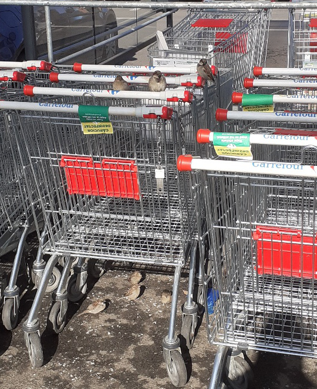

M-am trezit greu, cu o senzație de mentol în corp. Parcă de arsură. Junghiul nu s-a mai înmuiat și m-a ținut toată noaptea în înțepături, de câte ori mă mișcam în somn, acuitatea durerii mă arunca afară din vis.

***

Mă scobor din pat, fără chef, și pornesc automat prin beznă, spre bucătărie. Prietena mea, mintea, s-a activat. Gândurile încep să tranziteze și unul e mai viguros decât altele: viața se practică zilnic, nu ți se "întâmplă" zilnic. Da, corect, are mare dreptate gândul ăsta. Dar ce te faci când n-ai chef de practică?!

Dintr-un unghi de vedere, eu am acces la un spectacol al vieții. E drept, nu unul clasic sau des întâlnit dar tocmai asta îl face spectacol. Prin lipsa normalului în demență, ai parte de spargeri de idei, de concepte, de stări, de emoții, e un regal de explozii mentale.

Uitându-mă în urmă, nu pot să nu observ măiestria Creației și a faptului că nimic nu e întâmplător: posibil că am ars toate etapele necesare, că m-am “calificat” să am parte de demența asta. Pentru că îți trebe țâțâni zdravene să te țină balamalele să duci acest anormal. De fapt, acest alt normal. Nu degeaba am făcut, în perioada pandemiei, spălare de ochi și de prejudecăți și de credințe. Nu degeaba am început să fac pace cu mine ca să pot face apoi pace cu restul. Se zice că nu ți se dă mai mult decât poți duce.

Mi-aduc aminte de înlănțuirea de evenimente începând cu 2015, când am avut burnoutul generat de un job pe care îl făceam pentru bani și pentru o mică faimă locală ce-mi hrănea vârstos egoul. Dacă nu ești pe drumul cel bun, de pe arătură îți intră uscăturile în ochi să ți-i deschidă larg, să vezi. Când am început să vomit în coșul de gunoi de la birou, corpul meu era deja peste limita de suport. Așa că am zis și eu, în ceasul al 13lea, stop. La 3 luni după, au venit cancerele mamei. De ziua mea. Care cancere mi-au alimentat micul gând ce mă împingea să-mi construiesc o casă așa cum mi-o doresc, să fac ce îmi doresc în viață, pentru că văzusem cum moartea-ți suflă-n ceafă tot timpul. Și asta am făcut. Casa asta mi-a adus satisfacția vieții nu neapărat prin rezultat cât în special prin proces. Doamne, cât am crescut! Am descoperit, după 40 de ani, ce-mi face inima să cânte.

**E un fir invizibil care leagă toate evenimentele vieții noastre între ele, într-o înlănțuire logică creșterii fiecăruia dintre noi.**

Dar noi ne încrâncenăm să vedem partea goală.

Când am demisionat, am privit și simțit asta ca fiind un moment greu. Și nedrept. Mult timp după, de câte ori mi-aduceam aminte, gemeam de frustrare.

Apoi, când au venit cancerele, mi s-a părut prea mult. Nu apucasem să mă odihnesc, să-mi trag sufletul că am început o altă alergătură prin spitale pentru viața mamei. 2 ani. E drept, anii ăia îi consider pierduți din viața mea dar câștigați în viața ei. Dacă cineva mă întreabă ce am făcut în anii ăia, habar n-am.

Apoi am ridicat casa și, ca femeie, e al naibii de greu să gestionezi niște bărbați, în general, și niște bărbați în construcții, în special. Realitatea este că un bărbat nu tratează o femeie cu același respect cu care tratează un alt bărbat. E un fapt, nu e judecată, e în ADN-ul lor. Oricât citeam noaptea pe forumuri de construcții ca să știu ce vorbesc ziua pe teren, cu bărbații din construcții e greu. Am simțit iar că m-am apucat de o gălușca prea mare de înghițit. Dar ce mișto a fost parcursul!

După ce am terminat casa, a apărut demența. Și iar mă dau cu fundul de pământ și cu inima de iad. Dar, din perspectiva aia de regal, de a face parte dintr-o experiență deosebită, demența este încă un element pe firul ăsta care este de fapt viața mea.

Cursul fain făcut mi-a dat avântul să înalț capul și să privesc în ansamblu ce am în ogradă. Nu tot timpul am puterea să fac asta sau chef sau dorință dar e o unealtă pe care nu mă pot face că nu o am.

Uite că am depănat juma’ de viață în juma de oră! Parcă de abia m-am trezit și deja am plecat în trecut. Mi-a plecat mintea de la cheful de viață și am ajuns să fac analiză de viață! Toate astea în timp ce-mi desfășor ritualurile dimineții, plăcute sau neplăcute.

***

Micul dejun al mamei a fost bun, cu depănare de amintiri, cu stare bună. A realizat singură că prin faptul că s-a deschis către mine și mi-a spus de viol, i s-a luat o încărcătură uriașă de pe suflet.

Are însă 2 regrete și un dor: că nici fratele ei, nici sora mea vitregă, pe care mama a crescut-o de când avea câțiva anișori, nu o caută, că ar vrea să îi mai vadă, și un dor imens de Ardeal, unde ea a copilărit. Dacă nu pot face nimic cu cei doi, cu dorul pot. I-am promis că la vară, când o fi ea în putere, ne suim în mașină și o duc unde i-a rămas ei sufletul.

***

Am pregătit-o mental pentru o ieșire. Vreau să mergem împreună la Carrefour, să fac câteva cumpărături, să vadă și ea mallul. Deși inițial nu prea dădea semne, la îndemnul domnului meu, a acceptat cu juma’ de gură. Sunt convinsă că o să îi placă!

Nu m-am înșelat, a fost fascinată de mall, de magazine, de imensitate, de decorurile interioare. Dar destul de repede, s-a întâmplat ceva. În scurt timp, am simțit că imprimă o viteză, o alergătură, ca și cum vrea să se termine mai repede și să plecăm. Eu aveam listă de cumpărături, ea nu mai avea răbdare, că e obosită, că mai venim și altă dată. Am renunțat la ce mai aveam de luat și m-am grăbit către mașină. Cu toată graba mea, nu m-a răbdat inima să nu fac o poză la niște vrăbiuțe gureșe care stăteau la taclale pe sau sub cărucioarele de cumpărături. Niște grăsane drăgălașe, care m-au ajutat să-mi ogoiesc o țâră sufletul neliniștit și trist. Eu m-am vaccinat ca să o pot duce pe mama prin tot felul de locuri, să o bucur. Dar boala asta a ei, frica asta de lume, de aglomerație, de ce nu îi este familiar, nu îi dă voie să se bucure din plin.

  

A vrut să îi iau chipsuri iar, o dată ajunse acasă, mi le-a cerut. Ce tare! Nu a uitat de ele! Că, în rest, a uitat că a văzut grătar și i-am luat, că a vrut cozonac și i-am luat. A uitat tot, mai puțin chipsurile. I le dau și se duce sus.

Mă uit pe cameră și o văd cum mănâncă chipsuri și se șterge de grăsime pe cearceaful pilotei. Urc să îi pun la îndemână șervețele și îmi spune că tocmai l-a aruncat pe cel pe care s-a șters! Minciună sau adevărul ei? Nu comentez.

***

O întreb dacă îi e foame și-mi spune că azi nu mai vrea nimic. O dau în glumă și îi spun că dacă îi dau chipsuri în fiecare zi, nu zice nu. Sau dulciuri zilnic. Răspunsul ei m-a umplut de zâmbet, pentru că mi l-a dat mama mea, cea pe care o știu eu: “păi da, vreau dulciuri ca să fiu o dulceață de femeie!”. Asta e mama!! Care, după atâta rebus greu desfăcut la viața ei, mânuiește tare mișto cuvintele! Care le dă nuanțe faine în funcție de context!

***

Am jucat table râzând amândouă, pe muzică și am lăsat-o să mă bată. A băut sucul rece mulțumită, și-a luat medicamentele și s-a pregătit de somn cu o mină pozitivă. Iar la mine în inimă s-a aprins din nou speranța că poate la noi Alzheimerul se dă bătut. De voința mea, de rutina ei, de table, de hrana vie.

***

De două zile particip la un program de abundență gratuit ținut de Deepak Chopra. L-am mai făcut o dată, spre finalul anului trecut și atunci ceream abundență în sănătate. Acum, tare bine mi-ar prii o abundență în bucurie de viață, așa că mai bag o fisă și mai fac o dată programul. Însă ce-mi place cel mai mult la acest program sunt meditațiile. Sunt scurte, se mulează perfect pe lipsa mea de timp sau atenție sau disponibilitate pe care o trăiesc acum dar îmi dau niște trăiri absolut fantastice. La propriu.

Nu le pot face decât seara, după ce termin și eu ziua. Dar le fac! Oricât aș fi de obosită, nu aș renunța pentru nimic în lume la plutirea aia prin Univers pe care mi-o dă meditația. Și când te gândești că acum doi ani aveam nevoie de un ghid scris, de pași clari, de etape explicate ca să înțeleg ce e aia o meditație dar mai ales cum se face… Iar acum, dacă aș putea, aș sta toată ziua mufată la lumea asta fantastică, imaterială, la care ai acces prin ușa meditației.

***

Sunt recunoscătoare profund:
1. Prezenței mele de spirit!
2. Meditației!
3. Legumelor crude!
