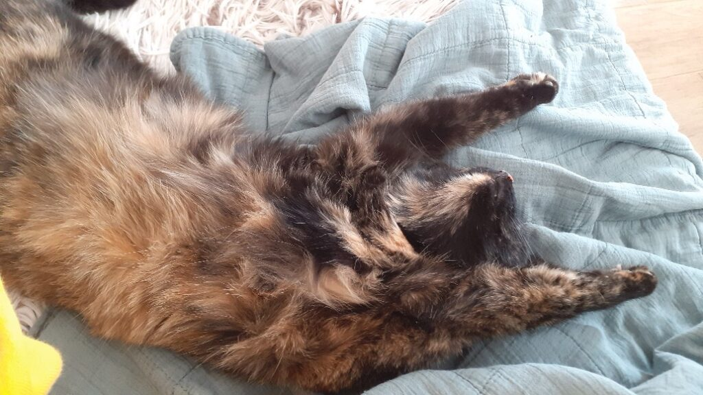

+++
date = 2022-11-13
title = "Ziua 306"
description = "Aș da orice să știu ce e în ea acum. Aș da orice să schimb ce e în ea acum. Dac-ar exista o cale să-i vâr și ei niște zori roz în interior, dacă Universul ar face undo la toată istoria ei de viață și i-ar da o nouă șansă, dacă, dacă, dacă… E doar o privire goală dintr-un înăuntru care se golește trist, dar sigur."
authors = ["Biannca Locatelli"]
[taxonomies]
tags = []
[extra]
math = false
diagram = false
image = "images/ziua-306.jpg"
+++
---

Faptul că am început să-mi practic aplicat viața în viață, cu atenție pe clipe, pe stări, pe sugrumări sau exaltări, cel puțin acum, în faza de mugur, e obositoare și consumatoare. Am resimțit din plin asta în noaptea ce parcă mi s-a scurs printre gene într-o clipită, alergată și fugărită parcă de ziua asta care stă să se nască și să-mi aducă alte evenimente sub lupă în marele laborator experiențial care-i existența asta. Pentru că mi-s din fire curioasă, ca toată lumea de altfel, doar că eu mi-am cultivat-o, inconștient cam toată viața dar și conștient în ultima perioadă, nu mă mai strâng ca melcul la gândul unei noi zile, dar parcă aș vrea să mă mai țină în poale o țâră mai mult noaptea asta, vreau mai multă stare de stare odihnitoare, vreau să mai adun în rezervorul de energie ceva zeamă pentru zilele ce-mi vin.

În dimineața asta de duminică, când până și cocoșii din sat trag la aghioase cu poftă, pe mine mă trezește un sforăit pe alocuri suav, dar mai consistent trompetă, că domnul meu încă n-a depășit faza răcelii și crede el, în somnul profund care-l leagănă, că mă delectează octavele lui la ceasul ăsta atât de liniștit. Nope, se înșeală, mă ciufuțesc, dar nu mă lasă inima să-l trezesc să-i spun asta.

În pauzele scurte și neașteptate dintre sunetele unui nas revoltat, îmi strecor și eu micul ritual al dimineții, în care-mi numesc încântările clipei, dar recunosc că mi-e greu. Mă grăbesc să îngrămădesc în momentul de liniște recunoștințe, dar sforăitura mă pălește pe nepregătitelea și-mi spulberă bunul mers al înșiruirii, ce are o logică emoțională în mine. O iau de la început la următoarea pauză, dar deja mi s-a instalat și programul temei că acuș vine valul sonor și-mi spală tot ce-am scris eu pe nisipul mulțumirilor. Am încercat așa de vreo câteva ori, până când am renunțat, că deja-mi părea un simulacru. Asta e Universule, eu am încercat, n-a fost să fie în dimineața asta.

***

Cu cât îmi pun ochiul mai vigilent pe acumul ce mă trăiește, cu atât văd mai cu limpezime împletirea între una caldă și alta rece care-mi șerpuiește prin zile. Oi fi eu ciufută și adormită, dar afară sunt niște zori superbi. Și, nu e doar una călduță, e de-a dreptul știrea fierbinte a dimineții: nu mă mai doare capul. Dacă trag linia și fac calculul, parcă-mi dă pe plus. Hai să-mi croșetez ziua de aici, zic.

  

***

Avidă de frumos, am înhățat culori din zori și le-am pastelat și în mine, că e totuși duminică, că totuși suntem cu toții în viață, sănătoși pe cât ne-am priceput să ne păstrăm, împreună, pe cât ne-au ținut voința și dorința. Mi se pare genială funcția minții numită imaginație, și, pentru că sunt vizuală, am avut impresia că și apa pe care-am băut-o cu poftă, s-a înrozit în mine și lasă în urma ei totul vindecat și fain, ca un fund de bebeluș. În dimineața asta, am băut zori și am fost rozalie. Cu stropi senini și albaștri, pe ici, pe colo, prin părțile mai încăpățânate. Ducă-se ciufuțeala!

***

Oleacă înmuiată și vădit deschisă unei noi zile, dau drumul camerei de supraveghere cât să văd o mama care privește fix televizorul. Nu vreau să-mi feresc privirea și ochii-mi rămân îndelung pe imaginea asta, încercând să pătrundă profunzimi ce nu pot fi cuprinse de-o retină. O privesc cum stă în pat, cu pilota până sub bărbie, cum ține mâinile împreunate pe piept și, din când în când, aruncă câte-o scamă imaginară de pe pilota sau o netezește, cum privește televizorul și brusc întoarce capul spre perete unde rămâne cu ochii minute bune, că mă face să măresc imaginea și s-o focusez pe același perete, doar-doar oi înțelege ce o face să-l țintuiască cu atâta insistență. Aș da orice să știu ce e în ea acum. Aș da orice să schimb ce e în ea acum. Dac-ar exista o cale să-i vâr și ei niște zori roz în interior, dacă Universul ar face undo la toată istoria ei de viață și i-ar da o nouă șansă, dacă, dacă, dacă… E doar o privire goală dintr-un înăuntru care se golește trist, dar sigur.

***

Asta a fost aia rece, secondată în pasul următor de una caldă venită în viața mea sub forma unei donații pentru Sett de la cineva neașteptat.

Mintea a plecat imediat să miroasă urmele acestei donații și-am picat pe gânduri: ce anume îi face pe oameni să doneze? Cauza sau inițiatorul? Sau ambele? Îmi dau seama cât de grele sunt fiecare în parte, că oricât ai vrea să îngrămădești în fiecare pixel al fiecărei litere a fiecărui cuvințel toată nevoia sau durerea sau strigătul, sunt oameni care devin orbi sau surzi aproape instant. Și recunosc că am încercat, cu ocazia acestei strângeri, să înțeleg care-i mecanismul care face o ființă umană, care nativ e extraordinară și bună în esență, să se blindeze în nepăsare. N-am reușit încă. La fel și cu inițiatorul. Poate să fie el poleit cu aur, pe unii aurul îi va deranja puternic și-și vor muta privirea, iar alții, deși vor vedea aurul, vor crede că sigur se vor găsi donatori, alții, acolo, în lumea asta mare, care au mai mult decât ei și cărora le prisosec vreo 10 lei. Partea proastă este că mulți gândesc așa, iar palierul celor care vor să dea doar pentru că vor să dea, fără scuze sau fără dovezi, se îngustează dramatic. Iar eu acum strâng bani pentru un câine. Oare dacă aș strânge pentru o ființă umană, ar fi altfel? Universule, te rog eu mult din sufletul meu de copil cuminte, să nu mă faci să aflu răspunsul!

***

În aceeași nuanță de pustiu interior, o urmăresc pe mama cum își aliniază dumicații pe farfurie și o pot face nestingherită, pentru că nu pare a fi ori conștientă, ori interesată sau afectată de prezența mea în bucătărie. Are o paloare îngrozitoare, ochii i s-au dus în fundul capului, are cearcăne, dar din toate urlă neprezența. Încep să nu mai am dubii referitor la faptul că mama nu mai are gust și singurul receptor ce i-a mai rămas, care să țină drapelul sus într-o palidă încercare de viață, este cel pentru dulce. Nu întâmplător, pentru că cică există o legătură între dulce și creier. E adevărat că legătura asta apare atunci când există o activitate cerebrală intensă, ceea ce nu e cazul acum, dar de unde știu eu că de fapt, sub pojghița asta de neparticipare, n-o fi vreun vulcan prin mama? Nu știu.

Lupițele vecinului latră insistent de câteva minute și istoria-mi spune că nu o fac întâmplător sau aiurea. Nope, este un câine mare și speriat pe pârloaga de lângă terenul nostru, s-a adăpostit și el probabil aici, unde e liniște și nu-s alți câini cu care să înceapă un război teritorial. Mă întorc în bucătărie, îi spun mamei că o las un strop singură, îmi burdușesc buzunarele cu ce carne am găsit prin frigider, pun și niște cașcaval, și o conservă de pateu, că și-așa mama nu-l mănâncă și ies la noua apariție, să-l hrănesc. Deși am mers încet, i-am vorbit constant, cât am putut eu de calm și cald, e speriat și a fugit. Off, ce prostie am făcut! Deși am vrut să-l ajut, am reușit să-l gonesc din locul unde găsise și el un strop de adăpost… Într-o fracțiune de secundă am simțit cum mi se îngreunează a tristețe sufletul, cum mă doare tare singurătatea altor ființe, că știu cât de tare a durut la mine, cum mă taie adânc nepăsarea oamenilor față de animale.

Revin la mama și o rog să nu urce, să mă aștepte să-i dau pastilele, că mă întorc imediat, mă duc după câinele care s-a avântat spre stradă, să-i las undeva, pe acolo, mâncarea pe care o am asupra mea. Fug să nu-l pierd și într-adevăr, e în stradă, zăpăcit de lătrăturile câinilor din toate curțile din jur. Îi ușuiesc pe toți, nu se opresc, moment în care scot din mine un mare "Gura!" atât de urlător, de ferm și de sigur, că s-a făcut liniște. Vibrația mea i-a "lovit" pe toți și-am reușit să-i potolesc, cât să-și tragă sufletul amărâtul ăla care n-a avut noroc de-o curte. Îi las mâncarea și mă retrag, să vină și s-o mănânce. E neîncrezător, dar stomacul gol e mai puternic și în timp ce mă îndepărtez, apuc să-l văd cum înfulecă nemestecând și apoi pleacă de unde o fi venit.

Mama e deja sus. Ce pastile trebe să ia?! Lasă mamă, știu eu ce-ți trebe. Oare știu?

***

Deși am fugit de gri la adăpostul scrisului, sau făcutului de treabă sau ascultatul prietenei mele ce are nevoie de vărsat niște amar de suflet, nu reușesc să mă scot din starea asta libidinoasă de apăsător care m-a îmbrățișat. Nici nu știu când m-am pornit să curg, dar știu că plâng de neputință, și a mea, și a mamei, și a câinelui hăituit, și a lumii ăsteia reci și prea închisă în pătrățelele proprii, și  îmi azvârl privirea spre cer, parcă vreau să mă înfig însetată în curatul albastrului, să-l iau și să mă spăl și eu cu el, să merg mai departe, să fiu senină.

***

Din toate variantele oferite, doar varza are un ecou în amintirile ei, așa că prânzul mamei de azi se reduce doar la varza acră călită. Fix când mai avea două guri de mâncare, sună asistenta, să mă duc să o iau, că doar acum e disponibilă. Cu timpul a doi dumicați în plus sau în minus, aștept ca mama să termine, o anunț că vine să-i facă injecția pentru azi și fiecare își vede de drum: eu înșfac cheia de la mașină să plec, mama palmează o banană și o ascunde sub bluză. Da, mecanismele pe care ea le-a ascuns toată viața, acum ies la suprafață ca niște cadavre care plutesc. Nemaiavând frânele funcționale în creier, ies tot felul de schelete, care mai de care mai greu de privit sau interesant de analizat.

***

La început am crezut că doar mi se pare, dar azi am avut confirmarea: de câte ori vine asistenta, mama e volubilă, vrea să aibă conversații, vrea să dea bine. Bine, nu mama vrea, ci egoul ei, care se zvârcolește pe uscat și cum dă de vreun uman nou, cum se dă în stambă. Dacă mai aud pe cineva că n-are ego sau că a scăpat de el sau că "l-a topit", cum am mai auzit, o să-i spun că nici nebun să fii nu scapi. Literalmente.

***

Seara mi se scurge printre discuții cu domnul meu și scris pentru blogul meu, ambele dătătoare de blândețe inimii și sufletului, răscolite intens azi. Pisica-balsam s-a strecurat și ea lângă mine și-mi vibrează un tors rotund în toată canapeaua. Nu mă pot abține și-mi întind mâna a mângâiere pe blănița ei moale și caldă, iar ea se întinde a drag către mine. Croim amândouă momente faine și ne dăm una alteia diferite feluri de siguranță: ea că e ocrotită, eu că e o minune totuși viața asta. Așa cum e ea. Sau tocmai pentru că e așa.

    &nbsp; &nbsp; &nbsp;
    &nbsp; &nbsp; &nbsp;

***

Sunt recunoscătoare pentru:
1. Zori roz!
2. Curajul generozității, trăsătură universală intrinsecă a ființei umane, astupată cu straturi de neîncredere, nepăsare, las' că face altul!
3. Viață!

Frumosul unei clipe din azi:

  

 

 

  

    <a href="/blog/ziua-305/">Postarea anterioară</a>
  

  

    <a href="/blog/ziua-307/">Postarea următoare</a>
  

