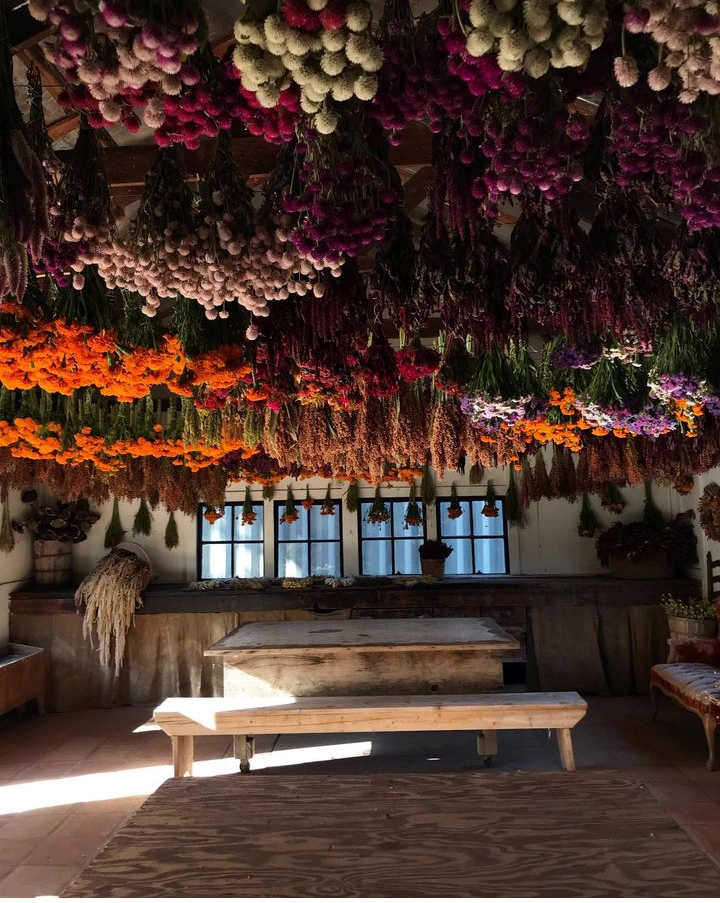

+++
date = 2022-11-15
title = "Ziua 308"
description = "Zilele astea, sincronicitate sau nu, am dat numai peste cauze bune, peste oameni care se zbat, care fac valuri ce le depășește pătrățica, care au puterea să dizloce niște energii extraordinare și să miște munți, doar ca să facă un bine, să întindă o mână. Doamne, câți sunt, dar doamne, cât de mare e mulțimea aia care trece peste ei, tropăind a nepăsare, având în buzunarele inimii doar grija pentru ei, pentru ziua lor de mâine."
authors = ["Biannca Locatelli"]
[taxonomies]
tags = []
[extra]
math = false
diagram = false
image = "images/ziua-308.jpg"
+++
---

Mi s-a înșurubat trezirea în jurul orei 5 dimineața și chiar de mă îmbie linul din dormitor și căldurica asta plăcută să mă întorc la somn, coțofana de minte a început să taie bilete la gânduri și să le orânduiască pe rânduri, în funcție de importanța pe care le-o atribuie ea: care mai în față, mai de prima mână, mai importante, care mai domolite și mai terne, mai de spatele sălii așa.

Când lucram și trăiam într-un mediu acid de atâta stres, pe lângă că nu observam des avalanșa asta de reflecții, mai mult sau mai puțin ale mele, sau poate că nici n-o aveam, că nu mai era loc, mi se părea normal să fiu așa, în priză tot timpul, că doar mintea mi-era super hiperactivă și evident că n-aveam buton pe care să-l apăs seara târziu când ajungeam acasă, să dau reset. Acum, când stresul ăla e într-o altă viață dar uite că m-a năpădit alt tip de stres, realizez că mintea va găsi mereu zone de adăpare buboasă, indiferent pe unde mă duce sau mă trântește viața, dacă nu pun piciorul în prag. Numa' că, fix atunci când vrei să îi apuci hățurile, s-o strunești, taman atunci se stropșește mai abitir și te scuipă cu și mai multe gânduri. Că, de fapt, e o încrâncenare, e un "care pe care" și, vorba lui Twain, adaptată la cazul de față, nu te pune cu mintea că te bate cu experiența. Atâta timp m-a condus ea pe mine, că se simte diferit și greu s-o conduc eu pe ea. Și durează ceva până ne acomodăm, și ea, și eu, cu alternativa.

Dacă tot sunt trează ca un radar, măcar să m-adun pentru ceremonialul meu din altarul interior, pista de lansare a recunoștințelor pe orbita infinitului, nu că d-aia nu mai poate Universul de înșiruirea mea, ci pentru că așa mă fac mai atentă și mai conștientă și mai aproape de viața mea, atunci când am tendința să mă zgâiesc și să jinduiesc la binele din viața altora. Pentru că, cu toată sinceritatea, îl invidiez pe domnul meu care doarme așa de liniștit.

***

E frig bine afară, beznă densă și nu am curajul și nici inima s-o las pe fâșneața blănoasă să evadeze în noapte, afară. Ea freacă insistent tocul ușii de la bucătărie, mai dă o fugă și la ușile din living ce dau spre terasă, le lustruiește și p-alea de acolo, hop și-un salt la geam, poate tocul ăsta e mai cu noroc. Nope, ghinion de nesanșă, azi sunt hotărâtă s-o mai țin în casă, măcar până se luminează și se mai încălzește o țâră, pentru că aseară mi-a tușit și nu mi-a plăcut deloc. Dac-ar putea vorbi, mi-ar zice vreo două, așa doar mă prind din ochii ei de jad că mă trece Dunărea în sinea ei, dar mă fac și eu că plouă, că am treabă, că-mi beau apa, stai să-mi fac și smoothieul, ooo, trebe să pun și de ceai, lasă Spikylino, vorbim noi mai încolo.

***

Și cu ritualul ce se consumă în fiecare dimineață în bucătărie gata, mă fac mică pe-un colț de canapea, înfășurată într-un pled și dau drumul la facebook, să iau pulsul strângerii de fonduri pentru franțuzul de Sett. Ieri a fost ziua lui și nu am primit nicio donație. Este dureros. Nu pot să nu mă gândesc cum o fi pentru o mamă care strânge fonduri pentru puiul ei și nu primește, dacă pe mine mă doare așa neprimitul pentru un pui de câine pe care nici nu-l cunosc. Dar știu că experiența asta, ca toate experiențele, mă va învăța multe și sunt ochi și urechi, deschisă să primesc și să învăț.

Zilele astea, sincronicitate sau nu, întâmplare sau nu, am dat numai peste cauze bune, peste oameni care se zbat, care fac valuri ce le depășește pătrățica, care au puterea să dizloce niște energii extraordinare și să miște munți, doar ca să facă un bine, să întindă o mână. Doamne, câți sunt, dar doamne, cât de mare e mulțimea aia care trece peste ei, tropăind a nepăsare, având în buzunarele inimii doar grija pentru ei, pentru ziua lor de mâine. Una din legile fundamentale ale acestei lumi este aia că cu cât dai, din ce ai, din ce n-ai, cu atât dai drumul la robinet și curge mai mult prin tine, pentru tine. Cu cât ții mai mult, mai strâns de ce ai, de ce n-ai, cu atât ți se risipește mai mult printre degete. E trăită pe pielea mea, și o variantă, și alta. Cât de grozav poate să fie ca o cafea necumpărată să se transforme în viață pentru altă ființă, sau într-o haină călduroasă, sau într-o apă potabilă? E fantastic și e posibil. Dar lumea e prea grăbită să scrolleze mai departe.

Ca să-mi ridic un pic moralul, mă uit la ce-mi place mie cel mai mult, castele și antichități, doar-doar oi alunga senzația asta de amar pe care o am în suflet. Ce o fi, o fi, oricum nu pot forța nimic.

***

Mama își împarte cașcavalul de la micul dejun cu cerșetoreasa-șefă din casă, Spiky, nedezlipită de picioarele coanei mari, lângă masă. Mă bucură să văd la mama umanitate și grijă față de alte ființe, în dimineața asta în care am simțit atât de acut lipsa lor. Mama nu a dat niciodată pe dinafară de grijă și de ajutat, a ajutat cât i-a permis limita ei de confort, să nu care cumva să facă ceva care să-i stânjenească călduțul propriu. Cu toate astea, a avut și are o slăbiciune la animale. Probabil că și asta mi s-a transmis ereditar.

Odată cu ultimul dumicat și zâmbet adresat lui Spiky, pe care aproape că devin geloasă, o anunț că mă duc să o aduc pe asistentă, s-o perforeze scurt c-un B12 injectabil. Foarte bine, s-o aduc, că-i place de ea.

***

Dacă tot ies din casă pentru returul doamnei, eficiența din mine bagă și o tură de cumpărături. Mama e cuminte, oricum nu e singură în casă, dar știe că-s plecată la Carrefour, că doar mi-a dat și ea listuța ei: Ciocips, Chinder Pinguin, Milca. Atât a reținut ea din reclamele care-i invadează intruziv spațiul și mintea.

Doamne, dar ce s-au mai scumpit toate! Pui trei articole în coș și-n aplicația Carrefourului "Act for good" și gata, s-a strigat milionul, pe stil vechi, că eu tot așa am rămas. În ultima perioadă, mi se pare că e o accelerare a creșterilor și, invariabil, se va ajunge la o spargere cu curs de puroi. Cum eu nu mă uit la știri, nu știu clar pulsul economiei, dar eu fac cumpărături și plătesc utilități și mai aproape de pulsul economiei decât așa, nu cred că există. Simt o ascuțire de luptă: unii să adune cât mai mult, alții să supraviețuiască. Dacă s-ar întâlni într-un mijloc, cât de faină ar deveni planeta asta.

***

Doar ce am așezat cumpărăturile la locul lor, mi-am băut prima halbă din ceai, că s-a și făcut de prânz. Parcă doar ce-am clipit și îi făcea injecția, uite că deja s-a făcut timpul pentru a doua masă a zilei ei.

Nu mai vrea ciorbă de perișore, varza e prea acră, pilaful nu-i place, mă face șah-mat, că eu altceva nu mai am să-i dau. Și, de nicăieri, toate stihiile iritării se năpustesc pe mine. Îmi trece razant prin minte gândul că toate astea se vor răzbuna cândva pe ea, toate ocaziile, toată mâncarea risipită și aruncată la animalele câmpului sau păsările cerului, tot efortul meu să-i diversific mesele, și apoi îmi pare rău că am gândit așa. Dar în clipe d-astea, eu mă simt prost că nu mai am și alte variante de backup, în loc să o anunț că asta e tot ce avem, dacă vrea bine, dacă nu, iar bine. Și ce face omul când se simte prost? Gândește aiurea sau scuipă prostii. Sau și una și alta. Eu rămân doar la stadiul de gândit, mă prind repede de reproșul inutil pe care i-l fac și ea nici măcar nu știe, încerc să redresez săgeata asta energetică care împunge câmpul ei de energie, și-așa vlăguit de Alzheimer. Bine că mă prind, dar și câte catapulte d-astea nenorocite am aruncat toată viața mea către ea, din inconștiență…

***

Prin crăpăturile astea generate de simțitul prost și peticite apoi de un gând chituitor, simt cum mi se strecoară o țâră de oboseală, parcă mi-e și frig, parcă mi se strânge carnea pe mine, mi se contractă mușchii, mă simt îngrămădită în mine, la propriu. Nu am muncit azi mai mult decât am făcut-o altădată, ba chiar am fost blândă cu mine la capitolul ăsta și totuși, nu mă mai țin balamalele la mai mult.

Așa abătută și așa obosită, mă așez să-mi trag sufletul, să respir cu toată ființa mea și să mă scutur puțin de starea asta mâzgoasă care mă slinoșește.

Scrollez social media și aproape că-mi pică telefonul din mână când îmi apare un reel ce pare că-mi vorbește direct, mi se pare că Universul ăsta nu contenește să mă uimească și-mi trimite ce trebe să aud sau văd fix când trebe să aud sau să văd. Cică bivolii, specie care urăște apa, care urăște să stea în ploi sau furtuni, s-au prins că dacă văd nori de furtună trebe să fugă spre ei, astfel vor sta în furtună mai puțin timp decât dacă ar fugi în direcția opusă. Giiiz, până și bivolii au înțeles că fuga de probleme nu face decât să augmenteze momentul prezent de viață neplăcută și că singura cale să treci de problemă e PRIN problemă carnal, la propriu, cu tot ce ai și ce ești și ce știi și ce simți, nu pe lângă, nu făcându-te că plouă, că nu ai problema, că n-o vrei, că aia și ailaltă. Mama natură are toate răspunsurile, păcat că nu mai știm să le citim, am uitat limbajul, am devenit atât de inteligenți, ba chiar artificial inteligenți, încât ne-am prostit dramatic. Nu o să blamez progresul tehnologic niciodată, dar o să am semnele mele de întrebare acolo unde el rescrie naturalul.

Reel-ul ăsta mi-aduce aminte de momente similare în care Universul a complotat, utilizând bucăți din prezentul meu, să mă facă atentă la ce trebe să înțeleg din prezentul care mă cocoșa la momentul respectiv: când am atins un biciclist (nici acum nu știu dacă nu a intrat intenționat în mașina mea), mi-era efectiv rău în suflet și plângeam greu în mașină, pe autostradă, mi-a apărut o reclamă la Nestea care scria mare, 2 metri pe 2 metri: "Eliberează-te de griji!" Țin minte, ca și cum tocmai s-a întâmplat, cum m-au trecut fiori pe coloană în același timp în care am dat un oftat atât de visceral și atât de plin, încât mi-a golit starea de toată greutatea pe care i-o imprimasem. Sau cum, într-un alt moment de cumpănă al meu cu mine, o reclamă la un unt, la tv, "Să luăm viața ca pe o încântare!", mi-a dat una peste ochii atât de pierduți în suferință, de mi i-a aliniat drept, pe drumul în care nicio durere nu e nici netrecătoare, nici insurmontabilă.

Dar cea mai tare a fost și rămâne poza pe care mi-au căzut ochii, în ziua imediat următoare morții tatălui meu, care-mi spunea: "Forgive those who didn't know how to love you. There were teaching you how to love yourself". Am ȘTIUT că era tata, care-mi vorbea. Și ce mângâietor de traume și de copilărie irosită în singurătate și neiubire a fost.

***

În principal, ziua mi-a fost tristă, mă doare neimplicarea, neinima din semeni, dar știu că trebe să mă înfășor în acceptare și să apăs pedala înțelegerii. Așa că sunt recunoscătoare pentru:
1. Inimile alea mari care bat în trupuri de ființe umane pentru alte ființe umane!
2. Lecțiile astea valoroase care-mi trec prin zile!
3. Claritatea mentală care-mi spală ochii sau, după caz, îmi dă una peste ei, să văd corect ce e, nu ce aș vrea eu să fie!

Și-un frumos din zi:

  

Full Belly Farm
