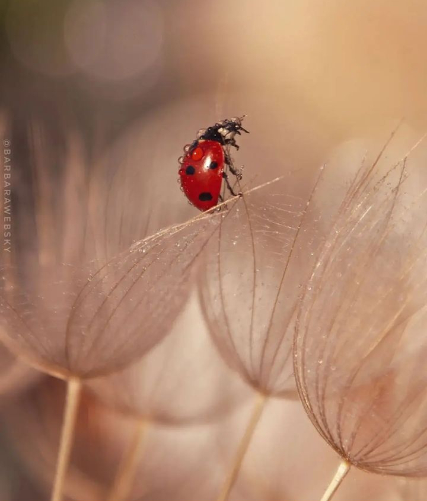

+++
date = 2022-11-17
title = "Ziua 310"
description = "Înghiontită de împrejurări, eu am decis că nu-s iubibilă cândva și am făcut tot ce-am putut, dintr-o inconștiență grosolană, să nu fiu iubibilă nici mai târziu. Mi-am pus straturi de aroganță, când de fapt mi-era frică să nu par slabă și deci neiubibilă, m-am făcut puternică și mi-am pus coajă peste coajă peste coajă ca să nu mai ajungă nimeni la sâmburele meu unde eram vulnerabilă, dar eram eu."
authors = ["Biannca Locatelli"]
[taxonomies]
tags = []
[extra]
math = false
diagram = false
image = "images/ziua-310.png"
+++
---

Chiar de mi-e corpul obosit pe ici, pe colo, spiritul mi-e mai însuflețit ca niciodată, iar noaptea ce-a trecut n-a fost decât un pod pentru ziua de azi, nici pe departe o zonă-tampon, de încărcare baterii. Aproape toată noaptea am stat într-o stare de veghe, de acută prezență, de o trezie plină. În puținele momente de absență din starea asta, am avut senzația că sunt o licurică, o mică spiridușă ce plutește ghidușă peste tot și toate. Mi se pare incredibil cum surata nopții de ieri, atât de atârnătoare, poate să fie atât de ușurică, să se simtă ca un cașmir pe piele. Cum spuneam, viața asta, cu ochiul mărit pe ea, e fabuloasă. Și cuvântul ăsta e mic și pipernicit.

***

În țopăiala mea de noapte, am avut claritate mentală cât cuprinde și-am putut să văd, măcar la nivel de teorie, cât de simple sunt de fapt conjuncturile noastre. Cum, dacă te tragi vreo 10 pași mai în spate, vezi lejer firul comun care leagă toate tragediile pe care le trăiești și ăla e pur și simplu alegerea personală, cu dedesubtul pe care deja l-am descoperit până și eu, percepția.

Toate dramele mele sunt alegerile mele, luate ca să întărească niște convingeri și niște decizii pe care le-am luat în diferite momente ale vieții mele. Cu inima-n așteptare și cu dorință de validare în ochi, înghiontită de împrejurări, eu am decis că nu-s iubibilă cândva și am făcut tot ce-am putut, dintr-o inconștiență grosolană, să nu fiu iubibilă nici mai târziu. Mi-am pus straturi de aroganță, când de fapt mi-era frică să nu par slabă și deci neiubibilă, m-am făcut puternică și mi-am pus coajă peste coajă peste coajă ca să nu mai ajungă nimeni la sâmburele meu unde eram vulnerabilă, dar eram eu. Noaptea asta a fost o călătorie mișto prin mine și prin diversele măști și vieți pe care mi le-am construit în viața asta, ca să fac față unor păreri exterioare mie. Dacă m-aș fi prins eu mai devreme, măcar cu vreo 20 de ani, că părerile din afară n-au nicio legătură și nicio contribuție la înăuntrul meu, aș mai fi avut acum încă 20 de ani în plus de antrenament. Dar, cum nimic nu e întâmplător, probabil că acum a trebuit să încep să mă coc.

***

Zâmbesc în bezna camerei și recunosc că-mi place aroma asta suavă a descoperire de mine pe care o am. Cred că încep cu adevărat să mă plac. Luată de valurile vieții sau ale demenței, rareori m-am oprit să fac așa o radiografie scurtă și cuprinzătoare a celei ce-am fost și crescut până la momentul ăsta de viață. Dar halta asta e tare bine-venită.

Ca și cum toată noaptea a fost complice la momentul ăsta mic al meu cu recunoștințele mele, toate s-au legat natural, s-au scăldat în mine și au ieșit, fără să am senzația că pleacă ceva din mine. Am avut senzația că sunt atât eu, individuală, dar și eu, universală, că ce dospesc în mine la foc cald de inimă și mulțumesc Universului primesc tot eu, care-s mare cât tot Universul. În prea dimineața asta post-mergătoare unei nopți de nesomn, nu mai există delimitare, nici în senzația de carne și nici în minte. Și nu mi se trage de la oboseală.

***

Vorba lui Paul Olteanu de la MindArchitect, repetiția e mama învățăturii pentru "elefant" așa cum numește el mintea non-conștientă. Îmi dau seama că băutul de apă, făcutul de smoothie și de ceai sunt deja pe panoul de comandă al "elefantului", singurele elemente care mai aduc un zvâc de noutate fiind ce aleg să pun în apa dimineții, s-o fac vie, sau ce adaug, scot, înlocuiesc în smoothie și în ceai. Ritualul ăsta mic al dimineților mele este dovada cea mai palpabilă și mai elocventă că poți pune pe pilot automat și lucruri bune, că poți să înlocuiești obiceiuri nesănătoase cu altele hrănitoare. Ani întregi, la prima oră a dimineții, pe stomacul gol, partenere mi-erau 5 țigări și-o cană de cafea, plus milioane de gânduri și de griji pe care nici nu le vedeam. Am mai zis că viața asta e mișto tare?

Vreau să profit de fiecare minuțel al timpului meu liber și savurez un documentar, alături de smoothieul meu bun. Încerc să mă înfiletez puternic în starea asta faină care mă umple, să mă stabilesc în ea și să nu mă scuture nici mersul la mama în cameră, nici acțiunile rutinate pe care le fac în fiecare zi.

***

Am simțit că mama-i bine de când am intrat în cameră, zici că am niște senzori care prind ei niște planuri și citesc niște vibrații acolo care-mi furnizează rapid un rezultat: chiar nu știu ce anume m-a făcut să mă prind de asta, dar nu m-am înșelat. Mama e liniștită, calmă, zâmbitoare și cooperantă. Bun așa.

Cu micul dejun în aceeași notă, parcă mi-a desfăcut și mie comportamentul înghețat de obicei în preajma ei, în ultima vreme. Vorbim, nimicuri e adevărat, dar nimicurile astea nu mai au încărcătură aiurea, ci sunt ușurele, ca niște bule mici care, din când în când, mai conțin și zâmbete sau chiar râsete. Mă bucur. Nu cred că există ceva mai instant molipsitor pe lumea asta decât zâmbetul. Sau mai hrănitor de stări.

***

Am auzit odată, mai demult, la o reclamă, o propoziție care a rămas cu mine: we can never clap with one hand. Chiar dacă ești sau te crezi puternic, chiar dacă ești sau te crezi ție însăți suficient, unde-s doi, puterea crește. Chiar dacă, în definitiv și la propriu, treci prin experiențe singur, că nimeni nu poate simți cum simți tu, întotdeauna o mână pe umăr sau o vorbă caldă o să facă minuni. Văd asta cu fiecare mică sau mare donație pe care o primesc pentru Sett. Cum spunea profa mea de curs, dacă trebuia să fim singuri, să ne descurcăm doar singuri, am fi avut fiecare planeta lui, am fi fost 8 miliarde de umani pe 8 miliarde de planete. Dar uite că nu suntem și o fi și ăsta vreun semn din care trebe să tragem vreo învățăminte.

Mi-aduc aminte că-ntr-un an am ajutat și eu cu un strop o cauză umanitară. Pentru că făcusem donația respectivă, tot primeam update-uri despre mersul cauzei. Într-un final, greoi, că așa e când lumea se uită în fix direcția opusă ăleia care cere un ban sau doi, s-au strâns banii și cauza a fost închisă cu reușită pe toate planurile. În acel moment de final, m-am simțit atât de bine, atât de mare și atât de om, încât am avut parcă o mică explozie de suflet în suflet. Nu pot să redau, evident, dar a fost o eliberare de ceva atât de intens încât în acel moment aș fi putut muta munții, am simțit o dragoste imensă față de toți cei care participaseră, alături de mine, la cauză, și o apropiere față de ei cum nu născusem niciodată până atunci, în toată viața mea. Acum știu că e vorba despre serotonină. Și că nu doar că serotonina mea crește exponențial, și cu asta și sistemul meu imunitar se întărește, dar că același lucru se întâmplă și în cel care primește binele, și-și întărește și el sistemul imunitar și, cel mai tare, și că alții care nu au participat la acel bine dar îl observă, au parte și ei de o creștere de serotonină și de sistem imunitar prin simplul fapt că se află în același câmp de energie care-i cuprinde pe primii doi. Mecanism genial al vieții ăsteia.

Așa se explică de ce acum, când văd pe stradă sau pe social media un gest de bun și bine, lacrimile îmi țâșnesc instant, iar în miez sunt invadată de sclipici euforici, care mi se împrăștie prin toate colțurile, tăindu-le judecățile sau prejudecățile și care mă mărește mai mult decât corpul ăsta limitat. Așa am înțeles eu în sfârșit sensul profund al sfatului: înconjoară-te de oameni buni și blânzi sau oameni care fac efortul de a fi bun și blânzi.

***

Mă apuc de curățenie și de rumegat idei, de observat că rumeg idei, de gânduri, de fugit din prezentul care miroase greu, de adus înapoi în camera unde este mama căreia încă parcă-i sclipește viața în ochi. Deși în linii mari am același ritual când fac curățenie, îmi dau seama că dacă sunt prezentă la el, nu e deloc la fel. Gândurile sunt altele, sau chiar de unul apare insistent, mă duc pe altă cracă cu el, declanșatorii de gânduri sau trăiri sunt mereu noi, sau dacă sunt aceiași, generează rămurele de emoție nouă, pare că am decis cu totul, în mine, să nu aștern monotonia pe activități care fac parte dintr-o rutină de la care nu pot să mă sustrag, acum.

***

La prânz aduc o mamă gureșă, cu luminițe în ochi și spumoasă-n vorbire. Face și mici glumițe, ce să mai, e într-o stare de zile mari. Efervescențe ca asta, e drept că la scară redusă, adaptată la situația mamei, încă adapă speranța aia mică, din ce în ce mai mică, că poate nu e chiar așa de rău. Chiar dacă în mine am înțeles că Alzheimerul e ireversibil, există, tot în mine, o parte care crede că totul și orice e posibil. Iar zile ca asta o gogoșesc.

Aduc asistenta pentru ultima injecție de B12. Au zburat 10 zile într-o clipire de gene pentru mine dar pentru memoria mamei, nu au fost suficiente: deși s-a repetat zi de zi în toate cele 10 zile, de câte ori o anunț că aduc asistenta, mama mă întreabă, invariabil, pentru ce.

***

Ca ultim gest, opresc și la magazinele de la care are nevoie de cumpărături și simt că în orice act făcut spre ceilalți se află negreșit și statornic și răsplata proprie. Și da, devine adicție.

Întoarsă acasă, o găsesc pe mama fericită, toată numa' zâmbet, că i-a dat cadou asistentei o cutie de bomboane, că "așa e frumos". Iar cutia de bomboane a cumpărat-o ea de la magazin. Mda, s-a terminat fitilul minții pe ziua de azi, n-a avut puterea s-o țină toată ziua.

***

O zi faină, cu totul și cu toate, și cu recunoștința mea pentru:
1. Noaptea deosebită, aleasă, în care m-am simțit spiridușă!
2. O mamă prezentă sau prezența mamei!
3. Imaginea unui castel în golden hour, imagine care-mi dă niște fiori superbi și pe care o consider una dintre cele mai frumoase priveliști de pe pământ!

Clipa mea de fain:

  

 

 

  

    <a href="/blog/ziua-309/">Postarea anterioară</a>
  

  

    <a href="/blog/ziua-311/">Postarea următoare</a>
  

