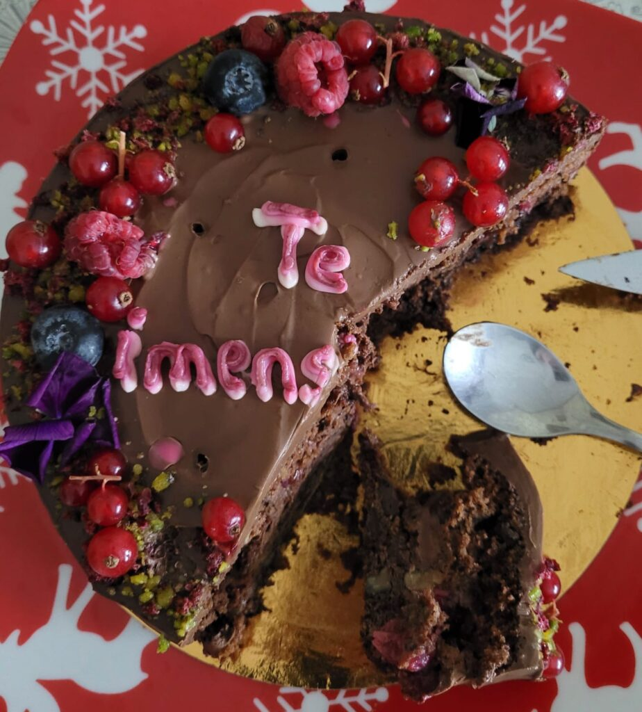

+++
date = 2022-11-19
title = "Ziua 312"
description = "Și dacă fac o petiție, și dacă mă rog eu mult și apăsat, Universul ăsta n-o să plece urechea la ruga mea și n-o să mă creadă pe cuvânt că eu simt că de-abia am deschis ochii, că-s nouă, prospătură, de abia încep să mă prind cum se mănâncă viața asta și cum se simte și cum se trăiește. Am doar câțiva anișori, grosul ăla de 40 a fost așa, o pregătire de lansare, o bătută pe loc, un joc de glezne de încălzire, eu de abia acum pășesc cu adevărat, câteodată încă-n străchini, dar de multe ori pe drumul ăla mișto și aliniat cu adevărat mie, ființei."
authors = ["Biannca Locatelli"]
[taxonomies]
tags = []
[extra]
math = false
diagram = false
image = "images/ziua-312.jpeg"
+++
---

Nu cred că Universul are-un Iphone (sau android) cu calendar, de unde să sară ca lăcustele notificări de zile de naștere, nu l-am găsit nici pe Facebook, să-i cer prietenia și astfel să știe el când mi-e mie ziua aia specială, o dată-n an, prin urmare nu m-a cadorisit c-o noapte nealbă, una mai de somn așa, mai cu plecare îndelungată și cu folos în niște lumi paralele, dar nemateriale. M-am tot trezit cu ochii sprijiniți în proiecția roșie a orei de pe tavan iar pe la 4, când domnul meu a îngemănat și-un sforăit intens și-un vis urât, am decis că nu-i rost de somn portocaliu, ci iese la iveală o trezire albă. Ok, trag aer în piept a oftat dar îl expir a înțelegere.

Să pui o respirație între tine și exterior e fix suficient. Pentru că, în spațiul și timpul acelei respirații, se creează tamponul necesar ca ce vine de afară să nu se sau să nu te bulucească grămadă. E ca vestibulul casei care te ferește de frigul iernii când deschizi ușa, să nu se ducă în miezul casei, e zona aia care potolește pârjolul verii să dogoare incendiar în interior.

Îmi iau și înăuntrul la plimbare alături de exterior și mă preling, singură și cumincioară, spre parter.

***

Azi e ziua mea. Fac 47 de ani.

Prima senzație ce mă gâdilă când îmi spun cifra asta este să fac totuși calculul matematic, poate am greșit pe vreundeva. Nope, sunt 47. Am eu așa vaga bănuială că și dacă fac o petiție, și dacă mă rog eu mult și apăsat, Universul ăsta n-o să plece urechea la ruga mea și n-o să mă creadă pe cuvânt că eu simt că de-abia am deschis ochii, că-s nouă, prospătură, de abia încep să mă prind cum se mănâncă viața asta și cum se simte și cum se trăiește. Am doar câțiva anișori, grosul ăla de 40 a fost așa, o pregătire de lansare, o bătută pe loc, un joc de glezne de încălzire, eu de abia acum pășesc cu adevărat, câteodată încă-n străchini, dar de multe ori pe drumul ăla mișto și aliniat cu adevărat mie, ființei. 40 și de ani am arat de-a dreptul drumuri, de multe ori viața a dat cu mine de pământ, atâta am muncit și alergat și făcut ca să am, să arăt, să demonstrez, să susțin, că n-am știut ce înseamnă pas elegant, oleacă mai sus de suprafața imediat următoare târâtului.

Probabil că d-asta m-am trezit mai devreme, ca să am timp și disponibilitate să fac o retrospectivă.

Am în mână două alegeri: să regret tot ce a fost și ce n-am știut și ce n-am făcut la fiecare moment din prima mea viață sau să salut și să mulțumesc și să accept tot ce mi s-a făcut sămânță și m-a crescut și m-a născut acum, în a doua mea viață. Pot să aleg să simt doruri vechi și să-mi pară rău că acele clipe s-au dus sau pot să aleg să văd cu ce mi-au contribuit oamenii sau situațiile cu aromă de trecut. Pot să fac o analiză tabelară Before and After sau pot să privesc asta ca o trecere, curgere, transformare.

Nimic în Universul ăsta nu e static și slavă lui că e așa. Orice stagnează, se pâclește și se-mpute și-n asta nu poate supraviețui nimic bun.

M-am plimbat prin mine, mi-am pus casetele video pe care le-am găsit pe rândurile mai din față ale memoriei mele, mi-am luat zâmbete de acolo unde le-am avut și lecții de acolo unde nu am avut zâmbete, mi-am trimis ochii noi în locuri și amintiri vechi și-am înțeles de ce n-a fost să fie. De ce n-am păstrat lângă mine oameni sau situații. Pentru că femeia aia care-i avea în jur nu era cinstită ei însăși, ci lor, era îmbrăcată cu haine și trăsături care să le fie lor pe plac, nu ei, făcea lucruri de dragul lor, nu pentru ea, toate dintr-o foame bolnavă de acceptare. Iar experiențele, astfel crescute, și oamenii, astfel induși în eroare, n-aveau cum să-mi rămână, când nici eu nu știam ce înseamnă să-mi fiu sinceră. Și-așa fac pace și cu mine, și cu ei, și cu pierderea lor, dar și cu regăsirea mea.

***

Hai că s-a-ndurat totuși "bărbosul" și mi-a dat, la ceasul dimineții, cadoul nesperat: pe BBC Earth, se difuzează, calup, cele 4 meditații Mindful Earth, care mie mi-au contribuit enorm și care m-au scăldat în lacrimi și-n beatitudine la prima lor vizionare. Yep, s-au simțit la fel, m-am scufundat cu atâta bucurie în ele și le-am luat din nou la trăit, că am început să dau pe dinafară de viață fabuloasă.

Mai am stropi de timp și pentru un pic de castele, un pic de antichități, un pic de design, nici n-am început ziua bine și deja mi-am umplut platoul numa' de bunătățuri. Și, cireașa de pe tot, dacă ieri a plouat și a fost vreme închisă, azi a ieșit soarele și-mi aruncă raze jucăușe în living. Cum poate fi și mai bine decât atât?!

***

Nu las așteptarea mea perfidă, de după fereastra minții ascunsă, să-mi întunece în vreun fel ziua și mă prefac că nu simt greu neștiutul mamei de azi: de obicei, ea nu știa ziua mea de naștere, dar avea pe bufet, lipit cu scotch, o hârtiuță cu datele de naștere ale celor apropiați și verifica hârtiuța asta în fiecare dimineață. Are și aici aceeași hârtiuță, în agenda ei de lângă pat, dar uită s-o verifice sau, și dac-o verifică, până se întâlnește cu mine, uită. Nu-i bai, ar fi o mare prostie să am așteptarea unui "La mulți ani" de la ea sau să mă supăr că nu vine. Nici măcar mâhnire nu vreau să pun în dreptul acestei așteptări. Dacă nu pot să n-am așteptarea, măcar să nu-i pun ceva aiurea în buzunar.

Mama mănâncă încet, pare o țâră absentă, nici eu nu-s prea gureșă, că mi-am domolit intensitățile, să le pot cuprinde și duce pe toate câte mi-au venit în astă dimineață, dar starea dintre noi nu-i cu jenă, nu-i cu împunsături, nu-i cu judecăți. O las să fie cum poate ea dar, în același timp, mă las și pe mine să fiu cum pot eu. E cadoul meu pentru mine.

***

Dau comandă la restaurantul indian rămas în mine din vremuri vechi, Karishma, mă apuc să fac un strop de ordine și mă frâng oleacă sub niște dureri subite: una de cap și alta de cap de piept. N-am nici chef și nici potențial să le duc așa și iau o pastilă, să pot avea o zi funcțională cu ai mei dragi. Mă ascund sub umbrela lui "Scopul scuză mijloacele", pentru că încerc să mănânc sănătos, dar când mă strânge vreo durere, zdup, bag un panaceu, care-i dă în cap ei și mie îmi varsă chimicale-n corp. Azi am voie.

***

Ziua mea e borna de finiș a strângerii de bani pentru Sett și recunosc că am ceva emoții pentru asta. Am speranțe mari care, ce-i drept, ar putea fi numite nerealiste, urmărind activitatea slăbuță de până acum, în totuși două săptămâni. Dar sper eu ca oamenii, care vor intra pe wall-ul de Facebook, să vadă și să aibă dezlegare la portofel. Vom vedea.

***

Gata, indian food is here! Ne place la nebunie mâncarea indiană, copila mea și iubitul ei au adus comanda și-au strecurat pe lângă și-un tort vegan ciocolatos de la Sara Green. Deși durerile sunt tot cu mine, bucuria unei mese delicioase cu oamenii mei cei mai iubiți, mai scutură și taie de prin intensități și probabil că și pilula și-o face efectul. Mănânc puținel și cu grijă, dar mă satur privindu-i pe ei: o mână de oameni care-mi umplu inima asta a mea cât tot Universul. Cât de relative-s dimensiunile câteodată!

Mă uit la ei și-mi dau seama că da, în fiecare-n parte mi-am făcut și eu căsuță, că m-am legat de ei cu niște fire ce nu pot fi desfăcute cu nimic, că-n una îmi vorbește sângele ce-a curs cândva și-n venele mele, că altul s-a strecurat atât de forever în tot ce sunt eu încât da, m-ar face homeless o țâră, mai mult, dacă m-ar faulta în viața asta. Și chiar dacă cu ea sunt de la începutul vieții ei, iar cu el de vreo 12 ani, eu de abia de câțiva ani am înțeles cum să-i iubesc, să le permit, să-i respect, să-i accept. Și continui să învăț nuanțe în fiecare zi.

***

Felia de tort de la prânzul mamei n-a sunat niciun clopoțel în mintea goală a mamei, care a venit la prânz, a trecut pe lângă copiii, i-a salutat, dar nu a realizat cine sunt. Am hotărât deja să nu mă acidulez, mă bucur și eu de bucuria ei la vederea tortului. La drept vorbind, copilul-mama nici n-ar avea de unde să știe că e ziua mea. Asta ar fi trebuit să o știe mama-mamă.

***

Strângerea de fonduri a avut rezultate tare slabe, abia am încropit de 700 și un pic de roni, ceva lire și ceva euro. Ce visuri aveam eu că strâng pentru operație… dar, cum m-a învățat pe mine un tip fain de la Peștera anul ăsta, privesc ce am în sacoșă, nu ce n-am, și consider că am strâns suficienți pentru analizele premergătoare operației lui Sett. Nu mă mai uit la mulțimea care a închis ochii și inima și urechile la ruga mea și a lui Sett, ci la cei care au avut larghețea de a ne contribui. Toate au timpul lor.

***

Când credeam că gata, mă pun să sorb urări și să răspund la ele, am primit și ultimul cadou, de suflet mult, din partea cercului de femei faine cu care am făcut cursul spălător de ochi Pace cu mine. Puțin peste o oră de stat pe zoom la bârfe, la plâns, la râs, la depănat, la încurajat, m-au hrănit cum nici nu speram că se poate. Doamne, cât am plâns, cât de mișcată, cât de fericită, cât mi-a înmuiat fiecare coajă de pe suflet revederea cu ele. Femeile astea frumoase și-au rupt sâmbata seara timp să vină la o întâlnire pe net, cu mine. Iar noi nu ne-am văzut în viața reală niciodată. Cam cât de tare trebe să fie încrengăturile în lumea asta a energiei, a chimiei dintre oameni, ca femeile astea puternice să vină să facă scut pentru mine, în ziua mea?! Ca de fiecare dată, plec cu aripi în tălpi de lângă ele, cu idei, cu iubire, cu nou, cu un ceva ce n-are corespondent în vocabular.

***

Obișnuită să cred că dacă e rău, se poate și mai rău, ziua de azi îmi spală cu jet credința din creier și-mi arată și reversul: dacă e bine, se poate și mult mai bine.

De obicei, de ziua mea, machiavelica crescută-n mine nu mi-a permis să primesc și să mă primenesc și cu alte urări, venite din afara micii mele familii. Nu puteam să primesc un telefon și să ascult urarea cu inima deschisă sau nu puteam citi o urare fără să mă gândesc că e făcută doar ca bifă, că dă bine. Toate astea pentru că, de fapt, la rădăcina percepțiilor mele, se afla insidioasă părere că nu mă calific, că nu merit, că nu ar avea cineva de ce să mă placă sau, și mai mult, să mă iubească.

Well, anul ăsta, ca și anul trecut, am ascultat și am citit cu urechea și cu ochii inimii. Mi-am pus pieptul în bătaia urărilor celorlalți și doamne, câte au venit și au intrat până în adâncurile alea odată triste și m-au îmbogățit și m-au nelimitat! Fiecare fărâmiță de gând bun și energie pe care au pus-o oamenii în simplul "La mulți ani!" scris sau spus, s-a așezat acolo, în pușculița mea eterică, și la final de zi mă simt gogoșată maxim de-un bine cald și bun și blând.

Vibrez de recunoștință pentru tot și toate și toți. O stare mai înaltă decât asta nu cred că puteam primi cadou mai frumos.

  

Un "Te imensiubesc, mami!" devorat :-)
