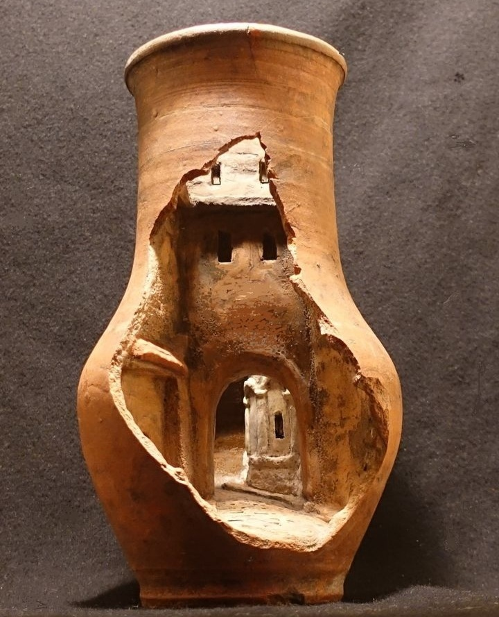

+++
date = 2022-11-25
title = "Ziua 318"
description = "O Bianncă conținută, liniștită, întâmpină la prânz o mamă pierdută printre gânduri, prin viața ei în care nu s-au întâmplat mari minuni, dar lecții dure au lovit neașteptat, și-mi dau seama, din nou și din nou, că-n copacul neamului nostru, am șansa extraordinară de a crea o nouă crăcuță. Una verde, plină de miracole, una care să fie capabilă nu să șteargă tot ce-au adunat bunii și străbunii mei, că alea-s roade ce m-au născut pe mine, ci să pună zvâc de viață nouă, bună, frumoasă, trăită intențional."
authors = ["Biannca Locatelli"]
[taxonomies]
tags = []
[extra]
math = false
diagram = false
image = "images/ziua-318.png"
+++
---

M-a învelit mâna asta de ajutor, ce-am primit-o ieri pentru Sett, toată noaptea într-un somn portocaliu, blând, atotcuprinzător, odihnitor de carne și ogoitor de emoții, așa că trezirea mi-a fost ușoară și naturală, ca o briză pe-un țărm cald. Sâmburele ăla de bunătate primită a copt și-a copt întreaga noapte, până a născut mătase ce mi-a țesut vise faine, cu plutiri prin Univers, de o insurmontabilă siguranță că totul este fix așa cum trebe să fie.

Mi se pare fantastic cum ființa umană, fie ea oricât de căzută, de neglijată, de uitată, de amărâta și însingurată, poate să se culcușească într-o palmă de bine întinsă de o altă ființă umană și de acolo să-și pornească înflorirea. Am pe buze gustul sigur, de netăgăduit, că în ființele umane nu există cu adevărat răul, ci doar și-au făcut cort temporar, în câte-o zonă de inimă, fie dezamăgirea, fie lovirea, fie neiubirea, fie însingurarea pe care le-au simțit la un moment dat. Dar e de ajuns să vină un alt suflet, să deschidă uși, să aerisească, să scuture, să primenească și ființa aia rătăcită să găsească drumul, împinsă la-nceput dar imboldită interior după aia, către bunul ăla intrinsec și natural ființei. Dacă ne-am uita un strop în jur, cu ochi spălați de "doar eu", dacă am îndrăzni un gest, o faptă, o vorbă, what a wonderful life it would be. M-a învățat demența mamei atât de pătrunzător că viața nu ne e dată s-o trăim singuri, ci să ne fim unelte de descoperire unul altuia.

Evident că-n blajinul ăsta la care-am deschis ochii, mulțumirea mi se duce toată pentru clipa prezentă, pentru odihna asta mică ce-am primit-o și mi-a făcut bine, pentru tot ce am în jur, în viață, în gând, în inimă. Orb să fii să nu găsești ceva pentru care să fii deplin recunoscător. Oi fi eu oleacă mioapă, dar ochii mei interiori încep să-și curețe retinele.

Cred că Spiky s-a urcat și ea pe treapta de vibrație care mă trăiește acum, că a pornit înaintea mea spre parter, dar poți să spui după cum își unduiește trupușorul de felină, că-i fericită și se simte în siguranță. Știu cum se simte fetiță dragă, sunt și eu tot acolo acum!

***

Nici izurile din camera mamei, de-mi închid ermetic nările, nici starea ei de apatie, nu reușesc să mă clintească de acolo unde mi-am înfipt adânc călcâiele încrederii. Gospodăresc rapid în baie, mă conversez deschisă-n zâmbet dar și-n disponibilitate cu mama și nu mă atinge nimic, zici că m-am blindat peste noapte în ceva impenetrabil, nimic nu trece de platoșa asta mișto ce-mi are spatele. Bun așa și mulțam!

***

Am învățat, tot în timpul ăsta de când e mama aici, că atunci când vrei, tot ce-ți vine în viață se gogoșește. Și răul și binele, polii ăștia atât de minunați care sunt rezultatul exclusiv al percepției fiecăruia.

Am deschis netul și din facebook mi se rostogolește-n în ochi postarea din grupul de bulldogei. Mă umflu și umplu toată cu ea, fiecare postare mai adaugă vânt în pupa inimii mele, și-mi țâșnește recunoștința pură, fără picătură de intervenție a minții, către fetele astea minunate care chiar fac minuni. E prima zi dar, din ce înțeleg eu prin rândurile postărilor, lumea e generoasă. Iar eu știu, pe pielea mea, că pic cu pic se adună de-un lac.

***

Singura supapă care-mi vine mănușă pe moment și pe trăiri este meditația. Sunt fremătândă de emoție bună și simt nevoia să descarc undeva preaplinul ăsta, că nu știu cum să-l duc, să-l dozez să-mi ajungă pentru mai multe zile, așa că poate dacă-l vărs într-o meditație, o să acționeze ea ca o bancă depozitară de trăire curată. O să repet, că știu sigur c-am mai zis-o și simțit-o, până când, împresurată de orice ar fi, o s-o zic și simt zilnic: viața asta e fabuloasă de-a dreptul! Și de-a stângul.

***

O Bianncă conținută, liniștită, întâmpină la prânz o mamă pierdută printre gânduri, prin viața ei în care nu s-au întâmplat mari minuni, dar lecții dure au lovit neașteptat, și-mi dau seama, din nou și din nou, că-n copacul neamului nostru, am șansa extraordinară de a crea o nouă crăcuță. Una verde, plină de miracole, una care să fie capabilă nu să șteargă tot ce-au adunat bunii și străbunii mei, că alea-s roade ce m-au născut pe mine, ci să pună zvâc de viață nouă, bună, frumoasă, trăită intențional. Toți cei dinaintea mea au făcut și ei tot ce au putut, știut și priceput și vin și eu lângă ei, cu tot ce pot, știu și mă pricep și eu. Sper eu că pe crăcuța asta nouă să se așeze urmașii mei, să sugă ei de la viața lor totul, cu atenție pe percepție și pe ce lasă după ei, pentru urmașii lor. Că dacă nu suntem singuri în viața asta, cu siguranță nu suntem, n-am fost și nici nu vom fi în eternitatea neamurilor noastre.

***

Mi-am luat de rumegat în mansardă starea mamei, în mod particular, dar și boala ei, în mod general. Deși sună abracadabristic, demența mamei a fost, atunci când am fost capabilă să văd, o sevă numai cu bunătățuri. Mi-a servit lecții pe care le-am perceput dure, dar de fapt toate astea mi-au dat jet puternic peste ochi, să mă trezesc cu adevărat la viața mea.

Mi-a rămas chipul ei pe retină, cu privirea ei dinspre și înspre nicăieri de azi și realizez, cu profunzime, că aproape în fiecare acțiune sau trăire sau gest, există un point of no retunr. Dincolo de care dacă treci, nu mai există un înapoi. La ea cred că cel mai nenorocit moment a fost violul. De la el au urmat doar rostogoliri de soartă pe aceeași notă, toate au încapsulat în ele atât de fatidicul punct de neîntoarcere: divorțul de tata, decizia ei, bardă de ghilotină, de a nu mai accepta pe nimeni în viața ei, îmbrățișarea singurătății. Pentru un ochi neantrenat și ușor judecător, cum l-am avut și-l mai am câteodată, aș zice că mama a fost inflexibilă și rigidă. Pentru însă cineva care înțelege și simte pe pielea ei de câtă voință e nevoie să practici atenția pe clipa fiecărei zile, deciziile ei definitive ca niște drumuri înfundate, au fost doar modul cum ea a putut să facă față. Învăț de la ea să miros din timp când mă apropii de punctul ăla dincolo de care mă așteaptă demonii regretului și să cântăresc cât mai bine traseul și pasul.

***

Chiar dacă am prins pe la margini de mine ceva scame, uitându-mă cu înțelegere și compasiune peste viața ființei care mi-a dat mie viață, restul zilei nu mă scapă din mâini starea aia faină care m-a legănat și-n noaptea trecută. Mă înghiontește mereu curiozitatea să verific facebookul și postarea despre Sett și fiecare like sau comentariu de susținere, de orice fel, îmi mai crește pene noi la aripile apărute.

N-am avut niciodată, în viața mea de până acum, atâta încredere că lucrurile vor ieși așa cum trebe. Mereu am speranța asta, mereu cred, dar acum are o aromă nouă. Și cred eu că are legătură cu deschiderea mea de suflet, dezvelirea maximă pe care-am făcut-o, lăsatul ăsta nepretențios al oricărui gând găunos să se ducă-n plata lui, dar nu în Universul ăsta în care eu și Sett croșetăm, cu ajutorul a multor oameni inimoși, o operație pe coloană și un mers ulterior în patru lăbuțe.

***

Atât nebucuria cât și bucuria sunt mari consumatoare de energie, iar eu simt că-mi las lumina mai mică, că am nevoie de timp nou și zeamă în rezervorul cu care să pornesc și mâine în descoperirea unei noi zile din aceeași viață. Că voi fi capabilă s-o văd tot fabuloasă, sau mă las iar în genunchi și-o miros a crudă pe la rădăcină, oi vedea.

***

Cert este că azi nu m-a atins nimic. De fapt, starea mea n-a permis asta și mulțam din rărunchi:
1. MIE, că m-am prins ce rai există-n clipă dar n-am uitat nici de iadul din aceeași clipă!
2. Părinților de bulldogei care fac scut pentru un altul de-al lor, să pornească vesel la plimbări și de acum înainte!
3. Vieții ăsteia superbe!

Frumosul meu din zi:

  

B.B. Clay art

 

 

  

    <a href="/blog/ziua-317/">Postarea anterioară</a>
  

  

    <a href="/blog/ziua-319/">Postarea următoare</a>
  

