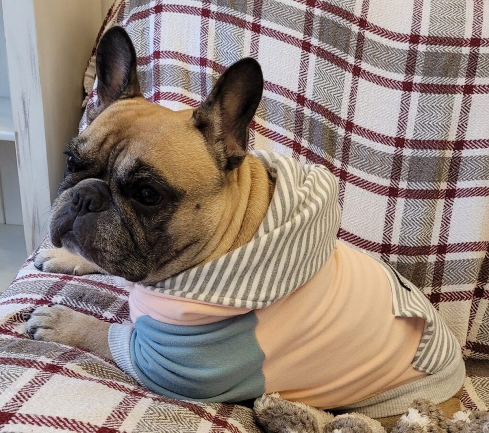
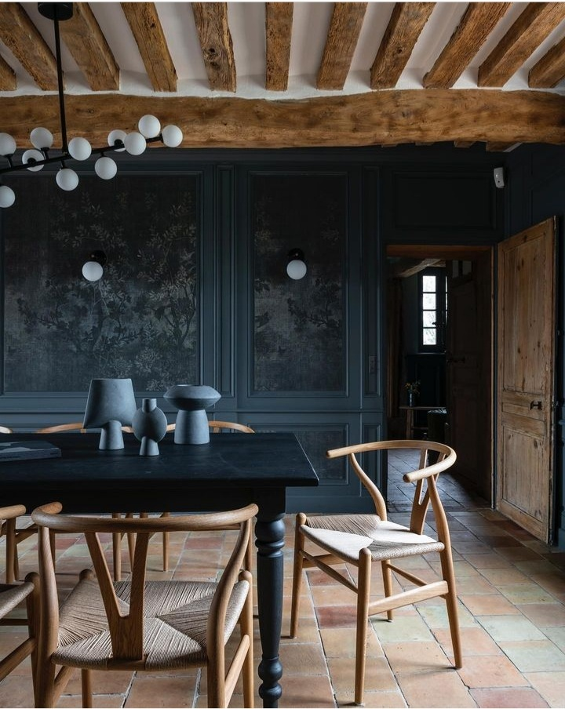

+++
date = 2022-11-26
title = "Ziua 319"
description = "Mă simt propriul meu balsam, simt la un nivel de profunzime că singurul lucru pe care trebe să-l fac în viața asta a mea este doar să show up. Să fac act de prezență, la propriu și la cel mai conștient mod posibil, pentru mine. Că dacă fac asta, pentru mine, aduc la pachet și percepția doar pe clipă. Și-n clipa asta pe care-o trec, oricât m-ar împinge înșelătoarea mea minte apocaliptică, nu încape mai mult decât pot să duc."
authors = ["Biannca Locatelli"]
[taxonomies]
tags = []
[extra]
math = false
diagram = false
image = "images/ziua-319.jpg"
+++
---

Blândă mi-a fost și noaptea ce m-a străbătut, că nu mi-a lăsat nici semne de întrebare prin minte, nici strângeri de oboseală prin carne.

Am o mare îngăduință în mine, mă simt propriul meu balsam, simt la un nivel de profunzime că singurul lucru pe care trebe să-l fac în viața asta a mea este doar să show up. Să apar. Să fac act de prezență, la propriu și la cel mai conștient mod posibil, pentru mine. Că dacă fac asta, pentru mine, aduc la pachet și percepția doar pe clipă, că e singura care mi se află sub microscop acum, nu încap îngrămădite-n ea nici toate clipele din trecut, mai dure sau mai nebune, nici alea din viitor, imaginate fain, dar încă nenăscute. Și-n clipa asta pe care-o trec, oricât m-ar împinge înșelătoarea mea minte apocaliptică, nu încape mai mult decât pot să duc. Dar, la cercetare mai atentă, încap și mici sclipiri de bine, pe care de multe ori îl sar cu privirea, care vin fix să contrabalanseze "dusul" ăla ce-mi sare-n ochi din prima.

Am auzit de curând că ființei umane, care e programată din fabrică, pentru supraviețuire, să se focuseze pe ce se poate întâmpla rău, îi trebe o focusare de 6 ori mai intensă ca să conceapă și priceapă substanța unui gând bun. Evident, cu ghilimelele de rigoare la bun și rău. Habar n-am dacă e corect sau nu, dar zău că mă mângâie pe glandă să știu că nu-s defectă doar pentru că mintea mi se duce direct și săgeată către răul imaginabil, îmi face bine să știu că dacă mă prind de asta de la prima plecare inconștientă, mai am dreptul la încă cinci încercări conștiente să găsesc și gândul-lumină, ce-i este, negreșit, frate gândului-întuneric.

***

Purtată pe brațele unei treziri liniștite, îmi dau voie să-mi fiu blândă și să mă cuprind cu toate ale mele. În indulgența ce mi-o trimit, am brusc, de nicăieri apărută, conștientizarea totală a faptului că mintea, inima și corpul îmi sunt unelte, dar și parteneri de drum. Mă inundă pur și simplu, fix așa cum e expresia, un mare drag pentru corpul ce mi l-am hărtănit prin muncă multă și grea, prin țigări și cafele și mâncare proastă, prin nopți nedormite, pentru mintea mea, așa-numita coțofană, pe care mereu am făcut-o și-o fac de râs când îmi dă la râșnit apoteoticele scenarii dar tot ea, draga de ea, e un burete de informații pe care le stochează și mi le dă când i le cer și are ea grijă ca mie să-mi fie bine, să mă țin în viață, și pentru inima mea pe care am copleșit-o, în viețile de dinaintea acestei vieți, în alea în care abia mă târam, cu imense suferințe, cu dureri de suflet din care credeam că n-o să mai ies vie, cu întunecimi atât de abisale cum numai cineva, tot ca mine "all or nothing", le putea înțelege. Tocmai pe acești trei prieteni ai mei, pe viață, nu i-am luat niciodată în calculul bogăției mele, nu i-am prețuit cu adevărat, nu i-am înțeles și nu mi i-am iubit. Dimineața asta, pe lângă vederea acestui mare adevăr, mi-a adus și o iubire moale și caldă și plină pentru ei: nu m-au lăsat niciodată baltă și au fost acolo, pentru mine, și când le-am dat rahat, adică de cele mai multe ori, și când le-am dat ambrozie. Wow!

La cât mai multe conștientizări d-astea! Și să dea Universul ăsta fabulos să nu le dosesc repede în sertarul uitărilor.

***

Mama e bine, o văd pe camera de supraveghere cum stă pe tabletă, cu Sassy lipită de ea, cu televizorul pornit. Deși am vrut la un moment dat să îi scot televizorul din cameră, în timp am realizat că nici nu-l aude de cele mai multe ori, doar că are nevoie, îi este familiar așa, să aibă un zumzăit în cameră. Așa eram și eu și acum mi se pare că liniștea are cele mai frumoase sunete. Nu vreau să-i stric feng shui-ul mamei, așa că, până la proba contrarie, televizorul rămâne pe poziții.

***

Mă delectez cu apa caldă bine și las timp și spațiu în acest gest. Până acum îmi puneam apa în halbă și o sorbeam de cele mai multe ori făcând și smoothie-ul în același interval. Haplea, să îngrămădesc cât mai multe într-o clipă dar în viteza asta, uit să fiu acolo în moment la secvența de băut apa. Lumea asta modernă cu multitasking-ul ei presupus, ne acaparează gândul și ne încolțește-n minte posibilitatea că poți face nu unul, două, ci nouă lucruri în același timp. Nope, azi doar îmi beau apa, doar mă uit la ea și prin ea și-mi dau seama că în curând va deveni parte din corpul meu, că va fi absorbită cu sete de cel mai mare și mai mocofan, cel mai recent decretat la rang înalt de prieten al meu, corpul.

Ca să mituiesc spre iertare, mă delectez și cu imagini faine, ce-mi nasc bucurii în interior și le împac, 2 în 1, și pe minte și pe inimă. Mi se pare că am descoperit lumea, dintr-odată mi s-a dat un văl de ceață de pe ochi și nicicând nu am putut vedea mai clar coexistența asta care sunt, interdependența asta care mă formează. Mi-a luat 47 de ani să mă întorc la adevărul ăsta intrinsec al oricărei ființe umane. Decât deloc, bun și așa.

***

În spatele întregii scene de teatru la care am participat eu și ceilalți trei actori în dimineața asta, îmi bătea gongul, curiozitatea: oare ce se mai întâmplă cu postarea strângerii de fonduri pentru Sett, de pe grupul de bulldogei? Recunosc că sunt extrem de curioasă, dar nu pentru că mi s-ar fi strecurat vreo îndoială pe vreundeva, spațiul speranței mele este etanș, n-are fisuri, ci pentru că acțiunea asta îmi dă noi și noi trăiri. Sunt sugativă de experiențe, mai ales d-astea bunuțe, și vreau să văd cu ce mă mai îmbogățesc și azi.

Lumea donează! Nu știu cât, că n-am acces la sume, dar știu c-o fac, pentru că postează. Dacă la început am gândit că părinții de bulldogei vor fi darnici pentru că, involuntar, se pun ei înșiși în postura părinților lui Sett și nu e deloc roz, azi am înțeles și partea aia ne-egoistă, partea aia curată, partea aia de suflet bun care dă pentru că vrea să ajute. Mulți dintre părinții de buldogei nu vor avea vreodată nevoie de sprijin financiar, așa că donațiile le fac din inimă darnică și nimic mai mult. Ce mă bucur c-am văzut și perspectiva asta, ce mă bucur c-am validat în mine umanitatea lor.

Ca să închid frumos, cel mai frumos posibil, bucla asta de buldogei, tocmai ce-am primit de la copilă poza cu Măyuca noastră, venită de la plimbare. Iubesc tare mult ființa asta cu față supărată mereu!

  

Maya

***

Despletesc din mine fire de blândețe cât s-o îmbrățișeze și pe mama, să-i îngădui să fie cum poate ea să fie și cum nu poate ea să fie și o aduc la micul dejun. Chiar dacă refuză și aia, și ailaltă, până la urmă acceptă ceva, în crăpătura mică rămasă deschisă în mintea și apetitul ei și se bucură. Iar eu, mă bucur de bucuria ei, nu mă mai strofoc de respingere. Dac-aș avea mereu deschiderea asta…

***

Mă port cu mine ca cu un bibelou, nu vreau să-mi sparg descoperirea genială a dimineții și mă apuc de curățenie într-un ritm nou, molcom. Pentru că imaginația e cel mai la îndemână bilet de evadare, îmi văd mișcările ca fiind line ca o balerină, îmi văd începuturile începuturi, negrăbite spre finaluri, e drept că nu-i chiar cu savurare făcutul de curat, dar nu mai e nici cu graba de bifare. Puiul ăsta de relație pe care o cresc cu mine, mă face să-mi fiu mai atentă, mai indulgentă, mai grijulie, doar am brusc încă trei de care trebe să am grijă. În acest moment, de curățenie în casa-casă dar și de curățenie în esența mea, simt că-mi iubesc viața. Așa simplă, casnică sau complexă, transformatoare.

***

Poate c-am lăsat, prin dereticarea și trecerea mea pe acolo, în fiecare bucată de spațiu din casă semințe de liniște, de calm, de pace, că acum mă simt îmbrățișată și împresurată de ele.

Au făcut scut între mine și potențiale zgârieturi generate de o mamă absentă la prânz, sunt tampon între mine, aia iute la a judeca și mine, aia care poate, dacă vrea, să înțeleagă. Parcurg încetișor cu mama drumul pe care l-am făcut și de dimineață, când refuză aproape tot, când, nimic din ce-i pun pe masă, nu o încântă suficient de mult încât doar să guste. Eu am convingerea fermă că dac-o fac să pună pe limbă un strop din mâncare, papilele o să-și aducă aminte că le place și-o să-i contrazică mintea care refuză și respinge pentru că nu-și mai aduce aminte. Dar n-o forțez, doar trimit în eterul dintre noi convingerea asta și de o avea ea puterea să-i înmoaie mintea, bine. De nu, iarăși bine. De murit de foame, nu va muri, asta e sigur.

***

Deși pe undeva, printr-un pliu de-al meu, cred că am avut și eu perspectiva asta dar n-am scos-o la lumină, una dintre cele mai mișto și frumoase femei, ce mi-e și prietenă, m-a forțat să privesc altfel demența mamei.

_"Ce oportunitate ai tu să "let go" în experiența asta. Și e o mare șansă că poți să o faci prin boala cuiva și nu boala ta. Poate ăsta e sacrificiul pe care îl face mama ta pentru tine, îți dă șansa să te "vindeci" prin boala ei și nu a ta. Am auzit odată ceva ce mi-a rămas veșnic în minte. Cineva a fost întrebat care e lecția cea mai valoroasă pe care a primit-o de la tatăl lui iar răspunsul a fost: "nimic, n-am văzut sau învățat nimic de valoare de la tata. A avut o viață plină de frici și de frustrări, nu a fost niciodată liber sau fericit și a și murit la fel, cu frică și frustrare". Iar răspunsul ce a venit a fost: "ăsta e sacrificiul tatălui tău, ți-a arătat, cu prețul vieții lui, cum să nu trăiești și cum să nu mori""_

Well, asta e o schimbare de perspectivă, e moneda întoarsă invers. Nu cred că există cineva, din afară, care să ne spună 100% care e adevărul, dar știu, după ani de julire, că atunci când ai mai multe puncte din care privești același lucru, ești mai bogat. Câteodată, cu o liniște în suflet, alteori cu o înțelegere că nimic nu vine special să mă faulteze pe mine, de multe ori cu lumină. Și nu există doar un singur adevăr, iar singura persoană care-l poate valida, în toate fațetele lui, sunt doar eu.

***

Doamne, dar ce zi tare bună am avut! Trec cu privirea minții peste ea, încercând involuntar să facă un copy azi pentru un paste mâine și sunt recunoascătoare pentru:
1. Ochii limpezi ce-au văzut o mică parte din esențialul a ceea ce sunt!
2. Molcomul care m-a conținut toată ziua!
3. Femeia asta care mă îmbogățește constant!

Clipa de fain este:

  

Isabelle and Mathieu Lott architects
