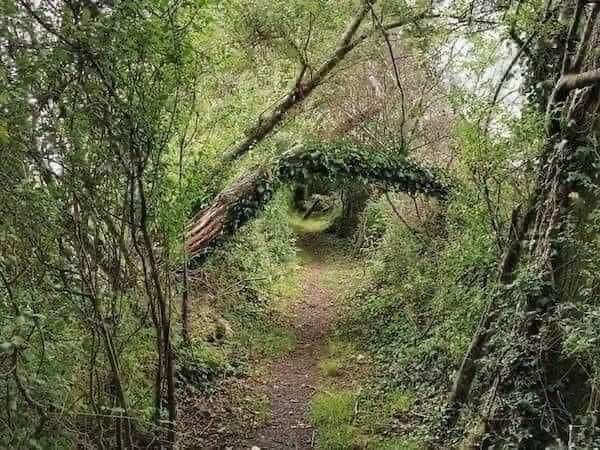

+++
date = 2022-11-28
title = "Ziua 321"
description = "Îi strecor printre dumicați și anunțul că voi pleca un pic, ridică ochii întrebători la mine, îi răspund privirii, care-i face loc fricii: mama e atât de lipită de mine, într-un mod greu de înțeles și de explicat, că atunci când află că plec și nu sunt în casă cu ea, ceva inconfortabil se întâmplă în spațiul ei interior."
authors = ["Biannca Locatelli"]
[taxonomies]
tags = []
[extra]
math = false
diagram = false
image = "images/ziua-321.jpg"
+++
---

Pântecul nopții e cel mai mișto timp de introspecție, dacă ai nevoie de el. E în ora 4 noaptea ceva magic, coace în ea ora asta clipe pline de sensuri și înțelesuri și te lasă gentil să le descarci pe toate, după cum ți-e voința și putirința.

Mi-am propus aseară, când mi-am lăsat papucii-n afara somnului, să mă întâlnesc cu ea, fără alarmă, natural, cum mi se mai întâmplă când decid că trebe. Acum trebe. Am nevoie de un timp doar al meu, fără nicio firimitură din exterior, clar, limpede, în care să fac un spațiu de pace și de reușită în mine, în care să bag pe îndelete multă compasiune și convingere că totul va fi bine, în ce mi-am propus eu cu Sett. În același timp, cu pulberi de minuni suspendate, îmi torn și recunoștințele într-un Univers cald și molcuț, cam cum e și atmosfera din cameră. Toate astea având un trupușor de felină vibrând rotund sub palma dreaptă. Cam cum poate fi mai fain de-atât?

Mai dau o fugă portocalie pe tărâmul din spatele ochilor închiși, convinsă până-n prăselele sufletului meu că totul va fi bine. Nu e nicio fisură pe nicăieri, care să lase loc vreunei îndoieli să se strecoare perfid. Pur și simplu nu conțin în mine decât varianta optimă și atât.

***

Pecetluiesc rămășagul ăsta făcut la ceas de taină cu apa caldă, îmbibată cu zeama de la o juma' de lămâie, îmi fac și smoothie-ul dar nu și ceaiul. O să plec la drum după Sett și mă știu, nu prea o să-mi ardă de opriri.

Timpul meu liber îl dau tot unui timp, de meditație, de permitere a mea, pentru mine, să ies din realitatea asta care parcă s-a precipitat brusc cu o nouă grijă, pentru o altă viață, și să mă duc acolo în interior, în tărâmul ăla care nu poate fi atins, zdruncinat sau întinat de ceva, zona aia din mine unde sălășluiește eternitatea nemișcată și totuși atât de vie. Am nevoie de gura asta de conștiință curată pentru zilele care vin.

***

Urc să-i dau Euthyrox-ul mamei, să deretic rapid la ele, să iau pulsul vieții care se trăiește în felul ăsta ciudat în camera lor, de uitare de sine. Mama pare bine, e clar că e trezită și ea de ceva timp, că a apucat molcomul specific abia trezirii să se risipească, are parcă și o țâră de agerime și-n privire dar și-n vorbă. Foarte bine, chiar dacă eu nu o să fiu acasă să mă bucur de prezența ei în ea, mă bucur pentru ea. De când mi-am înțeles eu mie compania și mi-am apreciat ființa, cât de cât, cred eu că așa trebe să se simtă la toți, cu atât mai mult la ea, la care venirea în simțit e din ce în ce mai rară.

Jumătatea aia de oră între pastilă și mic dejun se fușterește instant, eu nu înțeleg unde fug zilele de luni până duminică, d-apăi o bucățică de juma' de oră, așa că urc s-o aduc la micul dejun ce o așteaptă pe masă, fără drept de veto. Am pus pe masă tot ce se poate califica la a fi mâncat dimineața, să aibă alegeri sau măcar impresia unei alegeri. Nu știu care dintre ele contează mai mult în ea.

Îi strecor printre dumicați și anunțul că voi pleca un pic, ridică ochii întrebători la mine, îi răspund privirii, care-i face loc fricii: mama e atât de lipită de mine, într-un mod greu de înțeles și de explicat, că atunci când află că plec și nu sunt în casă cu ea, ceva inconfortabil se întâmplă în spațiul ei interior. Prind repede din aer nuanța asta de teamă și o liniștesc, cât pot eu de calmă și caldă în voce, că nici nu-și va da seama că plec, atât de repede mă întorc. Mint și știu că mint. Dar vreau să-i liniștesc acolo, în ea, niște ape repezi, chiar dacă am eu bănuiala că nu va adăsta prea mult în memoria ei informația asta nouă. Hipocampusul ei o va faulta rapid.

***

Sunt pe drum spre Ploiești, către Sett, și sunt inundată de o stare de bun și de bine. Nu e ceva ce forțez să simt, ci mai degrabă îmi deschid receptorii să primesc ce e. Bun așa.

Sett m-a recunoscut și am plecat spre București înapoi destul de repede, dar de data asta e mai agitat la drum. Plânge, scâncește, mă și ceartă cu lătrături scurte dar puternice până când, învins de monotonia mersului constant în viteză, adoarme. M-a tulburat puțin starea lui, dar trag aer adânc în piept și ignor. Mergem înainte.

Încă o planetă aliniată m-ajută să prind primul loc pe lista consultațiilor la primul cabinet de cardiologie veterinară din țară, în București, așa că de pe DN mă avânt direct spre centrul capitalei, plină până la refuz de mașini, de toate culorile și mărimile, din toate direcțiile. Fie toată lumea are azi treabă în centrul Bucureștiului, fie eu, exilată de bună voie în afara lui, am uitat cum e să trăiești pe fast forward.

Ajungem la cabinet dar înainte de toate, dau o tură cu botosul supărat să ude toți boscheții și abia apoi intrăm, evitând astfel alte incidente rușinoase în interior.

***

Eu n-am mai întâlnit așa bulldogel cuminte în toată viața mea. A stat acolo, pe masa de inox care, din spusele părinților lui, i-a dat întotdeauna frisoane, aproape 40 de minute și nu a zis nici pâs. E drept că i-am ținut capul pe braț și l-am mângâiat non-stop, i-am șoptit la urechile clăpăuge cât e de minunat, l-am pupat, și uite așa, am scăpat și bifat consultul care-i dă undă verde pentru operație: inimioara lui e în parametrii normali și va suporta anestezia. Încă o victorie repurtată, pusă acolo în șirul ăla de aliniere planete.

***

Luăm din nou în piept traficul infernal în drumul spre casă, gata pe ziua de azi, mâine e operația. Toate "vorbele" nespuse, suprimate de mai devreme de pe masa de consult, se prăvălesc spre mine de pe bancheta din spate, acum mă ceartă, acum mă urlă, dar îi dau toată libertatea s-o facă, la cât de cumincior a fost. Are dreptate, indiferent ce-mi zice, pe limba lui. Eu, pe limba mea, doar apuc să-i spun, printre pauzele în care-și încarcă mitraliera de lătrături, că mi-e drag de el, că poate să mă țină-ntr-un concert până mâine, că mie tot drag îmi e și că până acum, pare că și Universului îi e drag de el.

***

Acasă, facem turul de onoare curții, să descărcăm vezici și intestine, să facem mișcare și să mai scuturăm în aer energia asta atât de caracteristică în spumoșii bulldogei.

Îl privesc și-l strunesc, că nu-i nevoie de alergat nebunesc taman acum, când mâine e operația pe coloană și mi se pare că trăiesc un vis incredibil: repeziciunea cu care s-au derulat toate, de la clipa când am citit comentariul tatălui lui Sett și implicit neputința, până la reușita strângerii de fonduri și mâine operația, mi se pare că m-am calibrat, dar zău dacă am habar cum, pe direcția aia în care merge Universul iar el, drăgăstos, ca un bunic blând, m-a luat sub ocrotirea lui pe drumul ăsta cu Sett. Pur și simplu am zburat prin acțiuni, bani, emoții, medici, oameni, drumuri.

Dacă nu am văzut asta limpede, mi-a arătat viața acum, că avem două variante prin care putem să facem lucrurile: cu mâinile sau cu gândul sau cu amândouă. Ambele variante vin la pachet din momentul în care pășești pe lumea asta, îți sunt daruri naturale, cu care te naști și pe care le crești, odată cu tine. În vâltoarea asta a vieții, în care fizicalitatea a preluat mare parte din mințile oamenilor, cumva s-a pierdut și diluat cunoștința despre puterea gândului și de cele mai multe ori ne bazăm exclusiv pe ce facem cu mâinile noastre. Am uitat varianta a doua, care, cred eu cu tărie, că a fost de fapt primordială. Iar asta e înmiit mai puternică decât cealaltă.

Gândul meu mic, născut spontan la o citire de-un comentariu, a mobilizat o armată de oameni și a aliniat programe, agende, portofele, inimi. Gândul ăsta mic a crescut o acțiune atât de mare că a "înghițit" în ea suflete ce n-au nicio legătură între ele, cu un singur liant: Sett.

Nu mai am niciun dubiu că un gând, oricât de mic, de neînsemnat ar părea, poate schimba lumea. Când se pune pe aceeași direcție din care bate vântul dătător de viață, devine indestructibil și are o putere uriașă. Putere, nu forță. Mică mare diferență de nuanță.

***

Înfofolesc blănosul în păturică moale, îl țin aproape de mine, cum deja îi cunosc preferința, îl alint, îl mângâi și-i înțeleg și plânsul mic, din când în când, și teama de locuri străine și necunoscute, dar îl adorm cu vorbe dulci. After all, doar înfățișarea ne deosebește, noi, toate ființele, de fapt nu rezistăm dulceții energiei care vine spre noi de la o altă ființă.

***

Sunt obosită dar mă simt extraordinar de plină, aproape că nici nu mă pot cuprinde la cât de mare mă percep. Mare parte din spațiu ăsta e ocupat de recunoștință, din care rup trei bucățele pentru:
1. Miez superb de noapte!
2. Inimioara asta "verde" a lui Sett!
3. IUBIRE, indiferent de forma pe care o îmbracă!

Și frumos mi-a fost:

  

