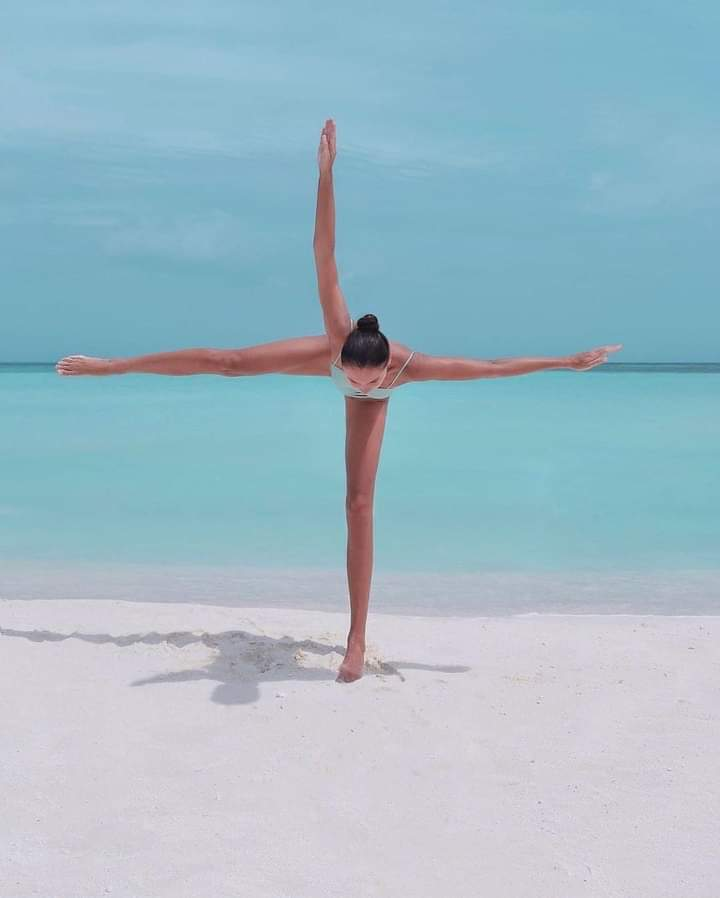

+++
date = 2022-11-29
title = "Ziua 322"
description = "Ce-am împărțit noi doi, în seara asta, în drumul dinspre cabinet spre clinica de recuperare, rămâne doar între noi doi, pentru că nu se poate așeza în niciun cuvânt, nicio alăturare de litere nu poate comprima trăirea mea imensă și încrederea lui colosală în mine. Asta intră la capitolul intimități. D-alea de inimă, adânci."
authors = ["Biannca Locatelli"]
[taxonomies]
tags = []
[extra]
math = false
diagram = false
image = "images/ziua-322.jpg"
+++
---

Știam și eram pregătită sufletește pentru o noapte albă. Sau albă cu negru, fix așa cum are blănița Settuț, noutatea vieții mele. Cu puiul ăsta dislocat din mediul lui, e dificil să dormi, pentru că e un lipicios și vrea să doarmă cu o parte a corpului lui, oricare ar fi aia, pe o parte a corpului tău, oricare ar fi aia. În cea mai mare parte a nopții, sau cel puțin în bucățile de timp în care a dormit, a stat cu capul pe picioarele mele sau pe șold sau pe burtă, așa că mi-a fost aproape imposibil să strecor ceva somn printre gene, în pozițiile alea rigide, fără strop de mișcare. Plus că el n-are voie să sară din pat și trebuia să-i intuiesc intenția și să-l cobor pe brațe. Iar de acolo, să-l scot, tot în brațe, afară la piș, cât mai des posibil.

Deși a fost greu și obositor, ieșirile astea în toi de noapte, deasă, neagră, uimitor de tăcută, au avut un soi de magie, mi-au rămas pe retina sufletului imprimate, să le scot ori de câte ori m-o mai încerca vreo teamă de ieșit afară, în noapte. Are cățelandrul ăsta în el atâta curaj și curiozitate, că la ceas extrem de mic de noapte, mi-a fost mentor motivațional. Nu mai spun că, așa cum arată RMN-ul, ar trebui să chițăie de dureri, iar el e într-o flendureală de te duce cu gândul la veselie și nu la suferință. Lecții la tot pasul.

***

Oricât de sugativă sunt eu la experiențe și descoperirea diamantelor din ele, recunosc că ora 5 dimineața a venit ca o eliberare. M-am dat la o parte pe mine, cu ale mele ritualuri și i-am dedicat "trezirea" lui: l-am drăgălit, și-a lăsat burtica dezvelită să-l mângâi, l-am zmotocit de fălcuțe, scărpinat de botic și de cap și de tot. E topit, s-a împrăștiat moale pe pat și soarbe, aproape fără să respire, atenția și iubirea și drăgăleala. Pe care i le dau din belșug, îl așteaptă o zi grea și vreau să i le înfășor pe toate într-o fascie imaginară, să-i fie scut.

Îl iau în brațe și mergem cătinel spre bucătărie, să-mi încălzesc apa și să-mi fac smoothie-ul. Revenim în living unde am senzația acută că geloasa Spiky ne urmărește cu privirea de dincolo de bariera pe care am pus-o între living și treptele spre etaj, să-i limitez accesul lui Sett spre scările care numa' bine nu i-ar face la o coloană și așa suprasolicitată deja. Mi-e dor de pufuletul meu pisicos și cred că și ei de mine sau măcar de mângâierile mele care-i încep, invariabil, diminețile, dar mă fac că nu știu, să nu-l apuce pe Sett vreo agitație și să trezim toată casa.

Îmi sorb apa în poziție de lotus, cu Sett înghesuit în lăcașul mic lăsat de picioarele mele îndoite, cât mai aproape de mine. În clipa asta, pe lângă apa asta blândă ce-mi alunecă în trup, curge prin mine și-aproape c-o simt visceral, o căldură inimoasă și-un drag pur pentru ființa asta cuminte ce-mi stă în poală. Îi sunt răspunzătoare într-un fel pe care doar eu îl simt acum, iar felul ăsta n-are nicio legătură cu realitatea asta palpabilă. Acolo unde alte ființe umane au stricat o rasă de câini și-au aruncat în lume și-n viețile lor predispoziții oribile, Universul m-a trimis să rectific un strop, să îndrept o țâră un păcat și-o coloană. Și-n procesul ăsta, să-nvăț ce înseamnă să primești o mână întinsă a ajutor.

Deși sunt plină de senzații, strecor în mine și smoothie-ul și, cu Sett lipit de picioare, îmi fac și-o cafea tare, să mă țină în țâțâni toată ziua. Înapoi la o nouă rundă de bibileală, nu se satură să le primească iar eu nu mă îndur să nu i le dau.

Doar așa, cu titlu informativ, caut pe net să pricep, high level, cu ce se mănâncă operația asta pe coloană și mă strâng în mine. Off, măi pui mic…

***

Ca să nu fac revoluție la parter, îi pregătesc mamei un sendviș cald și nelipsitul lapte bătut și i le duc sus. Stau cu ea, îi povestesc despre Sett, îi spun că azi îl duc la operație, dar din toate astea ale mele nu culege decât ce o interesează: Plec? Și ce face ea singură? Nu cred că o să-mi iasă din minte, vreodată în viața asta a mea, vorbele psihiatrului ei: comportamentele ascunse bine sub fustele controlului mental, o dată ăsta dispărut, ies ca ciupercile după ploaie la suprafață. Iar la mama, tot ce m-a durut toată viața mea cu ea a fost egoismul, ăsta plutește acum ca o spurcăciune. Îmi înghit revolta interioară inutilă și o linistesc, ca și ieri: nici nu o să te prinzi că m-am și întors. _Da, ai dreptate_, conchide ea cuminte.

***

Gata, am pornit spre clinica unde va fi operat. E liniștit, pe bancheta din spate, iar eu îi vorbesc tot drumul și îi promit că totul va fi bine, că el oricum va dormi, că medicul va face minuni pe coloana lui mică, că se va trezi și că, deși va fi o perioadă mai cu greu și mai cu restricții, după, va fi ca nou.

Vorbesc și plâng, simt o mare responsabilitate cum mă apasă pe umeri și mă înfige mai adânc în scaunul de mașină dar el stă cumincior, într-un trafic infernal, pe o ploaie măruntă, care a scos toate mașinile din București pe străzi.

La cabinet au început pregătirile pentru operație și eu nu mai pot sta cu el. Plânsul lui însă mă urmărește și mă furnică prin tot corpul. Universule, dacă există cineva undeva acolo, nevăzut dar preacurtat, acum e momentul să își arate puterea!

Prea s-au aliniat toate, ca fix operația să fie nod. N-are cum altfel, în mine nu încape o altă variantă, deși simt cum dă din coate și se înghesuie să intre și gândul apocaliptic.

Sett va fi bine.

***

Plec spre casă și iau în piept același trafic infernal. Giiiz, am uitat cum e să trăiești în București!

Mă opresc scurt și la trei cumpărături, cu telefonul transferat de pe bord pe ochelari, pentru că mama e singură în casă. Ea nu știe, că n-am vrut s-o fac conștientă de asta, dar eu știu și sunt într-o priză și-o fugă care-mi roade o țâră stomacul.

Sunt acasă iar așteptarea e grea. Operația ar trebui să dureze 1,5 - 2 ore, dar au cam trecut și eu n-am nicio veste. Mă apuc de curățenie, mai mult din nevoia de a consuma în vreun fel energia care mă strânge de gât și timpul care se scurge extrem de încet.

La 2 fără 3 minute mi-a scris tatăl lui Sett. El apare pe fișă și pe el l-au anunțat.

Operația a decurs bine, Sett se trezește încet, dar sigur, iar eu tocmai ce-am scăpat de o tonă de pe suflet. Respirația mi-e mai lină, corpul mai drept. Mulțamul ăla de-l tot zic eu e necuprinzător pentru ce simt acum. Sunt recunoscătoare imens pentru șuvoiul de viață care curge prin mine, prin orice e viu în jur și care a ales să curgă în continuare și prin Sett. Nu am cuvinte. Doar viață și emoții. Intense.

***

O aduc pe mama la prânz și jur că mi-ar trebui greutăți în papuci să mă țină pe podea. Îi povestesc mamei despre Sett și nu-mi mai încap în piele. Ea nu sesizează fericirea mea sau nu o impresionează și nu înțelege ce legătură am eu cu Sett. _Care Sett?_ Îi povestesc cu răbdare și cu disponibilitate, că acum mă ține sufletul s-o fac, cum am citit eu comentariul tatălui lui Sett și am ales să-i scriu în privat, și cum, după aia, lucrurile s-au derulat cu o repeziciune și o împletire inimaginabilă. Mă ascultă, dar nu înțelege. _Cum s-au strâns bani, cine i-a strâns? Atâția bani?!_ Da, mamă, știu, e greu de crezut și pentru mine care, zic eu, am mințile încă acasă.

_"Da, bine"_ îmi închide fără drept de continuare efervescența și se întoarce la ce e important pentru ea acum: ciorba, pulpa de pui cu salată, iaurtul cu fructe.

***

La 17 termin toată curățenia și mă așez un strop. Îmi aud bătăile inimii în urechi și realizez că am o mare liniște în mine. Am doar o oră liberă la dispoziție și-l ascult pe Gabor Mate, When your body says no. A fost cea mai bună alegere pe care puteam s-o fac.

Are undeva, pe la începutul video-ului, o parte care mi s-a părut genială: câteva necrologuri selectate pe care le citește și din care, dacă ai ochii și urechile spălate să auzi ce trebe, te cutremuri cum noi oamenii, elogiem, cu inconștiență nonșalantă, la alți oameni, fix lucrurile care până la urmă le pun capac. Al sicriului. Acum, urmărindu-l pe Gabor, m-a amuzat la prima mână, dar cu cât îl ascult mai mult, cu atât îmi dau seama cât de aiurea trăim cu toții sau marea majoritate.

Probabil că am auzit, într-o altă realitate, acum 7 ani o voce care spunea: _Și-a dedicat viața celorlalți, tot timpul să le facă pe toate, mereu alții i-au fost cap de listă blablabla…_ și vocea asta mi-a dat un burnout fatal. CE BINE!

***

Fug la cabinet să îl iau de acolo pe Sett, să-l duc la clinica de recuperare. La ora 18 traficul e mai infernal decât era dimineață, am făcut "decât" o oră jumate până la Eroilor.

Diferența față de alte dăți a fost dată de faptul că sunt zen total în mine, am o împăcare și o indulgență la cote de Everest. Și de faptul că am realizat cum experiența cu Sett m-a forțat să-mi depășesc niște frici și autolimitări tâmpite, pe care le car cu mine ca pe niște cartofi stricați și împuțiți.

Poate pentru că atunci când am învățat să conduc mașina, s-a urlat și strigat la mine în toate felurile, poate pentru că, gravidă în luna a 7-a, am avut un accident urât, habar n-am de ce, pe mine mereu m-a stresat, într-un fel sau altul, condusul. Conduc bine, prudent dar bine, însă, deși știu și văd asta, nu se corelează văzutul cu simțitul. Pentru mine condusul noaptea, pe vreme ploioasă, e cireașa de pe tort, pentru că port și ochelari și toate luminile mă agresează vizual. Well, cu Sett, am trecut prin toate. Și mi le-am văzut, mirosit, perceput și învins pe toate.

Și m-am mai prins și de faptul că eu eram o birjăreasă notorie la volan, în principal pentru că mă simțeam prost și proastă. Reacționam și îi făceam cu ou și cu oțet pe alții, acolo, în afara mea, în trafic, pentru că, în mine, aveam impresia că ei mă judecă, că mă consideră șofer prost. Aiurea! Nimănui nu-i pasă.

Traversarea orașului cu puiul operat a fost cea mai grea experiență din ultima perioadă. Am plâns cu scâncetele lui, i-am cântat cu lacrimi în voce, am condus cu o mână pe volan și cu cealaltă pe bancheta din spate, să-l ating, să-l mângâi, să simtă că deși îl doare, sunt acolo.

Ce-am împărțit noi doi, în seara asta, în drumul dinspre cabinet spre clinica de recuperare, rămâne doar între noi doi, pentru că nu se poate așeza în niciun cuvânt, nicio alăturare de litere nu poate comprima trăirea mea imensă și încrederea lui colosală în mine. Asta intră la capitolul intimități. D-alea de inimă, adânci.

Dacă n-aș știi că-i personal calificat la clinica asta, nu l-aș lăsa aici. Sunt multe animăluțe, de toate soiurile, fiecare țipă, urlă, plânge, chițăie, e o atmosferă care te înțeapă-n suflet și-ai vrea să ai baghetă magică, să-i alini pe toți și pe fiecare în parte. Mă îmbrac în lașitate și-o tulesc repede, că nu mă țin baierile ochilor și mă inundă lacrimile.

***

La început am crezut că-i o lacrimă rămasă stingheră pe ochiul stâng, care mi se plimbă atârgățată de retină. Apoi, când căldura din mașină mi-a uscat fața dar "lacrima" e tot acolo, m-am prins că mi-a apărut ceva la ochi. Lasă, o să treacă, toate trec, sunt obosită.

Așa va trece și răceala mamei, împrumutată de la noi, care-o face să tușească și s-o usture-n gât. Să nu cumva să mă odihnesc, încep să-i administrez, din 6 în 6 ore, medicamente pentru răceală. Câteodată, Universul ăsta are un umor negru. Sau sadic.

***

Ignorând finalul, am avut o zi trepidantă și plină cu de toate. O trec cu ochii minți și-mi pun farul pe clipele frumoase, în toate nuanțele posibile de frumos. Sunt recunoscătoare pentru:
1. O noapte plină de iubire!
2. Succesul operației!
3. Nebunia asta superbă a vieții!

Frumosul din zi:

  

 

 

  

    <a href="/blog/ziua-321/">Postarea anterioară</a>
  

  

    <a href="/blog/ziua-323/">Postarea următoare</a>
  

