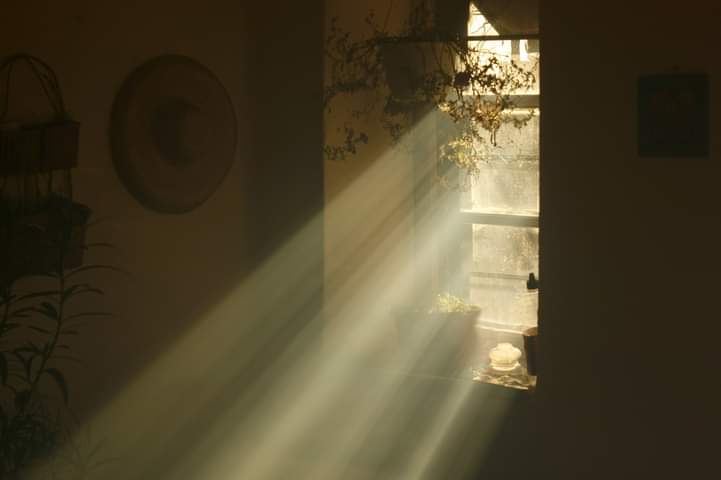

+++
date = 2022-11-30
title = "Ziua 323"
description = "Ca o deschidere de debara unde-au fost înghesuite baloane, au început să mă inunde părerile și gândurile și acceptările și felicitările la propria-mi adresă. Mi-am mulțumit pentru fiecare decizie că m-a adus aici. Mi-am apreciat fiecare inconștiență că m-a adus aici, la o cupă mai mare de prezență. Mi-am mângâiat toate naivitățile că m-au adus aici, cu inimă curată capabilă să văd inima curată. Și mi-am acceptat toate prostiile, că fără ele nu m-aș fi lovit și spart sau nu s-ar fi împiedicat alții din jurul meu, ce nu trebuiau să fie acolo."
authors = ["Biannca Locatelli"]
[taxonomies]
tags = []
[extra]
math = false
diagram = false
image = "images/ziua-323.png"
+++
---

La 3 noaptea când a sunat alarma telefonului, m-am trezit atât de brusc și-am și sărit în picioare instant, că al meu corp astral n-a apucat să-mi nimerească corpul fizic și până la ușă, efectiv m-am lovit de toți pereții. Pur și simplu, nu-mi pot coordona mișcările cu creierul, e ca și cum încerc să mănânc cu mâna altuia. Fac pașii dintr-o nevoie naturală, intrinsecă, impregnată în memoria materiei, ordonată de mușchi și de observația că altfel mă duc în cap. E o degringoladă majoră în mine și mișcările mele, iar eu trebe să ajung la mama, s-o trezesc fără s-o sperii, să-i dau pastila, să mă retrag elegant și să adorm la loc. Mă simt ca elefantul pus să facă bijuterii din mărgeluțe și, pe holul care desparte dormitorul nostru de camera ei, mă opresc să-i dau șansa corpului meu să-și pună toate straturile necesare, să le alinieze, ca să pot funcționa normal, cât se poate de normal la ora 3 noaptea. De fapt dimineața.

Ce n-a reușit pauza mică dintre camere să facă, i-a ieșit din plin mirosului trăznet de la mama din cameră, care aproape că m-a sufocat. M-am strecurat întâi în baie, unde am eliminat cauza mirosului cât mai încet posibil, dar se pare că încetul ăsta al meu în miez de noapte are caracteristici de tanc, că mama s-a speriat, eu m-am oripilat, i-am dar pastila și am fugit. Am folosit același hol despărțitor să-mi încarc plămânii cu aer, că dragii de ei s-au închis brusc la asaltul duhorii de mai devreme, și să-mi las acolo, în bucata asta tampon, mica trăire intensă de-am avut-o. Evident că a fugit somnul, clar speriat și el de izul oribil, că pe la 4 fără ceva încă făceam exerciții de respirație, alergam oi, le prindeam și număram, iar scăpau, iar le prindeam și tot așa. Am adormit totuși un strop iar la 5 și 13 minute eram în picioare, gata să dau piept cu ziua ce mi-a început haotic. De data asta, am control asupra membrelor dar nici urmă de cenzură asupra gândurilor, mai ales alea de aoleală.

***

Ca să le estompez un pic, în mersu-mi încet și legănat, îmi deșir și ritualul de mulțumiri, la început mecanic, dar apoi din ce în ce mai prezentă. Îmi place ce văd în traseul meu, mi-e dragă casa asta a mea dar, pentru că ochii-mi sunt obișnuiți cu întunericul, pot vedea și afară, pe geamuri și mă bucură spațiul pe care-l am în jurul casei. Îmi vin avalanșă în minte recunoștințe suflate de tot ce întâlnesc la fiecare pas și-mi dau seama că nu doar la orizontală iese mișto ritualul meu de recunoștințe, ba se îmbibă mai abitir de împrejurul meu când sunt la verticală.

În noaptea asta ce mă înconjoară, mi se aprinde o idee la mansardă și o conturez cu atâta claritate, cum numai la ceasuri d-astea mici îmi iese mie: "ne-am echipat" cu simțuri ca să aducem lumea înconjurătoare în înterior, să palpăm înăuntru ce e în afara noastră. Astă primă bucățică din idee, pe cât de simplistă, pe atât de profundă mi s-a părut, că am înțeles, cu subiect și predicat, ce am tot auzit: simțurile sunt ancorele ființei noastre eterice în material. Nu suntem compleți când dăm skip la vreun simț, în mod voluntar sau, de obicei, inconștient, iar excepțiile de la regulă, cei care se nasc cu vreunul lipsă, sunt de-a dreptul fascinante prin compensarea pe care o fac. Prin demența mamei, ajung să cred că tranșarea voluntară între om și unul sau mai multe din simțurile lui, mai devreme sau mai târziu, se răzbună.

***

A doua bucată de idee a fost și mai tare: m-am prins de fizicalitatea recunoștințelor mele și de cum le leg eu doar de ce e în afara mea. Dar eu unde sunt în ecuația asta?! Eu nu sunt recunoscătoare că-n mine se deschid izvoare noi, că fac eforturi zilnice să mă spăl pe ochi de limite și limitări, că sunt aplecată și dedicată să mă văd, simt, să contez pentru mine?! Dintr-odată, ca o deschidere de debara unde-au fost înghesuite baloane, au început să mă inunde părerile și gândurile și acceptările și felicitările la propria-mi adresă. Mi-am mulțumit pentru fiecare decizie, indiferent cum am perceput-o, că m-a adus aici, în dimineața asta. Mi-am apreciat fiecare inconștiență că m-a adus aici, la o cupă mai mare de prezență, în această dimineață. Mi-am mângâiat toate naivitățile că m-au adus aici, cu inimă curată capabilă să văd inima curată, în această dimineață. Și mi-am acceptat toate prostiile, că fără ele nu m-aș fi lovit și spart sau nu s-ar fi împiedicat alții din jurul meu, ce nu trebuiau să fie acolo.

Așa că în dimineața asta am spălat în căldura recunoștinței și afara mea dar și înăuntrul meu. Și se simte tare bine.

***

Că tot e timp din belșug, după apa caldă dar simplă, mă culcușesc în colțar și mă lăfăi în castelele prietenilor mei virtuali, care mi-au permis și dat voie să mă plimb și eu cu ei prin camerele atât de mișto ale fiecărui palat. Sunt dăți în care încerc, cu obiectivitatea la maxim, să înțeleg ce e așa de grozav la niște pereți de piatră, ca să pot să-mi domolesc o țâră obsesia asta care-mi treieră prin vene. Și-mi iese, dacă-mi forțez detașarea, îmi dau seama că poate părea, sau chiar fi, o inepție. Dar eu nu am fost niciodată bună la menținerea obiectivității, eu am trăit mereu intens și colosal experiențele mele așa că, deși pricep, de fapt în mine nu înțeleg. Îmi salut obsesia și-n dimineața asta și mă las învăluită în mrejele ei.

***

Micul dejun al mamei trece ca o părere, nu e tocmai în apele ei, poate și pentru că răceala asta se simte mai rău în corpul ăsta mic care a mai rămas din ea. Mă asigur că mănâncă totuși ceva și îi fac ceai cu multă lămâie și miere. Plus struguri negri la discreție. O să trecem noi și de asta.

***

Nu e cazul să mă duc la Sett azi, așa că mă apuc să gătesc pentru prânz. O ciorbă de cartofi de zeamă de varză, ciuperci pleurotus cu usturoi, la cuptor, tocăniță de porc cu multe legume și o mămăligă mai încolo, nu știu unde mi-a zburat timpul, dar știu unde mi-au stat gândurile. La puiul mic, operat, clar cu dureri, că doar e tăiat pe juma' de spate, cum stă el într-o cușcă, singurel, departe de ai lui.

Nu știu dacă este pentru că îmbrac eu situația în emoție umană, dar mă copleșește imaginea și simt, iar și iar, că dorința mea pentru umanitatea asta este ca nimeni, niciodată, să nu se simtă singur. Cred că asta e prima treaptă în a ne face bine și, interesant al naibii, nu putem să facem asta noi pentru noi. Da, cunosc teoriile "nu ești niciodată singur" și chiar cred asta, doar că aici, în fizicalitate, unde fiecare e cu nasul afundat, de multe ori, exclusiv în pătrățica lui, uneori te simți groaznic de singur. Și-n timp ce gătesc, înțeleg de ce it takes 2 to tango. Dar, mai profund de atât, înțeleg că eu sunt a doua persoană pentru mama. Simplu dar intens, natural dar respins, clar și totuși atât de îmbârligat de înțeles pentru mine.

Ca să-mi închidă frumos rumegarea de gânduri în care m-am aruncat cu voluptate, primesc de la clinică un filmuleț cu Sett, în care merge ca și cum nu tocmai ar fi fost operat. E băietul ăsta făcut dintr-un aluat incredibil, iar zburdălnicia lui îmi ridică colțurile buzelor, dar și ale sufletului, într-un mare zâmbet. Mulțam!

***

Înaintea prânzului strecor și baia mamei și mă înduioșez peste măsură: cu clăbucul pe cap, clatită, uscată, îmbracată, mama a acompaniat fiecare clipă cu o singură întrebare, pusă în clasicul ritm obsedant: când vin Sărbătorile? Îi răspund mereu și îmi pare un copiluț în așteptarea lui Moș Crăciun. Cum e și viața asta…

***

Pesemne că a consumat toate cuvintele care i se perindau prin minte prin întrebarea asta, că la masă, deși a mâncat tot, spre norocul meu, nenorocul a făcut să simt că sunt singură acolo. Nu are nicio reacție, a închis și a plecat din ea. Mă mulțumesc cu hrănitul unui corp și nu mai croșetez nimic altceva. Poate învăț să iau ziua așa cum vine, cu tot ce vine.

***

Îmi dozez cu zgârcenie energia ce-o mai am în buzunarul zilei, dar nu reușesc să-mi strunesc gândurile ce mă poartă când într-un trecut, mai mult sau mai puțin dureros, când într-un viitor, mai mult sau mai puțin real. Atâta sar dintr-un gând într-altul că îmi consum, pe nesimțitelea, energia pe care o pusesem eu bine pentru alte îndeletniciri. Yep, poți să duci calul la râu, dar nu-l poți face să bea.

Îmi dau seama, acum, cât de multe am în mine de la mama. Suntem mimetici, dacă ceva ne impactează, copiem fără ca nici măcar să ne prindem, e o proprietate intrinsecă a noastră, built in, venim cu ea din fabrică. Dacă la început ne ajută în supraviețuire, după aia bagăm program peste program în noi și ne trezim, pe la jumătatea vieții, dacă o facem și atunci, că suntem copia fidelă a părinților, deși ne-am zbătut să fim oricine altcineva.

Acum nu-mi mai doresc să nu fiu ca mama, acum îmi doresc să fiu ca mine, aia care sunt acolo dedesubt. Eu sunt importantă pentru viață, pentru lume, că d-aia am venit. Pentru că aduc o nuanță nouă. Nu mai mișto sau mai tare, ci una nouă. Și colorez planeta cu lumina mea unică. Vorba lui Dulcan: "Noi suntem a miliarda șansă din miliarde de șanse de a nu fi. Dacă o singură șansă a pledat pentru mine din miliarde șanse de a nu fi, am obligația de a spune ce am înțeles din a fi"

Așa că dacă copiem, c-o s-o mai facem până la finalul itinerariului aici, măcar să fim atenți de la cine o facem, nu mai avem scuza infantilismului la îndemână.

***

Dacă nu m-aș adânci în ziua asta, aș putea-o numi cu ușurință banală. Dar, între timp, m-am mai deșteptat și-o numesc zi de școală, în care mulțumesc:
1. Interiorului meu cald și bun, care-a fost așa tot timpul, deși i-am suflat d-afară crivăț de nenumărate ori!
2. Stării excelente a lui Sett!
3. Vieții care mă străbate!

Iar frumosul de clătit ochi și suflet este:

  

